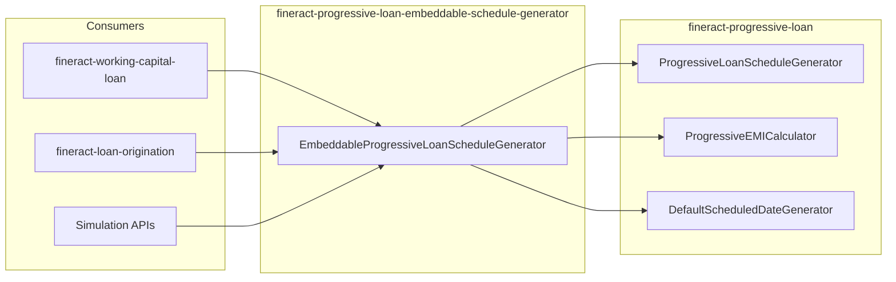

`EmbeddableProgressiveLoanScheduleGenerator` is a deliberately small
façade exposed by the
`fineract-progressive-loan-embeddable-schedule-generator` Gradle module. It
lets non-loan code — simulation tools, working-capital projections,
origination quoters — generate a progressive schedule **without** running
the full loan engine, the persistence layer, or any Spring context.

## What you get

A single class that you can `new` and call from anywhere:

```java
package org.apache.fineract.portfolio.loanaccount.loanschedule.domain;

public class EmbeddableProgressiveLoanScheduleGenerator {

    private final ProgressiveLoanScheduleGenerator scheduleGenerator;

    public EmbeddableProgressiveLoanScheduleGenerator() {
        final ScheduledDateGenerator scheduledDateGenerator = new DefaultScheduledDateGenerator();
        final EMICalculator emiCalculator = new ProgressiveEMICalculator(scheduledDateGenerator);
        this.scheduleGenerator = new ProgressiveLoanScheduleGenerator(
                scheduledDateGenerator, emiCalculator,
                new NoopInterestScheduleModelRepositoryWrapper());
    }

    public LoanSchedulePlan generate(MathContext mc, LoanRepaymentScheduleModelData modelData) {
        return scheduleGenerator.generate(mc, modelData);
    }
}
```

That's the entire public surface. The constructor wires together exactly
the three collaborators `ProgressiveLoanScheduleGenerator` needs:

| Collaborator | Embedded implementation |
| --- | --- |
| `ScheduledDateGenerator` | `DefaultScheduledDateGenerator` (calendar/holidays support, no DB) |
| `EMICalculator` | `ProgressiveEMICalculator` — the same one the server uses |
| `InterestScheduleModelRepositoryWrapper` | `NoopInterestScheduleModelRepositoryWrapper` (private inner class) |

## The noop repository wrapper

The inner `NoopInterestScheduleModelRepositoryWrapper` implements every
method on `InterestScheduleModelRepositoryWrapper` to return `Optional.empty()`,
`null`, `false`, or `0L` as appropriate:

```java
private static final class NoopInterestScheduleModelRepositoryWrapper
        implements InterestScheduleModelRepositoryWrapper {

    @Override public Optional<ProgressiveLoanModel> findOneByLoanId(Long id) { return Optional.empty(); }
    @Override public Optional<ProgressiveLoanModel> findOneByLoan(Loan loan) { return Optional.empty(); }
    @Override public Optional<ProgressiveLoanInterestScheduleModel> extractModel(...) { return Optional.empty(); }
    @Override public ProgressiveLoanInterestScheduleModel writeInterestScheduleModel(...) { return null; }
    @Override public Optional<ProgressiveLoanInterestScheduleModel> readProgressiveLoanInterestScheduleModel(...) { return Optional.empty(); }
    @Override public boolean hasValidModelForDate(Long loanId, LocalDate targetDate) { return false; }
    @Override public Optional<ProgressiveLoanInterestScheduleModel> getSavedModel(Loan loan, LocalDate businessDate) { return Optional.empty(); }
    @Override public Long removeByLoanId(Long loanId) { return 0L; }
}
```

Because the generator only uses the wrapper to *cache* a previously
computed model — and an embeddable caller never has a previous model —
returning empties everywhere is safe.

<Note>
  The embedded generator therefore performs **no** I/O. It is fully
  CPU-bound, thread-safe per instance, and suitable for stateless workers.
</Note>

## Why a separate module

Pulling progressive math into the embeddable Gradle module gives three
independent consumers a clean way to depend on it:

<CardGroup cols={2}>
  <Card title="fineract-working-capital-loan" icon="briefcase">
    Working-capital projections need progressive schedules but don't run
    inside the loan engine. They build a `LoanRepaymentScheduleModelData`
    from the working-capital product and use the embeddable to generate
    a forward-looking plan.
  </Card>
  <Card title="fineract-loan-origination" icon="file-signature">
    Origination quotes a *prospective* loan before the loan record
    exists. Persistence wrappers can't be used — there is no loan to
    persist against. The embeddable provides the calculator with no
    dependency on JPA.
  </Card>
  <Card title="Simulation / what-if APIs" icon="flask">
    The core loan engine exposes simulation endpoints that should not
    side-effect the persistent state. The embeddable variant is the
    safest implementation choice.
  </Card>
  <Card title="External clients" icon="plug">
    Tooling that needs to mirror Fineract's amortization math (e.g. a
    front-office quote engine) can shade the embeddable jar without the
    rest of the server.
  </Card>
</CardGroup>

## Calling the embeddable

<Steps>
  <Step title="Add the dependency">
    Add `fineract-progressive-loan-embeddable-schedule-generator` to your
    Gradle module. It transitively pulls in
    `fineract-progressive-loan` for the generator and calculator classes.
  </Step>
  <Step title="Build a LoanRepaymentScheduleModelData">
    Populate the DTO with the principal, repayment frequency,
    disbursement plan, interest rate, holidays, and any term variations
    your caller knows about. This is the same DTO the server uses
    internally.
  </Step>
  <Step title="Instantiate the embeddable">
    `new EmbeddableProgressiveLoanScheduleGenerator()`. Reuse the instance
    across calls — there's no per-call state.
  </Step>
  <Step title="Call generate(mc, modelData)">
    Pass an appropriate `MathContext` (Fineract uses `MoneyHelper.getMathContext()`
    on the server). The result is a `LoanSchedulePlan` with installments,
    totals, and an outstanding-amounts snapshot.
  </Step>
</Steps>

```java
EmbeddableProgressiveLoanScheduleGenerator engine =
        new EmbeddableProgressiveLoanScheduleGenerator();

LoanRepaymentScheduleModelData modelData = buildModelData(application);
LoanSchedulePlan plan = engine.generate(MoneyHelper.getMathContext(), modelData);

return plan.getInstallments();
```

## What you do not get

<Warning>
  - **No persistence.** The wrapper is a noop. Anything you compute is
    discarded when the instance goes out of scope; you must persist
    yourself if needed.
  - **No transaction processor.** The embeddable produces *schedules*,
    not allocations. To replay payments use the full
    [transaction processor](/progressive-loan/progressive-transaction-processor)
    server-side.
  - **No COB.** COB runs against persisted state; the embeddable has
    none.
  - **No event publishing.** The embeddable does not emit business
    events.
</Warning>

These limitations are intentional. The embeddable is a *pure function* —
given the same input it returns the same plan, every time.

## Architecture



The `@SuppressWarnings("unused")` on the class is intentional: it's
consumed at runtime by other modules and tests, not at compile time from
within the embeddable jar itself.

## Working-capital integration

Working-capital loans use the embeddable to compute the amortization
schedule of a single tranche projected at full utilization. See the
[working-capital overview](/working-capital/overview) for how that
schedule feeds into utilization metrics, breach detection, and the
dedicated [COB pipeline](/working-capital/cob-pipeline).

## Origination integration

Loan origination uses the embeddable to render *what-if* quotes during
the application stage, before any persistent loan record exists. The
quoting service builds the `LoanRepaymentScheduleModelData` from the
application terms and the chosen product, runs the embeddable, and
returns the plan to the caller. See
[origination overview](/origination/overview).

## Versioning notes

<Info>
  The embeddable's public API is a single class with a single public
  method. Any change to the underlying
  `LoanRepaymentScheduleModelData` shape is a breaking change for
  embeddable consumers — keep this contract narrow and version it with
  Fineract's normal release cadence.
</Info>

## Related pages

<CardGroup cols={2}>
  <Card title="Progressive overview" href="/progressive-loan/overview" icon="map" />
  <Card title="Schedule generator" href="/progressive-loan/progressive-schedule-generator" icon="calendar" />
  <Card title="Working-capital overview" href="/working-capital/overview" icon="briefcase" />
  <Card title="Origination overview" href="/origination/overview" icon="file-signature" />
</CardGroup>

## Thread safety

The embeddable is safe to share across threads as long as each call
provides its own `LoanRepaymentScheduleModelData`. The internal
`ProgressiveLoanScheduleGenerator`, `ProgressiveEMICalculator`, and
`DefaultScheduledDateGenerator` are stateless after construction —
they accept the model as a parameter on every method.

This makes the embeddable a good fit for:

- A pool of long-lived servlet workers serving quote endpoints.
- A reactive pipeline where many simulation requests fan out in
  parallel.
- A batch job projecting schedules for an entire portfolio.

<Warning>
  The `LoanRepaymentScheduleModelData` itself is *not* thread-safe — it
  is a mutable builder used during generation. Build a fresh instance
  per call rather than sharing one across threads.
</Warning>

## Comparison with the in-engine generator

| Concern | In-engine | Embeddable |
| --- | --- | --- |
| Spring required | Yes | No |
| Schedule persistence | Yes — via JPA wrapper | No — noop wrapper |
| Transaction replay | Yes — when `LoanTransactionProcessingService` is wired | No |
| Multi-tranche projection | Yes | Yes |
| Rate changes | Yes | Yes (caller must include them in model data) |
| Charges and fees | Yes | Yes — through the model data |
| Side-effects | Persists model, emits events | None |
| Failure mode | Rolls back loan transaction | Throws exception to caller |

The functional output (`LoanSchedulePlan`) is byte-identical for
equivalent inputs — confirmed by the shared regression tests across
both wrappers.

## When NOT to use the embeddable

<Steps>
  <Step title="The loan exists and is active">
    Always use the in-engine generator through the loan write service.
    The embeddable can't see persisted state and would re-derive
    things, possibly inconsistently.
  </Step>
  <Step title="You need event emission">
    The embeddable doesn't publish business events. If your caller
    expects subscribers to react, go through the in-engine generator.
  </Step>
  <Step title="You're inside a JPA transaction">
    Calling the embeddable from inside an open JPA transaction works,
    but it's wasted opportunity — the in-engine path will reuse the
    transaction for cache lookups. Reach for the embeddable only when
    you genuinely don't want persistence.
  </Step>
</Steps>
