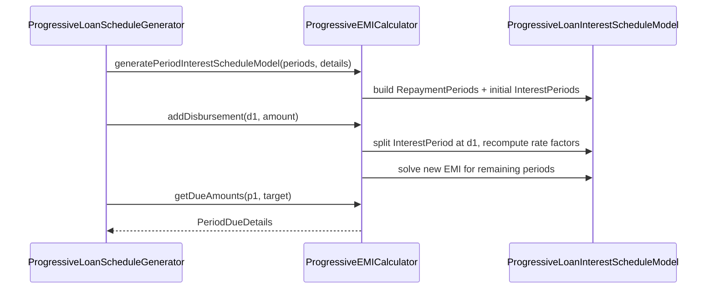

`EMICalculator` is the heart of the progressive loan module. It owns the
`ProgressiveLoanInterestScheduleModel` — the in-memory representation of a
loan's amortization plan — and exposes a small set of mutators that keep
that model in sync with every business event a loan can experience:
disbursement, rate change, balance correction, repayment, interest pause,
re-age, write-off and so on.

This page documents the interface that lives in
`fineract-progressive-loan/src/main/java/org/apache/fineract/portfolio/loanproduct/calc/EMICalculator.java`
and the math its default implementation (`ProgressiveEMICalculator`) applies.

## Interest model and repayment periods

A `ProgressiveLoanInterestScheduleModel` carries:

- The `LoanProductRelatedDetail` (currency, days-in-year, interest method,
  installment rounding multiple).
- A `MathContext` used for every BigDecimal operation.
- An ordered list of `RepaymentPeriod`s, each containing one or more
  `InterestPeriod`s — the slices between calendar events such as
  disbursements, rate changes, interest pauses, balance corrections and the
  installment due date itself.
- Cached pre-calculated values (rate factor minus one, outstanding balance
  per slice) that speed up later recomputation.

Each `RepaymentPeriod` exposes:

| Field | Meaning |
| --- | --- |
| `fromDate` / `dueDate` | Period boundary dates |
| `emi` | Equated installment for this period |
| `originalEmi` | EMI as first calculated (before mutations) |
| `interestPeriods` | Slices of constant rate & balance within the period |
| `paid` flags per allocation type | Whether principal / interest / fees / penalties are paid |

## Building a model

There are two entry points:

```java
ProgressiveLoanInterestScheduleModel generatePeriodInterestScheduleModel(
        @NotNull List<LoanScheduleModelRepaymentPeriod> periods,
        @NotNull ILoanConfigurationDetails loanProductRelatedDetail,
        Integer installmentAmountInMultiplesOf, MathContext mc);

ProgressiveLoanInterestScheduleModel generateInstallmentInterestScheduleModel(
        @NotNull List<RepaymentScheduleInstallmentData> installments,
        @NotNull ILoanConfigurationDetails loanProductRelatedDetail,
        Integer installmentAmountInMultiplesOf, MathContext mc);
```

<Tabs>
  <Tab title="From scheduled periods">
    `generatePeriodInterestScheduleModel` is the path used at submit and at
    every regeneration. The schedule generator hands in the bare
    `LoanScheduleModelRepaymentPeriod`s (from/due dates only, no amounts),
    and the calculator seeds the model with empty repayment periods.
  </Tab>
  <Tab title="From persisted installments">
    `generateInstallmentInterestScheduleModel` rebuilds the model from the
    `RepaymentScheduleInstallmentData` snapshot already saved to the
    database. This is how COB and read paths recover a working model
    without re-running the full schedule generator.
  </Tab>
</Tabs>

## The declining-balance formula

For each `InterestPeriod` the calculator computes a **rate factor**:

```
rateFactor = 1 + (annualNominalInterestRate / 100)
                 * (daysInPeriod / daysInYear)
```

The annual nominal rate may itself be a sum: the product's rate plus any
floating-rate overlay valid for the period. `daysInYear` follows the
product's `DaysInYearType` (360 / 364 / 365 / actual).

When the calculator needs to determine the EMI that pays the loan off in
the remaining N periods given an outstanding balance B, it solves:

```
EMI = B * r * (1 + r)^N / ((1 + r)^N - 1)
```

…rounded to the product's `installmentAmountInMultiplesOf`. For multi-rate
schedules — where rate changes occur mid-loan — the calculator iterates per
period, applying the rate factor of each `InterestPeriod` to the
outstanding balance before settling on a new equal EMI for the remaining
periods.

<Info>
  The rate calculation is delegated to
  `calculateRateFactorForRepaymentPeriod`, which the calculator calls
  whenever the model is mutated. This is also where interest-pause ranges
  are honoured: `applyInterestPause` and `cancelInterestPause` toggle the
  contribution of an `InterestPeriod` to zero without removing it from the
  model, preserving the period structure.
</Info>

## Mutators

Every business event maps to a single mutator on `EMICalculator`. Each
mutator recalculates EMIs from the action date forward, leaving paid /
historical periods untouched.

<AccordionGroup>
  <Accordion title="addDisbursement(model, dueDate, amount)">
    Increases the outstanding balance on `dueDate`, then resolves new EMIs
    for the rest of the loan. Used for primary disbursement and any
    additional disbursement.
  </Accordion>
  <Accordion title="addCapitalizedIncome(model, dueDate, amount)">
    Same shape as `addDisbursement` but flags the inflow as capitalized
    income rather than principal — relevant for accounting downstream.
  </Accordion>
  <Accordion title="changeInterestRate(model, submittedOnDate, newRate)">
    Inserts a new `InterestPeriod` boundary at `submittedOnDate`,
    recomputes rate factors from there, and re-solves EMI for the
    remaining periods. Honours the product's floating-rate config when
    `newRate` is absent.
  </Accordion>
  <Accordion title="addRepaymentPeriods(model, submittedOnDate, count, processed)">
    Appends `count` extra repayment periods (used by tenor extensions). The
    `processed` list replays already-applied transactions so the new tail
    inherits the correct outstanding balance.
  </Accordion>
  <Accordion title="addBalanceCorrection(model, date, amount)">
    Pushes the outstanding balance up (positive amount) or down (negative)
    on `date`. The processor uses this to register late repayments inside
    the period in which they actually arrived, separating *interest accrued*
    from *interest charged*.
  </Accordion>
  <Accordion title="payInterest / payPrincipal">
    Mark interest or principal as paid for the repayment period spanning
    `[repaymentPeriodFromDate, repaymentPeriodDueDate]` on
    `transactionDate`. These don't change rates or balances directly —
    they flag the model so subsequent `getDueAmounts` calls return zero
    for the consumed allocation.
  </Accordion>
  <Accordion title="creditPrincipal / creditInterest">
    Increase outstanding principal or future interest due. Triggered by
    chargebacks, reversed waivers and other "give-back" transactions.
    Creates a virtual EMI for the period the credit lands in.
  </Accordion>
</AccordionGroup>

## Queries

Read-only methods extract balances and dues without mutating state:

<ResponseField name="getDueAmounts(model, fromDate, dueDate, targetDate)" type="PeriodDueDetails">
  Maximum principal and interest due in `[fromDate, dueDate]` evaluated on
  `targetDate`. Used by the repayment screen and the
  transaction processor when allocating money to an installment.
</ResponseField>

<ResponseField name="getPeriodInterestTillDate(model, fromDate, dueDate, targetDate, includeChargeback, fixedInterestTillDate)" type="Money">
  Interest accumulated in the period up to `targetDate`. Used by accrual
  COB (`fixedInterestTillDate = true`) and by the schedule view
  (`fixedInterestTillDate = false`).
</ResponseField>

<ResponseField name="getOutstandingLoanBalanceOfPeriod(model, targetDate)" type="Money">
  Outstanding principal on `targetDate` — used by reporting and
  delinquency.
</ResponseField>

<ResponseField name="getOutstandingAmountsTillDate(model, targetDate)" type="OutstandingDetails">
  Breakdown of outstanding principal / interest / fees / penalties on
  `targetDate`. The progressive transaction processor calls this before
  every allocation step to know how much of each `AllocationType` is in
  scope.
</ResponseField>

<ResponseField name="getSumOfDueInterestsOnDate(model, subjectDate)" type="Money">
  Total interest due across the whole loan on `subjectDate`.
</ResponseField>

## Putting it together



## When to call what

<Steps>
  <Step title="At submit / regenerate">
    Call `generatePeriodInterestScheduleModel`, then `addDisbursement` for
    each expected disbursement on the loan.
  </Step>
  <Step title="On each business event">
    Pick the mutator that matches the event: rate change, balance
    correction, additional disbursement, interest pause, etc.
  </Step>
  <Step title="During payment processing">
    Use `getOutstandingAmountsTillDate` to discover allocatable buckets,
    then `payInterest` / `payPrincipal` for the amounts you actually
    consumed.
  </Step>
  <Step title="During COB">
    Use `getPeriodInterestTillDate` with `fixedInterestTillDate=true` to
    drive accrual. The interest model is *not* mutated by COB.
  </Step>
</Steps>

<Warning>
  Never modify a `ProgressiveLoanInterestScheduleModel` from two threads at
  once. The model is held by the per-transaction
  `InterestScheduleModelRepositoryWrapper`; callers must reload it via
  `extractModel(...)` inside their own transaction boundary.
</Warning>

<Tip>
  When debugging a progressive loan that "doesn't add up", dump
  `model.getRepaymentPeriods()` — each period prints its EMI,
  `InterestPeriod` slices, paid flags, and the cached rate-factor /
  outstanding-balance pair. The lifecycle becomes obvious from one log
  line per period.
</Tip>

## See also

<CardGroup cols={2}>
  <Card title="Schedule Generator" href="/progressive-loan/progressive-schedule-generator" icon="calendar" />
  <Card title="Tx Processor" href="/progressive-loan/progressive-transaction-processor" icon="arrows-up-down" />
  <Card title="Loan Product" href="/progressive-loan/progressive-loan-product" icon="sliders" />
  <Card title="Embeddable Generator" href="/progressive-loan/embeddable-schedule-generator" icon="puzzle-piece" />
</CardGroup>

## Math context conventions

Every BigDecimal operation inside the calculator uses the
`MathContext` supplied by the caller. Production code passes
`MoneyHelper.getMathContext()`, which yields:

- precision = 19 decimal digits
- rounding mode = `HALF_EVEN`

Tests sometimes supply `MathContext.DECIMAL128` for tighter precision
during regression checks. The model itself rounds money values to
`installmentAmountInMultiplesOf` only at installment boundaries;
internal rate factors stay at full precision so small drift doesn't
accumulate across many periods.

## Interest pause range

`applyInterestPause(model, fromDate, toDate)` carves out a span where
interest does not accrue. The mechanic is simple: the existing
`InterestPeriod` covering the span is split into three (before / paused
/ after), and the paused slice contributes a rate factor of 1 (no
growth). The slice stays in the model — it's not deleted — so
`cancelInterestPause` can restore the original behaviour without
re-running the schedule generator.

<Info>
  Chargeback interest does *not* pause. The calculator carries a
  separate `chargebackInterest` accumulator that keeps ticking even
  during a pause range. The pause flag is checked per slice when the
  primary interest is computed; it never touches the chargeback path.
</Info>

## A note on the model snapshot

Every successful mutator persists a fresh
`ProgressiveLoanInterestScheduleModel` snapshot via the repository
wrapper. The snapshot is what `getSavedModel(...)` returns the next
time COB or a read endpoint touches the loan. Two implications:

- The snapshot is keyed by `(loanId, businessDate)`. Re-running the
  same mutator on the same business date overwrites in place rather
  than appending — the wrapper handles the upsert.
- The wrapper exposes `removeByLoanId(loanId)`. Loan closure calls it
  to garbage-collect the model row; nothing else should.
