The `fineract-progressive-loan` Gradle module supplies everything Fineract needs
to run loans configured with the **PROGRESSIVE** interest method: an EMI
calculator built on a declining-balance interest model, a schedule generator
that drives installment shapes from that model, and an advanced payment
allocation transaction processor. It plugs into the core loan engine through
the shared `LoanScheduleGenerator` and `LoanRepaymentScheduleTransactionProcessor`
interfaces, so the rest of the platform — accounting, COB, delinquency,
reporting — interacts with progressive loans through the same surface as any
other loan flavor.

## Why a separate module

Progressive amortization differs from the classic *cumulative* schedule in two
important ways:

- **Interest is modelled per period from a live outstanding balance** rather
  than recomputed from the original disbursement. Mid-term events such as
  interest-rate changes, additional disbursements, interest pauses or capital
  credits all mutate the same in-memory interest model and are applied
  forward from the action date.
- **Payment allocation is rule-driven**. Instead of the fixed strategies used
  by the legacy processor (penalties, fees, interest, principal in that
  order), progressive loans use *payment allocation rules* attached to the
  loan product. The processor walks each `PaymentAllocationType` in the
  configured order and consumes the transaction amount against `IN_ADVANCE`,
  `DUE`, `PAST_DUE`, and future installments.

Isolating this code in `fineract-progressive-loan` keeps the legacy loan
engine untouched, lets the module be opted out at build time, and gives the
embeddable schedule generator (see below) a small, self-contained dependency
surface.

## Package layout

The module sits under `org.apache.fineract.portfolio` and mirrors the layout
of the core `fineract-loan` module so contributors can find counterparts
quickly:

<CardGroup cols={2}>
  <Card title="loanproduct/calc" icon="calculator">
    `EMICalculator` interface plus `ProgressiveEMICalculator`, the
    declining-balance engine that owns the `ProgressiveLoanInterestScheduleModel`
    and all rate / disbursement / pause mutators.
  </Card>
  <Card title="loanaccount/loanschedule/domain" icon="calendar-days">
    `ProgressiveLoanScheduleGenerator` — implements `LoanScheduleGenerator`
    and turns the interest model into a `LoanSchedulePlan` of installments.
  </Card>
  <Card title="loanaccount/domain/transactionprocessor/impl" icon="arrow-right-arrow-left">
    `AdvancedPaymentScheduleTransactionProcessor` and helpers
    (`ProgressiveTransactionCtx`, `ChangeOperation`) implementing
    rule-driven payment allocation and replay.
  </Card>
  <Card title="loanaccount/service" icon="database">
    Persistence wrappers like `InterestScheduleModelRepositoryWrapper` that
    save the interest schedule model alongside the loan.
  </Card>
</CardGroup>

```text
fineract-progressive-loan/src/main/java/org/apache/fineract/
└── portfolio/
    ├── configuration/
    ├── delinquency/service/
    ├── loanaccount/
    │   ├── api/                            # progressive-specific endpoints
    │   ├── data/                           # DTOs
    │   ├── domain/
    │   │   └── transactionprocessor/impl/  # AdvancedPaymentScheduleTransactionProcessor
    │   ├── handler/
    │   ├── loanschedule/domain/            # ProgressiveLoanScheduleGenerator
    │   ├── mapper/
    │   ├── repository/
    │   ├── rescheduleloan/                 # progressive reschedule support
    │   ├── service/                        # InterestScheduleModelRepositoryWrapper, …
    │   └── starter/                        # Spring auto-configuration
    └── loanproduct/
        ├── calc/                           # EMICalculator + ProgressiveEMICalculator
        ├── domain/
        └── mapper/
```

## Key classes at a glance

<AccordionGroup>
  <Accordion title="EMICalculator (interface)">
    Defines the contract for building and mutating a
    `ProgressiveLoanInterestScheduleModel`. Operations include
    `generatePeriodInterestScheduleModel`, `addDisbursement`,
    `changeInterestRate`, `addBalanceCorrection`, `payInterest`,
    `payPrincipal`, `creditPrincipal`, `creditInterest`,
    `getDueAmounts`, `getOutstandingAmountsTillDate` and
    `getPeriodInterestTillDate`. See
    [EMI calculator](/progressive-loan/emi-calculator).
  </Accordion>
  <Accordion title="ProgressiveEMICalculator">
    The default `@Component` implementation. Maintains the
    `RepaymentPeriod` list inside the interest model, recalculates rate
    factors for each period, and reshapes equal-installment EMIs whenever
    a mutating event hits the schedule.
  </Accordion>
  <Accordion title="ProgressiveLoanScheduleGenerator">
    Implements `LoanScheduleGenerator.generate(...)`. Walks the disbursement
    list, asks the `ScheduledDateGenerator` for repayment dates, drives the
    `EMICalculator` to populate a `LoanSchedulePlan`, then hands the plan
    back to the loan engine. Cross-referenced from the core
    [loan repayment schedule guide](/loan/loan-repayment-schedule).
  </Accordion>
  <Accordion title="AdvancedPaymentScheduleTransactionProcessor">
    Implements `LoanRepaymentScheduleTransactionProcessor` for progressive
    loans. Allocates each transaction (repayment, refund, chargeback,
    write-off, charge-off, re-age) over installments according to the
    loan product's `LoanPaymentAllocationRule`s. Default rule sweeps
    `IN_ADVANCE → DUE → PAST_DUE → FUTURE_INSTALLMENT`.
  </Accordion>
  <Accordion title="InterestScheduleModelRepositoryWrapper">
    Wraps persistence of `ProgressiveLoanModel` — the database snapshot of
    the in-memory interest schedule model. Lets the generator restore a
    loan's running state after a restart and lets COB extend the schedule
    on the fly.
  </Accordion>
</AccordionGroup>

## End-to-end flow

```mermaid
flowchart LR
    subgraph Submit
      A[Loan submitted] --> B[ProgressiveLoanScheduleGenerator.generate]
      B --> C[EMICalculator.generatePeriodInterestScheduleModel]
      C --> D[LoanSchedulePlan saved]
    end
    subgraph Lifecycle
      D --> E[Disbursement / rate change / interest pause]
      E --> F[EMICalculator mutator]
      F --> G[ProgressiveLoanModel re-persisted]
      G --> H[Repayment transaction]
      H --> I[AdvancedPaymentScheduleTransactionProcessor]
      I --> J[Installments updated, allocations recorded]
    end
```



<Note>
  All mutators on `EMICalculator` are idempotent with respect to the action
  date: replaying the same operation on a freshly loaded model yields the
  same installments. This is what makes the progressive transaction
  processor able to fully reprocess history when a back-dated transaction
  arrives.
</Note>

## How it composes with the rest of Fineract

<Steps>
  <Step title="Loan product opts in">
    Set `interestType = PROGRESSIVE` and pick the
    `loanScheduleType = PROGRESSIVE` plus
    `loanScheduleProcessingType` on the product. The advanced payment
    strategy `advanced-payment-allocation-strategy` is required. See
    [loan product configuration](/progressive-loan/progressive-loan-product)
    and the core [loan product](/loan/loan-product) reference.
  </Step>
  <Step title="Schedule generator picked by factory">
    The loan engine's `LoanScheduleGeneratorFactory` returns
    `ProgressiveLoanScheduleGenerator` when the product is progressive.
  </Step>
  <Step title="Processor picked by factory">
    `LoanRepaymentScheduleTransactionProcessorFactory` returns the
    `AdvancedPaymentScheduleTransactionProcessor` for progressive loans.
  </Step>
  <Step title="COB and downstream consumers">
    Daily COB business steps (accrual, delinquency, charge-off behaviour)
    call into `EMICalculator.getOutstandingAmountsTillDate` and
    `getPeriodInterestTillDate` to compute up-to-the-date balances
    without mutating the loan.
  </Step>
</Steps>

## Reuse outside the loan engine

`ProgressiveLoanScheduleGenerator` is also the engine behind
`EmbeddableProgressiveLoanScheduleGenerator`, a thin façade in
`fineract-progressive-loan-embeddable-schedule-generator`. The embeddable
variant wires a noop `InterestScheduleModelRepositoryWrapper`, so callers
get a stateless calculator suitable for simulation, working-capital loan
projection, and origination quoting. See
[Embeddable generator](/progressive-loan/embeddable-schedule-generator)
for the integration recipe.

<Tip>
  Most contributors looking to understand progressive amortization should
  read the modules in this order: **EMI calculator → schedule generator →
  transaction processor**. The product configuration and embeddable pages
  are reference material you can dip into when wiring something up.
</Tip>

## Where to go next

<CardGroup cols={2}>
  <Card title="EMI Calculator" href="/progressive-loan/emi-calculator" icon="function" />
  <Card title="Schedule Generator" href="/progressive-loan/progressive-schedule-generator" icon="calendar" />
  <Card title="Tx Processor" href="/progressive-loan/progressive-transaction-processor" icon="arrows-up-down" />
  <Card title="Loan Product" href="/progressive-loan/progressive-loan-product" icon="sliders" />
  <Card title="Embeddable Generator" href="/progressive-loan/embeddable-schedule-generator" icon="puzzle-piece" />
</CardGroup>

## Persistence footprint

Progressive loans add two persistence concerns on top of the standard
loan schema:

| Table | Purpose |
| --- | --- |
| `m_loan_interest_schedule_model` | Serialized snapshot of `ProgressiveLoanModel` — replayed at COB and on each transaction. |
| `m_loan_interest_pause` | Per-loan ranges where interest accrual is suspended. Read by the EMI calculator on every mutate. |

The interest schedule model is *cached*, not authoritative. If the row
is missing the calculator can always rebuild it from the loan terms and
the saved transactions. The wrapper exists so the hot read paths don't
pay for that rebuild every time.

## Module configuration

The progressive loan module is on by default in the community
distribution. Toggling it follows the standard module pattern:

```properties
fineract.module.progressive-loan.enabled=true
```

When disabled, the `ProgressiveLoanScheduleGenerator` and
`AdvancedPaymentScheduleTransactionProcessor` beans are not registered.
Existing progressive loans become read-only — useful for safe
deprecation while the legacy book matures.

<Warning>
  Don't disable the module while progressive loans are still open.
  Lifecycle operations (repayments, accrual, COB) need the engine; with
  it off the loan engine cannot service these accounts.
</Warning>

## Testing surface

The module ships extensive integration tests under
`fineract-progressive-loan/src/test/`. Three flavours are useful when
contributing:

<Steps>
  <Step title="Calculator unit tests">
    Verify EMI math against hand-computed expectations for fixed inputs.
    Fast to run, no Spring context.
  </Step>
  <Step title="Schedule generator tests">
    Exercise the generator + calculator end to end against a fake
    `LoanApplicationTerms`. No DB needed.
  </Step>
  <Step title="Processor integration tests">
    Spring-loaded; drive the processor through a stream of fake
    transactions and assert the final installment shape and mapping
    rows. The slowest tier but the only place to catch replay bugs.
  </Step>
</Steps>
