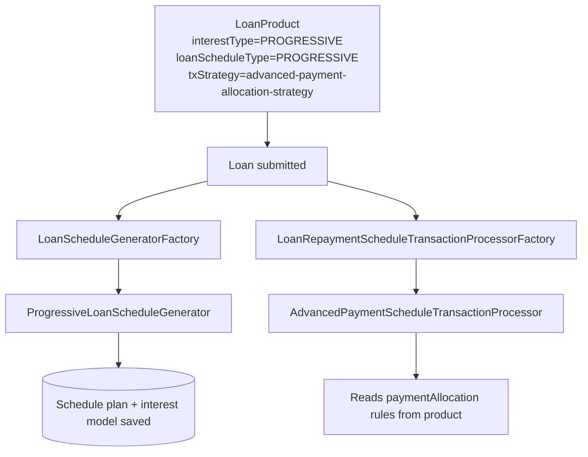

A loan only routes through the progressive engine when its **loan product**
is configured for it. This page enumerates the exact fields you must set,
what each does, and how they interact with the rest of the platform.

Pair this guide with the core
[loan product reference](/loan/loan-product), which covers fields shared
across all loan flavors. Everything below is *additional* to that.

## The four switches

<CardGroup cols={2}>
  <Card title="interestType = PROGRESSIVE" icon="percent">
    Selects the declining-balance interest engine. Also called
    `interestMethod` in the API payload (`"interestType": 1` maps to
    progressive). Without this, the `EMICalculator` is never invoked.
  </Card>
  <Card title="loanScheduleType = PROGRESSIVE" icon="calendar">
    Tells the factory to build a `ProgressiveLoanScheduleGenerator`. The
    only other value is `CUMULATIVE`.
  </Card>
  <Card title="loanScheduleProcessingType" icon="route">
    `HORIZONTAL` (period-major) or `VERTICAL` (bucket-major) — controls
    how `AdvancedPaymentScheduleTransactionProcessor` walks installments
    during allocation.
  </Card>
  <Card title="transactionProcessingStrategyCode" icon="cog">
    Must be `advanced-payment-allocation-strategy`. This is the only
    strategy that resolves to `AdvancedPaymentScheduleTransactionProcessor`.
  </Card>
</CardGroup>

<Warning>
  All four must be aligned. Setting `interestType = PROGRESSIVE` with a
  cumulative `loanScheduleType` is rejected at validation; setting the
  schedule type alone without the right transaction strategy throws at
  loan submit.
</Warning>

## Payment allocation rules

The advanced strategy demands at least one
`LoanPaymentAllocationRule` per supported transaction type. Each rule has
four fields:

<ParamField path="transactionType" type="enum" required>
  `DEFAULT`, `REPAYMENT`, `GOODWILL_CREDIT`, `MERCHANT_ISSUED_REFUND`,
  `PAYOUT_REFUND`, `INTEREST_PAYMENT_WAIVER`, `DOWN_PAYMENT`.
</ParamField>

<ParamField path="paymentAllocationOrder" type="PaymentAllocationType[]" required>
  Ordered list of buckets. Each entry pairs a phase
  (`IN_ADVANCE` / `DUE` / `PAST_DUE` / `FUTURE_INSTALLMENT`) with an
  allocation slot (`PENALTY` / `FEE` / `INTEREST` / `PRINCIPAL`).
  Sixteen entries cover the default progressive cascade end to end.
</ParamField>

<ParamField path="futureInstallmentAllocationRule" type="enum" required>
  What to do with overpayment after every due bucket is consumed.
  Options: `NEXT_INSTALLMENT`, `LAST_INSTALLMENT`, `REAMORTIZATION`,
  `NEXT_LAST_INSTALLMENT`.
</ParamField>

<ParamField path="creditAllocationOrder" type="AllocationType[]">
  For products that accept chargebacks. Determines whether a chargeback
  reinstates principal first, interest first, or by another order.
</ParamField>

<Tabs>
  <Tab title="Default REPAYMENT rule">
    ```json
    {
      "transactionType": "REPAYMENT",
      "paymentAllocationOrder": [
        { "paymentAllocationRule": "IN_ADVANCE_PENALTY",        "order": 1 },
        { "paymentAllocationRule": "IN_ADVANCE_FEE",            "order": 2 },
        { "paymentAllocationRule": "IN_ADVANCE_INTEREST",       "order": 3 },
        { "paymentAllocationRule": "IN_ADVANCE_PRINCIPAL",      "order": 4 },
        { "paymentAllocationRule": "DUE_PENALTY",               "order": 5 },
        { "paymentAllocationRule": "DUE_FEE",                   "order": 6 },
        { "paymentAllocationRule": "DUE_INTEREST",              "order": 7 },
        { "paymentAllocationRule": "DUE_PRINCIPAL",             "order": 8 },
        { "paymentAllocationRule": "PAST_DUE_PENALTY",          "order": 9 },
        { "paymentAllocationRule": "PAST_DUE_FEE",              "order": 10 },
        { "paymentAllocationRule": "PAST_DUE_INTEREST",         "order": 11 },
        { "paymentAllocationRule": "PAST_DUE_PRINCIPAL",        "order": 12 }
      ],
      "futureInstallmentAllocationRule": "NEXT_INSTALLMENT"
    }
    ```
  </Tab>
  <Tab title="DOWN_PAYMENT variant">
    Down-payment transactions usually skip the `IN_ADVANCE` phase and go
    straight to `DUE` for the down-payment period. The rule's transaction
    type is `DOWN_PAYMENT` and the order omits IN_ADVANCE entries.
  </Tab>
</Tabs>

## Required product flags for downstream features

| Feature | Required flag(s) |
| --- | --- |
| Interest recalculation | `isInterestRecalculationEnabled = true`, plus a `RecalculationCompoundingMethod`. |
| Multi-disbursement | `multiDisburseLoan = true`, `maxTrancheCount`, `outstandingLoanBalance` (optional cap). |
| Down-payment | `enableDownPayment = true`, `disbursedAmountPercentageForDownPayment`, `enableAutoRepaymentForDownPayment`. |
| Interest pause | Requires `interestType = PROGRESSIVE`; no extra product flag — controlled per loan. |
| Charge-off behaviour | `loanChargeOffBehaviour` (`REGULAR` / `ACCELERATE_MATURITY` / `ZERO_INTEREST` / `ACCRUE_TILL_CHARGE_OFF`). |
| Re-age | `isInterestRecalculationEnabled = true`, plus the re-age interest handling type. |

## Relationship to the core loan product

The progressive module does **not** introduce a separate `WCLoanProduct`
analogue. It reuses the standard `LoanProduct` entity and reads the
progressive-relevant fields from `LoanProductRelatedDetail` —
specifically:

- `interestMethod`
- `loanScheduleType`
- `loanScheduleProcessingType`
- `transactionProcessingStrategyCode`
- The `paymentAllocation` and `creditAllocation` collections
- `daysInYearType`, `daysInMonthType`
- `installmentAmountInMultiplesOf`

Every other field on the loan product (charges, accounting rules,
delinquency bucket, fund, etc.) behaves identically to non-progressive
products.

## End-to-end example



## Validation rules

The `LoanProductDataValidator` enforces several invariants when a product
is created or updated:

<Steps>
  <Step title="Strategy compatibility">
    If `loanScheduleType = PROGRESSIVE`, the transaction strategy *must*
    be `advanced-payment-allocation-strategy`. Otherwise validation fails
    with `error.msg.loan.transaction.strategy.not.compatible`.
  </Step>
  <Step title="Allocation completeness">
    At least one `LoanPaymentAllocationRule` with
    `transactionType = DEFAULT` (or the specific types you intend to
    process) must be supplied.
  </Step>
  <Step title="Allocation order well-formed">
    Every order list must contain exactly one entry per
    `PaymentAllocationType × AllocationType` combination it touches, with
    no duplicates.
  </Step>
  <Step title="Interest method narrowing">
    Progressive products restrict `interestCalculationPeriodType` to
    `DAILY`. The validator rejects `SAME_AS_REPAYMENT_PERIOD` because the
    interest model already slices per `InterestPeriod`.
  </Step>
</Steps>

## Choosing between progressive and cumulative

<AccordionGroup>
  <Accordion title="Pick progressive when">
    You need any of: mid-term rate changes, additional disbursements
    after loan start, interest pauses (e.g. moratoria), product-level
    customizable allocation order, full back-date replay safety, or the
    advanced charge-off behaviours (`ZERO_INTEREST`, `ACCELERATE_MATURITY`).
  </Accordion>
  <Accordion title="Stay on cumulative when">
    The loan book has only vanilla equal-installment loans with no
    mid-term events and you want the smaller per-loan memory footprint
    (no persisted interest schedule model).
  </Accordion>
</AccordionGroup>

## Related references

<CardGroup cols={2}>
  <Card title="Core loan product" href="/loan/loan-product" icon="sliders" />
  <Card title="Schedule generator" href="/progressive-loan/progressive-schedule-generator" icon="calendar" />
  <Card title="Tx processor" href="/progressive-loan/progressive-transaction-processor" icon="arrows-up-down" />
  <Card title="EMI calculator" href="/progressive-loan/emi-calculator" icon="function" />
</CardGroup>

<Tip>
  When migrating an existing tenant onto progressive products, leave
  legacy products alone and create new progressive products in parallel.
  The schedule and processor factories pick per-loan from the product, so
  you can run both flavors side by side until the tail of the old book
  matures.
</Tip>

## Field interaction matrix

A few fields have non-obvious cross-effects when set together:

| Combination | Result |
| --- | --- |
| `multiDisburseLoan = true` + `enableDownPayment = true` | Down-payment is calculated per tranche, not on the total commitment. |
| `isInterestRecalculationEnabled = false` + `interestType = PROGRESSIVE` | Legal but pointless — most progressive features rely on recalculation. |
| `loanScheduleProcessingType = VERTICAL` + payment allocation `FUTURE_INSTALLMENT_REAMORTIZATION` | Re-amortization runs *after* the vertical sweep, which can shift principal between far-future installments. |
| `interestRecalculationCompoundingMethod = NONE` + `loanChargeOffBehaviour = ZERO_INTEREST` | Standard combination — most regulated lenders run this pair. |
| `installmentAmountInMultiplesOf > 1` + `enableDownPayment` | Down-payment isn't rounded; only installment amounts are. |

## Per-loan overrides

A handful of product fields can be overridden at loan submit if the
product's `LoanProductConfigurableAttributes` allows it: tenor,
interest rate, repayment frequency, amortization type. The overrides
flow through to the loan's effective `LoanProductRelatedDetail`
snapshot, leaving the product itself untouched. This is the same
mechanism the [working-capital product](/working-capital/product-and-breach)
uses for its own per-facility variations.

## Sample product creation payload

```json
{
  "name": "Progressive Small Business 12m",
  "shortName": "PSB12",
  "currencyCode": "USD",
  "principal": 50000,
  "numberOfRepayments": 12,
  "repaymentEvery": 1,
  "repaymentFrequencyType": 2,
  "interestRatePerPeriod": 12,
  "interestRateFrequencyType": 3,
  "interestType": 1,
  "amortizationType": 1,
  "interestCalculationPeriodType": 1,
  "loanScheduleType": "PROGRESSIVE",
  "loanScheduleProcessingType": "HORIZONTAL",
  "transactionProcessingStrategyCode": "advanced-payment-allocation-strategy",
  "isInterestRecalculationEnabled": true,
  "paymentAllocation": [/* …default REPAYMENT rule from the example tab… */]
}
```

The response returns the created product ID, which is then referenced
on subsequent loan submit calls.
