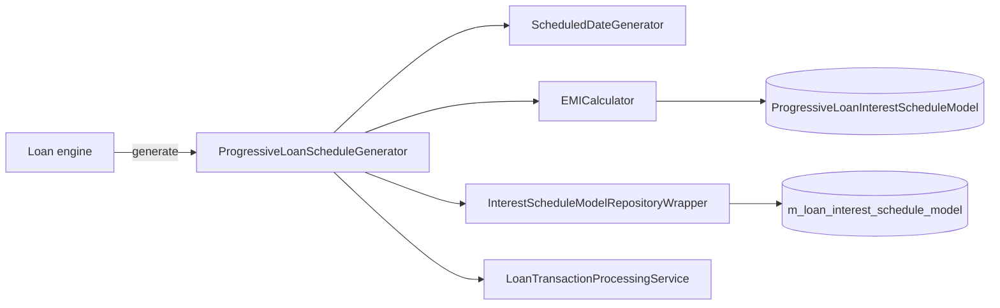

`ProgressiveLoanScheduleGenerator` is the bridge between the core
`LoanScheduleGenerator` interface and the progressive
[EMI calculator](/progressive-loan/emi-calculator). Whenever a loan with
`interestMethod = PROGRESSIVE` needs a fresh schedule — at submit,
approval, additional disbursement, rate change, term extension, or
reschedule — the loan engine asks `LoanScheduleGeneratorFactory` for a
generator and gets this class.

The implementation lives at
`fineract-progressive-loan/src/main/java/org/apache/fineract/portfolio/loanaccount/loanschedule/domain/ProgressiveLoanScheduleGenerator.java`.

## Collaborators

| Collaborator | Role |
| --- | --- |
| `ScheduledDateGenerator` | Computes calendar dates for repayment periods, holidays, and disbursement events. Shared with the cumulative generator. |
| `EMICalculator` | Builds and mutates the in-memory interest schedule model. |
| `InterestScheduleModelRepositoryWrapper` | Persists the model alongside the loan so subsequent reads, payments and COB don't re-derive it from scratch. |
| `LoanTransactionProcessingService` | Optional. Replays prior transactions over a freshly generated schedule when regenerating an active loan. |

The class is a Spring `@Component` and constructor-injects the first three
collaborators; the transaction processing service is set later via
`@Autowired(required = false)` so the generator can be reused by the
[embeddable variant](/progressive-loan/embeddable-schedule-generator)
without dragging in the full transaction processing graph.

## generate(...) walkthrough

The single public entry point is `generate(MathContext, LoanApplicationTerms,
Set<LoanCharge>, HolidayDetailDTO)` — the same signature the cumulative
generator implements.

<Steps>
  <Step title="Compute calendar">
    The generator asks `ScheduledDateGenerator` for the canonical list of
    period boundary dates honouring the product's
    `RepaymentStartDateType` (submitted-on or disbursement date),
    repayment frequency, and holiday rules.
  </Step>
  <Step title="Seed the interest model">
    For each calendar slice it constructs a
    `LoanScheduleModelRepaymentPeriod` and passes the full list to
    `EMICalculator.generatePeriodInterestScheduleModel`. The result is a
    `ProgressiveLoanInterestScheduleModel` with empty repayment periods
    but the right rate factors.
  </Step>
  <Step title="Apply disbursements">
    The generator iterates over `LoanApplicationTerms.getDisbursementDatas()`
    and calls `EMICalculator.addDisbursement` for each one. Multi-tranche
    loans land here. After every disbursement the calculator re-solves
    EMI for the remaining periods.
  </Step>
  <Step title="Layer additional events">
    For active-loan regeneration the generator also feeds in term
    variations, interest pauses, and floating-rate change points — each
    routed to its EMI-calculator mutator (`changeInterestRate`,
    `applyInterestPause`, `addBalanceCorrection`).
  </Step>
  <Step title="Project installments">
    For every `RepaymentPeriod` in the model the generator builds a
    concrete `LoanRepaymentScheduleInstallment` (principal, interest,
    fees, penalties, due date, period span) and adds it to the
    `LoanSchedulePlan`. Charges are matched to installments via the same
    `findInPeriod` helper used by the cumulative generator.
  </Step>
  <Step title="Surface plan + model">
    `generate` returns a `LoanScheduleDTO` containing the plan and (when
    relevant) a refreshed `ProgressiveLoanInterestScheduleModel` so the
    caller can persist it via the repository wrapper.
  </Step>
</Steps>

## Multi-disbursement handling

Progressive loans treat tranches as ordinary mutators on the same model.
The generator validates that the *outstanding* projection never goes
negative — if a configured tranche would over-pay the schedule the engine
throws `MultiDisbursementOutstandingAmoutException`. Tranches with no
actual disbursement date are pencilled in using their expected date and
later replayed (see Replay below).

<Note>
  The `RepaymentStartDateType` decides which date the *first* repayment
  period anchors on. `SUBMITTED_ON_DATE` uses the application's submitted
  date; `DISBURSEMENT_DATE` waits for the first tranche. The progressive
  generator passes this through unchanged — there's no progressive-specific
  override.
</Note>

## Replay for active loans

When the engine calls `generate(...)` on a loan that already has
transactions, the generator needs to ensure the regenerated schedule is
consistent with what's already been paid. The flow is:

1. Build the model from terms as above.
2. Hand the model and the loan's existing transactions to
   `LoanTransactionProcessingService.reprocessProgressiveLoanTransactions`
   (when the bean is present).
3. The processor walks each historical transaction in order, calling the
   `EMICalculator` mutator that corresponds to it.
4. The resulting model reflects the *current* state, so the projected
   installments include past-due amounts and the right outstanding
   balance going forward.

This replay is why `ProgressiveLoanScheduleGenerator` keeps a reference to
the transaction processor and why the embeddable variant supplies a noop
repository wrapper — see the next page.

## Plan structure

The returned `LoanSchedulePlan` carries:

<ResponseField name="installments" type="List&lt;LoanRepaymentScheduleInstallment&gt;">
  One entry per repayment period. Each holds principal, interest, fees,
  penalties, and the `fromDate`/`dueDate` slice.
</ResponseField>

<ResponseField name="downPaymentPeriods" type="List&lt;LoanScheduleModelDownPaymentPeriod&gt;">
  Populated when the product enables down-payment. The generator emits a
  zero-day period at disbursement carrying the down-payment amount.
</ResponseField>

<ResponseField name="totalPrincipal / totalInterest / totalFees / totalPenalties" type="Money">
  Sums computed from the installments — used by the API to surface the
  loan summary.
</ResponseField>

<ResponseField name="outstandingAmounts" type="OutstandingAmountsDTO">
  Optional snapshot delegated to `EMICalculator.getOutstandingAmountsTillDate`.
</ResponseField>

## Cross-references

<CardGroup cols={2}>
  <Card title="Loan repayment schedule" href="/loan/loan-repayment-schedule" icon="calendar-days">
    The cross-cutting docs for how *any* schedule generator integrates
    with the loan engine.
  </Card>
  <Card title="EMI calculator" href="/progressive-loan/emi-calculator" icon="function">
    Detail on each mutator the generator calls.
  </Card>
  <Card title="Tx processor" href="/progressive-loan/progressive-transaction-processor" icon="arrows-up-down">
    What runs after the schedule is in place.
  </Card>
  <Card title="Loan product" href="/progressive-loan/progressive-loan-product" icon="sliders">
    Product fields that flip a loan onto this generator.
  </Card>
</CardGroup>

## Behaviour cheat sheet

| Event | Calculator mutator the generator calls | Notes |
| --- | --- | --- |
| New disbursement (tranche or top-up) | `addDisbursement` | Re-solves EMI for remaining periods. |
| Capitalized income | `addCapitalizedIncome` | Recorded distinct from principal. |
| Interest rate change | `changeInterestRate` | Splits the `InterestPeriod`. |
| Term extension | `addRepaymentPeriods` | Appends periods; replays processed transactions. |
| Late payment | `addBalanceCorrection(+amount)` | Increases outstanding for the period it lands in. |
| Repayment | `payPrincipal` / `payInterest` | Driven by the transaction processor, not the generator. |
| Chargeback | `creditPrincipal` / `creditInterest` | Creates a virtual EMI. |

<Tip>
  When you need to compare two schedule outputs (e.g. before and after a
  rate change) the cleanest diff is on the `RepaymentPeriod` list of the
  resulting models — the `LoanSchedulePlan` rounds to the
  product's installment multiple and can mask small interest moves.
</Tip>

## Failure modes

<Warning>
  - `MultiDisbursementOutstandingAmoutException` — the configured tranche
    plan over-pays the loan. Reduce or move a tranche.
  - Null `EMICalculator` would NPE on the very first slice. The factory
    refuses to return a progressive generator when the calculator bean
    isn't on the classpath; you only see this if you wire the generator
    by hand outside Spring.
  - A model with zero periods — usually because the calendar produced
    none — yields an empty plan and the loan engine fails its own
    validation.
</Warning>

## Where the integration shows up

- Core engine: `LoanScheduleGeneratorFactory.create(...)` switches on
  `interestType` and `loanScheduleType`.
- COB: `LoanAccrualTransactionBusinessStep` queries the saved interest
  schedule model directly via the repository wrapper, without going
  through the generator.
- Re-amortize and reschedule:
  `org.apache.fineract.portfolio.loanaccount.rescheduleloan` (in this
  module) reuses the generator to produce a "what-if" plan before
  committing.

This generator is otherwise a thin orchestrator — the math lives in the
[EMI calculator](/progressive-loan/emi-calculator), and the financial
semantics live in the
[transaction processor](/progressive-loan/progressive-transaction-processor).

## Holiday and non-working-day handling

Like the cumulative generator, the progressive flavour delegates
holiday and non-working-day adjustment to `ScheduledDateGenerator`.
Three policies are supported:

| Policy | Behaviour |
| --- | --- |
| `MOVE_TO_NEXT_WORKING_DAY` | Push the due date forward to the next business day. |
| `MOVE_TO_PREVIOUS_WORKING_DAY` | Pull the due date back to the previous business day. |
| `MOVE_TO_NEXT_REPAYMENT_MEETING_DAY` | Snap to the next group meeting (only relevant for group loans). |

Whichever policy is in force, the generator hands the *adjusted* dates
to the calculator. The calculator never knows about holidays itself —
it sees only the slices it's been asked to model.

## Outstanding loan balance cap

When the product configures `outstandingLoanBalance` on a
multi-disbursement loan, the generator enforces it before applying any
tranche. If `currentOutstanding + trancheAmount > cap`, the engine
refuses the disbursement and the user sees a validation error. The
check happens here rather than at the API edge because it depends on
the *projected* schedule, not just the current loan state.

## Diagnostic logging

The generator emits `INFO` on the high-level steps and `TRACE` on per-
period decisions. Enable `org.apache.fineract.portfolio.loanaccount.loanschedule.domain.ProgressiveLoanScheduleGenerator`
at `TRACE` to see every model mutation interleaved with the resulting
installment shape. The output is verbose but the cleanest way to
understand why a borderline schedule rounded one way and not the other.

<Tip>
  Pair `TRACE`-level generator logs with `TRACE`-level calculator logs
  to see the full chain: each generator call shows the input event,
  each calculator log shows the resulting rate factors and EMI
  re-solve. Together they reconstruct the loan's history.
</Tip>
