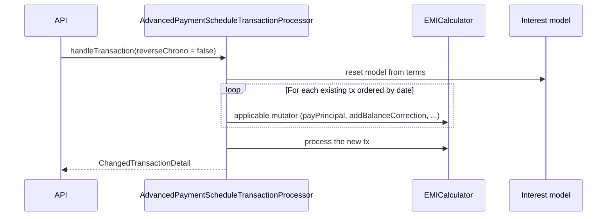
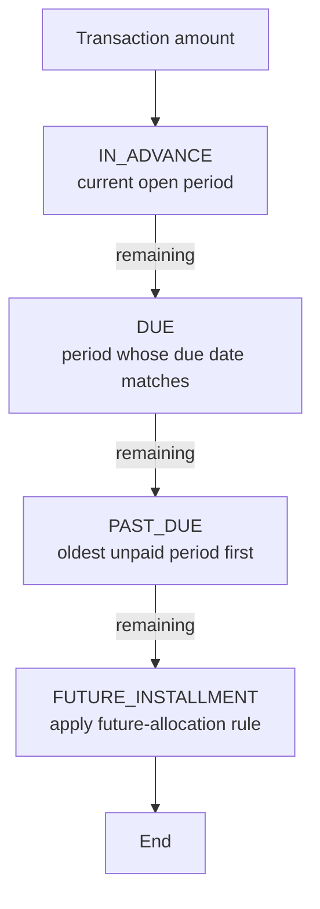

`AdvancedPaymentScheduleTransactionProcessor` is the
`LoanRepaymentScheduleTransactionProcessor` for progressive loans. It lives
at
`fineract-progressive-loan/src/main/java/org/apache/fineract/portfolio/loanaccount/domain/transactionprocessor/impl/AdvancedPaymentScheduleTransactionProcessor.java`
and replaces the cumulative `RepaymentScheduleTransactionProcessor` used by
non-progressive loans.

Unlike the cumulative processor, the advanced one is **rule driven**. Each
loan product configures a list of `LoanPaymentAllocationRule`s — one per
transaction type — and the processor walks the rule's allocation order
when assigning a transaction amount across installments.

## Key concepts

<CardGroup cols={2}>
  <Card title="PaymentAllocationType" icon="list-ol">
    The bucket order the processor walks. Default progressive ordering is
    `IN_ADVANCE → DUE → PAST_DUE → FUTURE_INSTALLMENT`, each subdivided by
    `AllocationType` (PENALTY, FEE, INTEREST, PRINCIPAL).
  </Card>
  <Card title="AllocationType" icon="layer-group">
    The four basic allocation slots: `PENALTY`, `FEE`, `INTEREST`,
    `PRINCIPAL`. Imported as static constants at the top of the processor.
  </Card>
  <Card title="LoanPaymentAllocationRule" icon="gear">
    Per-transaction-type configuration on the loan product. Specifies the
    allocation order and what to do with `FUTURE_INSTALLMENT` overpayments.
  </Card>
  <Card title="LoanCreditAllocationRule" icon="rotate-left">
    Mirror of the payment rule for *credit* transactions (chargebacks).
    Determines how a chargeback reinstates principal vs. interest.
  </Card>
</CardGroup>

## Default allocation order

The processor's static fallback rule, retrieved via
`getDefaultAllocationRule(loan)`, follows this order (top to bottom):

```text
IN_ADVANCE          PENALTY, FEE, INTEREST, PRINCIPAL
DUE                 PENALTY, FEE, INTEREST, PRINCIPAL
PAST_DUE            PENALTY, FEE, INTEREST, PRINCIPAL
FUTURE_INSTALLMENT  PENALTY, FEE, INTEREST, PRINCIPAL
```

Concretely:

<Steps>
  <Step title="IN_ADVANCE">
    Money paid before the next due date is held against the current
    period. Inside that period, penalties and fees are consumed first,
    then interest accrued so far (`getPeriodInterestTillDate(targetDate)`),
    then principal.
  </Step>
  <Step title="DUE">
    On or after the due date, the same penalty → fee → interest →
    principal sweep is applied for the period that just became due.
  </Step>
  <Step title="PAST_DUE">
    Any prior unpaid periods are walked in order, oldest first. The
    processor reads `getOutstandingAmountsTillDate` to know exactly how
    much is past due per bucket.
  </Step>
  <Step title="FUTURE_INSTALLMENT">
    Any remainder is allocated to upcoming installments. The product's
    `FutureInstallmentAllocationRule` decides whether that means
    *next installment*, *last installment*, or *re-amortize remaining*.
  </Step>
</Steps>

Each step delegates to `processPaymentAllocation(...)` which:

1. Asks the [EMI calculator](/progressive-loan/emi-calculator) how much of
   the bucket is open for the installment.
2. Consumes the lesser of *open* and *remaining transaction amount*.
3. Records a `LoanTransactionToRepaymentScheduleMapping` linking the
   transaction to the installment with the allocated principal / interest /
   fees / penalties.
4. Calls the appropriate calculator mutator (`payPrincipal`, `payInterest`)
   so the in-memory model stays in sync with the database.

## Transaction families

The processor handles many transaction types beyond plain repayments. The
high-level branches are:

<AccordionGroup>
  <Accordion title="REPAYMENT family">
    `REPAYMENT`, `DOWN_PAYMENT`, `MERCHANT_ISSUED_REFUND`,
    `PAYOUT_REFUND`. Driven by the loan's payment allocation rule.
  </Accordion>
  <Accordion title="REFUND family">
    `REFUND_FOR_ACTIVE_LOAN` and goodwill credits. The processor walks
    `getFutureInstallmentsForRefund` to refund overpaid future
    installments before draining past-due buckets.
  </Accordion>
  <Accordion title="CHARGEBACK">
    Applies a `LoanCreditAllocationRule`. Reinstates principal and/or
    interest by calling `creditPrincipal` / `creditInterest` on the
    calculator. Chargeback interest continues to accrue even when the
    main loan interest is paused.
  </Accordion>
  <Accordion title="CHARGE_OFF / RE_AGE / WRITE_OFF">
    Special handling that respects `LoanChargeOffBehaviour` and
    `LoanReAgeInterestHandlingType` on the loan product. The processor
    may issue `accrualAdjustment` and `accrueTransaction` entries
    automatically.
  </Accordion>
  <Accordion title="WAIVE_INTEREST / WAIVE_CHARGES">
    Marks the corresponding bucket as paid without consuming cash and
    delegates to `payInterest` for waived interest portions.
  </Accordion>
</AccordionGroup>

## Reprocessing — the engine that makes back-dating safe

Progressive loans support back-dated transactions. When one arrives, the
processor doesn't try to patch in place: it
**reprocesses the entire transaction history**:



Because every mutator on the calculator is deterministic given the model
state and the action date, replaying a stable transaction stream produces
the same installments byte-for-byte — that's what `ChangedTransactionDetail`
compares against to report what actually changed.

## Wiring it up

<ParamField path="loanScheduleType" type="enum" required>
  Must be `PROGRESSIVE` on the loan product for this processor to be
  selected by `LoanRepaymentScheduleTransactionProcessorFactory`.
</ParamField>

<ParamField path="loanScheduleProcessingType" type="enum" required>
  `HORIZONTAL` or `VERTICAL`. Horizontal walks installments period by
  period; vertical walks allocation type by allocation type. The
  processor reads this flag from
  `LoanProductRelatedDetail.getLoanScheduleProcessingType`.
</ParamField>

<ParamField path="paymentAllocation[]" type="LoanPaymentAllocationRule[]" required>
  One entry per transaction type. Each entry encodes the four-level
  `PaymentAllocationType × AllocationType` matrix plus a
  `FutureInstallmentAllocationRule`.
</ParamField>

<ParamField path="creditAllocation[]" type="LoanCreditAllocationRule[]">
  Only needed for products that accept chargebacks.
</ParamField>

## Hooks into accounting and COB

Once an allocation completes, the processor:

- Builds `LoanTransactionToRepaymentScheduleMapping` rows. These are what
  the accounting subsystem reads to post double-entry journal entries.
- Emits accrual adjustments (`accrualAdjustment(...)`) when a
  back-dated payment changes prior-period accrual. COB picks these up to
  reverse and reapply general-ledger postings.
- Updates the installment `obligationsMet` flag, which drives delinquency
  classification in the next COB run.

<Note>
  None of these side-effects are direct. The processor only mutates the
  loan domain object; downstream systems observe the change through
  domain events and recompute themselves on their own cadence.
</Note>

## Replay context

`ProgressiveTransactionCtx` carries the working state between steps of
one transaction's allocation: the running balances per allocation type,
the list of installments to consider for `IN_ADVANCE` / `PAST_DUE`, the
charge map, and the mapping rows being built. `ChangeOperation` is the
small reified record describing a single mutation so the calculator and
the database stay in lockstep during replay.

## When to extend

Most custom requirements can be satisfied by adding a new
`LoanPaymentAllocationRule` on the product — no code change is needed.
Reach for a custom processor only when the **order of mutations** itself
must change (e.g. a regulator-mandated waterfall that interleaves
penalties between installments). In that case extend
`AdvancedPaymentScheduleTransactionProcessor`, override the relevant
`handleTransaction*` method, and register your bean with a higher Spring
priority.

<Warning>
  Custom processors must remain deterministic under replay. Any decision
  that depends on wall-clock time, randomness, or external state breaks
  back-dating and will silently corrupt schedules over time.
</Warning>

## See also

<CardGroup cols={2}>
  <Card title="EMI calculator" href="/progressive-loan/emi-calculator" icon="function" />
  <Card title="Schedule generator" href="/progressive-loan/progressive-schedule-generator" icon="calendar" />
  <Card title="Loan product" href="/progressive-loan/progressive-loan-product" icon="sliders" />
  <Card title="Overview" href="/progressive-loan/overview" icon="map" />
</CardGroup>

## ChangedTransactionDetail

Every replay returns a `ChangedTransactionDetail` describing which
existing transactions had to be modified to make the new total
consistent. Callers (REST handlers, COB jobs) inspect it to:

- Reverse and reissue accounting entries for changed transactions.
- Emit `TRANSACTION_ADJUSTED` business events.
- Surface a "this back-dated repayment changed N prior entries" warning
  in the UI.

The detail is computed *by diff* — the processor compares the
pre-replay snapshot of each transaction against the post-replay value
and records the deltas. If nothing changed (e.g. the new transaction
strictly extends history), the detail is empty.

## Allocation phases at a glance



Each box sweeps `PENALTY → FEE → INTEREST → PRINCIPAL` internally
before the next box runs. The order between boxes is fixed; the order
*within* a box comes from the product's `LoanPaymentAllocationRule`.

## Subtle behaviour worth knowing

<AccordionGroup>
  <Accordion title="Charges on installments">
    Each installment carries charges (one-off, periodic, and instalment
    charges). The processor walks `getLoanChargesOfInstallment` to pull
    the right charges into the right bucket. Charges with
    `chargeTime = SPECIFIED_DUE_DATE` only count for the installment
    they're attached to.
  </Accordion>
  <Accordion title="FUTURE_INSTALLMENT and reamortization">
    When the rule is `REAMORTIZATION`, the processor calls back into
    the `EMICalculator` to re-solve EMI for remaining periods using the
    reduced principal — making the rest of the loan finish on time but
    with smaller installments.
  </Accordion>
  <Accordion title="Down-payment specifics">
    Down-payment is a zero-day period at disbursement. The processor
    treats it as the very first DUE bucket; future-installment overflow
    skips it on subsequent repayments to avoid double-allocation.
  </Accordion>
</AccordionGroup>
