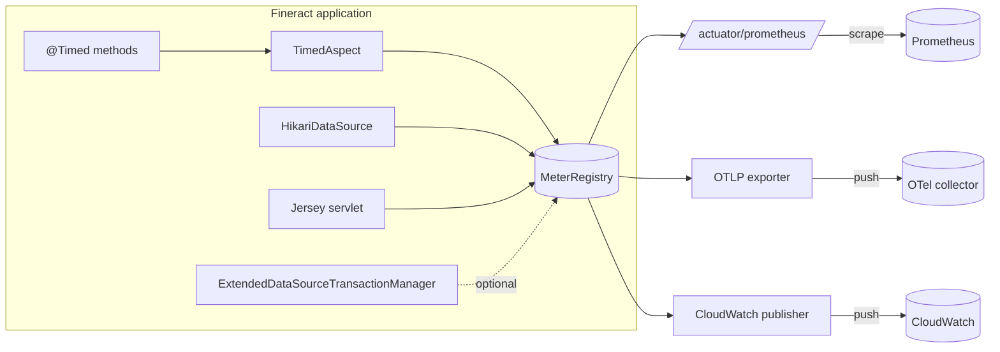

`fineract-provider` exposes a deliberately small operational surface through Spring Boot's actuator: a few health and info endpoints, Prometheus scraping by default, optional OTLP push, optional CloudWatch shipping, and the `@Timed` aspect from Micrometer. The wiring lives in **one tiny Java file** (`MetricsConfig.java`) and a block of `management.*` properties in `application.properties` — everything else is Spring Boot's auto-configuration acting on what is on the classpath.

This page documents:

- the `MetricsConfig` `@Configuration` class,
- which actuator endpoints are exposed by default,
- the Micrometer tags Fineract applies,
- the Prometheus, OTLP and CloudWatch export paths,
- the property keys that drive each piece.

## MetricsConfig

```java fineract-provider/src/main/java/org/apache/fineract/infrastructure/core/config/MetricsConfig.java
@Configuration
@EnableAspectJAutoProxy
public class MetricsConfig {

    @Bean
    public TimedAspect timedAspect(MeterRegistry registry) {
        return new TimedAspect(registry);
    }
}
```

That is the entire class. It does two things:

1. **`@EnableAspectJAutoProxy`** — turns on Spring's AspectJ proxying so `@Timed`-annotated beans receive the aspect.
2. **`timedAspect(MeterRegistry)`** — registers Micrometer's `io.micrometer.core.aop.TimedAspect`, which intercepts methods annotated with `@io.micrometer.core.annotation.@Timed` and produces a `Timer` (or `LongTaskTimer`) sample for every invocation.

`MeterRegistry` itself is auto-configured by `spring-boot-starter-actuator` plus whichever exporter starters are on the classpath (Prometheus, OTLP, CloudWatch). Fineract does not register one explicitly — it relies on Boot.

Effective consequence: any service method in any Fineract module can do

```java
@Timed(value = "fineract.loan.disburse", histogram = true)
public CommandProcessingResult disburseLoan(...) { ... }
```

and the resulting timer will show up in `/actuator/metrics/fineract.loan.disburse` and in the Prometheus scrape with whatever Micrometer common tags are configured (see below).

## Endpoint exposure

The actuator surface is exposed over HTTP through Boot's web-exposure include list. Defaults in `application.properties`:

```properties fineract-provider/src/main/resources/application.properties
management.endpoints.web.exposure.include=${FINERACT_MANAGEMENT_ENDPOINT_WEB_EXPOSURE_INCLUDE:health,info,prometheus}
management.endpoint.health.probes.enabled=true
management.health.livenessState.enabled=true
management.health.readinessState.enabled=true
management.health.jms.enabled=${FINERACT_MANAGEMENT_HEALTH_JMS_ENABLED:false}
management.health.ratelimiters.enabled=${FINERACT_MANAGEMENT_HEALTH_RATELIMITERS_ENABLED:false}
management.info.git.mode=FULL
management.endpoints.web.cors.allowed-origins=*
management.endpoints.web.cors.allowed-methods=GET, POST, PUT, DELETE, OPTIONS
management.endpoints.web.cors.allowed-headers=*
```

So a default boot exposes exactly three endpoints over HTTP:

| Endpoint | URL | Default | Notes |
| --- | --- | --- | --- |
| `health` | `GET /actuator/health` | on | Includes `liveness` / `readiness` sub-groups thanks to `management.endpoint.health.probes.enabled=true`. |
| `info` | `GET /actuator/info` | on | Populated with full Git metadata (`build.gradle` applies `com.gorylenko.gradle-git-properties`). `management.info.git.mode=FULL` exposes commit, branch and time. |
| `prometheus` | `GET /actuator/prometheus` | on | Plain-text Prometheus scrape. Requires `management.prometheus.metrics.export.enabled=true` (the default). |

Other endpoints (`metrics`, `loggers`, `mappings`, `env`, `beans`, `caches`, `threaddump`, `heapdump`) are **not** exposed by default — they are reachable in-process but not over HTTP. Override with `FINERACT_MANAGEMENT_ENDPOINT_WEB_EXPOSURE_INCLUDE=health,info,prometheus,metrics,loggers` (etc.) to extend the list.

### Health probes

`management.endpoint.health.probes.enabled=true` plus `management.health.livenessState.enabled=true` and `management.health.readinessState.enabled=true` produce the two Kubernetes-style probe sub-endpoints:

```text
GET /actuator/health/liveness
GET /actuator/health/readiness
```

The standard Spring Boot health indicators contribute to readiness — datasource, Liquibase, disk, etc. The JMS health indicator is off by default (`management.health.jms.enabled=false`) because not every deployment runs ActiveMQ. The rate-limiters indicator is similarly off by default; turn it on with `FINERACT_MANAGEMENT_HEALTH_RATELIMITERS_ENABLED=true` when Resilience4j is in use.

### CORS on the actuator port

Actuator endpoints have their own CORS configuration, parallel to the API one ([CORS & filters](/provider/cors-and-filters)):

```properties
management.endpoints.web.cors.allowed-origins=*
management.endpoints.web.cors.allowed-methods=GET, POST, PUT, DELETE, OPTIONS
management.endpoints.web.cors.allowed-headers=*
```

These keys are consumed by Boot's actuator auto-configuration and apply only to `/actuator/**`. They are independent from `fineract.security.cors.*`, which is what `FineractCorsConfiguration` reads for the `/api/**` surface.

## Exporters: Prometheus, OTLP, CloudWatch

### Prometheus (default)

```properties
management.prometheus.metrics.export.enabled=${FINERACT_MANAGEMENT_PROMETHEUS_ENABLED:true}
# management.prometheus.metrics.export.pushgateway.enabled=false
```

Prometheus shipping is on by default. The endpoint is `GET /actuator/prometheus`. The PushGateway is wired but commented out — turning it on requires uncommenting the property and adding the gateway host configuration.

### OTLP (off by default)

```properties
management.otlp.metrics.export.enabled=${FINERACT_MANAGEMENT_OLTP_ENABLED:false}
management.otlp.metrics.export.url=${FINERACT_MANAGEMENT_OLTP_METRICS_EXPORT_URL:http://tempo:4318/v1/traces}
management.otlp.metrics.export.aggregationTemporality=${FINERACT_MANAGEMENT_OLTP_METRICS_EXPORT_AGGREGATION_TEMPORALITY:cumulative}
```

Enables Micrometer's OTLP metrics exporter when `FINERACT_MANAGEMENT_OLTP_ENABLED=true`. The `aggregationTemporality` choice (`cumulative` vs. `delta`) matters when feeding a backend that requires a specific semantics — most collectors accept `cumulative`.

### CloudWatch (off by default)

```properties
management.metrics.export.cloudwatch.enabled=${FINERACT_MANAGEMENT_CLOUDWATCH_ENABLED:false}
management.metrics.export.cloudwatch.namespace=${FINERACT_MANAGEMENT_CLOUDWATCH_NAMESPACE:fineract}
management.metrics.export.cloudwatch.step=${FINERACT_MANAGEMENT_CLOUDWATCH_STEP:1m}
```

Sends timer/gauge data to AWS CloudWatch under the namespace `fineract` at one-minute intervals. The CloudWatch metric publisher uses the standard AWS SDK credential chain.

### Tracing

```properties
management.tracing.enabled=${FINERACT_MANAGEMENT_TRACIING_ENABLED:false}
```

Off by default. When enabled, Boot's Micrometer Tracing bridge produces spans alongside metrics (typically OTLP-pushed to Tempo/Jaeger).

## Common tags

Micrometer common tags are pinned at startup. Fineract sets:

```properties
management.metrics.tags.application=${FINERACT_MANAGEMENT_METRICS_TAGS_APPLICATION:fineract}
```

That single property turns into a `application=fineract` tag on **every** meter in the registry, which is enough to filter Fineract metrics in a shared Prometheus or CloudWatch namespace.

Additional tags come from elsewhere:

| Tag | Source | Notes |
| --- | --- | --- |
| `application` | `management.metrics.tags.application` | Static — defaults to `fineract`. |
| `tenant` | Added by tenant-aware service code where applicable (e.g. the routing data source instrumentation) | Only present on meters explicitly tagged at sample time. |
| HTTP server-side tags | Spring Boot auto-configured `WebMvcMetricsFilter` / Jersey instrumentation | `method`, `uri`, `status`, `exception`, `outcome` — added automatically to `http.server.requests`. |
| HikariCP pool tags | `pool=HikariPool-N` on `hikaricp.connections.*` meters | Auto-published by `MicrometerMetricsTracker` (Hikari wires it when `MeterRegistry` is present). |

There is no global Micrometer customizer in `fineract-provider` that injects the tenant tag onto every meter — making "tenant" a common tag would risk cardinality explosions in multi-tenant deployments. Instead it is added selectively on per-tenant counters/timers that benefit from it.

## Histograms for HTTP requests

```properties
management.metrics.distribution.percentiles-histogram.http.server.requests=${FINERACT_MANAGEMENT_METRICS_DISTRIBUTION_HTTP_SERVER_REQUESTS:false}
```

Off by default. When `FINERACT_MANAGEMENT_METRICS_DISTRIBUTION_HTTP_SERVER_REQUESTS=true`, Micrometer publishes histogram buckets for `http.server.requests`, which lets Prometheus compute true server-side percentiles — at the cost of significant cardinality.

The same toggle is available per-meter through `@Timed(histogram = true)` (the `TimedAspect` produced by `MetricsConfig` honours it). That is the recommended path for high-value business meters (e.g. loan disbursement time) because you can opt in per endpoint without flooding the registry.

## Meter map at a glance



## End-to-end request lifecycle in the metrics surface

```mermaid
sequenceDiagram
  participant Client
  participant Jersey
  participant Service as @Timed service
  participant Aspect as TimedAspect
  participant Registry as MeterRegistry
  participant Scrape as /actuator/prometheus
  Client->>Jersey: POST /api/v1/loans/{id}/disburse
  Jersey->>Service: disburseLoan(...)
  Service->>Aspect: method invocation
  Aspect->>Registry: timer.start()
  Aspect->>Service: proceed()
  Service-->>Aspect: result
  Aspect->>Registry: timer.stop(tags=method,uri,status,application)
  Jersey-->>Client: 200
  Note over Registry: also: http.server.requests, hikaricp.*, jvm.*, system.cpu.*
  Scrape->>Registry: scrape() (every 15s)
  Registry-->>Scrape: text/plain; version=0.0.4
```

## Full property reference

The full block as it ships in `application.properties`:

```properties fineract-provider/src/main/resources/application.properties
management.health.jms.enabled=${FINERACT_MANAGEMENT_HEALTH_JMS_ENABLED:false}
management.endpoint.health.probes.enabled=true
management.health.livenessState.enabled=true
management.health.readinessState.enabled=true
management.health.ratelimiters.enabled=${FINERACT_MANAGEMENT_HEALTH_RATELIMITERS_ENABLED:false}
management.endpoints.web.cors.allowed-origins=*
management.endpoints.web.cors.allowed-methods=GET, POST, PUT, DELETE, OPTIONS
management.endpoints.web.cors.allowed-headers=*
management.info.git.mode=FULL
management.endpoints.web.exposure.include=${FINERACT_MANAGEMENT_ENDPOINT_WEB_EXPOSURE_INCLUDE:health,info,prometheus}
management.tracing.enabled=${FINERACT_MANAGEMENT_TRACIING_ENABLED:false}
management.metrics.tags.application=${FINERACT_MANAGEMENT_METRICS_TAGS_APPLICATION:fineract}
management.metrics.distribution.percentiles-histogram.http.server.requests=${FINERACT_MANAGEMENT_METRICS_DISTRIBUTION_HTTP_SERVER_REQUESTS:false}
management.otlp.metrics.export.enabled=${FINERACT_MANAGEMENT_OLTP_ENABLED:false}
management.otlp.metrics.export.url=${FINERACT_MANAGEMENT_OLTP_METRICS_EXPORT_URL:http://tempo:4318/v1/traces}
management.otlp.metrics.export.aggregationTemporality=${FINERACT_MANAGEMENT_OLTP_METRICS_EXPORT_AGGREGATION_TEMPORALITY:cumulative}
management.prometheus.metrics.export.enabled=${FINERACT_MANAGEMENT_PROMETHEUS_ENABLED:true}
# management.prometheus.metrics.export.pushgateway.enabled=false
management.metrics.export.cloudwatch.enabled=${FINERACT_MANAGEMENT_CLOUDWATCH_ENABLED:false}
management.metrics.export.cloudwatch.namespace=${FINERACT_MANAGEMENT_CLOUDWATCH_NAMESPACE:fineract}
management.metrics.export.cloudwatch.step=${FINERACT_MANAGEMENT_CLOUDWATCH_STEP:1m}
```

## Behaviour reference

| Concern | Property | Default | Effect |
| --- | --- | --- | --- |
| HTTP exposure | `management.endpoints.web.exposure.include` | `health,info,prometheus` | Add `metrics` or `loggers` for richer ops; remove `prometheus` to silence the scrape endpoint. |
| K8s probes | `management.endpoint.health.probes.enabled` | `true` | Splits `/actuator/health` into `liveness` and `readiness` sub-paths. |
| Git info | `management.info.git.mode` | `FULL` | Boot exposes commit SHA, branch, time on `/actuator/info` — fed by the gradle-git-properties plugin. |
| Common tag | `management.metrics.tags.application` | `fineract` | Applied to every meter. |
| HTTP histograms | `management.metrics.distribution.percentiles-histogram.http.server.requests` | `false` | Enables per-bucket histograms — needed for accurate server-side percentiles. |
| Prometheus scrape | `management.prometheus.metrics.export.enabled` | `true` | Off-by-flag if Prometheus is not in use. |
| OTLP push | `management.otlp.metrics.export.enabled` | `false` | Combine with `management.tracing.enabled` for end-to-end OTel. |
| CloudWatch push | `management.metrics.export.cloudwatch.enabled` | `false` | Uses AWS default credential chain, namespace `fineract`. |
| JMS health check | `management.health.jms.enabled` | `false` | Turn on only when ActiveMQ is wired. |
| Rate-limiter health check | `management.health.ratelimiters.enabled` | `false` | Surfaces Resilience4j rate-limiter state. |
| Tracing | `management.tracing.enabled` | `false` | Bridges Micrometer Tracing to OTLP. |

## Operational notes

- **Securing actuators.** `AuthorizationServerConfig` includes `/actuator/**` in `securityMatcher(...)` for the OAuth2 profile so actuator endpoints sit behind authentication when OAuth is on; under basic-auth they are protected through the same Spring Security filter chain documented in [CORS & filters](/provider/cors-and-filters).
- **Same-port vs. separate-port.** By default actuator endpoints share the API port. Set `management.server.port=…` to move them off; combine with `springdoc.use-management-port=true` to keep Swagger UI on the same internal port.
- **Boot's auto-publish set.** Even without any Fineract-specific meters, `MeterRegistry` already contains `jvm.*`, `process.*`, `system.cpu.*`, `logback.events`, `hikaricp.*`, `tomcat.sessions.*` and `http.server.requests` — all of which appear on `/actuator/prometheus` automatically.
- **`@Timed` semantics.** `TimedAspect` requires the bean to be a Spring-managed proxy (i.e. an interface-based or CGLIB proxy). Calling a `@Timed` method from within the same class bypasses the aspect — pull it into a collaborator if you need that call timed.
- **No custom meter binder list.** Fineract does not register `MeterBinder` beans of its own from `MetricsConfig`. Domain meters are produced ad-hoc by services through `@Timed` or by directly using the autowired `MeterRegistry`.

## Related

- [Spring configuration classes](/provider/spring-configuration) — where `MetricsConfig` is summarised alongside its peers.
- [Bootstrap & Runtime → Spring Boot configuration](/runtime/spring-boot-configuration) — the `FineractProperties` and other `management.*` keys.
- [CORS & filters](/provider/cors-and-filters) — note the separate `management.endpoints.web.cors.*` CORS surface.
- [Security & Auth → Filters](/security/filters) — how actuator endpoints are protected when basic-auth or OAuth2 is enabled.
