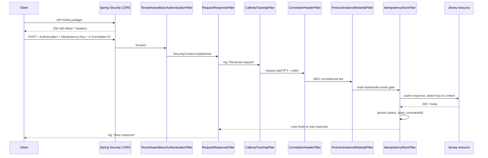

Every `/api/**` request through `fineract-provider` runs through a deliberately layered stack of servlet filters before it hits Jersey and the resource bean. The stack is assembled inside `SecurityConfig.filterChain(...)` using Spring Security's `addFilterBefore` / `addFilterAfter` operators relative to anchor filters like `SecurityContextHolderFilter`, `ExceptionTranslationFilter` and `RequestResponseFilter`. CORS is the one piece that is **not** a Fineract filter — it is the standard Spring Security CORS handler, configured by the `CorsConfigurationSource` bean built in `FineractCorsConfiguration`.

This page documents the filters owned by the provider (their flags, side-effects and ordering) and the CORS configuration that brackets them.

## CORS

CORS in Fineract is the standard Spring Web `CorsConfigurationSource` mechanism, populated from `FineractProperties.Security.Cors` and registered into the Spring Security chain by a single `http.cors(Customizer.withDefaults())` call in `SecurityConfig`, gated on `fineract.security.cors.enabled=true`.

```java fineract-provider/src/main/java/org/apache/fineract/infrastructure/core/config/FineractCorsConfiguration.java
@Bean
@ConditionalOnMissingBean(CorsConfigurationSource.class)
public CorsConfigurationSource corsConfigurationSource() {
    CorsConfiguration config = new CorsConfiguration();
    FineractProperties.CorsProperties corsConfiguration = fineractProperties.getSecurity().getCors();
    config.setAllowedOriginPatterns(corsConfiguration.getAllowedOriginPatterns());
    config.setAllowedMethods(corsConfiguration.getAllowedMethods());
    config.setAllowedHeaders(corsConfiguration.getAllowedHeaders());
    config.setExposedHeaders(corsConfiguration.getExposedHeaders());
    config.setAllowCredentials(corsConfiguration.isAllowCredentials());
    UrlBasedCorsConfigurationSource source = new UrlBasedCorsConfigurationSource();
    source.registerCorsConfiguration("/**", config);
    return source;
}
```

The bean is registered with `@ConditionalOnMissingBean(CorsConfigurationSource.class)`, which means an integrator can ship their own `CorsConfigurationSource` and Fineract will step aside.

### Property keys

The defaults in `application.properties` are intentionally permissive — production deployments are expected to tighten them.

| Key | Default | Notes |
| --- | --- | --- |
| `fineract.security.cors.enabled` | `${FINERACT_SECURITY_CORS_ENABLED:true}` | When `false`, `http.cors(...)` is not called and the filter chain has no CORS handler at all. |
| `fineract.security.cors.allowed-origin-patterns` | `${FINERACT_SECURITY_CORS_ALLOWED_ORIGIN_PATTERNS:*}` | List form. `*` works because Spring's `setAllowedOriginPatterns` permits credentials with wildcards (`setAllowedOrigins` does not). |
| `fineract.security.cors.allowed-methods` | `${FINERACT_SECURITY_CORS_ALLOWED_METHODS:*}` | `GET, POST, PUT, DELETE, OPTIONS` is the implicit superset. |
| `fineract.security.cors.allowed-headers` | `${FINERACT_SECURITY_CORS_ALLOWED_HEADERS:*}` | Headers a browser may send on the actual (non-preflight) request. |
| `fineract.security.cors.exposed-headers` | `${FINERACT_SECURITY_CORS_EXPOSED_HEADERS:*}` | Headers JavaScript may read off the response (`Access-Control-Expose-Headers`). Includes `X-Correlation-ID` and `Idempotency-Key` in practice. |
| `fineract.security.cors.allow-credentials` | `${FINERACT_SECURITY_CORS_ALLOW_CREDENTIALS:true}` | Required for Basic-auth/Cookie scenarios. Browsers will then refuse `*` for `Access-Control-Allow-Origin` — origin patterns must be specific. |

A second CORS surface, **`management.endpoints.web.cors.*`**, configures the actuator port independently:

```properties
management.endpoints.web.cors.allowed-origins=*
management.endpoints.web.cors.allowed-methods=GET, POST, PUT, DELETE, OPTIONS
management.endpoints.web.cors.allowed-headers=*
```

That block is consumed by Boot's actuator auto-configuration, not by `FineractCorsConfiguration`, and applies only under `/actuator/**`.

### Preflight handling

`OPTIONS /api/**` is explicitly permitted in `AuthorizationServerConfig.permitAll()`:

```java
auth.requestMatchers(API_MATCHER.matcher(HttpMethod.OPTIONS, "/api/**")).permitAll()
```

so browser preflights succeed without authentication. The `BasicAuthenticationFilter` (or OAuth resource-server filter) is skipped for `OPTIONS`, the CORS handler answers with the policy headers, and the request never reaches Jersey.

## Filter ordering

`SecurityConfig.filterChain(...)` assembles the filters relative to the Spring Security anchors `SecurityContextHolderFilter`, `ExceptionTranslationFilter`, plus the Fineract anchors `RequestResponseFilter` and `CorrelationHeaderFilter`. Boolean flags can add more filters near the end.

```java fineract-provider/src/main/java/org/apache/fineract/infrastructure/core/config/SecurityConfig.java
http.addFilterBefore(tenantAwareBasicAuthenticationFilter(), SecurityContextHolderFilter.class)
    .addFilterAfter(requestResponseFilter(), ExceptionTranslationFilter.class)
    .addFilterAfter(correlationHeaderFilter(), RequestResponseFilter.class)
    .addFilterAfter(fineractInstanceModeApiFilter(), CorrelationHeaderFilter.class);

if (loanCOBFilterHelper != null) {
    http.addFilterAfter(loanCOBApiFilter(), FineractInstanceModeApiFilter.class)
        .addFilterAfter(idempotencyStoreFilter(), LoanCOBApiFilter.class);
    http.addFilterBefore(progressiveLoanModelCheckerFilter, LoanCOBApiFilter.class);
} else {
    http.addFilterAfter(idempotencyStoreFilter(), FineractInstanceModeApiFilter.class);
    http.addFilterAfter(progressiveLoanModelCheckerFilter, FineractInstanceModeApiFilter.class);
}
if (fineractProperties.getIpTracking().isEnabled()) {
    http.addFilterAfter(callerIpTrackingFilter(), RequestResponseFilter.class);
}
if (fineractProperties.getSecurity().getTwoFactor().isEnabled()) {
    http.addFilterAfter(twoFactorAuthenticationFilter(), CorrelationHeaderFilter.class);
}
```

The effective order, for a typical default deploy (loan COB on, IP tracking on, 2FA off, basic auth on), is:

```mermaid
flowchart LR
  Req[Browser request] --> Cors[Spring Security CORS]
  Cors --> Basic[TenantAwareBasicAuthenticationFilter]
  Basic --> SCH[SecurityContextHolderFilter]
  SCH --> ET[ExceptionTranslationFilter]
  ET --> RR[RequestResponseFilter]
  RR --> IP[CallerIpTrackingFilter]
  RR --> CH[CorrelationHeaderFilter]
  CH --> IM[FineractInstanceModeApiFilter]
  IM --> PR[ProgressiveLoanModelCheckerFilter]
  PR --> COB[LoanCOBApiFilter]
  COB --> Idem[IdempotencyStoreFilter]
  Idem --> Jersey[Jersey servlet at /api/*]
```



(Order is approximate where multiple `addFilterAfter` calls anchor on the same predecessor — Spring Security inserts the most recently added first.)

## CallerIpTrackingFilter

```text fineract-core/src/main/java/org/apache/fineract/infrastructure/core/filters/CallerIpTrackingFilter.java
```

A `OncePerRequestFilter` that, when `fineract.ip-tracking.enabled=true`, resolves the caller's IP from the first non-blank value among a fixed list of headers (`X-Forwarded-For`, `Proxy-Client-IP`, `WL-Proxy-Client-IP`, `HTTP_X_FORWARDED_FOR`, `HTTP_X_FORWARDED`, `HTTP_X_CLUSTER_CLIENT_IP`, `HTTP_CLIENT_IP`, `HTTP_FORWARDED_FOR`, `HTTP_FORWARDED`, `HTTP_VIA`, `REMOTE_ADDR`), falling back to `request.getRemoteAddr()`. The resolved value is stored on the request as the `"IP"` attribute and cleared in the `finally` block. `isAsyncDispatch()` and `shouldNotFilterErrorDispatch()` are both overridden to `false` so the filter runs once per top-level request, not per error or async dispatch.

| Property | Default | Effect |
| --- | --- | --- |
| `fineract.ip-tracking.enabled` | `${FINERACT_CLIENT_IP_TRACKING_ENABLED:false}` | When `false`, the filter short-circuits straight to `filterChain.doFilter` without touching the request. |

The filter is wired only when the flag is enabled; otherwise `addFilterAfter(callerIpTrackingFilter(), RequestResponseFilter.class)` is skipped entirely.

## CorrelationHeaderFilter

```text fineract-core/src/main/java/org/apache/fineract/infrastructure/core/filters/CorrelationHeaderFilter.java
```

A `OncePerRequestFilter` that, when `fineract.correlation.enabled=true`, copies the correlation-id header off the inbound request and puts it on the SLF4J MDC under the key `correlationId`, escaping the value through `LogParameterEscapeUtil.escapeLogMDCParameter` to defuse log-forging attempts. The configured `mdcWrapper` (a thin wrapper used so tests can swap MDC) handles `put`/`remove`. The MDC entry is cleared in the `finally` block, so it never leaks between requests.

The Logback pattern in `logback-spring.xml` includes `%X{correlationId}`, which is how the value ends up in every log line emitted while handling the request — across thread boundaries when those threads inherit the MDC (e.g. `DelegatingSecurityContextAsyncTaskExecutor`, configured by `SpringConfig`).

| Property | Default | Effect |
| --- | --- | --- |
| `fineract.correlation.enabled` | `${FINERACT_LOGGING_HTTP_CORRELATION_ID_ENABLED:false}` | When `false`, the filter is a pass-through. |
| `fineract.correlation.header-name` | `${FINERACT_LOGGING_HTTP_CORRELATION_ID_HEADER_NAME:X-Correlation-ID}` | The HTTP header name read from the request. The value is **not** echoed back on the response by this filter. |

`FineractRequestContextHolder` also exposes the correlation ID to downstream services so e.g. webhook calls can propagate it.

## RequestResponseFilter

```text fineract-core/src/main/java/org/apache/fineract/infrastructure/core/filters/RequestResponseFilter.java
```

The simplest of the bunch: a `OncePerRequestFilter` that emits a `DEBUG` log on the way in (`"Received request: [{}], [{}]"` with method + URI) and another on the way out (`"Sent response: [{}] for [{}], [{}]"` with status + method + URI). It does not modify the request or response — its role is to give the surrounding filters a stable Spring Security anchor (`RequestResponseFilter.class`) to attach themselves to.

That is why `SecurityConfig` does `addFilterAfter(requestResponseFilter(), ExceptionTranslationFilter.class)` first, then `addFilterAfter(correlationHeaderFilter(), RequestResponseFilter.class)`, `addFilterAfter(fineractInstanceModeApiFilter(), CorrelationHeaderFilter.class)` and (conditionally) `addFilterAfter(callerIpTrackingFilter(), RequestResponseFilter.class)` — the entire Fineract-specific chain uses `RequestResponseFilter` as its root.

## IdempotencyStoreFilter

```text fineract-core/src/main/java/org/apache/fineract/infrastructure/core/filters/IdempotencyStoreFilter.java
```

A `OncePerRequestFilter` that gives clients an at-most-once guarantee on write commands. The flow is:

1. Read the `Idempotency-Key` header (name configurable via `fineract.idempotency-key-header-name`) from the inbound request.
2. If present, place it on `FineractRequestContextHolder` under `SynchronousCommandProcessingService.IDEMPOTENCY_KEY_ATTRIBUTE`.
3. Wrap the response in a `ContentCachingResponseWrapper` when the request content type is "allowed" (so the body can be captured).
4. Let the chain run.
5. On success — when a command id is present, the response content type is allowed, and the helper decides the key should be stored — persist `(status, body, commandId)` so a replay with the same `Idempotency-Key` returns the same result instead of re-executing the command.
6. Copy the cached body back to the real response.

The downstream `SynchronousCommandProcessingService` is what actually checks `IdempotencyStoreHelper` before executing a command — see [Core → Commands framework](/core/commands-framework). The filter only marshals header, request context, and response body.

| Property | Default | Effect |
| --- | --- | --- |
| `fineract.idempotency-key-header-name` | `${FINERACT_IDEMPOTENCY_KEY_HEADER_NAME:Idempotency-Key}` | Header used both for inbound key extraction and for batch sub-requests (see below). |

## IdempotencyStoreBatchFilter

```text fineract-core/src/main/java/org/apache/fineract/infrastructure/core/filters/IdempotencyStoreBatchFilter.java
```

The batch counterpart. The platform's `/batches` resource (in `fineract-core`) runs every sub-request through a chain of `BatchFilter`s instead of servlet filters, because each sub-request is just a deserialised `BatchRequest` rather than a real HTTP exchange. `IdempotencyStoreBatchFilter` is a `@Component` that implements `BatchFilter`, extracts the idempotency header out of the `BatchRequest.headers` list (filtering on `fineract.idempotency-key-header-name`), puts it on `FineractRequestContextHolder`, runs the chain, and stores `(statusCode, body, commandId)` on success. The shared `IdempotencyStoreHelper` keeps the logic identical to the servlet-filter case.

See [Core → Batch API](/core/batch-api) for the batch resource as a whole.

## How the filters compose

The runtime contract of a typical authenticated `POST /api/v1/loans` request looks like this:



When `fineract.correlation.enabled=false` the `CorrelationHeaderFilter` becomes a pass-through; when `fineract.ip-tracking.enabled=false` the `CallerIpTrackingFilter` is not even added to the chain; when no `Idempotency-Key` header is sent the `IdempotencyStoreFilter` still runs but stores nothing.

## Adjacent filters worth knowing about

`SecurityConfig` also wires:

- **`TenantAwareBasicAuthenticationFilter`** — runs first, resolves the tenant from `Fineract-Platform-TenantId`, authenticates Basic credentials against the tenant DB. See [Security → Basic auth](/security/basic-auth).
- **`FineractInstanceModeApiFilter`** — enforces `fineract.mode.read-enabled` / `…write-enabled` per HTTP method; matches read-only deployments. See [Core → Instance mode](/core/instance-mode).
- **`LoanCOBApiFilter`** and **`ProgressiveLoanModelCheckerFilter`** — bracket loan-COB catch-up so a request never touches a loan that is mid-COB. See [Core → Spring Batch integration](/core/spring-batch-integration).
- **`TwoFactorAuthenticationFilter`** — added only when `fineract.security.2fa.enabled=true`. See [Security → Two factor](/security/two-factor).

## Filter reference table

A quick scan of every Fineract-owned filter in the chain:

| Filter | Source path | Type | Property gate | Side-effect |
| --- | --- | --- | --- | --- |
| `CallerIpTrackingFilter` | `fineract-core/.../filters/CallerIpTrackingFilter.java` | `OncePerRequestFilter` | `fineract.ip-tracking.enabled` | Sets request attribute `"IP"` from forwarded-for headers. |
| `CorrelationHeaderFilter` | `fineract-core/.../filters/CorrelationHeaderFilter.java` | `OncePerRequestFilter` | `fineract.correlation.enabled` | Pushes header value (default `X-Correlation-ID`) into SLF4J MDC under `correlationId`. |
| `RequestResponseFilter` | `fineract-core/.../filters/RequestResponseFilter.java` | `OncePerRequestFilter` | (always) | DEBUG-logs method/URI in and status/method/URI out. |
| `IdempotencyStoreFilter` | `fineract-core/.../filters/IdempotencyStoreFilter.java` | `OncePerRequestFilter` | (always, but only effective when header set) | Captures `Idempotency-Key`, caches response, stores (status, body, commandId) on success. |
| `IdempotencyStoreBatchFilter` | `fineract-core/.../filters/IdempotencyStoreBatchFilter.java` | `BatchFilter` | (always for batch resource) | Same semantics inside `/batches`. |

## Property cheat-sheet

| Property | Default | Effect |
| --- | --- | --- |
| `fineract.security.cors.enabled` | `true` | Wire CORS into the Spring Security chain. |
| `fineract.security.cors.allowed-origin-patterns` | `*` | Patterns; combine with `allow-credentials=true`. |
| `fineract.security.cors.allowed-methods` | `*` | Methods on `Access-Control-Allow-Methods`. |
| `fineract.security.cors.allowed-headers` | `*` | Headers permitted on the actual request. |
| `fineract.security.cors.exposed-headers` | `*` | Headers JS may read off the response. |
| `fineract.security.cors.allow-credentials` | `true` | Browser permission to send credentials. |
| `fineract.ip-tracking.enabled` | `false` | Switch on `CallerIpTrackingFilter`. |
| `fineract.correlation.enabled` | `false` | Switch on `CorrelationHeaderFilter`. |
| `fineract.correlation.header-name` | `X-Correlation-ID` | Header read by `CorrelationHeaderFilter`. |
| `fineract.idempotency-key-header-name` | `Idempotency-Key` | Header consumed by both idempotency filters. |

## Operational notes

- **`OPTIONS` is always permitted.** Preflight is allowed unconditionally for `/api/**`, so locking down `fineract.security.cors.allowed-methods` does not break CORS preflight checks.
- **Correlation IDs survive async tasks.** Because `SpringConfig` registers the `applicationEventMulticaster` against a `DelegatingSecurityContextAsyncTaskExecutor`, the MDC value flows into listener threads. See [Spring configuration classes](/provider/spring-configuration).
- **`X-Correlation-ID` is not echoed.** `CorrelationHeaderFilter` only reads. If you want the value visible to the caller, add a small `OncePerRequestFilter` of your own (or expose `MDC.get("correlationId")` from a response interceptor).
- **`IP` attribute lifetime.** The `request.getAttribute("IP")` value is cleared in the `finally` block — do not rely on reading it from a `HandlerInterceptor.afterCompletion`. Read it inside the request handler instead.
- **Idempotency stores require an `Idempotency-Key`.** The filter is wired unconditionally and never rejects a missing header — it just becomes a no-op. Clients opt in by sending the header.
- **CORS does not protect actuator endpoints.** `/actuator/**` has its own `management.endpoints.web.cors.*` block.

## Related

- [Security & Auth → Filters](/security/filters) — the same chain seen from the security side, including the authentication and authorization steps.
- [Spring configuration classes](/provider/spring-configuration) — `FineractCorsConfiguration` and `SecurityConfig` as `@Configuration` beans.
- [Jersey JAX-RS bootstrap](/provider/jersey-bootstrap) — the servlet these filters protect.
- [Core → Commands framework](/core/commands-framework) — the persistent idempotency store these filters feed.
- [Core → Batch API](/core/batch-api) — where `IdempotencyStoreBatchFilter` is wired into the per-sub-request pipeline.
