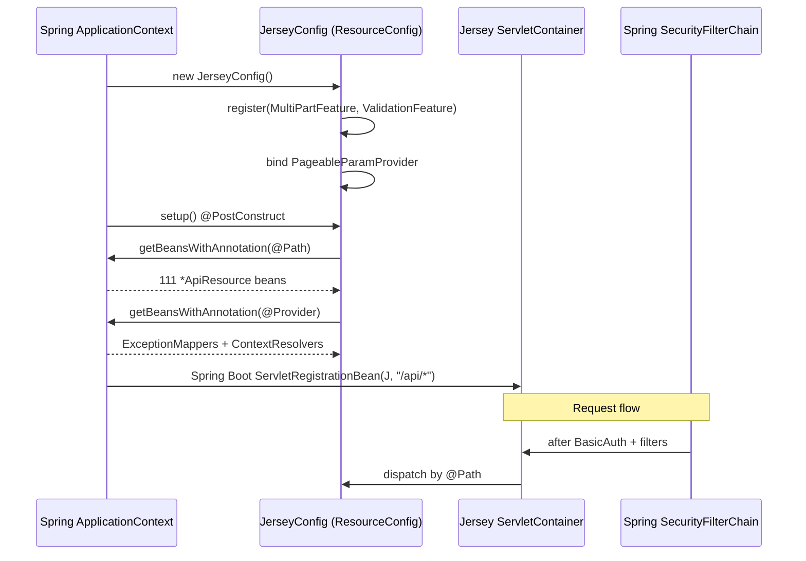
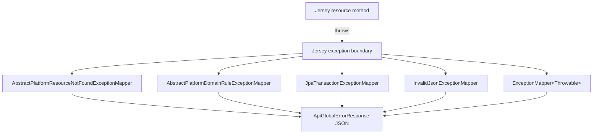

Apache Fineract serves its REST surface through **Jersey 3.x** (the JAX-RS reference implementation) embedded in the Spring Boot application. The bootstrap is unusual in one regard: instead of statically listing the resource classes or letting Jersey scan a package on its own, Fineract uses a tiny `JerseyConfig` that extends `org.glassfish.jersey.server.ResourceConfig`, asks the Spring `ApplicationContext` for every bean annotated `@jakarta.ws.rs.Path` (or `@jakarta.ws.rs.ext.Provider`), and registers each one. This means every JAX-RS resource and every JAX-RS provider in the platform is also a regular Spring bean — that is what lets resources inject Fineract services, transaction managers, the platform `PlatformSecurityContext`, and the per-tenant `RoutingDataSource` straight into their fields.

There is exactly **one** Jersey configuration file in the entire repository:

```text
fineract-provider/src/main/java/org/apache/fineract/infrastructure/core/jersey/JerseyConfig.java
```

There are no `ResourceConfig` subclasses anywhere else and there is no `web.xml` / `WebApplicationInitializer` overriding it. Everything that follows is reached from that one class.

## JerseyConfig in full

```java fineract-provider/src/main/java/org/apache/fineract/infrastructure/core/jersey/JerseyConfig.java
@Configuration(proxyBeanMethods = false)
@ApplicationPath("/api")
public class JerseyConfig extends ResourceConfig {

    JerseyConfig() {
        register(org.glassfish.jersey.media.multipart.MultiPartFeature.class);
        register(new AbstractBinder() {
            @Override
            protected void configure() {
                bind(PageableParamProvider.class).to(ValueParamProvider.class).in(Singleton.class);
            }
        });
        register(org.glassfish.jersey.server.validation.ValidationFeature.class);
        property(ServerProperties.WADL_FEATURE_DISABLE, true);
    }

    @Autowired
    ApplicationContext appCtx;

    @PostConstruct
    public void setup() {
        appCtx.getBeansWithAnnotation(Path.class).values().forEach(this::register);
        appCtx.getBeansWithAnnotation(Provider.class).values().forEach(this::register);
    }
}
```

That ~25 lines is the whole story. Let us unpack it.

## What the constructor registers

The constructor runs before Spring has a chance to inject the application context, so it can only register classes that do **not** need autowiring — Jersey-internal features and a single HK2 binding.

| Registration | Purpose |
| --- | --- |
| `MultiPartFeature.class` | Enables `multipart/form-data` parsing on resources that declare `@FormDataParam` (notably the document-management upload endpoints under `/api/v1/clients/{id}/documents`, `/api/v1/loans/{id}/documents`, etc.). |
| `new AbstractBinder() { bind(PageableParamProvider).to(ValueParamProvider).in(Singleton); }` | Teaches Jersey how to materialise a Spring `Pageable` argument straight from query parameters (`?page=`, `?size=`, `?sort=`). The provider class is `org.apache.fineract.infrastructure.core.api.jersey.PageableParamProvider`. |
| `ValidationFeature.class` | Enables `jakarta.validation` (Bean Validation) on resource methods — `@Valid` parameter checking, `@NotNull`/`@Pattern` constraints on request DTOs, and the `ConstraintViolationException` mapper. |
| `property(ServerProperties.WADL_FEATURE_DISABLE, true)` | Turns off Jersey's auto-generated WADL at `/application.wadl`. Fineract publishes OpenAPI (see [Swagger and OpenAPI](/provider/swagger-openapi)) and has no need for a parallel WADL document. |

The constructor does **not** register Gson, JSON or message-body providers manually. That is intentional — Fineract sidesteps Jersey's normal JSON path entirely. Most resource methods are typed `@Produces(MediaType.APPLICATION_JSON)` and return raw `String` payloads that the `ToApiJsonSerializer<T>` helper has already serialised using the platform Gson instance. The result is that Jersey only ever sees `String` going out, which avoids any double-serialisation between Jersey's MessageBodyWriter chain and Fineract's Gson. The full discussion of that decision lives in [Bootstrap & Runtime → Serialization and Jersey](/runtime/serialization-and-jersey).

## The @PostConstruct sweep

After Spring has injected `appCtx`, the `setup()` method runs and walks the context twice:

```java
appCtx.getBeansWithAnnotation(Path.class).values().forEach(this::register);
appCtx.getBeansWithAnnotation(Provider.class).values().forEach(this::register);
```

- **`@Path` beans** are JAX-RS resource classes — everything matching `*ApiResource.java` plus the batch resource and the OpenAPI helpers. There are 111 such classes in `fineract-provider` alone (see [API resources index](/provider/api-resources-index)).
- **`@Provider` beans** are JAX-RS extension points — exception mappers (e.g. `UnAuthenticatedUserExceptionMapper`, `PlatformDataIntegrityExceptionMapper`, `AbstractPlatformResourceNotFoundExceptionMapper`), reader/writer interceptors, and `ContextResolver` implementations. The Spring `@Component` stereotype plus `@Provider` is enough — there is no separate registration list.

Because both queries hit the live Spring context, registering a new resource is a two-step operation:

1. Annotate the class with both `@Component` (or `@Service`) and `@Path("…")`.
2. Make sure the package falls under `org.apache.fineract.**` so the platform component scan picks it up.

No edit to `JerseyConfig` is needed. The same is true for `@Provider` extensions: drop the class into any Fineract module under `org.apache.fineract.**`, mark it `@Component @Provider`, and the next boot will register it.



## How the servlet itself gets registered

`JerseyConfig` is annotated `@ApplicationPath("/api")`. That single annotation is what Spring Boot's `JerseyAutoConfiguration` reads to decide the servlet mapping. There is **no** explicit `ServletRegistrationBean` or `JerseyAutoConfiguration` override in the codebase — Boot's defaults do the right thing:

1. `JerseyAutoConfiguration` notices a `ResourceConfig` bean on the classpath.
2. It creates a `ServletRegistrationBean<ServletContainer>` whose URL pattern is derived from `@ApplicationPath`, here `/api/*`.
3. Boot's embedded Tomcat installs that servlet on the main port (`server.port`, default `8080`).

Every authenticated `/api/**` request therefore passes through Spring Security's filter chain first (see [Security filters](/security/filters)) and is then dispatched into Jersey, which routes it to the matching `@Path` method on the resource bean discovered above.

The other directories under `/` are served by Spring MVC's static handler, not by Jersey:

| URL prefix | Served by | Source |
| --- | --- | --- |
| `/api/**` | Jersey (`JerseyConfig`) | `@ApplicationPath("/api")` |
| `/swagger-ui/**`, `/api-docs`, `/fineract.json` | springdoc-openapi (Spring MVC) | `springdoc.*` properties |
| `/legacy-docs/**` | Spring MVC static handler | `src/main/resources/static/legacy-docs/` |
| `/actuator/**` | Spring Boot actuator | `management.endpoints.web.exposure.include` |

The dual stack is the reason `SecurityConfig` uses `PathPatternRequestMatcher` rather than a Jersey-only matcher — both Jersey and Spring MVC endpoints have to pass through the same Spring Security pipeline.

## Provider-side message body handling

Although Jersey is not asked to serialise JSON, several **provider** registrations matter:

| `@Provider` kind | Examples in `fineract-provider` / `fineract-core` | Role |
| --- | --- | --- |
| `ExceptionMapper<…>` | `UnAuthenticatedUserExceptionMapper`, `InvalidJsonExceptionMapper`, `AbstractPlatformDomainRuleExceptionMapper`, `AbstractPlatformResourceNotFoundExceptionMapper`, `AbstractPlatformServiceUnavailableExceptionMapper`, `JpaTransactionExceptionMapper` | Translate platform exceptions into structured `ApiGlobalErrorResponse` JSON, set the right HTTP status. |
| `ContextResolver<Gson>` | n/a — Fineract serialises before Jersey sees the payload | — |
| `MessageBodyReader<MultiPart>` / `MessageBodyWriter<…>` | Provided by `MultiPartFeature` | Read `multipart/form-data` for document uploads. |
| `ContainerRequestFilter` | The Jersey-level CORS shim is **not** registered here — CORS lives in the Spring filter chain via `FineractCorsConfiguration`. See [CORS & filters](/provider/cors-and-filters). |

Because resources return `String` JSON, the only default writer Jersey ends up using on the response side is the plain-text writer, which simply copies the byte buffer to the response. The reverse direction (parsing the request body) is also short-circuited for `application/json`: resources declare their methods with `String json` parameters and call `apiRequestBodyContext.parse(json)` themselves.

## Path-based JSON tweaks for the API surface

`PageableParamProvider` is the one place where Fineract teaches Jersey to materialise a non-trivial type from query parameters. It implements `org.glassfish.jersey.server.spi.internal.ValueParamProvider` and is bound in singleton scope inside `JerseyConfig`'s constructor `AbstractBinder`. When a resource method declares a `Pageable pageable` argument, the provider reads `page`, `size`, `sort` from the request and produces a Spring Data `PageRequest`. Without that binding Jersey would refuse the unknown parameter type at startup.

## When a new resource appears in the wire-format

The end-to-end consequence of "everything is discovered, not registered" is:

| Action | Result |
| --- | --- |
| Add `@Path("/v1/widgets") @Component class WidgetsApiResource` under `org.apache.fineract.portfolio.widgets.api` | Next boot publishes `/api/v1/widgets/**` automatically; appears in `fineract.json`; `JerseyConfig.setup()` registers it. |
| Add a `@Provider @Component class WidgetExceptionMapper implements ExceptionMapper<WidgetException>` | Next boot picks it up; exceptions of that type are mapped during Jersey response building. |
| Forget `@Component` | `getBeansWithAnnotation(Path.class)` will not return the bean, so the resource is **not** registered even though it compiles cleanly. This is the most common cause of "my endpoint returns 404". |
| Add `@Component @Path("…")` to a class outside `org.apache.fineract.**` | Not picked up by the component scan in `FineractWebApplicationConfiguration`, so it never reaches `JerseyConfig` either. |

The matching deployment guide for adding a new resource is in [API resources index](/provider/api-resources-index), which lists all currently registered `*ApiResource.java` classes and their root `@Path` values.

## Interaction with springdoc-openapi

`springdoc-openapi-starter-webmvc-ui` is configured to scan `org.apache.fineract` for JAX-RS resources (`springdoc.packagesToScan=org.apache.fineract`, `springdoc.pathsToMatch=/api/**`). The resource classes registered with Jersey by `JerseyConfig` and the resource classes scanned by springdoc are the **same set** — both rely on the `@Path` annotation. That parity is what keeps the runtime surface and the published OpenAPI document in sync, and is why CI runs the Gradle `resolve` task with `readerClass = 'org.apache.fineract.infrastructure.openapi.FineractOperationIdReader'` to fail the build if anyone forgets a unique `operationId`. The full Swagger story is in [Swagger and OpenAPI](/provider/swagger-openapi).

## Caveats and intentional limitations

- **No HK2-Spring bridge.** Fineract does not pull in `jersey-spring6`. Dependency injection into resources is done by Spring (because each `@Path` class is already a Spring bean) — not by Jersey. `@Context`-style injection still works for JAX-RS objects (`UriInfo`, `HttpServletRequest`) because those are filled in by Jersey itself.
- **WADL is off.** `WADL_FEATURE_DISABLE = true` is set explicitly. Do not expect `/api/application.wadl`.
- **No `jersey-mvc`, no `jersey-server-linking`.** Hyperlinks and view templating are not used.
- **No `jersey-json` / `jersey-media-json-jackson`.** JSON marshalling is handled by Fineract's Gson + `ToApiJsonSerializer`, never by Jersey's auto-configured Jackson.

## Lifecycle hooks

A few subtleties matter when adding code that participates in the Jersey bootstrap:

- **`@PostConstruct` order.** `JerseyConfig.setup()` runs after Spring has finished refreshing the context, so every `@Path` and `@Provider` bean has already been instantiated by the time it is registered. There is no chicken-and-egg problem with services injected into resources.
- **Lazy beans.** A resource that is marked `@Lazy` will still appear in `getBeansWithAnnotation(Path.class)` because Spring returns the proxy. The lazy initialisation happens when Jersey first dispatches into it.
- **Prototype beans.** All shipped resources are singletons. Defining a `@Scope("prototype")` `@Path` bean would be picked up by `setup()`, but Jersey itself caches resources per request-matcher and the prototype would be instantiated only once.
- **Shutdown.** `ResourceConfig` does not own any lifecycle hooks beyond what Boot's `ServletRegistrationBean` gives it. Closing the Spring context destroys the Jersey servlet alongside everything else.

## Comparing JerseyConfig to other Spring patterns

It is worth pointing out what `JerseyConfig` is **not** doing, because the Boot ecosystem has several near-misses:

| Pattern | Used here? | Comment |
| --- | --- | --- |
| `JerseyAutoConfiguration` resource-scan property | Yes — defaults from Boot | Boot creates the `ServletRegistrationBean` for `JerseyConfig` because it is a `ResourceConfig` bean. |
| `ResourceConfig.packages("…")` | No | Fineract uses the Spring context, not Jersey's classpath scanner. |
| `Application.getClasses()` / `getSingletons()` | No | The `@PostConstruct` sweep replaces both. |
| `WebApplicationInitializer` or `web.xml` | No | Pure Boot embedded Tomcat. |
| `JerseyResourceConfigCustomizer` | No | All customisation happens inside the constructor of `JerseyConfig`. |
| `JerseyApplicationPath` bean | No | `@ApplicationPath("/api")` on the class is sufficient. |

This minimal surface area is what makes the Jersey integration easy to reason about — there is exactly one file and exactly one annotation that determine how a `@Path` reaches the wire.

## How JAX-RS providers participate

The second sweep — `getBeansWithAnnotation(Provider.class)` — is what makes Fineract's exception-mapper layer pluggable. The mappers fall into a few categories:

| Category | Example mappers | When they fire |
| --- | --- | --- |
| **Domain rule violations** | `AbstractPlatformDomainRuleExceptionMapper`, `AbstractPlatformResourceNotFoundExceptionMapper`, `AbstractPlatformServiceUnavailableExceptionMapper` | Whenever a service throws a `PlatformApiDataValidationException`, `PlatformResourceNotFoundException` or `PlatformServiceUnavailableException`. Each maps to a structured `ApiGlobalErrorResponse` JSON shape with the matching HTTP status (400 / 404 / 503). |
| **Persistence translation** | `JpaTransactionExceptionMapper`, `DataIntegrityViolationExceptionMapper` | Unique-constraint, optimistic-lock, FK and PK violations turn into 4xx responses with a `userMessageGlobalisationCode` so the UI can render the right localised message. |
| **Authentication** | `UnAuthenticatedUserExceptionMapper`, `InvalidApiParameterExceptionMapper` | Translates the platform's home-grown auth exceptions to 401/403 with the right `WWW-Authenticate` header. |
| **Deserialisation** | `InvalidJsonExceptionMapper` | Catches Gson `JsonSyntaxException`/`JsonParseException` raised by `ToApiJsonSerializer` and translates them into a structured 400. |
| **Fallback** | `ExceptionMapper<Throwable>` | Catches anything that escaped the above mappers and produces a 500 with a generic `userMessageGlobalisationCode`. |

These mappers are dropped into different Fineract modules (`fineract-core`, `fineract-loan`, `fineract-savings`, etc.) and end up in the same registry simply because each is `@Component @Provider` — `JerseyConfig` does not need to know about them.



The full error-response shape and the underlying exception hierarchy are described in [Bootstrap & Runtime → Error handling](/runtime/error-handling).

## Property knobs that affect Jersey

There is no `jersey.*` block in `application.properties`. The only properties that change Jersey behaviour are:

| Property | Default | Effect |
| --- | --- | --- |
| `spring.jersey.application-path` | (unset) | Boot would honour this to override the servlet path. Fineract instead relies on the `@ApplicationPath("/api")` annotation. |
| `spring.jersey.type` | `servlet` | Servlet container mode (the alternative is `filter`). Fineract uses `servlet` so the chain remains compatible with Spring Security's pre-filter pipeline. |
| `springdoc.pathsToMatch` | `/api/**` | Indirectly limits the OpenAPI scan to the same path Jersey serves. See [Swagger and OpenAPI](/provider/swagger-openapi). |

Inside `JerseyConfig` only one Jersey property is set, and it is set in Java rather than via `application.properties`:

```java
property(ServerProperties.WADL_FEATURE_DISABLE, true);
```

## Diagnosing a missing endpoint

When an expected `/api/...` path returns `404`, the cause is almost always one of:

| Symptom | Probable cause | Fix |
| --- | --- | --- |
| Endpoint missing both at runtime **and** from `fineract.json` | Class has `@Path` but no `@Component`/`@Service` so component scan misses it | Add `@Component` (or `@Service`) to the resource class. |
| Endpoint missing only at runtime, present in `fineract.json` | Class lives outside `org.apache.fineract.**` — picked up by Gradle scan classpath but not by the runtime component scan | Move class under `org.apache.fineract.…`. |
| Endpoint present at runtime, missing from `fineract.json` | Class lives in a Gradle source set that is not on the `swagger-gradle-plugin` `classpath` | Add the module to `fineract-provider`'s `implementation` dependencies. |
| Endpoint present but returns 401/403 immediately | Forgot to add the `requestMatchers(...)` rule in `SecurityConfig` or `AuthorizationServerConfig` | Add the matcher + authority pair (see [Security → Basic auth](/security/basic-auth)). |
| Endpoint returns 405 on `OPTIONS` | CORS not enabled | Set `fineract.security.cors.enabled=true` (see [CORS & filters](/provider/cors-and-filters)). |

Because `JerseyConfig.setup()` is `@PostConstruct`, the resource list is fixed for the lifetime of the application. Restart is required to register a freshly-added class.

## Related

- [API resources index](/provider/api-resources-index) — the 111 resource classes Jersey ends up registering.
- [Serialization and Jersey](/runtime/serialization-and-jersey) — why Fineract serialises with Gson before Jersey writes the response.
- [Spring configuration classes](/provider/spring-configuration) — `SecurityConfig`, `FineractCorsConfiguration`, etc. that bracket the Jersey servlet.
- [CORS & filters](/provider/cors-and-filters) — the Spring-side filter pipeline every Jersey-bound request traverses first.
- [Swagger and OpenAPI](/provider/swagger-openapi) — how the same `@Path` set drives the generated contract.
