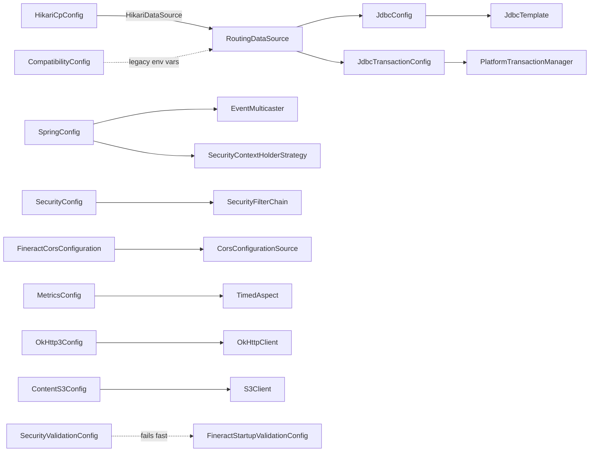
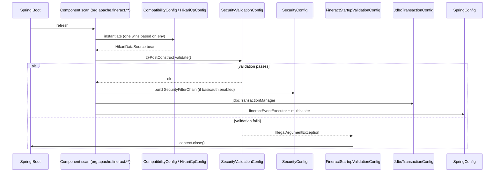

`fineract-provider` itself owns a small but very load-bearing set of Spring `@Configuration` classes that sit directly under `org.apache.fineract.infrastructure.core.config`. They are the place where the tenant `HikariDataSource` is materialised, where `JdbcTemplate`/`NamedParameterJdbcTemplate` and the platform `PlatformTransactionManager` are exposed, where the asynchronous event multicaster is wired, where OkHttp is built, and where Spring Security's filter chain is described. These classes are picked up by the application's component scan (`org.apache.fineract.**`, started from `FineractWebApplicationConfiguration` in `fineract-core`) and most of them are gated by either an environment variable, a `fineract.*` property, a Spring profile, or a startup validation condition.

This page is a one-paragraph-plus-`@Bean`-table reference for every file currently in `fineract-provider/src/main/java/org/apache/fineract/infrastructure/core/config/`, plus the closely related `SpringAsyncConfig` under `infrastructure/configuration/async/`.

```text fineract-provider/src/main/java/org/apache/fineract/infrastructure/core/config/
CompatibilityConfig.java
ContentS3Config.java
FineractCorsConfiguration.java
FineractStartupValidationConfig.java
HikariCpConfig.java
JdbcConfig.java
JdbcTransactionConfig.java
MetricsConfig.java
OkHttp3Config.java
SecurityConfig.java
SecurityValidationConfig.java
SpringConfig.java
TaskExecutorConfig.java
TaskExecutorConstant.java
cache/
jpa/
```

## Bootstrap shape

The wiring relationships between the configuration classes look like this — most of the runtime infrastructure (`RoutingDataSource`, `PlatformTransactionManager`, `JdbcTemplate`, `MeterRegistry`, the Jersey servlet, the Security filter chain) is rooted in beans defined by these files.



## CompatibilityConfig

A deprecated bridge that translates the old `fineract_tenants_*` environment variables (`fineract_tenants_driver`, `fineract_tenants_url`, `fineract_tenants_uid`, `fineract_tenants_pwd`) into the modern `FINERACT_HIKARI_*` shape, then builds a `HikariDataSource` from them. The whole class is gated by `@ConditionalOnExpression("#{ systemEnvironment['fineract_tenants_driver'] != null }")` so it only activates on a legacy environment, and a `@PostConstruct` writes a multi-line `WARN` to the log telling operators to migrate. The class itself is annotated `@Deprecated` and is scheduled for removal.

| @Bean | Returns | Condition | Sources / property keys |
| --- | --- | --- | --- |
| `hikariTenantDataSource()` | `HikariDataSource` | `@ConditionalOnExpression` env `fineract_tenants_driver` set | `fineract_tenants_driver`, `fineract_tenants_url`, `fineract_tenants_uid`, `fineract_tenants_pwd`, plus `FINERACT_HIKARI_*` overrides |

## ContentS3Config

Builds an AWS SDK v2 `S3Client` used by the document-management module when content is stored in S3. The class reads `FineractProperties.getContent().getS3()` for region, endpoint override, path-style addressing and access/secret key, and falls back to `DefaultCredentialsProvider` when no static keys are supplied. The whole bean is gated by `@ConditionalOnProperty("fineract.content.s3.enabled")`.

| @Bean | Returns | Condition | Sources / property keys |
| --- | --- | --- | --- |
| `contentS3Client(FineractProperties)` | `software.amazon.awssdk.services.s3.S3Client` | `@ConditionalOnProperty("fineract.content.s3.enabled")` | `fineract.content.s3.enabled`, `fineract.content.s3.region`, `fineract.content.s3.endpoint`, `fineract.content.s3.access-key`, `fineract.content.s3.secret-key`, `fineract.content.s3.path-style-addressing-enabled` |

## FineractCorsConfiguration

Exposes the `CorsConfigurationSource` that `SecurityConfig` consumes when `fineract.security.cors.enabled=true`. The bean reads the `fineract.security.cors.*` block from `FineractProperties.Security.Cors` and registers a single `CorsConfiguration` under `"/**"` in a `UrlBasedCorsConfigurationSource`. It is guarded by `@ConditionalOnMissingBean(CorsConfigurationSource.class)` so integrators may override it.

| @Bean | Returns | Condition | Sources / property keys |
| --- | --- | --- | --- |
| `corsConfigurationSource()` | `CorsConfigurationSource` | `@ConditionalOnMissingBean(CorsConfigurationSource.class)` | `fineract.security.cors.allowed-origin-patterns`, `…allowed-methods`, `…allowed-headers`, `…exposed-headers`, `…allow-credentials` |

See [CORS, IP tracking, correlation headers](/provider/cors-and-filters) for the matching properties and runtime semantics.

## FineractStartupValidationConfig

Not a bean factory at all — a `@Component` (not `@Configuration`) annotated `@Order(Ordered.HIGHEST_PRECEDENCE)` whose `afterPropertiesSet()` calls `((ConfigurableApplicationContext) applicationContext).close()`. It is gated by `@Conditional(FineractValidationCondition.class)`, which is satisfied only when one of the earlier validation components (e.g. `SecurityValidationConfig`) has flagged a fatal misconfiguration. The effect is "abort startup with a clean shutdown" instead of letting Spring carry on with a half-built context.

| @Bean | Returns | Condition | Sources |
| --- | --- | --- | --- |
| — (no `@Bean` methods; implements `InitializingBean`) | — | `@Conditional(FineractValidationCondition.class)` | Triggered by any other `Fineract*ValidationConfig` |

## HikariCpConfig

The default path for the tenant pool. A single `@Bean(destroyMethod = "close") @ConfigurationProperties(prefix = "spring.datasource.hikari")` factory returns a `HikariDataSource` bound to the standard `spring.datasource.hikari.*` namespace. The class is gated by `@ConditionalOnExpression("#{ systemEnvironment['fineract_tenants_driver'] == null }")` so it is the active path whenever the legacy `CompatibilityConfig` is not.

| @Bean | Returns | Condition | Sources / property keys |
| --- | --- | --- | --- |
| `hikariTenantDataSource()` | `com.zaxxer.hikari.HikariDataSource` | `@ConditionalOnExpression` env `fineract_tenants_driver` **unset** | `spring.datasource.hikari.*` (driver-class-name, jdbc-url, username, password, minimum-idle, maximum-pool-size, idle-timeout, connection-timeout, data-source-properties.*) |

## JdbcConfig

Wraps the multi-tenant `RoutingDataSource` (defined in `fineract-core`) into the two `JdbcTemplate` flavours every read-side service in the platform consumes, and enables Spring Data JDBC repository scanning for three specific packages — the command store, the document-management domain and the MIX taxonomy. It is excluded from the `liquibase-only` Spring profile so the migration-only boot does not try to wire JDBC repositories.

| @Bean | Returns | Condition | Sources |
| --- | --- | --- | --- |
| `jdbcTemplate(RoutingDataSource)` | `org.springframework.jdbc.core.JdbcTemplate` | `@Profile("!liquibase-only")` | wraps `RoutingDataSource` |
| `namedParameterJdbcTemplate(RoutingDataSource)` | `NamedParameterJdbcTemplate` | `@Profile("!liquibase-only")` | wraps `RoutingDataSource` |

`@EnableJdbcRepositories(basePackages = { "org.apache.fineract.command.jdbc.store.domain", "org.apache.fineract.infrastructure.documentmanagement.domain", "org.apache.fineract.mix.domain" }, jdbcOperationsRef = "namedParameterJdbcTemplate", transactionManagerRef = "jdbcTransactionManager")` declares the Spring Data JDBC scan.

## JdbcTransactionConfig

Exposes two `ExtendedDataSourceTransactionManager` instances — the platform-wide `jdbcTransactionManager` (referenced by name by `JdbcConfig`'s `@EnableJdbcRepositories`) and a parallel `batchJdbcTransactionManager` used by the Spring Batch jobs. Both honour `fineract.mode.write-enabled=false` by flipping into read-only mode and apply any registered `TransactionLifecycleCallback`s and Boot's `TransactionManagerCustomizers`. A `TransactionTemplate` bound to the batch manager rounds out the file.

| @Bean | Returns | Condition | Sources |
| --- | --- | --- | --- |
| `jdbcTransactionManager` | `PlatformTransactionManager` | always | `FineractProperties.mode.readOnlyMode`, `RoutingDataSource`, `TransactionLifecycleCallback` list |
| `batchJdbcTransactionManager` | `PlatformTransactionManager` | always | same as above |
| `batchJdbcTransactionTemplate` | `TransactionTemplate` | always | `@Qualifier("batchJdbcTransactionManager")` |

The class is declared `@Configuration(proxyBeanMethods = false)` because each `@Bean` is self-contained and never invoked from another bean method.

## MetricsConfig

A deliberately minimal class: it carries `@EnableAspectJAutoProxy` and exposes a single `TimedAspect` so that `io.micrometer.core.annotation.@Timed` on service methods produces meter samples. The Micrometer `MeterRegistry` itself is auto-configured by Spring Boot (`spring-boot-starter-actuator`), which is also what publishes Prometheus and OTLP backends.

| @Bean | Returns | Condition | Sources |
| --- | --- | --- | --- |
| `timedAspect(MeterRegistry)` | `io.micrometer.core.aop.TimedAspect` | always | autowired `MeterRegistry` |

See [Spring Boot actuator and Micrometer metrics](/provider/actuator-and-metrics) for the matching property keys.

## OkHttp3Config

Builds the application-wide `okhttp3.OkHttpClient` used by webhook posting, OAuth resource-server validation and OpenID Connect federation. Connect/read/write timeouts come from `fineract.client-connect-timeout`, `fineract.client-read-timeout`, `fineract.client-write-timeout` (seconds). When `fineract.insecure-http-client=true` the configuration installs an all-trusting `X509TrustManager` and an `HostnameVerifier` that always returns `true` — that flag exists so developers can talk to test IdPs with self-signed certs and **must not** be used in production.

| @Bean | Returns | Condition | Sources / property keys |
| --- | --- | --- | --- |
| `okHttpClient()` | `okhttp3.OkHttpClient` | always | `fineract.client-connect-timeout`, `fineract.client-read-timeout`, `fineract.client-write-timeout`, `fineract.insecure-http-client` |

## SecurityConfig

The Spring Security configuration class for the basic-auth profile (the OAuth2 path lives in `infrastructure/security/config/AuthorizationServerConfig.java`). The class is `@ConditionalOnProperty("fineract.security.basicauth.enabled")` and `@EnableMethodSecurity`. Its `SecurityFilterChain` registers stateless session management, disables CSRF, adds `TenantAwareBasicAuthenticationFilter`, `RequestResponseFilter`, `CorrelationHeaderFilter`, `FineractInstanceModeApiFilter`, optionally `LoanCOBApiFilter`, `IdempotencyStoreFilter`, `ProgressiveLoanModelCheckerFilter`, `CallerIpTrackingFilter` and `TwoFactorAuthenticationFilter`, then declares hundreds of `requestMatchers(...).hasAnyAuthority(...)` rules pinning each `/api/**` endpoint to an authority.

| @Bean | Returns | Condition | Sources / property keys |
| --- | --- | --- | --- |
| `filterChain(HttpSecurity, …)` | `SecurityFilterChain` | `@ConditionalOnProperty("fineract.security.basicauth.enabled")` | `fineract.security.basicauth.enabled`, `fineract.security.hsts.enabled`, `fineract.security.cors.enabled`, `fineract.security.2fa.enabled`, `fineract.ip-tracking.enabled`, `server.ssl.enabled` |
| `basicAuthenticationEntryPoint()` | `BasicAuthenticationEntryPoint` | `basicauth.enabled` | realm `"Fineract Platform API"` |
| `authProvider()` (`customAuthenticationProvider`) | `DaoAuthenticationProvider` | `basicauth.enabled` | `TenantAwareJpaPlatformUserDetailsService`, `PlatformUserDetailsChecker` |
| `passwordEncoder()` | `PasswordEncoder` | `basicauth.enabled` | `PasswordEncoderFactories.createDelegatingPasswordEncoder()` |
| `authenticationManagerBean()` | `AuthenticationManager` | `basicauth.enabled` | wraps `authProvider()` |

Filter-instance helper methods (`requestResponseFilter()`, `correlationHeaderFilter()`, `callerIpTrackingFilter()`, `idempotencyStoreFilter()`, `fineractInstanceModeApiFilter()`, `tenantAwareBasicAuthenticationFilter()`, `twoFactorAuthenticationFilter()`, `loanCOBApiFilter()`) are package-visible — they construct the filters used inside `filterChain(...)` and are not themselves `@Bean`-annotated, which keeps the filter pipeline explicit.

## SecurityValidationConfig

A `@PostConstruct` consistency check: it reads `fineract.security.basicauth.enabled` and `fineract.security.oauth2.enabled` and throws `IllegalArgumentException` when neither **or** both are `true`. When that exception fires Spring's bean initialisation fails, `FineractValidationCondition` flips, and `FineractStartupValidationConfig` closes the context cleanly.

| @Bean | Returns | Condition | Sources |
| --- | --- | --- | --- |
| — (`@PostConstruct validate()` only) | — | always | `fineract.security.basicauth.enabled`, `fineract.security.oauth2.enabled` |

## SpringConfig

Owns three intertwined pieces:

1. **`fineractEventExecutor`** — a `ThreadPoolTaskExecutor` named `FineractEvent-*` whose pool size defaults to `cpus × 2` core / `cpus × 5` max with a 100-element queue, configurable through `spring.task.execution.pool.core-size`, `…max-size`, `…queue-capacity`. Rejected tasks fall back to `CallerRunsPolicy`; shutdown waits up to 60 s.
2. **`applicationEventMulticaster`** — replaces the default synchronous multicaster with a `SimpleApplicationEventMulticaster` that dispatches through a `DelegatingSecurityContextAsyncTaskExecutor` wrapping (1), so listeners run on a worker thread but keep the publisher's `SecurityContext`.
3. **`overrideSecurityContextHolderStrategy`** and **`securityContextHolderStrategy`** — a `MethodInvokingFactoryBean` that flips Spring Security's static `SecurityContextHolder` to `MODE_INHERITABLETHREADLOCAL` plus an exposed bean of the resulting strategy, so child threads see the authenticated principal.

| @Bean | Returns | Condition | Sources / property keys |
| --- | --- | --- | --- |
| `fineractEventExecutor(ThreadPoolTaskExecutorBuilder, …)` | `ThreadPoolTaskExecutor` | always | `spring.task.execution.pool.core-size`, `…max-size`, `…queue-capacity` |
| `applicationEventMulticaster(@Qualifier("fineractEventExecutor"))` | `SimpleApplicationEventMulticaster` | always | `@DependsOn("overrideSecurityContextHolderStrategy")` |
| `overrideSecurityContextHolderStrategy()` | `MethodInvokingFactoryBean` | always | calls `SecurityContextHolder.setStrategyName(MODE_INHERITABLETHREADLOCAL)` |
| `securityContextHolderStrategy()` | `SecurityContextHolderStrategy` | always | `@DependsOn("overrideSecurityContextHolderStrategy")` |

## SpringAsyncConfig (configuration/async)

Lives in `org.apache.fineract.infrastructure.configuration.async`, not in `core/config`, but is part of the same wiring story. It is `@EnableAsync` and `implements AsyncConfigurer`, providing the uncaught-exception handler and two single-threaded executors used to serialize the loan COB catch-up work so that two catch-up runs never race against the same loan.

| @Bean | Returns | Condition | Sources |
| --- | --- | --- | --- |
| `loanCOBCatchUpThreadPoolTaskExecutor()` (`LOAN_COB_CATCH_UP_TASK_EXECUTOR_BEAN_NAME`) | `ThreadPoolTaskExecutor` (max pool = 1) | `@EnableAsync` | — |
| `workingCapitalLoanCOBCatchUpThreadPoolTaskExecutor()` (`WORKING_CAPITAL_LOAN_COB_CATCH_UP_TASK_EXECUTOR_BEAN_NAME`) | `ThreadPoolTaskExecutor` (max pool = 1) | `@EnableAsync` | — |
| `getAsyncUncaughtExceptionHandler()` (override) | `CustomAsyncExceptionHandler` | — | logs uncaught async exceptions |

<Note>
  `TaskExecutorConfig.java` and `TaskExecutorConstant.java` in the same package hold the rest of the named task-executor beans (notification, COB inline, business-event broadcast). They are detailed in [Bootstrap & Runtime → Spring Boot configuration](/runtime/spring-boot-configuration).
</Note>

## Profile and conditional cheat-sheet

| Activation | Active classes |
| --- | --- |
| Default boot (`fineract_tenants_driver` unset, `basicauth.enabled=true`) | `HikariCpConfig`, `JdbcConfig`, `JdbcTransactionConfig`, `MetricsConfig`, `OkHttp3Config`, `SecurityConfig`, `SpringConfig`, `FineractCorsConfiguration`, `SpringAsyncConfig` |
| Legacy env vars present | adds `CompatibilityConfig`, disables `HikariCpConfig` |
| `liquibase-only` profile | `JdbcConfig` skipped; only Liquibase + `HikariCpConfig` materialise |
| `fineract.content.s3.enabled=true` | adds `ContentS3Config` |
| `fineract.security.oauth2.enabled=true` (and `basicauth.enabled=false`) | `SecurityConfig` skipped; `AuthorizationServerConfig` (security module) provides the filter chain instead |
| Misconfiguration (both auth schemes on/off) | `SecurityValidationConfig` throws → `FineractStartupValidationConfig` closes the context |

## Subpackages: cache and jpa

`core/config/` also contains two sub-packages whose responsibilities are adjacent enough that they merit a mention even though they are not the focus of this page:

| Sub-package | Role |
| --- | --- |
| `core/config/cache` | Holds `CacheConfig`, the EhCache / Caffeine wiring used by `CacheWritePlatformService`. The bean it exposes is consumed by `SecurityConfig` (cache invalidation on credential change) and by the configuration-domain services that cache rarely-changing reference data. |
| `core/config/jpa` | Holds the JPA bootstrap (`EntityManagerFactory`, vendor adapter, persistence-unit `packagesToScan`), the EclipseLink dynamic-weaving setup, and the JPA dialect customisations Fineract needs (e.g. `PostgreSQLDialectCustom`, `MySQLDialectCustom`). |

The JPA package is intentionally **not** exposed via Spring Data: Fineract uses plain `EntityManager` + `JpaRepository` in domain modules. The `EnableJdbcRepositories` annotation in `JdbcConfig` is the only Spring Data scan in the provider.

## Adding a new @Configuration to fineract-provider

Because `FineractWebApplicationConfiguration` does `@ComponentScan(basePackages = "org.apache.fineract.**")`, any new `@Configuration` class dropped into `org.apache.fineract.**` is picked up automatically — the four constraints are:

1. **Package.** Sit under `org.apache.fineract.**` so the component scan picks the class up.
2. **Profile guard.** Add `@Profile(...)` when the bean should not start in `liquibase-only` mode, in instance-mode tests, or in integration runs.
3. **Conditional guard.** Use `@ConditionalOnProperty(...)` for feature flags (so missing properties never break the boot) and `@ConditionalOnMissingBean(...)` when the bean should be overridable by integrators — `FineractCorsConfiguration` is the model here.
4. **Validation.** If the class introduces a fatal invariant (e.g. "exactly one auth scheme"), implement the check the same way `SecurityValidationConfig` does — throw from `@PostConstruct` and let `FineractValidationCondition` + `FineractStartupValidationConfig` close the context cleanly instead of leaving Spring half-initialised.

## Where each property block is consumed

| Property prefix | Owning class | What it drives |
| --- | --- | --- |
| `spring.datasource.hikari.*` | `HikariCpConfig` | Tenant pool sizing, JDBC URL, credentials. |
| `fineract.mode.*` | `JdbcTransactionConfig` | Read-only flag on the `PlatformTransactionManager`. |
| `fineract.security.basicauth.enabled` / `…oauth2.enabled` | `SecurityValidationConfig`, `SecurityConfig` | Pick exactly one auth scheme. |
| `fineract.security.cors.*` | `FineractCorsConfiguration` | The `CorsConfigurationSource` consumed by `SecurityConfig`. |
| `fineract.security.hsts.enabled`, `fineract.security.2fa.enabled` | `SecurityConfig` | Adds the matching filters / response headers. |
| `fineract.ip-tracking.enabled` | `SecurityConfig` | Conditional `CallerIpTrackingFilter` wiring. |
| `fineract.content.s3.*` | `ContentS3Config` | AWS SDK v2 `S3Client` for document storage. |
| `fineract.client-*-timeout`, `fineract.insecure-http-client` | `OkHttp3Config` | The platform `OkHttpClient`. |
| `spring.task.execution.pool.*` | `SpringConfig` | `fineractEventExecutor` sizing. |

## Lifecycle ordering at startup

The conditions and `@PostConstruct` calls above interact at boot in a specific order, and small mistakes (e.g. an exception thrown from `SecurityValidationConfig` rather than `IllegalArgumentException`) can leave Spring in a half-initialised state. The intended sequence is:



`FineractValidationCondition` becomes `true` as soon as any other validation component records a failure, which is what makes `FineractStartupValidationConfig.afterPropertiesSet()` actually invoke `context.close()` instead of merely doing nothing.

## Related

- [Bootstrap & Runtime → Spring Boot configuration](/runtime/spring-boot-configuration) — the `FineractProperties` tree these classes consume.
- [Security & Auth → Filters](/security/filters) — runtime behaviour of the filters wired by `SecurityConfig`.
- [Jersey JAX-RS bootstrap](/provider/jersey-bootstrap) — how the JAX-RS surface sits on top of the Spring Security filter chain configured here.
- [Core → Cache](/core/cache) — what `core/config/cache/` plugs into at the domain layer.
- [Core → JPA persistence](/core/jpa-persistence) — companion piece for `core/config/jpa/`.
