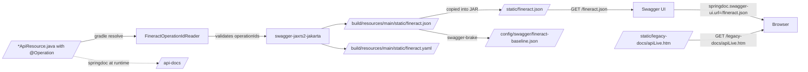

Apache Fineract publishes its REST contract through **two cooperating mechanisms**:

1. **Build-time** — the Gradle `resolve` task (provided by the `io.swagger.core.v3.swagger-gradle-plugin`) walks the JAX-RS resources via `swagger-jaxrs2-jakarta`, runs Fineract's custom `FineractOperationIdReader` to validate explicit `operationId`s, and writes `fineract.json` + `fineract.yaml` into `fineract-provider/build/resources/main/static/`. This is what gets bundled into the runtime JAR and what `swagger-brake` diffs against the baseline to catch breaking API changes.
2. **Run-time** — `springdoc-openapi-starter-webmvc-ui` is on the classpath, so Spring Boot auto-publishes a live OpenAPI document at `/api-docs` and the Swagger UI at `/swagger-ui/index.html` against a running instance. By default the UI is pointed at the **build-time** JSON (`springdoc.swagger-ui.url=/fineract.json`) rather than the live scan, so the published contract is deterministic.

A third surface exists for historical reasons: the static `legacy-docs/` directory under `src/main/resources/static/legacy-docs/`, which is a hand-curated HTML reference (`apiLive.htm`) kept around so older integrations that linked to it do not break.

There is **no** `SwaggerHomeApiResource` in the codebase — Swagger UI is delivered entirely by springdoc, not by a Fineract `*ApiResource`. The `infrastructure/openapi/` package contains exactly one file:

```text
fineract-provider/src/main/java/org/apache/fineract/infrastructure/openapi/
└── FineractOperationIdReader.java
```

## Where each piece lives

| Surface | URL / file | Produced by |
| --- | --- | --- |
| Swagger UI | `/swagger-ui/index.html` (redirect from `/swagger-ui.html`) | `springdoc-openapi-starter-webmvc-ui` at runtime |
| Live JSON | `/api-docs` (path configurable) | `springdoc` runtime scan of `org.apache.fineract` |
| Pinned JSON | `/fineract.json`, `/fineract.yaml` | Build-time Gradle `resolve` task — copied into `static/` |
| Legacy HTML | `/legacy-docs/apiLive.htm` | Hand-edited static file in `src/main/resources/static/legacy-docs/` |
| Breaking-change check | Gradle `checkBreakingChanges` | `com.docktape.swagger-brake` vs. `config/swagger/fineract-baseline.json` |



## springdoc-openapi at runtime

`fineract-provider/dependencies.gradle` pulls in:

```groovy
'org.springdoc:springdoc-openapi-starter-webmvc-ui',
```

That single starter brings in both the JSON producer and the Swagger UI webjar. The `application.properties` keys that control it are:

```properties fineract-provider/src/main/resources/application.properties
springdoc.api-docs.path=${SPRINGDOC_API_DOCS_PATH:/api-docs}
springdoc.api-docs.enabled=${SPRINGDOC_API_DOCS_ENABLED:true}
springdoc.swagger-ui.enabled=${SPRINGDOC_SWAGGER_UI_ENABLED:true}
springdoc.swagger-ui.display-query-params=true
springdoc.swagger-ui.url=/fineract.json
springdoc.packagesToScan=org.apache.fineract
springdoc.pathsToMatch=/api/**
springdoc.use-management-port=${SPRINGDOC_USE_MANAGEMENT_PORT:false}
springdoc.show-actuator=${SPRINGDOC_SHOW_ACTUATOR:false}
```

| Key | Default | Effect |
| --- | --- | --- |
| `springdoc.api-docs.path` | `/api-docs` | Path of the live, springdoc-scanned JSON. Set to `/openapi.json` etc. via `SPRINGDOC_API_DOCS_PATH`. |
| `springdoc.api-docs.enabled` | `true` | Turn the runtime scan off — useful in tightly locked-down deployments that prefer to serve only the pinned `fineract.json`. |
| `springdoc.swagger-ui.enabled` | `true` | Mount the Swagger UI webjar at `/swagger-ui/index.html`. |
| `springdoc.swagger-ui.url` | `/fineract.json` | **Important**: the UI does not read from `/api-docs`. It reads from the pinned JSON built by Gradle, so the rendered docs match the shipped contract. |
| `springdoc.swagger-ui.display-query-params` | `true` | Expand query parameters in the "Try it out" form by default. |
| `springdoc.packagesToScan` | `org.apache.fineract` | Limits the runtime scan to Fineract packages — keeps Spring Boot's auto-configured controllers out of the spec. |
| `springdoc.pathsToMatch` | `/api/**` | Mirrors the Jersey `@ApplicationPath("/api")` so `/actuator/**` is excluded. |
| `springdoc.show-actuator` | `false` | Even when `pathsToMatch` would include them, actuator endpoints are kept off the OpenAPI document. |
| `springdoc.use-management-port` | `false` | Keep the UI on the main port; set to `true` to serve it next to actuators on `management.server.port`. |

Springdoc's discovery uses JAX-RS annotations (`@Path`, `@GET`, `@POST`, etc.) rather than Spring MVC — that is the same annotation set Jersey's `JerseyConfig` walks (see [Jersey JAX-RS bootstrap](/provider/jersey-bootstrap)), which is why the runtime contract and the runtime endpoints stay in lock-step.

## Build-time generation: swagger-jaxrs2 + the Gradle `resolve` task

`fineract-provider/build.gradle` applies the Swagger Core Gradle plugin:

```groovy fineract-provider/build.gradle
apply plugin: 'io.swagger.core.v3.swagger-gradle-plugin'
apply plugin: 'com.docktape.swagger-brake'
```

and configures the document generation:

```groovy
tasks.register('prepareInputYaml') {
    outputs.file("${buildDir}/tmp/swagger/fineract-input.yaml")
    doLast {
        copy {
            from file("${projectDir}/config/swagger/fineract-input.yaml.template")
            into file("${buildDir}/tmp/swagger")
            rename { 'fineract-input.yaml' }
            filter(ReplaceTokens, tokens: [VERSION: "${project.version}".toString()])
        }
    }
}

resolve {
    outputFileName = 'fineract'
    outputFormat = 'JSONANDYAML'
    prettyPrint = false
    classpath = sourceSets.main.runtimeClasspath
    buildClasspath = classpath
    outputDir = file("${buildDir}/resources/main/static")
    openApiFile = file("${buildDir}/tmp/swagger/fineract-input.yaml")
    readerClass = 'org.apache.fineract.infrastructure.openapi.FineractOperationIdReader'
    sortOutput = true
    dependsOn(prepareInputYaml, classes)
}
```

The `resolve` task:

1. Materialises `fineract-input.yaml` from `config/swagger/fineract-input.yaml.template`, substituting the project version.
2. Loads the runtime classpath into a `swagger-jaxrs2-jakarta` `Reader` — specifically the Fineract subclass `FineractOperationIdReader`.
3. Writes `fineract.json` and `fineract.yaml` into `build/resources/main/static/`, where they end up packaged inside the boot JAR.
4. Sorts the output so diffs are deterministic.

`com.docktape.swagger-brake` then compares the produced `fineract.json` against `config/swagger/fineract-baseline.json` and fails the build on breaking changes. The task is conditional and is skipped when either the baseline or the new spec is absent:

```groovy
checkBreakingChanges.onlyIf {
    def baseline = findProperty('apiBaseline') ?: "${projectDir}/config/swagger/fineract-baseline.json"
    def apiNew   = findProperty('apiNew')      ?: "${project.buildDir}/resources/main/static/fineract.json"
    file(baseline).exists() && file(apiNew).exists()
}
```

## FineractOperationIdReader

The Fineract-specific reader is a thin subclass of `io.swagger.v3.jaxrs2.Reader` whose only added behaviour is to **fail the build** when two `@Operation(operationId = "...")` strings collide.

```java fineract-provider/src/main/java/org/apache/fineract/infrastructure/openapi/FineractOperationIdReader.java
public final class FineractOperationIdReader extends Reader {

    @Override
    public OpenAPI read(Set<Class<?>> classes, Map<String, Object> resources) {
        ExplicitOperationValidator.validate(classes);
        return super.read(classes, resources);
    }

    static final class ExplicitOperationValidator {
        static void validate(Set<Class<?>> classes) {
            Map<String, List<String>> operationIds = new LinkedHashMap<>();
            for (Class<?> resourceClass : classes) {
                if (resourceClass.getAnnotation(Path.class) == null) continue;
                for (Method method : resourceClass.getMethods()) {
                    Operation operation = method.getAnnotation(Operation.class);
                    String operationId = trimToNull(operation == null ? null : operation.operationId());
                    if (operationId == null || !hasHttpMethod(method)) continue;
                    operationIds.computeIfAbsent(operationId, k -> new ArrayList<>())
                                .add(resourceClass.getSimpleName() + "#" + method.getName());
                }
            }
            List<String> duplicates = operationIds.entrySet().stream()
                    .filter(e -> e.getValue().size() > 1)
                    .map(e -> e.getKey() + " -> " + String.join(", ", e.getValue()))
                    .sorted().toList();
            if (!duplicates.isEmpty()) {
                throw new IllegalStateException(
                        "Duplicate explicit OpenAPI operationIds detected:\n - "
                                + String.join("\n - ", duplicates));
            }
        }
    }
}
```

What it checks:

- The class is JAX-RS (`@Path` present).
- The method has an HTTP-verb annotation (`@GET`, `@POST`, ...) — `hasHttpMethod` walks the method's annotations looking for a meta-`@HttpMethod`.
- The method has an explicit `@Operation(operationId = "…")`.

Two resource methods declaring the same `operationId` will surface as:

```
Duplicate explicit OpenAPI operationIds detected:
 - createClient -> ClientsApiResource#create, ClientsApiResource#createClientFromTemplate
```

This is what keeps generated client code (Java SDK, TypeScript SDK) free of method-name collisions.

## *ApiResourceSwagger.java companion DTOs

The annotated `@RequestBody` / `@ApiResponse` shapes that drive the OpenAPI examples are not the runtime command DTOs. Instead, each `*ApiResource` ships a sibling `*ApiResourceSwagger.java` file that contains **public static nested classes** annotated with `@Schema(...)` for every request body, response body and example. Examples spread across the codebase:

```text
fineract-accounting/src/main/java/org/apache/fineract/accounting/accrual/api/AccrualAccountingApiResourceSwagger.java
fineract-accounting/src/main/java/org/apache/fineract/accounting/closure/api/GLClosuresApiResourceSwagger.java
fineract-accounting/src/main/java/org/apache/fineract/accounting/financialactivityaccount/api/FinancialActivityAccountsApiResourceSwagger.java
fineract-accounting/src/main/java/org/apache/fineract/accounting/glaccount/api/GLAccountsApiResourceSwagger.java
fineract-accounting/src/main/java/org/apache/fineract/accounting/provisioning/api/ProvisioningEntriesApiResourceSwagger.java
```

Convention:

- The companion file is named after the resource (`FooApiResource.java` ↔ `FooApiResourceSwagger.java`) and lives in the same package.
- Each nested class is `public static final class PostFooRequest { @Schema(example="42") public Long clientId; ... }`.
- The resource method references the companion type via `@Operation(... requestBody = @RequestBody(content = @Content(schema = @Schema(implementation = FooApiResourceSwagger.PostFooRequest.class))) ...)`.
- The classes are **never** instantiated at runtime — Gson reads the actual JSON payload into runtime command DTOs. Their sole purpose is to populate the OpenAPI document.

Adding a new endpoint therefore requires three pieces in lock-step:

| Piece | Location | Role |
| --- | --- | --- |
| Runtime resource method | `*ApiResource.java` with `@Path`, `@POST` etc. | Handles the actual request, deserialises JSON via `ToApiJsonSerializer`. |
| OpenAPI annotations | `@Operation(operationId = "createFoo", ...)` on the same method | Adds the operation, links request/response schemas. |
| Schema companion | `*ApiResourceSwagger.java` | Nested `@Schema` classes that describe request and response bodies. |

## Legacy static documentation

`fineract-provider/src/main/resources/static/legacy-docs/` ships three files:

```text
apiLive.htm
apidocs.css
jquery-1.7.min.js
```

This is a curated, hand-written HTML reference that predates the springdoc UI. Spring MVC's default static handler serves it at `/legacy-docs/apiLive.htm`. The file is explicitly listed alongside the modern endpoints in the OAuth2 security matcher so it stays reachable:

```java fineract-provider/src/main/java/org/apache/fineract/infrastructure/security/config/AuthorizationServerConfig.java
http.securityMatcher("/swagger-ui/**", "/fineract.json", "/actuator/**", "/legacy-docs/apiLive.htm")
```

The legacy doc is **not** regenerated from source — edits are made directly to `apiLive.htm`. It is kept around because older integrators have bookmarks pointing at named anchors inside the page.

## Putting it together: where each artefact comes from

| Artefact | Source of truth | Refresh trigger |
| --- | --- | --- |
| `/swagger-ui/index.html` | springdoc webjar | Every restart |
| `/fineract.json`, `/fineract.yaml` (in JAR) | `gradle resolve` ran on the runtime classpath | Every CI build |
| `/api-docs` (live spec) | `springdoc` scan of `org.apache.fineract` (`@Path`) | Every restart |
| `config/swagger/fineract-input.yaml.template` | Hand-edited (top-level `info:`, `servers:`) | Manual PR |
| `config/swagger/fineract-baseline.json` | Last released spec | Released manually after each version bump |
| `/legacy-docs/apiLive.htm` | Hand-edited HTML in `src/main/resources/static/` | Manual PR |

## Operational tips

- **Local exploration without a backend:** open `build/resources/main/static/fineract.json` in any OpenAPI explorer. The file is deterministic across builds because `resolve` sets `sortOutput = true`.
- **Locking the spec down:** set `SPRINGDOC_API_DOCS_ENABLED=false` to stop the runtime scan, and rely solely on the pinned JSON.
- **Moving Swagger UI to the management port:** set `SPRINGDOC_USE_MANAGEMENT_PORT=true` plus the actuator port — this keeps the UI off the public API port but is unusual.
- **Hiding actuators from the spec:** keep `springdoc.show-actuator=false` (the default).
- **Spotting a missing `operationId`:** the `resolve` task fails with `Duplicate explicit OpenAPI operationIds detected:` listing all offending pairs.

## Related

- [Jersey JAX-RS bootstrap](/provider/jersey-bootstrap) — the same `@Path` set both Jersey and springdoc walk.
- [API resources index](/provider/api-resources-index) — the 111 `*ApiResource` classes that contribute operations.
- [Actuator and metrics](/provider/actuator-and-metrics) — why `springdoc.show-actuator` and `springdoc.use-management-port` exist.
- [Serialization and Jersey](/runtime/serialization-and-jersey) — why the runtime DTOs and the `*ApiResourceSwagger` DTOs are separate.
