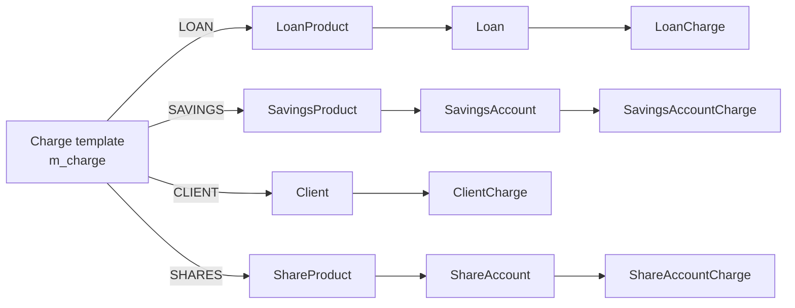
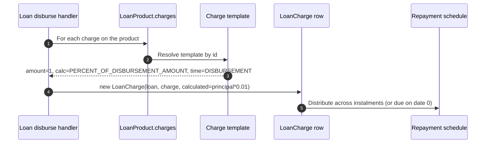
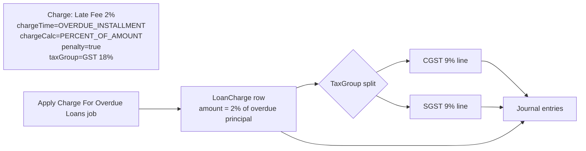

Almost every fee, penalty, withdrawal cost, annual subscription, and tranche-disbursement levy in Apache Fineract is just a row in `m_charge`. A `Charge` is a **template**: it is defined once by the operations team and then attached to loans, savings accounts, share accounts, or clients, where the platform materialises concrete `LoanCharge`, `SavingsAccountCharge`, `ShareAccountCharge`, or `ClientCharge` rows that follow the template's calculation rules. The `Charge` aggregate lives in `org.apache.fineract.portfolio.charge` inside the `fineract-charge` module.

## Module layout

```
fineract-charge
└── org.apache.fineract.portfolio.charge
    ├── api/        ChargesApiResource, ChargesApiConstants
    ├── data/       ChargeData, ChargeRequest, ChargeResponse
    ├── domain/     Charge, ChargeAppliesTo, ChargeTimeType,
    │               ChargeCalculationType, ChargePaymentMode, repositories
    ├── exception/  ChargeNotFoundException, ChargeMustBePenaltyException, …
    ├── handler/    Create / Update / Delete command handlers
    └── service/    ChargeReadPlatformService, ChargeWritePlatformService,
                    ChargeEnumerations
```

`ChargeTimeType` is one of the few classes that lives in `fineract-core` (`org.apache.fineract.portfolio.charge.domain`) rather than `fineract-charge`, because savings, loans, and shares all reference its values in their own domain code.

## The Charge entity

`Charge extends AbstractPersistableCustom<Long>` and maps to `m_charge`. The unique constraint is on `name`, so two charges can never share a display name within a tenant.

| Column | Java field | Notes |
|--------|------------|-------|
| `name` | `String name` | Unique within tenant, max 100 chars. |
| `amount` | `BigDecimal amount` | Flat amount or percentage value depending on `chargeCalculation`. Scale 6, precision 19. |
| `currency_code` | `String currencyCode` | ISO-style code; must match the account it is attached to. |
| `charge_applies_to_enum` | `Integer chargeAppliesTo` | One of `ChargeAppliesTo` — LOAN, SAVINGS, CLIENT, SHARES, WORKING\_CAPITAL\_LOAN. |
| `charge_time_enum` | `Integer chargeTimeType` | One of `ChargeTimeType` — defines *when* the charge fires. |
| `charge_calculation_enum` | `Integer chargeCalculation` | One of `ChargeCalculationType` — flat vs percent. |
| `charge_payment_mode_enum` | `Integer chargePaymentMode` | `REGULAR` or `ACCOUNT_TRANSFER` (loan charges only). |
| `fee_on_day`, `fee_on_month` | `Integer` | Used by annual / monthly fees to fix the trigger date. |
| `fee_interval` | `Integer` | Frequency in months / weeks for recurring fees. |
| `fee_frequency` | `Integer` | `PeriodFrequencyType` ordinal — DAYS, WEEKS, MONTHS, YEARS. |
| `is_penalty` | `boolean penalty` | When `true` accounting treats the charge as a penalty income. |
| `is_active` | `boolean active` | Soft-disable flag; inactive charges still exist but cannot be attached. |
| `is_deleted` | `boolean deleted` | Tombstone — used by the delete handler instead of a hard delete. |
| `min_cap`, `max_cap` | `BigDecimal` | Bounds applied after percentage calculation. |
| `income_or_liability_account_id` | `GLAccount` (ManyToOne) | Optional GL account override that wins over the loan/savings product mapping. |
| `tax_group_id` | `TaxGroup` (ManyToOne) | Optional tax group — when set the charge amount is grossed/netted with the group's components. See [/reference/tax](/reference/tax). |
| `payment_type_id` | `PaymentType` (ManyToOne) | When `chargePaymentMode = ACCOUNT_TRANSFER` the source account uses this payment type. |
| `enable_payment_type` | `boolean` | UI toggle that controls whether the payment-type dropdown is required. |
| `is_free_withdrawal`, `free_withdrawal_charge_frequency`, `restart_frequency`, `restart_frequency_enum` | savings free-withdrawal allowance — see below. |
| `is_payment_type` | `boolean` | When set on a savings withdrawal charge, the fee only applies if the transaction uses the matching payment type. |

`Charge` also exposes static factory `Charge.fromJson(JsonCommand)` which the write platform calls during create / update, and an `update(JsonCommand)` method that returns the `Map<String,Object>` of actual changes used by the command-source audit log (see [/commands/command-source](/commands/command-source)).

## ChargeAppliesTo — which entity owns the charge

`ChargeAppliesTo` is the discriminator that decides which product family a template belongs to.

| Ordinal | Name | Used by |
|---------|------|---------|
| 1 | `LOAN` | `LoanProduct.charges`, `LoanCharge` |
| 2 | `SAVINGS` | `SavingsProduct.charges`, `SavingsAccountCharge` |
| 3 | `CLIENT` | `ClientCharge` — one-off fees attached directly to a client |
| 4 | `SHARES` | `ShareProduct.charges`, `ShareAccountCharge` |
| 5 | `WORKING_CAPITAL_LOAN` | Working-capital product — see [/working-capital/product-and-breach](/working-capital/product-and-breach) |

The enum exposes guard helpers like `isLoanCharge()`, `isSavingsCharge()`, `isClientCharge()`, `isWorkingCapitalLoanCharge()`, and `isSharesCharge()`. The write service uses these to choose which validators to run.



## ChargeTimeType — when the charge fires

The full enum lives in `fineract-core` at `org.apache.fineract.portfolio.charge.domain.ChargeTimeType` and drives the lifecycle hook at which the charge is materialised.

| Ordinal | Name | Valid for | Trigger |
|---------|------|-----------|---------|
| 1 | `DISBURSEMENT` | Loan | First disbursement of the loan. |
| 2 | `SPECIFIED_DUE_DATE` | Loan, Savings | Fee with an explicit due date on the account. |
| 3 | `SAVINGS_ACTIVATION` | Savings | Account activation. |
| 4 | `SAVINGS_CLOSURE` | Savings | Account closure. |
| 5 | `WITHDRAWAL_FEE` | Savings | Every withdrawal transaction. |
| 6 | `ANNUAL_FEE` | Savings | Anniversary day each year — uses `feeOnMonth` / `feeOnDay`. |
| 7 | `MONTHLY_FEE` | Savings | Each month at the configured day. |
| 8 | `INSTALMENT_FEE` | Loan | Posted on every repayment instalment. |
| 9 | `OVERDUE_INSTALLMENT` | Loan | Penalty applied by the overdue-charge job when an instalment is past due. |
| 10 | `OVERDRAFT_FEE` | Savings | Charged when the running balance enters overdraft. |
| 11 | `WEEKLY_FEE` | Savings | Each week. |
| 12 | `TRANCHE_DISBURSEMENT` | Loan | Posted on every disbursement of a multi-tranche loan. |
| 13 | `SHAREACCOUNT_ACTIVATION` | Shares | Share account activation. |
| 14 | `SHARE_PURCHASE` | Shares | On a share purchase request. |
| 15 | `SHARE_REDEEM` | Shares | On a share redemption request. |
| 16 | `SAVINGS_NOACTIVITY_FEE` | Savings | Posted by the no-activity job when an account is dormant. |

`ChargeTimeType.validLoanValues()` and the equivalent helpers for savings / shares / working-capital are called by the write validator to reject mismatches like an `ANNUAL_FEE` attached to a `LOAN` template.

<Note>
`OVERDUE_INSTALLMENT` and `SAVINGS_NOACTIVITY_FEE` are special because they are not triggered by a user action — they are materialised by scheduled jobs. See [/loan/loan-arrears-aging](/loan/loan-arrears-aging) and [/savings/savings-jobs](/savings/savings-jobs).
</Note>

## ChargeCalculationType — flat vs percent

`ChargeCalculationType` controls how the charge `amount` is interpreted at materialisation time.

| Ordinal | Name | Meaning |
|---------|------|---------|
| 1 | `FLAT` | Use `amount` directly (in `currencyCode`). |
| 2 | `PERCENT_OF_AMOUNT` | `amount %` of the loan principal or savings transaction amount. |
| 3 | `PERCENT_OF_AMOUNT_AND_INTEREST` | `amount %` of principal + interest of the instalment. Loan only. |
| 4 | `PERCENT_OF_INTEREST` | `amount %` of the interest component. Loan only. |
| 5 | `PERCENT_OF_DISBURSEMENT_AMOUNT` | `amount %` of the disbursed tranche. Loan tranche only. |

The validity matrix is enforced by static helpers on the enum: `validValuesForLoan()`, `validValuesForSavings()`, `validValuesForShares()`, `validValuesForClients()`, `validValuesForShareAccountActivation()`, `validValuesForTrancheDisbursement()`, and the working-capital pair. Client charges always have to be FLAT; shares activation always FLAT.

`min_cap` and `max_cap` are applied **after** the percent calculation, so a 2% disbursement fee with `min_cap = 50` floors small loans at 50 in the charge's currency.

## ChargePaymentMode — how the fee settles

`ChargePaymentMode` is only meaningful for loan charges.

| Ordinal | Name | Behaviour |
|---------|------|-----------|
| 0 | `REGULAR` | The fee is added to the repayment schedule and waits for the next loan payment. |
| 1 | `ACCOUNT_TRANSFER` | The fee is automatically debited from a linked savings account via the account-transfer service. |

When `ACCOUNT_TRANSFER` is chosen, the `Charge` row must have a `payment_type_id` set so the resulting `AccountTransfer` knows which `PaymentDetail` to attach — see [/reference/payment-types](/reference/payment-types).

## Free-withdrawal allowance for savings

Three savings-specific columns let operators model a tiered "first N free, then pay" pricing:

- `is_free_withdrawal` — turns on the allowance.
- `free_withdrawal_charge_frequency` — number of withdrawals exempted per restart window.
- `restart_frequency` + `restart_frequency_enum` — the window length and its `PeriodFrequencyType` (e.g. 1 + MONTHS = monthly reset).

The savings transaction processor consults these columns when posting a `WITHDRAWAL_FEE` and silently skips the fee until the counter is exhausted.

## REST endpoints — `/v1/charges`

`ChargesApiResource` (in `fineract-charge`) exposes the standard CRUD slice:

| Method | Path | Operation | Returns |
|--------|------|-----------|---------|
| `GET` | `/v1/charges` | `retrieveAllCharges` | `List<ChargeData>` |
| `GET` | `/v1/charges/{chargeId}` | `retrieveCharge` | `ChargeData` |
| `GET` | `/v1/charges/template` | `retrieveNewChargeDetails` | dropdown options (`ChargeAppliesTo`, `ChargeTimeType`, currencies…) |
| `POST` | `/v1/charges` | `createCharge` | `CommandProcessingResult` |
| `PUT` | `/v1/charges/{chargeId}` | `updateCharge` | `CommandProcessingResult` |
| `DELETE` | `/v1/charges/{chargeId}` | `deleteCharge` | `CommandProcessingResult` |

Every write route dispatches through `CommandWrapperBuilder` so maker-checker, idempotency, and external-event publishing all apply (see [/commands/overview](/commands/overview)). The delete handler flips `is_deleted` rather than removing the row — the charge survives so existing materialised `LoanCharge` rows keep their template reference.

## How attachments materialise

The conceptual flow when a loan is disbursed with a 1% disbursement fee:



`LoanCharge` and friends keep a hard FK to the `Charge` template, so charges cannot be deleted while still referenced — the soft-delete column avoids breaking this invariant.

## ChargesApiConstants — JSON parameter names

`ChargesApiConstants` exposes the string literals used by both the validator and the entity's `update(JsonCommand)` method, so the wire-level contract stays in one place:

| Constant | Value |
|----------|-------|
| `nameParamName` | `"name"` |
| `amountParamName` | `"amount"` |
| `currencyCodeParamName` | `"currencyCode"` |
| `chargeAppliesToParamName` | `"chargeAppliesTo"` |
| `chargeTimeTypeParamName` | `"chargeTimeType"` |
| `chargeCalculationTypeParamName` | `"chargeCalculationType"` |
| `chargePaymentModeParamName` | `"chargePaymentMode"` |
| `penaltyParamName` | `"penalty"` |
| `activeParamName` | `"active"` |
| `feeOnMonthDayParamName` | `"feeOnMonthDay"` |
| `feeIntervalParamName` | `"feeInterval"` |
| `feeFrequencyParamName` | `"feeFrequency"` |
| `minCapParamName` | `"minCap"` |
| `maxCapParamName` | `"maxCap"` |
| `incomeAccountIdParamName` | `"incomeAccountId"` |
| `taxGroupIdParamName` | `"taxGroupId"` |
| `paymentTypeIdParamName` | `"paymentTypeId"` |

The constants are used by `ChargeDefinitionCommandFromApiJsonDeserializer` to reject unknown fields with `unsupported.parameter`, which prevents typos silently degrading to default values.

## Validation matrix

The deserializer runs a layered set of validations:

1. **Mandatory fields** — `name`, `amount`, `currencyCode`, `chargeAppliesTo`, `chargeTimeType`, `chargeCalculationType` are always required on create.
2. **Cross-field rules** for `ChargeAppliesTo = LOAN`:
   - `chargeTimeType` must be in `ChargeTimeType.validLoanValues()`.
   - `chargeCalculationType` must be in `ChargeCalculationType.validValuesForLoan()`.
   - `DISBURSEMENT` charges cannot have `penalty = true` — see `ChargeDueAtDisbursementCannotBePenaltyException`.
   - `OVERDUE_INSTALLMENT` must have `penalty = true` — see `ChargeMustBePenaltyException`.
3. **Cross-field rules** for `ChargeAppliesTo = SAVINGS`:
   - `chargeTimeType` must be in `ChargeTimeType.validSavingsValues()`.
   - `chargeCalculationType` restricted to `FLAT` and `PERCENT_OF_AMOUNT`.
   - `ANNUAL_FEE`, `MONTHLY_FEE`, `WEEKLY_FEE` require a valid `feeOnMonthDay` or `feeInterval`.
4. **Cap rules** — when both `minCap` and `maxCap` are set, `minCap <= maxCap` is enforced.
5. **Tax / payment-type rules** — `taxGroupId` only resolved if the FK exists; `paymentTypeId` only allowed when `chargePaymentMode = ACCOUNT_TRANSFER`.

## Exceptions

The package defines several typed exceptions, each mapped to a stable HTTP code by the global exception mapper.

| Exception | When thrown | HTTP |
|-----------|-------------|------|
| `ChargeNotFoundException` | `chargeId` resolves to nothing in `m_charge`. | 404 |
| `ChargeMustBePenaltyException` | `OVERDUE_INSTALLMENT` without `penalty = true`. | 403 |
| `ChargeDueAtDisbursementCannotBePenaltyException` | `DISBURSEMENT` with `penalty = true`. | 403 |
| `ChargeParameterUpdateNotSupportedException` | Update tried to change an immutable field. | 403 |
| `ChargeCannotBeDeletedException` | Delete attempted while still referenced. | 403 |

## Worked example — overdue penalty + tax group

A typical Indian-tax setup for a 2% late-fee penalty with 18% GST split into CGST + SGST:



The scheduled overdue-charge job (see [/jobs/loan-jobs-deep-dive](/jobs/loan-jobs-deep-dive)) computes the principal in arrears for each loan and materialises a `LoanCharge` row per due breach.

## Audit and external events

Every `Charge` lifecycle command emits an event in the platform's external-event pipeline (see [/events/business-events](/events/business-events)). The relevant business events are:

- `ChargeCreateBusinessEvent`
- `ChargeUpdateBusinessEvent`
- `ChargeDeleteBusinessEvent`

The materialisation of a charge onto a loan or savings account emits its own per-entity events (`LoanChargeCreate…`, `SavingsAccountChargeCreate…`) so subscribers can distinguish the *template* lifecycle from the *attachment* lifecycle.

## Cross references

- [/loan/loan-charges](/loan/loan-charges) — how `LoanCharge` is materialised, waived, and accounted for.
- [/savings/savings-charges](/savings/savings-charges) — withdrawal, monthly, and annual fee handling.
- [/shares/share-account](/shares/share-account) — share activation, purchase, and redeem fees.
- [/reference/tax](/reference/tax) — `TaxGroup` mapping that grosses charge amounts.
- [/reference/payment-types](/reference/payment-types) — used by account-transfer payment mode and by `is_payment_type` savings charges.
- [/models/charge-tax-rate-model](/models/charges-and-funds-model) — ER view across charge / tax / rate tables.
- [/api/charges](/api/codes-and-reference-api) — REST reference for `/v1/charges`.
- [/jobs/loan-jobs-deep-dive](/jobs/loan-jobs-deep-dive) — the overdue-charge job that materialises `OVERDUE_INSTALLMENT` charges.
