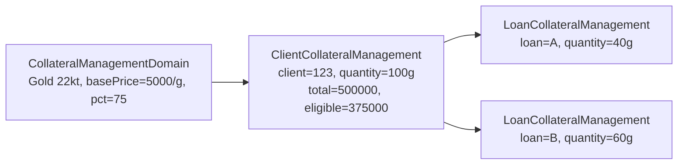
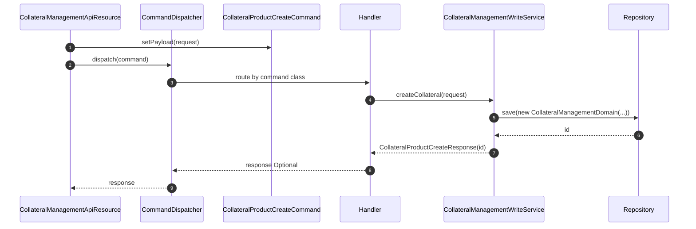
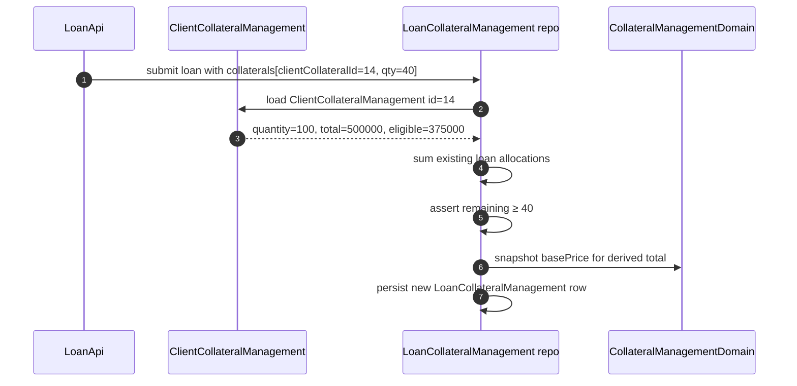

Apache Fineract separates the **catalogue** of pledgeable asset *types* from the **pledges** themselves. The catalogue is `CollateralManagementDomain` — a small reference entity that names an asset (e.g. *"Gold 22kt"*, *"Dairy cow"*, *"Toyota Hilux"*), records its base price per unit, the unit of measure, the quality grade, the percentage of base price used as collateral, and the currency. Per-client and per-loan pledges then reference the catalogue and add a quantity. The catalogue is exposed via `/v1/collateral-management` and lives across `fineract-core`, `fineract-loan`, and `fineract-provider`.

## Module layout

```
fineract-core
└── org.apache.fineract.portfolio.collateralmanagement   (data / shared constants)

fineract-loan
└── org.apache.fineract.portfolio.collateralmanagement.domain
    ├── CollateralManagementDomain   (the catalogue entity)
    ├── ClientCollateralManagement   (per-client pledge)
    └── LoanCollateralManagement     (per-loan pledge)

fineract-provider
└── org.apache.fineract.portfolio.collateralmanagement
    ├── api/        CollateralManagementApiResource (the catalogue API),
    │               ClientCollateralManagementApiResource,
    │               LoanCollateralManagementApiResource
    ├── command/    CollateralProduct{Create,Update,Delete}Command
    ├── data/       CollateralManagementData,
    │               CollateralProduct{Create,Update,Delete}{Request,Response}
    ├── exception/  CollateralNotFoundException, …
    └── service/    CollateralManagementReadService,
                    CollateralManagementWriteService
```

## CollateralManagementDomain — the catalogue entity

`CollateralManagementDomain` extends `AbstractPersistableCustom<Long>` and maps to `m_collateral_management`.

```java
@Entity
@Table(name = "m_collateral_management")
@Getter @Setter
public class CollateralManagementDomain extends AbstractPersistableCustom<Long> {

    @Column(name = "name", length = 20, columnDefinition = " ")
    private String name;

    @Column(name = "quality", nullable = false, length = 40)
    private String quality;

    @Column(name = "base_price", nullable = false, scale = 5, precision = 20)
    private BigDecimal basePrice;

    @Column(name = "unit_type", nullable = false, length = 10)
    private String unitType;

    @Column(name = "pct_to_base", nullable = false, scale = 5, precision = 20)
    private BigDecimal pctToBase;

    @ManyToOne
    @JoinColumn(name = "currency")
    private ApplicationCurrency currency;

    @OneToMany(mappedBy = "collateral", cascade = CascadeType.ALL,
               orphanRemoval = true, fetch = FetchType.EAGER)
    private Set<ClientCollateralManagement> clientCollateralManagements = new HashSet<>();
}
```

| Column | Java field | Notes |
|--------|------------|-------|
| `id` | inherited | PK. |
| `name` | `String name` | Short display name (max 20 chars). |
| `quality` | `String quality` | Grade descriptor, e.g. `"22kt"`, `"Grade A"`. Mandatory, max 40 chars. |
| `base_price` | `BigDecimal basePrice` | Price for one `unitType` of this asset in `currency`. Scale 5, precision 20. |
| `unit_type` | `String unitType` | Unit of measure, e.g. `"gram"`, `"head"`, `"piece"`. |
| `pct_to_base` | `BigDecimal pctToBase` | Loan-to-value haircut — what percentage of `basePrice * quantity` counts as collateral value. |
| `currency` | `ApplicationCurrency currency` | FK to `m_organisation_currency`. |
| `clientCollateralManagements` | back-ref | Every client pledge of this asset type. |

The `pct_to_base` is what stops a pledge from being valued at 100% of its market price. A `quality = 22kt` gold catalogue row priced at 5,000 per gram with `pct_to_base = 75` says "we will count 75% of the gold's market value as eligible collateral".

<Note>
The `name` column is intentionally tiny (20 chars). Use short, codified names — descriptive long-form text belongs in the loan's collateral notes, not on the catalogue row.
</Note>

## ClientCollateralManagement and LoanCollateralManagement

The catalogue is consumed by two pledge entities:

### ClientCollateralManagement (`m_client_collateral_management`)

A specific asset a client owns and has registered with the institution.

| Column | Notes |
|--------|-------|
| `client_id` | FK to `m_client`. |
| `collateral_id` | FK to `m_collateral_management` (the catalogue row). |
| `quantity` | How much of the asset the client has pledged. |
| `total`, `total_collateral` | Derived market value and eligible collateral value (after `pct_to_base`). |

### LoanCollateralManagement (`m_loan_collateral_management`)

The portion of a client collateral allocated to a specific loan.

| Column | Notes |
|--------|-------|
| `loan_id` | FK to `m_loan`. |
| `client_collateral_id` | FK to `m_client_collateral_management`. |
| `quantity` | How much of the client's pledge is locked against this loan. |
| `total`, `total_collateral` | Derived totals at the time of the loan application. |

The flow is **catalogue → client pledge → loan allocation**, with `pct_to_base` applied at the catalogue level and quantities chosen at each subsequent level.



## CollateralManagementApiResource — the catalogue REST API

The resource is annotated `@Path("/v1/collateral-management")` and uses the newer `CommandDispatcher` instead of the legacy command-source service. All requests / responses are typed (no raw JSON strings) and validated by Jakarta Bean Validation.

```java
@Path("/v1/collateral-management")
@Component
@Tag(name = "Collateral Management",
     description = "Collateral Management is for managing collateral operations")
@RequiredArgsConstructor
@Consumes({ MediaType.APPLICATION_JSON })
@Produces({ MediaType.APPLICATION_JSON })
public class CollateralManagementApiResource {
    private final CommandDispatcher dispatcher;
    private final CollateralManagementReadService collateralManagementReadService;
    private final CurrencyReadPlatformService currencyReadPlatformService;
}
```

### Endpoints

| Method | Path | Java method | Returns |
|--------|------|-------------|---------|
| `POST` | `/v1/collateral-management` | `createCollateral(CollateralProductCreateRequest)` | `CollateralProductCreateResponse` |
| `GET` | `/v1/collateral-management/{collateralId}` | `getCollateral(collateralId)` | `CollateralManagementData` |
| `GET` | `/v1/collateral-management` | `getAllCollaterals()` | `List<CollateralManagementData>` |
| `GET` | `/v1/collateral-management/template` | `getCollateralTemplate()` | `List<CurrencyData>` |
| `PUT` | `/v1/collateral-management/{collateralId}` | `updateCollateral(collateralId, request)` | `CollateralProductUpdateResponse` |
| `DELETE` | `/v1/collateral-management/{collateralId}` | `deleteCollateral(collateralId)` | `CollateralProductDeleteResponse` |

### Create payload

```json
{
  "name": "Gold 22kt",
  "quality": "22kt",
  "basePrice": 5000.00,
  "unitType": "gram",
  "pctToBase": 75.00,
  "currency": "USD"
}
```

The `currency` field is the ISO code looked up against `m_organisation_currency`. The `template` endpoint returns the full list of platform currencies for populating that dropdown — that is its sole job.

### Update rules

`PUT` accepts the same field set; `pctToBase` and `basePrice` are the typical operational changes (a gold-price update). The write service does **not** retroactively recompute totals on existing `ClientCollateralManagement` rows — each pledge keeps its snapshot at the time of registration. Operators who want fresh valuations re-register the client collateral.

### Delete behaviour

Delete is allowed only if no `ClientCollateralManagement` references the catalogue row. The cascade from `CollateralManagementDomain.clientCollateralManagements` is configured for orphan removal *within* a single entity graph but does not extend to deleting the catalogue row when pledges exist — the write service checks the back-reference and throws `CollateralCannotBeDeletedException` otherwise.

## Command dispatch flow



The dispatcher returns an `Optional<R>`, hence the `.get()` calls in the resource. Maker-checker and audit are managed by the dispatcher when configured.

## Sibling resources for the pledges

The two pledge entities have their own resources in the same package:

| Resource | Path | Purpose |
|----------|------|---------|
| `ClientCollateralManagementApiResource` | `/v1/clients/{clientId}/collaterals` | Register / list / delete client pledges. |
| `LoanCollateralManagementApiResource` | `/v1/loans/{loanId}/collaterals` | Attach / detach client pledges to a specific loan. |

Both reference catalogue ids returned from `/v1/collateral-management`.

## Read service

`CollateralManagementReadService` exposes:

| Method | Returns |
|--------|---------|
| `getAllCollateralProducts()` | `List<CollateralManagementData>` — the catalogue listing. |
| `getCollateralProduct(Long collateralId)` | `CollateralManagementData` for a single row. |

`CollateralManagementData` is a record-like class carrying the same field set as the entity plus a resolved `CurrencyData` for display.

## Validation rules

`CollateralProductCreateRequest` and `CollateralProductUpdateRequest` carry Jakarta Bean Validation annotations on every field. The validator enforces:

| Rule | Failure code |
|------|--------------|
| `name` not blank, ≤ 20 chars | `name.cannot.be.blank` |
| `quality` not blank, ≤ 40 chars | `quality.cannot.be.blank` |
| `basePrice` > 0 | `basePrice.must.be.positive` |
| `unitType` not blank, ≤ 10 chars | `unitType.cannot.be.blank` |
| `pctToBase` in `(0, 100]` | `pctToBase.invalid` |
| `currency` resolves to an `ApplicationCurrency` | `currency.not.found` |

## Exceptions

| Exception | When thrown | HTTP |
|-----------|-------------|------|
| `CollateralNotFoundException` | `collateralId` cannot be resolved. | 404 |
| `CollateralCannotBeDeletedException` | Pledged by at least one client collateral row. | 403 |
| `CurrencyNotFoundException` | Provided `currency` code unknown. | 404 |
| `PlatformApiDataValidationException` | Bean-validation failures aggregated. | 400 |

## Read service projection

`CollateralManagementReadService` uses `JdbcTemplate` against a left-joined query:

```sql
SELECT c.id            AS id,
       c.name          AS name,
       c.quality       AS quality,
       c.base_price    AS basePrice,
       c.unit_type     AS unitType,
       c.pct_to_base   AS pctToBase,
       cur.code        AS currencyCode,
       cur.display_symbol AS displaySymbol,
       cur.decimal_places AS decimalPlaces
  FROM m_collateral_management c
  LEFT JOIN m_organisation_currency cur ON cur.id = c.currency
 ORDER BY c.name
```

`CollateralManagementData` carries the catalogue fields plus an embedded `CurrencyData` so the UI can render with the correct symbol and decimal precision.

## ClientCollateralManagement attachment

A client registers a pledge via `POST /v1/clients/{clientId}/collaterals` with a payload like:

```json
{
  "collateralId": 7,
  "quantity": 100,
  "total": 500000.00,
  "totalCollateral": 375000.00
}
```

The `total` and `totalCollateral` are snapshotted from the catalogue — `total = quantity * basePrice` and `totalCollateral = total * pctToBase / 100`. They are saved so the eligible value is reproducible later even if the catalogue is re-priced.

## LoanCollateralManagement attachment

When a loan is being submitted, the application form lets the user split client collateral across loans:

```json
{
  "loanId": 99,
  "clientCollateralId": 14,
  "quantity": 40
}
```

The resulting `LoanCollateralManagement` row carries its own `quantity` and recomputed `total` / `total_collateral`. The sum of `quantity` across all `LoanCollateralManagement` rows pointing at a given client collateral must be ≤ the parent's `quantity` — enforced by `LoanCollateralManagementWritePlatformService`.



## Write-off and release

When a loan is closed (paid in full or written off), the associated `LoanCollateralManagement` rows are *not* automatically deleted — they stay as historical records. The available `quantity` on the parent `ClientCollateralManagement` is recomputed dynamically by the read service, so a closed loan's allocation is excluded from the "available to pledge" calculation. Hard-deleting a client collateral is allowed only when all referencing loans are closed.

## Currency consistency

The `currency` on a `CollateralManagementDomain` row is a per-asset attribute — different catalogue rows may be priced in different currencies. There is no requirement that the catalogue currency match the loan currency, but practically the loan-application UI surfaces a warning when the two diverge because the valuation cannot be applied directly to the loan's eligible collateral total without an FX conversion.

## Cross references

- [/loan/loan-collateral](/loan/loan-collateral) — how `LoanCollateralManagement` participates in the loan application and write-off flows.
- [/portfolio/client](/portfolio/client) — client pledges are visible on the client summary.
- [/organisation/monetary-currency](/organisation/monetary-currency) — `ApplicationCurrency` resolution used by the catalogue.
- [/api/clients](/api/clients-api) — `/v1/clients/{clientId}/collaterals` REST docs.
- [/api/loans](/api/loans-api) — `/v1/loans/{loanId}/collaterals` REST docs.
- [/commands/command-provider](/commands/command-provider) — how `CommandDispatcher` picks up `CollateralProduct*Command` handlers.
