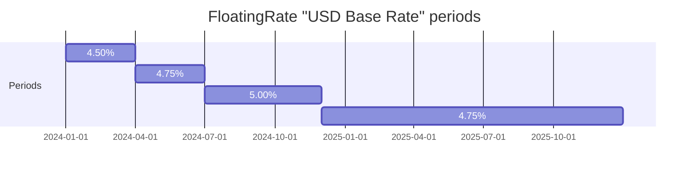
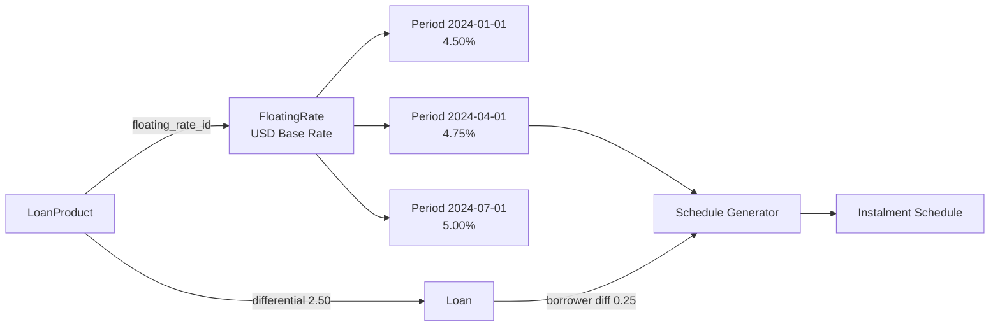
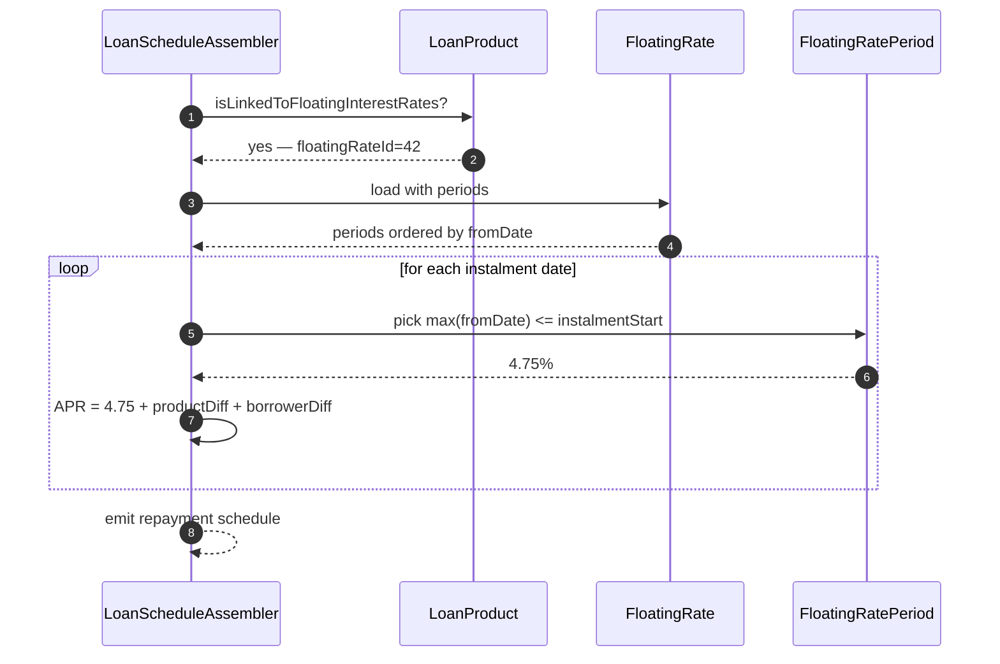
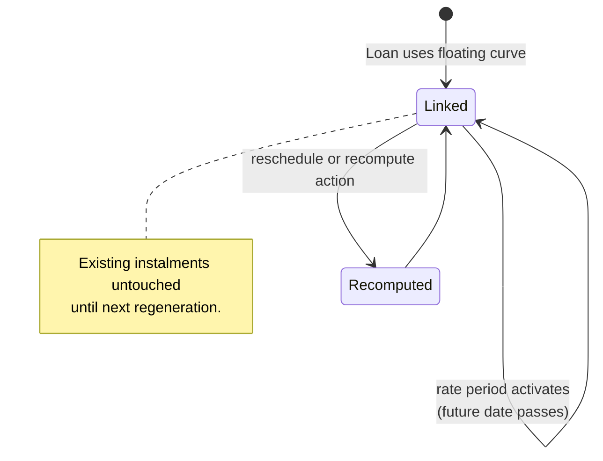

Apache Fineract supports variable-interest lending through the **floating rate** aggregate: a `FloatingRate` is a named curve (e.g. *"USD Base Rate"* or *"Prime + 200bps"*) and a `FloatingRatePeriod` is one step of that curve — an interest rate that becomes effective on a given date. A loan product can be linked to one base floating rate; loans created from that product read the active period each time the repayment schedule is regenerated. Both classes live in `org.apache.fineract.portfolio.floatingrates` inside the `fineract-rates` module.

## Module layout

```
fineract-rates
└── org.apache.fineract.portfolio.floatingrates
    ├── api/        FloatingRatesApiResource, FloatingRatesApiResourceSwagger
    ├── data/       FloatingRateData, FloatingRatePeriodData, FloatingRateDTO
    ├── domain/     FloatingRate, FloatingRatePeriod,
    │               FloatingRateRepository, FloatingRateRepositoryWrapper
    ├── exception/  FloatingRateNotFoundException, …
    ├── handler/    Create / Update floating-rate command handlers
    ├── serialization/ FloatingRateCommandFromApiJsonDeserializer
    ├── service/    FloatingRateReadPlatformService,
    │               FloatingRateWritePlatformService
    └── starter/    Spring auto-config
```

## FloatingRate — the curve

`FloatingRate` extends `AbstractAuditableWithUTCDateTimeCustom<Long>` and maps to `m_floating_rates`. The `name` column has a unique constraint named `unq_name`.

```java
@Entity
@Table(name = "m_floating_rates", uniqueConstraints = {
    @UniqueConstraint(columnNames = { "name" }, name = "unq_name") })
public class FloatingRate extends AbstractAuditableWithUTCDateTimeCustom<Long> {

    @Column(name = "name", length = 200, unique = true, nullable = false)
    private String name;

    @Column(name = "is_base_lending_rate", nullable = false)
    private boolean isBaseLendingRate;

    @Column(name = "is_active", nullable = false)
    private boolean isActive;

    @OrderBy(value = "fromDate,id")
    @OneToMany(cascade = CascadeType.ALL, mappedBy = "floatingRate",
               orphanRemoval = true, fetch = FetchType.EAGER)
    private List<FloatingRatePeriod> floatingRatePeriods;
}
```

| Column | Java field | Notes |
|--------|------------|-------|
| `id` | inherited | PK. |
| `name` | `String name` | Unique, up to 200 chars. |
| `is_base_lending_rate` | `boolean isBaseLendingRate` | When `true`, **this** is the bank's base rate and other floating rates may quote in terms of it. Only one row may have this flag set at a time — the write validator enforces it. |
| `is_active` | `boolean isActive` | Soft-disable. |
| `floatingRatePeriods` | `List<FloatingRatePeriod>` | Eagerly-loaded, ordered by `fromDate, id`. |

The eager fetch + cascade-all + orphan removal means a single `findById(floatingRateId)` brings the whole curve into memory ready for scheduling.

## FloatingRatePeriod — one step of the curve

`FloatingRatePeriod` also extends `AbstractAuditableWithUTCDateTimeCustom<Long>` and maps to `m_floating_rates_periods`.

```java
@Entity
@Table(name = "m_floating_rates_periods")
public class FloatingRatePeriod extends AbstractAuditableWithUTCDateTimeCustom<Long> {

    @ManyToOne
    @JoinColumn(name = "floating_rates_id", nullable = false)
    private FloatingRate floatingRate;

    @Column(name = "from_date", nullable = false)
    private LocalDate fromDate;

    @Column(name = "interest_rate", scale = 6, precision = 19, nullable = false)
    private BigDecimal interestRate;

    @Column(name = "is_differential_to_base_lending_rate", nullable = false)
    private boolean isDifferentialToBaseLendingRate;

    @Column(name = "is_active", nullable = false)
    private boolean isActive;
}
```

| Column | Java field | Notes |
|--------|------------|-------|
| `id` | inherited | PK. |
| `floating_rates_id` | `FloatingRate floatingRate` | Parent curve. |
| `from_date` | `LocalDate fromDate` | The day on which `interestRate` becomes effective. |
| `interest_rate` | `BigDecimal interestRate` | Either an absolute APR or a spread, depending on the differential flag below. |
| `is_differential_to_base_lending_rate` | `boolean` | When `true`, `interestRate` is a spread *added to the active base lending rate*. When `false`, `interestRate` is the absolute APR. |
| `is_active` | `boolean isActive` | Soft-disable — historical periods stay around for replay. |

`from_date` is **inclusive**; the *end* of a period is implicit — the next period's `from_date` (or open-ended if none).



## Differential rates and the base curve

A common pattern at MFIs is:

1. Create one curve flagged `isBaseLendingRate = true` and push absolute APR periods into it.
2. Create a second curve (`"Microenterprise rate"`) with `isBaseLendingRate = false` whose periods are all `isDifferentialToBaseLendingRate = true` and carry the spread, e.g. `+2.5`.

When the second curve is resolved on a date, the scheduler reads the base curve's active period and adds the spread to obtain the effective APR. This keeps spreads small and stable while letting the base rate move with central-bank announcements.

## FloatingRateDTO — the resolved view

`FloatingRateDTO` is the transient projection passed into the loan schedule generator. It captures:

- the resolved interest rate for the loan's `interestChargedFromDate`
- the differential to add (if the loan product configures an extra borrower-specific spread)
- the list of upcoming period changes that affect future instalments

The scheduler walks the periods chronologically and emits a new instalment block at each transition, so a loan that starts at 4.5% and crosses a 5% effective date will see its later instalments recomputed with the new rate.

## Association to loan product

`LoanProduct` carries an `is_linked_to_floating_interest_rates` boolean and an embedded `LoanProductFloatingRates`:

```java
@Column(name = "is_linked_to_floating_interest_rates", nullable = false)
private boolean isLinkedToFloatingInterestRates;

@OneToOne(mappedBy = "loanProduct", cascade = CascadeType.ALL,
          fetch = FetchType.EAGER, orphanRemoval = true)
private LoanProductFloatingRates floatingRates;
```

`LoanProductFloatingRates` stores the chosen `FloatingRate`, the product-level `interestRateDifferential`, the min/max differential bounds for borrower overrides, and a `floatingInterestRateAllowed` toggle. When a loan is submitted under such a product, the borrower differential is captured on the `Loan` itself; the effective APR at any date is `(base period rate) + (product differential) + (borrower differential)`.



## Repository wrapper

| Class | Purpose |
|-------|---------|
| `FloatingRateRepository` | Spring Data JPA. Derived finders by name and by `isBaseLendingRate`. |
| `FloatingRateRepositoryWrapper` | Throws `FloatingRateNotFoundException` on miss; exposes `retrieveBaseLendingRate()` returning the single base curve. |

## REST endpoints — `/v1/floatingrates`

`FloatingRatesApiResource` exposes a CRUD-minus-delete slice with embedded periods.

| Method | Path | Operation |
|--------|------|-----------|
| `GET` | `/v1/floatingrates` | `retrieveAll` |
| `GET` | `/v1/floatingrates/{floatingRateId}` | `retrieveOne` (includes periods, ordered by `fromDate`) |
| `POST` | `/v1/floatingrates` | `createFloatingRate` |
| `PUT` | `/v1/floatingrates/{floatingRateId}` | `updateFloatingRate` (add / edit periods) |

### Create payload

```json
{
  "name": "USD Base Rate",
  "isBaseLendingRate": true,
  "isActive": true,
  "ratePeriods": [
    { "fromDate": "01 January 2024", "interestRate": 4.50,
      "isDifferentialToBaseLendingRate": false, "isActive": true, "dateFormat": "dd MMMM yyyy", "locale": "en" }
  ]
}
```

### Update rules

- Adding a new period is allowed only if its `fromDate` is **in the future**. The validator (`FloatingRateCommandFromApiJsonDeserializer`) rejects past dates so historical schedules remain reproducible.
- Existing periods are immutable once `fromDate <= today` — only the `isActive` flag can be flipped.
- Toggling `isBaseLendingRate` requires there to be no other base curve.

## Schedule resolution flow



## Validation rules

`FloatingRateCommandFromApiJsonDeserializer` enforces:

| Rule | Failure code |
|------|--------------|
| `name` not blank, ≤ 200 chars | `name.cannot.be.blank` |
| Only one curve may have `isBaseLendingRate = true` | `base.lending.rate.already.exists` |
| Each `ratePeriods[i].fromDate` is in the future (on create or when adding) | `fromDate.cannot.be.in.past` |
| `interestRate` > 0 (when absolute) or non-zero (when differential) | `interestRate.invalid` |
| No two active periods share the same `fromDate` | `fromDate.duplicate` |

When the curve is **not** the base lending rate and a period sets `isDifferentialToBaseLendingRate = true`, the validator confirms a base curve actually exists in the tenant.

## Exceptions

| Exception | When thrown | HTTP |
|-----------|-------------|------|
| `FloatingRateNotFoundException` | `floatingRateId` not found. | 404 |
| `FloatingRatePeriodNotFoundException` | Period id missing on update. | 404 |
| `BaseLendingRateAlreadyExistsException` | A second curve tries to claim `isBaseLendingRate = true`. | 403 |
| `FloatingRatePeriodDateNotValidException` | Period date is in the past on a create / add. | 400 |

## Service contracts

`FloatingRateReadPlatformService`:

```java
public interface FloatingRateReadPlatformService {
    List<FloatingRateData> retrieveAll();
    List<FloatingRateData> retrieveLookupActive();
    FloatingRateData retrieveOne(Long floatingRateId);
    Collection<FloatingRatePeriodData> retrievePeriods(Long floatingRateId);
}
```

`FloatingRateWritePlatformService`:

```java
public interface FloatingRateWritePlatformService {
    CommandProcessingResult createFloatingRate(JsonCommand command);
    CommandProcessingResult updateFloatingRate(JsonCommand command);
}
```

`retrieveLookupActive()` returns only curves with `isActive = true` for the loan-product editor dropdown.

## Reschedule and rate-change behaviour

When a new `FloatingRatePeriod` is added with a future `fromDate`, *existing* loans linked to the product (directly or via differential curves) are **not** automatically rescheduled. They will only pick up the new rate on:

- the next loan write that triggers a schedule regeneration (e.g. waive charge, undo transaction), or
- an explicit reschedule operation through `/v1/rescheduleloans` (see [/loan/loan-reschedule](/loan/loan-reschedule)).

This is intentional — automatic reschedule on every rate change would amplify into a herd of recomputations across the active portfolio. Operators are expected to plan rate changes alongside batch reschedule jobs.



## Validity windows in practice

The `from_date` field is a `LocalDate` because rate quotations in microfinance are typically aligned to the start of a business day. The scheduler resolves the active period at the **start** of each instalment using:

```sql
SELECT *
  FROM m_floating_rates_periods p
 WHERE p.floating_rates_id = :curveId
   AND p.is_active = true
   AND p.from_date <= :instalmentDate
 ORDER BY p.from_date DESC
 LIMIT 1
```

When the curve is differential, the same query is run against the base curve and the spread added on top.

## Cross references

- [/loan/loan-product](/loan/loan-product) — where `isLinkedToFloatingInterestRates` and the product differential live.
- [/loan/loan-repayment-schedule](/loan/loan-repayment-schedule) — how the schedule generator consumes `FloatingRateDTO`.
- [/loan/loan-reschedule](/loan/loan-reschedule) — reschedule action recomputes against the latest active period.
- [/api/loan-products](/api/loan-products-api) — REST fields for product / floating-rate linkage.
- [/models/loan-product-model](/models/loan-product-model) — ER view including `m_loan_product_floating_rates`.
- [/progressive-loan/progressive-schedule-generator](/progressive-loan/progressive-schedule-generator) — how the progressive variant consumes floating periods.
