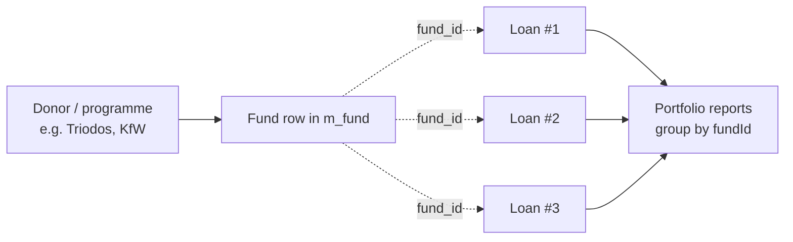
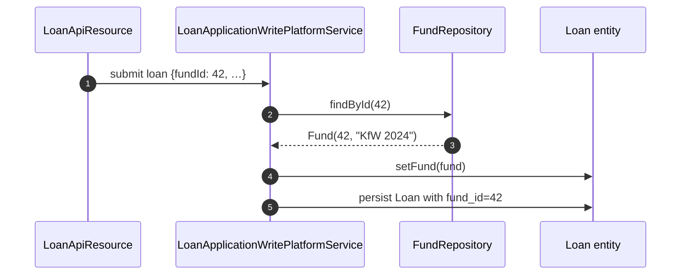

Microfinance institutions running Apache Fineract typically channel loans through several distinct pools of money: a self-funded portfolio, a donor grant, a refinancing line from a national development bank, a sharia-compliant facility. The `Fund` entity is the lightweight reference table that lets each loan be tagged with the source it was disbursed from. It carries no balance, no interest, and no GL implications — it exists purely so reports and portfolio dashboards can group loans by funding origin.

## Module layout

```
fineract-provider
└── org.apache.fineract.portfolio.fund
    ├── api/           FundsApiResource, FundsApiResourceSwagger
    ├── data/          FundData, FundRequest
    ├── handler/       Create / Update fund command handlers
    ├── serialization/ FundCommandFromApiJsonDeserializer
    ├── service/       FundReadPlatformService, FundWritePlatformService
    └── starter/       Spring auto-config

fineract-core
└── org.apache.fineract.portfolio.fund.domain
    ├── Fund
    └── FundRepository
```

The domain class lives in `fineract-core` because `Loan` (in `fineract-loan`) holds a `@ManyToOne` reference to it; the REST resource and write services live in `fineract-provider` alongside the other configuration-style admin APIs.

## The Fund entity

```java
@Entity
@Table(name = "m_fund", uniqueConstraints = {
    @UniqueConstraint(columnNames = { "name" }, name = "fund_name_org"),
    @UniqueConstraint(columnNames = { "external_id" }, name = "fund_externalid_org") })
public class Fund extends AbstractPersistableCustom<Long> {

    @Column(name = "name")           private String name;
    @Column(name = "external_id",
            length = 100)            private String externalId;
}
```

That is the entire schema — two columns plus the inherited `id`. Both `name` and `external_id` are unique within the tenant.

| Column | Java field | Notes |
|--------|------------|-------|
| `id` | `Long id` | Surrogate PK from `AbstractPersistableCustom`. |
| `name` | `String name` | Human-readable label, displayed in dropdowns. Unique. |
| `external_id` | `String externalId` | Optional code used by external systems / donor agreements. Unique when set. |

`Fund.fromJson(JsonCommand)` is the static factory called from the create handler. The `update(JsonCommand)` method follows the same pattern as every other Fineract entity — it returns a `Map<String,Object>` of actual changes for the command-source audit log.

<Note>
There is no `is_active` or `is_deleted` flag on `Fund`. Once a fund is referenced by any loan it cannot be deleted; the write platform throws a `PlatformDataIntegrityException` instead.
</Note>

## How loans attach to a fund

In `Loan` (`fineract-loan`), the fund is an optional `@ManyToOne`:

```java
@ManyToOne(optional = true)
@JoinColumn(name = "fund_id")
private Fund fund;
```

`fundId` flows through the loan application API as a top-level field — `LoanApiConstants.fundIdParameterName = "fundId"` — and ends up on `LoanAccountData.fundId` for read paths. The fund is set when the loan is submitted and can be edited up until disbursement via the standard loan modify command.



The loan product itself does **not** carry a `fund_id`; the choice is per-loan, not per-product. This matches the operational reality where the same product (e.g. a 12-month group loan) can be funded by whichever pool has capacity at disbursement time.

## REST endpoints — `/v1/funds`

`FundsApiResource` is annotated `@Path("/v1/funds")` and exposes the standard CRUD slice. There is no delete endpoint — funds are designed to be a permanent dimension.

| Method | Path | Java method | Permission |
|--------|------|-------------|------------|
| `GET` | `/v1/funds` | `retrieveFunds()` | `READ_FUND` |
| `GET` | `/v1/funds/{fundId}` | `retrieveFund(fundId)` | `READ_FUND` |
| `POST` | `/v1/funds` | `createFund(json)` | `CREATE_FUND` |
| `PUT` | `/v1/funds/{fundId}` | `updateFund(fundId, json)` | `UPDATE_FUND` |

The `POST` and `PUT` handlers route through `CommandWrapperBuilder.createFund()` / `updateFund()`, so the writes are subject to maker-checker if the `FUND` action is configured in `m_permission`. See [/commands/makercheckers](/commands/makercheckers).

### Request payload

```json
{
  "name": "KfW 2024 Refinancing Line",
  "externalId": "KFW-REF-2024-IT"
}
```

Only `name` is required. The serializer (`FundCommandFromApiJsonDeserializer`) enforces a max length of 100 on `name` and 100 on `externalId`, and unique-name failures surface as a `PlatformDataIntegrityException` translated to HTTP 403 by the global exception mapper.

### Response shape — `FundData`

| Field | Type | Notes |
|-------|------|-------|
| `id` | `Long` | PK |
| `name` | `String` | |
| `externalId` | `String` | nullable |

## Read service

`FundReadPlatformService` exposes two methods:

| Method | Returns | Caller |
|--------|---------|--------|
| `retrieveAllFunds()` | `Collection<FundData>` | Admin UI dropdowns. |
| `retrieveFund(Long fundId)` | `FundData` | Single-row fetch and validation during loan submit. |

Implementation uses a plain `JdbcTemplate` row mapper against `m_fund` — there is no JPA fetch graph because the entity has no relationships to lazy-load.

## Loan write path interactions

When a loan is submitted with a `fundId`, the loan write service resolves it via `FundRepository.findById(fundId).orElseThrow(FundNotFoundException::new)` and stores the managed entity reference on `Loan.fund`. The same flow runs during loan modify; clearing the field is allowed by passing `"fundId": null`.



## Reporting and portfolio queries

The most common usage is in pre-built Pentaho / data-table reports that join `m_loan.fund_id` to `m_fund.id` to break the outstanding portfolio down by funding source. The supplied `Active Loan Status Summary` report in `database/migrations/list_db/` filters and sums by `fund_id`, and the search/portfolio dashboards in the community web app expose a fund filter that calls `/v1/funds` to populate its dropdown.

Custom reports typically look like:

```sql
SELECT f.name AS fund,
       SUM(l.principal_outstanding_derived) AS outstanding
  FROM m_loan l
  LEFT JOIN m_fund f ON f.id = l.fund_id
 WHERE l.loan_status_id = 300         -- ACTIVE
 GROUP BY f.name;
```

`LEFT JOIN` is important because `fund_id` is nullable — loans booked before any funds were configured (or self-funded loans) will land in the `NULL` bucket.

## Permissions and audit

The standard permissions registered by the codes seed are `READ_FUND`, `CREATE_FUND`, and `UPDATE_FUND`. Because every write flows through the command framework, each create / update is captured in `m_portfolio_command_source` with the originating maker and (when enabled) checker. See [/commands/audits](/commands/audits).

## Read service

`FundReadPlatformService` is intentionally tiny — there is no JPA fetch graph to optimise.

```java
public interface FundReadPlatformService {
    Collection<FundData> retrieveAllFunds();
    FundData retrieveFund(Long fundId);
}
```

The implementation uses `JdbcTemplate` against `m_fund`:

```sql
SELECT f.id        AS id,
       f.name      AS name,
       f.external_id AS externalId
  FROM m_fund f
 ORDER BY f.name
```

`FundData` is a record-style class with three fields — `id`, `name`, `externalId` — and is what the JSON serializer ultimately writes to the wire.

## Validation rules

`FundCommandFromApiJsonDeserializer` enforces:

| Rule | Failure code |
|------|--------------|
| `name` not blank | `name.cannot.be.blank` |
| `name` length ≤ 100 | `name.exceeds.max.length` |
| `externalId` length ≤ 100 when present | `externalId.exceeds.max.length` |
| Only the supported parameter set (`name`, `externalId`, `locale`) is present | `unsupported.parameter` |

Unique-name and unique-externalId violations bubble up from the database constraint and are translated by `PlatformDataIntegrityException` to a stable error code, so the UI can show a friendly "fund name already exists" message instead of an opaque SQL error.

## Exceptions

| Exception | When thrown | HTTP |
|-----------|-------------|------|
| `FundNotFoundException` | `fundId` cannot be resolved by `FundRepository.findById`. | 404 |
| `PlatformDataIntegrityException` | Duplicate name or external id. | 403 |
| `PlatformApiDataValidationException` | Aggregated validation errors from the deserializer. | 400 |

## When to use Fund — and when not to

`Fund` is the right tool when:

- The institution needs to attribute outstanding loans to a specific donor / refinancing line for reporting.
- The accounting policy does not need separate GL accounts per fund — funds are a dimension, not a chart-of-accounts split.

It is the **wrong** tool when:

- Each funding source must hit its own bank account in the GL — in that case configure `paymentChannelToFundSourceMappings` on the loan product (see [/accounting/product-to-account-mapping](/accounting/product-to-account-mapping)) instead of relying on `Fund`.
- You need time-sliced attribution (the loan moves between funds during its life). `Loan.fund` is a single FK — only the latest assignment is preserved.
- The reporting requirement is borrower-driven (e.g. tracking which collateral type underpinned the loan). Use a code value or a data-table column for that.

<Note>
`Fund` is a dimension, not a balance. There is no automated reconciliation between the sum of `principal_outstanding_derived` of loans tagged with a fund and the actual cash drawn from that funding line — operators run that check via Pentaho reports or a downstream warehouse.
</Note>

## Schema migration history

The `m_fund` table has been part of Fineract since the very early MifosX days. The notable change was the addition of the `external_id` unique constraint, which lets downstream systems hand the institution back a stable identifier for the funding agreement. Existing `m_fund` rows without an `external_id` are unaffected — `NULL` is allowed and ignored by the unique constraint.

## Combined dimension query

A common reporting need is to break the active portfolio down by both fund and loan officer:

```sql
SELECT f.name          AS fund,
       s.display_name  AS officer,
       COUNT(*)        AS loans,
       SUM(l.principal_outstanding_derived) AS outstanding
  FROM m_loan l
  LEFT JOIN m_fund  f ON f.id = l.fund_id
  LEFT JOIN m_staff s ON s.id = l.loan_officer_id
 WHERE l.loan_status_id = 300
 GROUP BY f.name, s.display_name
 ORDER BY fund, officer;
```

Because `fund_id` is nullable, the `LEFT JOIN` keeps loans with no fund tagging visible in the report.

## Cross references

- [/loan/loan-application-lifecycle](/loan/loan-application-lifecycle) — where `fundId` is set on submit.
- [/api/loans](/api/loans-api) — `fundId` request / response fields.
- [/portfolio/transfer](/portfolio/transfer) — fund attribution is preserved on inter-office transfer.
- [/data/reports](/data/jdbc-template-services) — how custom funding reports are built.
- [/commands/makercheckers](/commands/makercheckers) — gating `CREATE_FUND` / `UPDATE_FUND` for treasury sign-off.
- [/accounting/product-to-account-mapping](/accounting/product-to-account-mapping) — when GL routing per funding source is needed.
