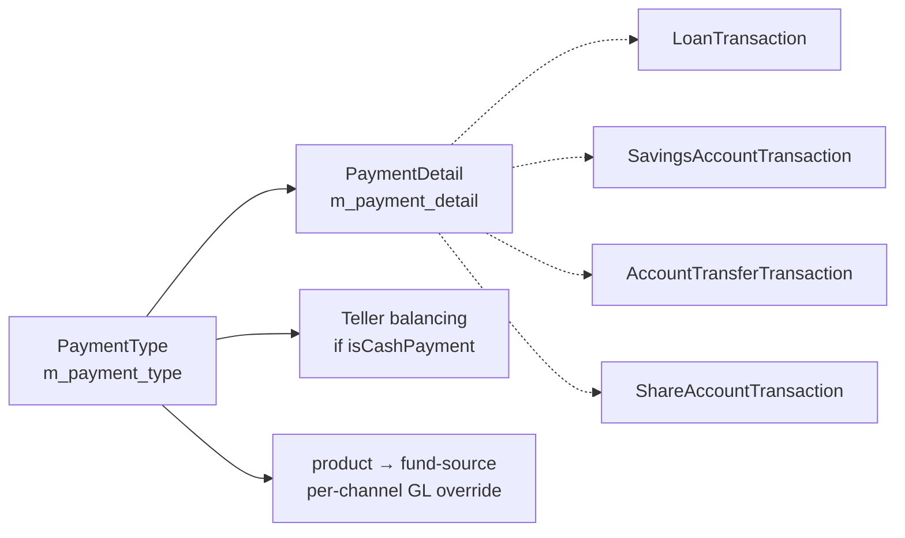
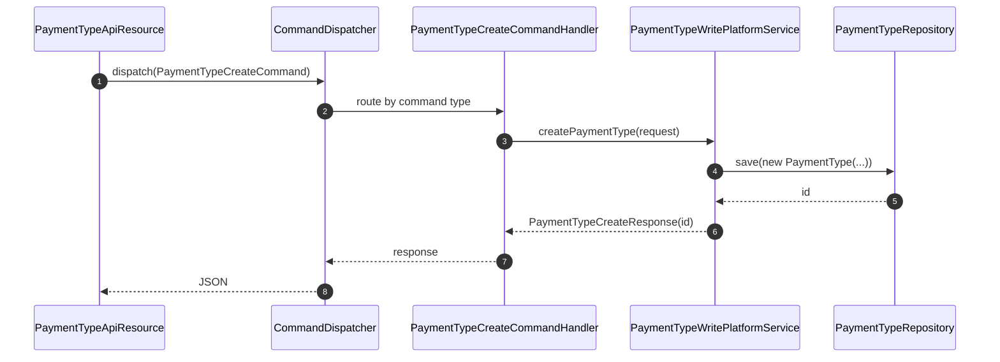
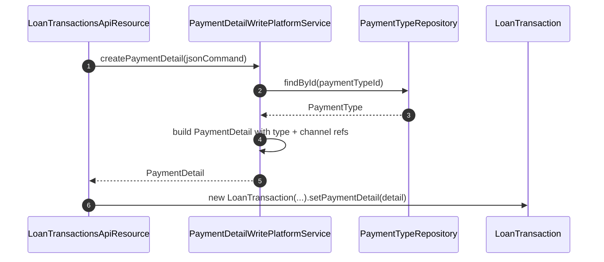
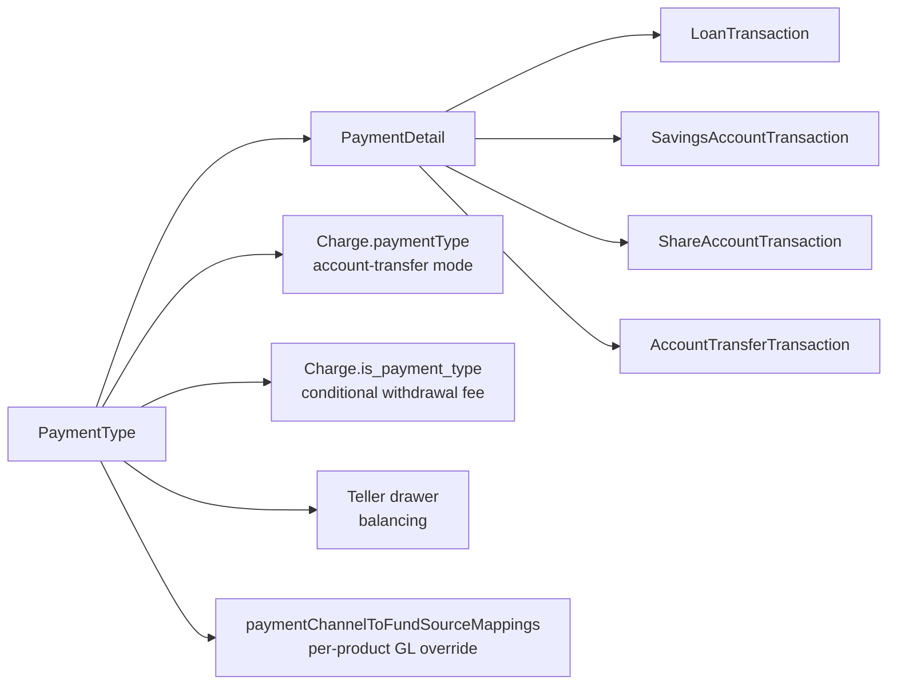

Every monetary movement in Apache Fineract — a loan repayment, a savings deposit, a withdrawal, a fee waiver settled with cash — carries an optional `PaymentDetail` that records *how* the money moved. The `PaymentType` is the small reference table that enumerates the available channels: `Cash`, `Mobile Money`, `Bank Transfer`, `Cheque`, `Card`, and any tenant-specific additions. Each type carries a single behavioural flag — `isCashPayment` — that the teller / cashier subsystem uses to decide whether the transaction should affect a cash drawer balance. The entity lives in `org.apache.fineract.portfolio.paymenttype` inside `fineract-core`.

## Module layout

```
fineract-core
└── org.apache.fineract.portfolio.paymenttype
    ├── api/        PaymentTypeApiResource (JAX-RS, /v1/paymenttypes)
    ├── command/    PaymentTypeCreateCommand, PaymentTypeUpdateCommand,
    │               PaymentTypeDeleteCommand
    ├── data/       PaymentTypeData, PaymentType{Create,Update,Delete}Request,
    │               PaymentType{Create,Update,Delete}Response
    ├── domain/     PaymentType, PaymentTypeRepository
    ├── exception/  PaymentTypeNotFoundException, …
    ├── handler/    Spring-dispatched command handlers
    ├── mapper/     MapStruct mappers between entity and data
    ├── service/    PaymentTypeReadPlatformService,
    │               PaymentTypeWritePlatformService
    └── starter/    Spring auto-config
```

Because `PaymentDetail` (in `fineract-core/.../portfolio/paymentdetail/domain`) and a lot of transaction code link to `PaymentType`, the whole package was kept in core rather than a dedicated module.

## The PaymentType entity

```java
@Entity
@Table(name = "m_payment_type")
public class PaymentType extends AbstractPersistableCustom<Long> {

    @Column(name = "value")             private String name;
    @Column(name = "description")       private String description;
    @Column(name = "is_cash_payment")   private Boolean isCashPayment;
    @Column(name = "order_position")    private Long position;
    @Column(name = "code_name")         private String codeName;
    @Column(name = "is_system_defined") private Boolean isSystemDefined;
}
```

Note that the entity uses Lombok `@Getter @Setter @NoArgsConstructor @AllArgsConstructor` and the database column for the display name is `value`, not `name`.

| Column | Java field | Notes |
|--------|------------|-------|
| `id` | inherited | PK. FK target for `m_payment_detail.payment_type_id`. |
| `value` | `String name` | The display name, e.g. `"Cash"`, `"M-Pesa"`. |
| `description` | `String description` | Optional long-form description. |
| `is_cash_payment` | `Boolean isCashPayment` | When `true`, this channel touches physical cash and impacts teller balancing. |
| `order_position` | `Long position` | Sort key in UI dropdowns. |
| `code_name` | `String codeName` | Optional cross-reference to the `Code/CodeValue` framework — see [/core/codes](/core/codes). |
| `is_system_defined` | `Boolean isSystemDefined` | Seeded payment types cannot be deleted. |

`Boolean` (not `boolean`) is used for `isCashPayment` and `isSystemDefined` because legacy rows may have `NULL`s — read code treats `null` as `false`.

## The `isCashPayment` flag

The flag has a single but high-impact consumer: the **teller / cashier** subsystem in `org.apache.fineract.organisation.teller`. When a teller is open and accepts a transaction:

- If the transaction's `PaymentDetail.paymentType.isCashPayment == true`, the teller's cash position is debited or credited accordingly, and the transaction appears on the end-of-day cashier balancing sheet.
- If `isCashPayment == false` (e.g. bank transfer, mobile money), the transaction is recorded normally but does **not** touch the teller's cash drawer — it goes through the regular bank-account journal entries instead.

The flag does **not** affect general accounting routing. That is decided by the loan / savings product → GL mapping plus the optional `paymentChannelToFundSourceMappings` on each product, which can override the GL account per `PaymentType` (see [/accounting/product-to-account-mapping](/accounting/product-to-account-mapping)).

<Note>
For tellers to balance correctly, the seeded `"Cash"` payment type must have `is_cash_payment = true`. All non-cash types should explicitly set it to `false`.
</Note>

## PaymentDetail — where the type lands

`PaymentDetail` is the small embeddable that hangs off every monetary transaction (`LoanTransaction`, `SavingsAccountTransaction`, `ShareAccountTransaction`, `AccountTransferTransaction`). It carries:

| Column | Notes |
|--------|-------|
| `payment_type_id` | FK to `m_payment_type`. |
| `account_number` | Free text — the source / destination bank account if relevant. |
| `cheque_number`, `routing_code`, `receipt_number`, `bank_number` | Optional channel-specific reference numbers. |



## Repository

`PaymentTypeRepository` is a plain Spring Data JPA `JpaRepository<PaymentType, Long>` — there is no wrapper because the entity is referenced from many places that need direct access to the result, and the lookup is short-circuited via the read service for UI calls.

## REST endpoints — `/v1/paymenttypes`

`PaymentTypeApiResource` exposes the standard CRUD slice. The path is intentionally one word (`paymenttypes`) to match historical clients.

| Method | Path | Java method | Permission |
|--------|------|-------------|------------|
| `GET` | `/v1/paymenttypes` | `getAllPaymentTypes` | `READ_PAYMENTTYPE` |
| `GET` | `/v1/paymenttypes/{paymentTypeId}` | `retrieveOnePaymentType` | `READ_PAYMENTTYPE` |
| `POST` | `/v1/paymenttypes` | `createPaymentType(PaymentTypeCreateRequest)` | `CREATE_PAYMENTTYPE` |
| `PUT` | `/v1/paymenttypes/{paymentTypeId}` | `updatePaymentType(...)` | `UPDATE_PAYMENTTYPE` |
| `DELETE` | `/v1/paymenttypes/{paymentTypeId}` | `deletePaymentType(...)` | `DELETE_PAYMENTTYPE` |

All writes pass through the modern `CommandDispatcher` (the package uses the newer command framework in `fineract-command-core`). System-defined rows reject delete with `PaymentTypeNotDeletableException`.

### Create payload

```json
{
  "name": "M-Pesa",
  "description": "Mobile money via Safaricom",
  "isCashPayment": false,
  "position": 30,
  "codeName": null
}
```

### Update rules

- `name`, `description`, `position`, `isCashPayment`, and `codeName` are all editable.
- `isSystemDefined` cannot be set via API — only Liquibase seeds may flip it.
- Disabling a payment type is done by deleting it; there is no separate `isActive` flag. Deletion is prevented if any `m_payment_detail` row still references the type.

## Read service and caching

`PaymentTypeReadPlatformService` exposes:

| Method | Returns | Caller |
|--------|---------|--------|
| `retrieveAllPaymentTypes()` | `Collection<PaymentTypeData>` | UI dropdowns on every loan / savings transaction form. |
| `retrieveOne(Long id)` | `PaymentTypeData` | Single-row fetch. |
| `retrieveAllCashPaymentTypes()` | `Collection<PaymentTypeData>` | Teller / cashier screens — filters `is_cash_payment = true`. |

The list is short and queried on every transaction screen, so the implementation uses a `JdbcTemplate` with the result intentionally lightweight. The data shape `PaymentTypeData` carries:

```java
record PaymentTypeData(Long id, String name, String description,
                       Boolean isCashPayment, Long position,
                       String codeName, Boolean isSystemDefined) { }
```

## Interaction with charges

A `Charge` template can opt into a payment-type-aware behaviour via two columns (see [/reference/charges](/reference/charges)):

- `payment_type_id` — when the charge's `chargePaymentMode = ACCOUNT_TRANSFER`, the resulting account transfer is tagged with this payment type.
- `enable_payment_type` + `is_payment_type` — on savings withdrawal charges, the fee only applies when the withdrawal's `PaymentDetail.paymentType` matches the configured one. This is what powers "ATM withdrawal: 50; teller withdrawal: free" pricing.

## Command flow



## Validation rules

`PaymentTypeCreateCommand` and `PaymentTypeUpdateCommand` carry their own Jakarta Bean Validation annotations on the request DTOs:

| Rule | Failure code |
|------|--------------|
| `name` not blank, ≤ 100 chars | `name.cannot.be.blank` |
| `description` ≤ 500 chars | `description.exceeds.max.length` |
| `position` ≥ 0 when present | `position.must.be.positive` |
| `isCashPayment` is a boolean if present | `isCashPayment.must.be.boolean` |

The write service additionally enforces uniqueness on `name` — the database constraint is the source of truth.

## Exceptions

| Exception | When thrown | HTTP |
|-----------|-------------|------|
| `PaymentTypeNotFoundException` | `paymentTypeId` cannot be resolved. | 404 |
| `PaymentTypeNotDeletableException` | Row referenced by `m_payment_detail` or `is_system_defined = true`. | 403 |
| `PaymentTypeWithIdValidatonException` | Internal consistency check failure during command dispatch. | 400 |

## How `PaymentDetail` is constructed

When a loan repayment is posted, the loan REST resource extracts the `paymentTypeId` and the channel-specific fields from the request body and asks `PaymentDetailWritePlatformService` to materialise a `PaymentDetail`:



The same flow runs for savings deposits, withdrawals, and share purchases / redemptions — they all pass through `PaymentDetailWritePlatformService` so the channel metadata is captured consistently.

## System-defined seeds

Liquibase seeds a small set of system-defined payment types so that core flows work out of the box. Typical seeds:

| Name | `isCashPayment` | `isSystemDefined` |
|------|------------------|-------------------|
| Cash | `true` | `true` |
| Cheque | `false` | `false` |
| Bank Transfer | `false` | `false` |
| Mobile Money | `false` | `false` |

Only the `Cash` entry is strictly required for teller balancing to work. The rest are optional and tenant-customisable.

## Read-service caching

`PaymentTypeReadPlatformService.retrieveAllPaymentTypes()` is called on every transaction screen, but the result is small (typically 5-15 rows). The implementation does not cache aggressively — a direct `JdbcTemplate` round-trip is cheap enough. The `retrieveAllCashPaymentTypes()` variant adds `WHERE is_cash_payment = true` and is used by the teller subsystem to populate its drawer-allowed-channels picker.

## Cross-module reference map



## Choosing between PaymentType and a Code/CodeValue

Payment types overlap with the `Code/CodeValue` framework (see [/core/codes](/core/codes)) — both enumerate options. The decision rule:

- Use `PaymentType` when the option affects runtime behaviour — teller balancing, conditional fees, GL routing.
- Use a `CodeValue` when the option is purely descriptive metadata (e.g. *"reason for write-off"*).

`PaymentType.codeName` is a deliberate bridge for installations that want a tighter coupling — they can hand the `m_code.code_name` of the related code and the UI will surface the matching code values alongside.

## Cross references

- [/organisation/teller](/organisation/teller) — uses `isCashPayment` to balance cash drawers.
- [/accounting/product-to-account-mapping](/accounting/product-to-account-mapping) — per-payment-type fund-source overrides.
- [/reference/charges](/reference/charges) — withdrawal fees keyed on payment type.
- [/loan/loan-transactions](/loan/loan-transactions), [/savings/savings-transactions](/savings/savings-transactions) — how `PaymentDetail` is created on each transaction.
- [/api/savings](/api/savings-api) — REST docs showing `paymentTypeId` as a transaction field.
- [/core/codes](/core/codes) — when a soft enumeration is the better choice than a payment type.
