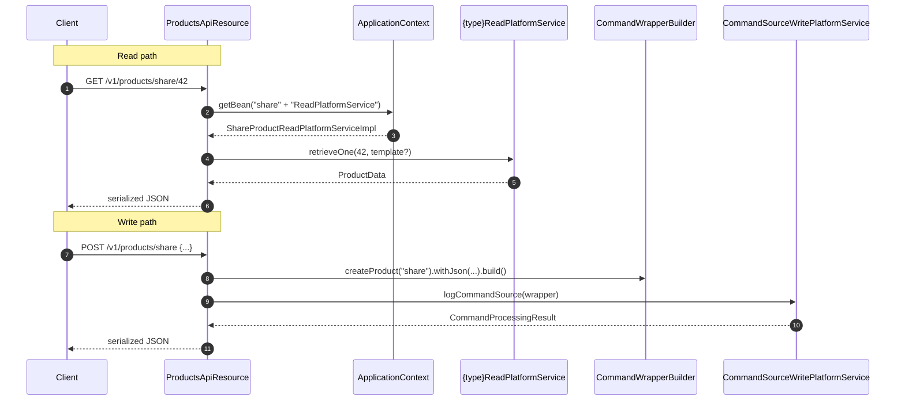

Apache Fineract's loan and savings APIs are bespoke (`/v1/loanproducts`, `/v1/savingsproducts`, `/v1/fixeddepositproducts`, `/v1/recurringdepositproducts`), but a separate, deliberately generic `/v1/products/{type}` endpoint exists to host product families that follow a simpler CRUD pattern. The implementation — `ProductsApiResource` — is a thin polymorphic facade: it accepts a `type` path parameter, looks up `"{type}ReadPlatformService"` in the Spring `ApplicationContext`, casts it to the expected interface, and delegates. Today the only consumer of this dispatch is the **share product** variant.

## Module layout

```
fineract-provider
└── org.apache.fineract.portfolio.products
    ├── api/         ProductsApiResource, ProductsApiResourceSwagger
    ├── constants/   ProductsApiConstants (READPLATFORM_NAME = "ReadPlatformService")
    ├── data/        ProductData (base class for all product variants)
    ├── exception/   ProductNotFoundException, …
    └── service/     ShareProductReadPlatformService (the per-type interface)
```

The actual share-product implementation `ShareProductReadPlatformServiceImpl` and its data class `ShareProductData extends ProductData` live in `fineract-investor` / share modules — `fineract-provider` only knows the generic contract.

## The dispatch contract

`ProductsApiResource` is annotated:

```java
@Path("/v1/products/{type}")
@Component
@Tag(name = "Products", description = "")
@RequiredArgsConstructor
public class ProductsApiResource {

    private final ApplicationContext applicationContext;
    private final ApiRequestParameterHelper apiRequestParameterHelper;
    private final DefaultToApiJsonSerializer<ProductData> toApiJsonSerializer;
    private final PlatformSecurityContext platformSecurityContext;
    private final PortfolioCommandSourceWritePlatformService commandsSourceWritePlatformService;
}
```

The dispatch trick is in `ProductsApiConstants`:

```java
String READPLATFORM_NAME = "ReadPlatformService";
```

For any request, the resource builds the bean name `productType + READPLATFORM_NAME` and asks Spring for it:

```java
String serviceName = productType + ProductsApiConstants.READPLATFORM_NAME;
ShareProductReadPlatformService service =
    (ShareProductReadPlatformService) this.applicationContext.getBean(serviceName);
```

So a request to `/v1/products/share/...` resolves to the Spring bean named `shareReadPlatformService`. If that bean does not exist (`BeansException`), the resource re-throws as `ResourceNotFoundException`, which the global exception mapper translates to HTTP 404.

## Endpoints

All five operations share the same dispatch idiom — they differ only in the operation forwarded to the resolved bean.

| Method | Path | Operation | Delegates to |
|--------|------|-----------|--------------|
| `GET` | `/v1/products/{type}/template` | `retrieveTemplate` | `service.retrieveTemplate()` |
| `GET` | `/v1/products/{type}/{productId}` | `retrieveProduct` | `service.retrieveOne(productId, settings.isTemplate())` |
| `GET` | `/v1/products/{type}` | `retrieveAllProducts` | `service.retrieveAllProducts(offset, limit)` |
| `POST` | `/v1/products/{type}` | `createProduct` | `CommandWrapperBuilder.createProduct(type)` |
| `POST` | `/v1/products/{type}/{productId}` | `handleCommands` | `CommandWrapperBuilder.createProductCommand(type, command, id)` |
| `PUT` | `/v1/products/{type}/{productId}` | `updateProduct` | `CommandWrapperBuilder.updateProduct(type, productId)` |

The reads call the resolved bean directly. The writes do **not** — they build a `CommandWrapper` keyed on `type` and feed it into `PortfolioCommandSourceWritePlatformService`, so maker-checker, idempotency, audit, and external events all participate. See [/commands/command-source](/commands/command-source).

### `GET /v1/products/{type}/template`

Returns the dropdowns / defaults needed to render a new-product form. Implementation:

```java
String serviceName = productType + ProductsApiConstants.READPLATFORM_NAME;
ShareProductReadPlatformService service =
    (ShareProductReadPlatformService) applicationContext.getBean(serviceName);
ProductData data = service.retrieveTemplate();
ApiRequestJsonSerializationSettings settings =
    apiRequestParameterHelper.process(uriInfo.getQueryParameters());
return toApiJsonSerializer.serialize(settings, data, service.getResponseDataParams());
```

`getResponseDataParams()` is a per-bean set of field names that supports response partialisation via the `fields=` query parameter — same mechanism used across the platform (see [/runtime/serialization-and-jersey](/runtime/serialization-and-jersey)).

### `GET /v1/products/{type}/{productId}`

Single fetch. `template=true` adds the dropdown options to the response so the same payload can drive an edit form.

### `GET /v1/products/{type}`

Paginated list — `offset` and `limit` are passed straight through to the service. The response is wrapped in the platform's generic `Page<ProductData>` envelope.

### `POST /v1/products/{type}`

Create. The wrapper key is `createProduct(type)`, so dedicated `CreateXxxProductCommandHandler` beans pick up the dispatch in `fineract-command-core`. Example operation `id` from the Swagger annotation is `createShareProduct`.

### `POST /v1/products/{type}/{productId}` with `command=...`

The handle-commands route. This is where lifecycle actions — `activate`, `closeShareAccount`, etc. — are forwarded. The CommandWrapperBuilder method is `createProductCommand(type, commandParam, productId)`, which generates an action name like `CREATE_SHAREPRODUCT_ACTIVATE` internally.

### `PUT /v1/products/{type}/{productId}`

Update. Wrapper key `updateProduct(type, productId)` maps to `UpdateXxxProductCommandHandler`.

## Dispatch diagram



## Adding a new product variant

The contract a new variant must satisfy is implicit — it has to:

1. Implement `ShareProductReadPlatformService` (or extend a superclass that does) so the cast in `ProductsApiResource` succeeds.
2. Register the implementation as a Spring bean with the name `{type}ReadPlatformService` — i.e. for a type literal `"foo"` the bean must be named `fooReadPlatformService`.
3. Return a `ProductData` subtype that the `DefaultToApiJsonSerializer<ProductData>` can serialise.
4. Provide create / update / commands handlers registered under the action names that `CommandWrapperBuilder.createProduct("foo")`, `updateProduct("foo", id)`, and `createProductCommand("foo", cmd, id)` produce.

In practice this is heavyweight enough that the share product remains the only consumer; new product families have so far chosen dedicated endpoints with bespoke contracts instead.

<Note>
The cast `(ShareProductReadPlatformService) applicationContext.getBean(serviceName)` is technically a leak of the share contract into a "generic" facade — historically the resource grew up around shares first. If a non-share variant ever lands, the cast will need to be widened to a common base interface.
</Note>

## ProductData — the common envelope

`ProductData` is the base data class in `org.apache.fineract.portfolio.products.data`. Subclasses (`ShareProductData`, future variants) layer their own fields on top. The generic facade only needs the base type for serialisation; partial response support is delegated to the per-service `getResponseDataParams()`.

## Where the variants live

| Variant | Type literal | Module | Read service bean |
|---------|--------------|--------|--------------------|
| Share product | `share` | `fineract-investor`-adjacent share modules | `shareReadPlatformService` |

## Comparison with other product APIs

| Endpoint | Resource | Pattern |
|----------|----------|---------|
| `/v1/loanproducts` | `LoanProductsApiResource` | Bespoke, statically typed against `LoanProduct` |
| `/v1/savingsproducts` | `SavingsProductsApiResource` | Bespoke |
| `/v1/fixeddepositproducts` | `FixedDepositProductsApiResource` | Bespoke |
| `/v1/recurringdepositproducts` | `RecurringDepositProductsApiResource` | Bespoke |
| `/v1/products/{type}` | `ProductsApiResource` | Polymorphic, Spring-bean lookup. Today only `share`. |

## Permission model

The wrappers built by `CommandWrapperBuilder.createProduct(type)`, `updateProduct(type, id)`, and `createProductCommand(type, command, id)` generate dynamically-named actions on the fly — `CREATE_SHAREPRODUCT`, `UPDATE_SHAREPRODUCT`, `ACTIVATE_SHAREPRODUCT`, etc. For these to pass authorisation, the matching permission rows have to exist in `m_permission`. The Liquibase seed for the share product variant registers:

| Permission code | Action |
|-----------------|--------|
| `READ_SHAREPRODUCT` | Both list and single-fetch routes. |
| `CREATE_SHAREPRODUCT` | `POST /v1/products/share`. |
| `UPDATE_SHAREPRODUCT` | `PUT /v1/products/share/{id}`. |
| `DELETE_SHAREPRODUCT` | Currently not exposed by the resource. |
| `ACTIVATE_SHAREPRODUCT`, `CLOSE_SHAREPRODUCT`, etc. | Lifecycle sub-commands routed through `POST /v1/products/share/{id}?command=...`. |

`PlatformSecurityContext.authenticatedUser()` is invoked in `createProduct` and `updateProduct` so that the security audit captures the originating user; the read endpoints use the framework-level filter chain instead.

## Error responses

| Condition | Exception | HTTP |
|-----------|-----------|------|
| Unknown `type` | `ResourceNotFoundException` wrapping `BeansException` | 404 |
| `productId` unknown | `ShareProductNotFoundException` (or variant equivalent) | 404 |
| Validation failure on create / update | `PlatformApiDataValidationException` | 400 |
| Permission denied | `NoAuthorizationException` | 403 |

A request to `/v1/products/savings` for instance will currently return 404 because no `savingsReadPlatformService` is registered as a *share-compatible* bean — the cast in `ProductsApiResource` would either fail or the bean wouldn't exist at all.

## Bean-naming conventions

Spring's default bean naming derives the bean id from the class name, lowering the first letter. So `ShareProductReadPlatformServiceImpl` is registered as `shareProductReadPlatformServiceImpl` by default — which would not match the lookup. The share-product implementation therefore explicitly registers itself with `@Service("shareReadPlatformService")` to align with the convention `{type}ReadPlatformService` used by `ProductsApiResource`.

## Why the dispatcher exists

Historically Fineract grew with bespoke product resources because each product family (loan, savings, deposit) carried so many specific concepts that polymorphism brought negative value. The share product family was added later and is operationally simpler — a tradition of a polymorphic `/v1/products/{type}` umbrella made sense because the API surface was small enough to live inside a single resource. As long as `share` remains the only consumer, the dispatcher essentially serves as a thin alias for the share-product API.

## Lifecycle command catalog (share variant)

The `POST /v1/products/{type}/{productId}?command=...` route currently supports these sub-commands on the share product:

| Command | Effect |
|---------|--------|
| `activate` | Move the product from `INACTIVE` to `ACTIVE`. |
| `inactivate` | Soft-disable a product so new share accounts cannot be created against it. |
| `addMarketPrice` | Append a market-price period. |
| `updateMarketPrice` | Update a market-price entry. |
| `deleteMarketPrice` | Remove a market-price entry. |

Each sub-command resolves to a `*ShareProductCommandHandler` registered by name in `fineract-command-core`'s registry.

```mermaid
flowchart LR
  Req[POST /v1/products/share/42?command=activate] --> API[ProductsApiResource.handleCommands]
  API --> CWB[CommandWrapperBuilder.createProductCommand<br/>('share','activate',42)]
  CWB --> CSS[CommandSourceWritePlatformService]
  CSS --> Reg[CommandHandler registry]
  Reg --> H[ActivateShareProductCommandHandler]
  H --> Write[ShareProductWritePlatformService.activate]
  Write --> DB[(m_share_product)]
```

## Serializer behaviour

`DefaultToApiJsonSerializer<ProductData>` is the platform-wide JSON serializer used everywhere `apiRequestParameterHelper.process(uriInfo.getQueryParameters())` produces a settings object. It supports:

- `pretty=true` — pretty-print the response for human consumption.
- `fields=a,b,c` — partial responses, restricted to the names the service returned from `getResponseDataParams()`. The service decides which fields are exposable; unknown names produce an error.
- `template=true` — include dropdown options in the response.

Because the resource passes the per-service response-param set into `toApiJsonSerializer.serialize(settings, data, service.getResponseDataParams())`, the partial-response semantics naturally adapt to whatever variant is being served.

## Future-proofing notes

A few seams in the resource make it easier to widen the dispatcher safely:

1. The `ApplicationContext` lookup is by bean name, not by type, so adding new variants requires no code change in `ProductsApiResource` — only a new bean registered under the right name.
2. Write paths route through `CommandWrapperBuilder.createProduct(type)` / `updateProduct(type, id)`, and the wrapper builder appends the type to the action name. So as long as a variant registers its handlers under `CREATE_FOOPRODUCT`, the dispatch picks them up.
3. The `apiRequestParameterHelper.process(...)` settings object decouples partial-response handling from the variant.

The cast `(ShareProductReadPlatformService)` remains the one place where widening would require a code change — replacing it with a common `ProductReadPlatformService` super-interface that both share and any future variant implement.

## Cross references

- [/shares/share-product](/shares/share-product) — the variant that consumes this dispatcher.
- [/loan/loan-product](/loan/loan-product), [/savings/savings-product](/savings/savings-product) — the bespoke siblings.
- [/commands/command-source](/commands/command-source) — how the write wrapper participates in audit / maker-checker.
- [/provider/api-resources-index](/provider/api-resources-index) — index of all `@Path` resources in the provider module.
- [/runtime/serialization-and-jersey](/runtime/serialization-and-jersey) — `DefaultToApiJsonSerializer` and partial-response semantics.
- [/security/overview](/security/overview) — how `PlatformSecurityContext.authenticatedUser()` participates in the permission check.
