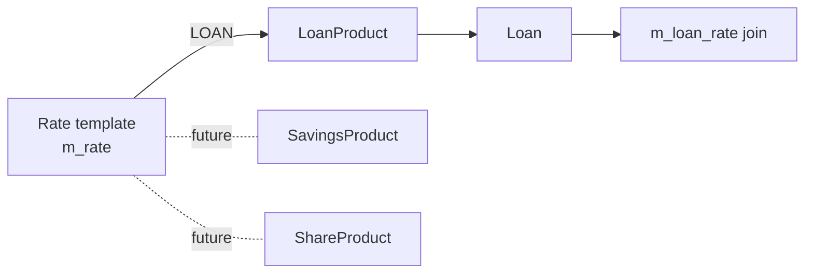
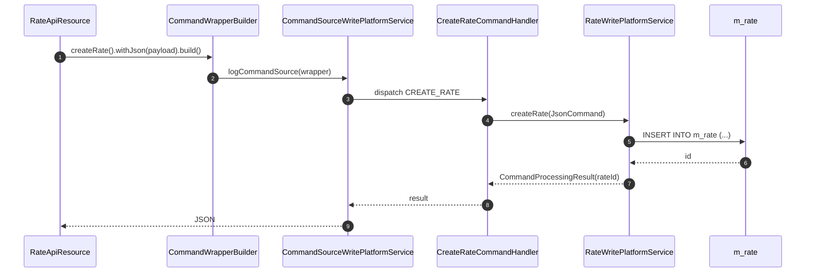
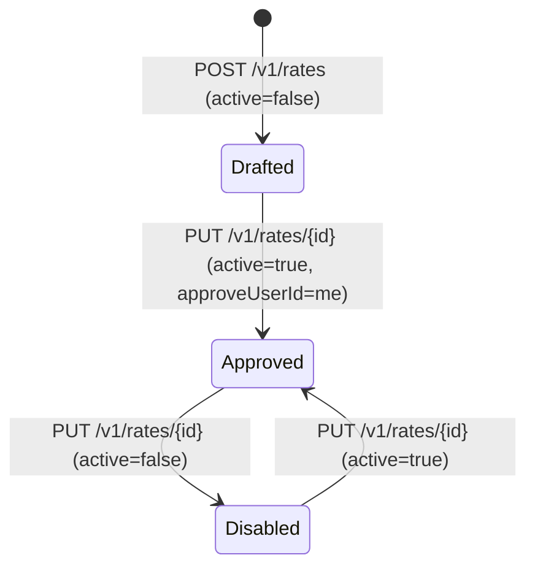

`Rate` is Apache Fineract's mechanism for layering a *percentage* on top of money that has already been calculated by another rule — most commonly a government-mandated VAT, service tax, or stamp duty that needs to be added on top of every fee or every loan repayment. The entity was contributed by Bowpi GT and lives in the `fineract-core` and `fineract-provider` modules under `org.apache.fineract.portfolio.rate`. A `Rate` is structurally similar to a `Charge`, but it always represents a *percentage*, is approved by a user (the `approveUser`), and can only apply to loans today.

## Module layout

```
fineract-core
└── org.apache.fineract.portfolio.rate
    ├── data/        RateData
    └── domain/      Rate, RateAppliesTo, RateRepository, RateRepositoryWrapper

fineract-provider
└── org.apache.fineract.portfolio.rate
    ├── api/         RateApiResource, RateApiConstants, RateRequest
    ├── exception/   RateNotFoundException, …
    ├── handler/     CreateRateCommandHandler, UpdateRateCommandHandler
    └── service/     RateReadPlatformService, RateWritePlatformService,
                     RateAssembler
```

## The Rate entity

`Rate` extends `AbstractAuditableCustom`, which gives it the standard `created_by_id`, `created_date`, `last_modified_by_id`, and `lastmodified_date` columns on top of the surrogate `id`. It maps to `m_rate`.

```java
@Entity
@Table(name = "m_rate", uniqueConstraints = {
    @UniqueConstraint(columnNames = { "name" }, name = "name") })
public class Rate extends AbstractAuditableCustom {

    @Column(name = "name", length = 250, unique = true)
    private String name;

    @Column(name = "percentage", scale = 10, precision = 2, nullable = false)
    private BigDecimal percentage;

    @Column(name = "product_apply", length = 100)
    private Integer productApply;

    @Column(name = "active", nullable = false)
    private boolean active;

    @ManyToOne
    @JoinColumn(name = "approve_user", nullable = true)
    private AppUser approveUser;
}
```

| Column | Java field | Notes |
|--------|------------|-------|
| `id` | inherited | Surrogate PK. |
| `name` | `String name` | Unique within tenant. Up to 250 chars. |
| `percentage` | `BigDecimal percentage` | The actual rate, e.g. `18.00` for 18% VAT. |
| `product_apply` | `Integer productApply` | Ordinal of `RateAppliesTo`. |
| `active` | `boolean active` | Soft-disable; inactive rates cannot be attached to new entities. |
| `approve_user` | `AppUser approveUser` | The Fineract user who approved the rate — captured because rates often need a four-eyes sign-off. |
| `created_by_id`, `created_date`, etc. | inherited | Audit columns from `AbstractAuditableCustom`. |

The static factory used by the create handler is:

```java
public static Rate fromJson(JsonCommand command, AppUser user) {
    String name = command.stringValueOfParameterNamed("name");
    BigDecimal percentage = command.bigDecimalValueOfParameterNamed("percentage");
    RateAppliesTo productApply = RateAppliesTo.fromInt(command.integerValueOfParameterNamed("productApply"));
    boolean active = command.booleanPrimitiveValueOfParameterNamed("active");
    return new Rate(name, percentage, productApply, active, user);
}
```

The `update(JsonCommand)` method handles name / percentage / active / `approveUserId` changes, but **rejects** any attempt to change `productApply` — the entity throws `ChargeParameterUpdateNotSupportedException` with key `rate.applies.to` because changing what a rate applies to would silently re-target every loan it is attached to.

## RateAppliesTo

The discriminator enum currently has a single valid value:

| Ordinal | Name | Used by |
|---------|------|---------|
| 0 | `INVALID` | sentinel — rejected by the validator |
| 1 | `LOAN` | `LoanRate` mapping table; rate is added to every repayment |

The enum is a deliberate placeholder — the data model is ready for `SAVINGS`, `CLIENT`, and `SHARES` rates in future, but no handler currently consumes anything other than `LOAN`. Validation in `RateAssembler` uses `RateAppliesTo.fromInt(...)` and rejects unknown ordinals.



## How rates attach to loans

Loan products can declare a default set of rates, and each loan inherits the product's rates at submission time. The join table is `m_loan_rate` with `(loan_id, rate_id)` as composite key; on the loan product the equivalent is `m_loan_product_rate`. When the repayment schedule is generated the `LoanScheduleAssembler` reads the active loan rates and applies them on top of each instalment's principal+interest+charges, effectively grossing the instalment.

This is structurally distinct from `Charge`, which produces an explicit `LoanCharge` row on the schedule. A rate produces no explicit row — it is folded into the instalment total — and it is the loan transaction processor's job to allocate the rate amount against the configured GL accounts.

<Note>
Because `Rate` always multiplies by a percentage, the rounding behaviour follows the loan product's `currency.inMultiplesOf` and the `MathContext` configured on the schedule generator. See [/loan/loan-repayment-schedule](/loan/loan-repayment-schedule).
</Note>

## Repositories

| Class | Purpose |
|-------|---------|
| `RateRepository` | Spring Data JPA repository for `Rate`. Derived finder `findByName(String)` powers the uniqueness check. |
| `RateRepositoryWrapper` | Wraps the JPA repo, throws `RateNotFoundException` on miss. The rest of Fineract always injects the wrapper. |

## REST endpoints — `/v1/rates`

`RateApiResource` is annotated `@Path("/v1/rates")` and exposes a CRUD-minus-delete slice. Like `Fund`, rates are designed to be a permanent dimension — once a loan has been grossed by a rate, that rate must stay queryable.

| Method | Path | Java method | Returns |
|--------|------|-------------|---------|
| `GET` | `/v1/rates` | `retrieveAllRates()` | `Collection<RateData>` |
| `GET` | `/v1/rates/{rateId}` | `retrieveRate(rateId)` | `RateData` |
| `POST` | `/v1/rates` | `createRate(RateRequest)` | `CommandProcessingResult` |
| `PUT` | `/v1/rates/{rateId}` | `updateRate(rateId, RateRequest)` | `CommandProcessingResult` |

### Create payload

```json
{
  "name": "VAT 18%",
  "percentage": 18.00,
  "productApply": 1,
  "active": true,
  "approveUserId": 5
}
```

`approveUserId` is optional — if absent the `approveUser` column stays null and a checker can fill it later via update. `productApply = 1` selects `LOAN`.

### Update rules

- `name`, `percentage`, `active`, and `approveUserId` are all editable.
- `productApply` is **not** editable — the write platform throws `rate.applies.to.update.not.supported`.
- Soft-disabling by setting `active = false` prevents the rate appearing in dropdowns but does not retroactively detach it from existing loans.

## Read service

`RateReadPlatformService` exposes:

| Method | Returns | Caller |
|--------|---------|--------|
| `retrieveAllRates()` | `Collection<RateData>` | UI dropdown on the loan-product editor. |
| `retrieveOne(Long rateId)` | `RateData` | Single-row fetch for the edit form. |
| `retrieveLoanApplicableRates()` | `Collection<RateData>` | Filters where `active = true AND product_apply = 1` for the loan-product association picker. |

`RateData` projects `id`, `name`, `percentage`, `productApply` (as `EnumOptionData`), `active`, and `approveUser` (id + display name).

## Rate vs Charge vs Tax — choosing the right tool

The three concepts overlap, and choosing among them is a frequent operational question.

| Concept | Best for | Stored as | Visible on schedule |
|---------|----------|-----------|---------------------|
| [`Charge`](/reference/charges) | Explicit fees with their own GL routing | `LoanCharge` rows | Yes — own line per instalment |
| `Rate` | Percentage uplift applied to every instalment as a whole | folded into instalment total | No — included in total |
| [`Tax`](/reference/tax) | Splitting an existing charge or interest posting into component lines (e.g. CGST 9% + SGST 9%) | `TaxGroup` mappings on charges/savings | Yes — one line per tax component |

A common pattern is to use `Charge` for the fee, `TaxGroup` to split out the tax components for accounting, and `Rate` only for jurisdictions where the law mandates a flat gross-up on every repayment.

## Command flow



Permissions enforced by the standard seed: `READ_RATE`, `CREATE_RATE`, `UPDATE_RATE`. Both writes are eligible for maker-checker through the usual `m_permission` flag.

## Validation rules

The deserializer in `fineract-provider`'s `org.apache.fineract.portfolio.rate.serialization` package enforces:

| Rule | Failure code |
|------|--------------|
| `name` not blank, ≤ 250 chars | `name.cannot.be.blank` / `name.exceeds.max.length` |
| `percentage` > 0 and not null | `percentage.must.be.positive` |
| `productApply` must resolve to a non-INVALID `RateAppliesTo` | `productApply.invalid` |
| `active` is a boolean | `active.must.be.boolean` |
| `approveUserId` (when present) references an existing `AppUser` | `approveUserId.user.not.found` |
| No unsupported parameters on the JSON body | `unsupported.parameter` |

Update additionally throws `ChargeParameterUpdateNotSupportedException("rate.applies.to", …)` if the payload tries to change `productApply`.

## Exceptions

| Exception | When thrown | HTTP |
|-----------|-------------|------|
| `RateNotFoundException` | `rateId` cannot be resolved. | 404 |
| `ChargeParameterUpdateNotSupportedException` | Immutable field on update. | 403 |
| `PlatformDataIntegrityException` | Duplicate `name`. | 403 |

## RateRequest payload class

The provider module exposes a strongly-typed `RateRequest` record consumed by the JAX-RS resource:

```java
public class RateRequest {
    private String name;
    private BigDecimal percentage;
    private Integer productApply;
    private Boolean active;
    private Long approveUserId;
    // standard locale / dateFormat fields from PortfolioApiData
}
```

The resource then forwards a `JsonCommand` to the write platform service, which uses the same `Rate.fromJson(...)` / `Rate.update(...)` factories described above.

## Read service projection

`RateReadPlatformService` uses a `JdbcTemplate` row mapper. A typical projection looks like:

```sql
SELECT r.id,
       r.name,
       r.percentage,
       r.product_apply,
       r.active,
       r.approve_user        AS approveUserId,
       u.username            AS approveUsername
  FROM m_rate r
  LEFT JOIN m_appuser u ON u.id = r.approve_user
 WHERE (:loanApplicableOnly = false OR (r.active = true AND r.product_apply = 1))
 ORDER BY r.name
```

`RateData` carries `id`, `name`, `percentage`, `productApply` (as `EnumOptionData`), `active`, and an embedded `approveUser` shape `{ id, username }`.

## Audit trail and approval

Because `Rate` extends `AbstractAuditableCustom`, every mutation timestamps `lastmodified_date` and stamps `last_modified_by_id` with the writing user. The `approveUser` column is *separate* from this audit — it is the business approver, not the system mutator. A common workflow has a maker submit the rate as `active = false`, a treasury approver flip `active = true` and set `approveUserId` to themselves, and only then does the loan-product editor allow attaching the rate.



The state machine is *informal* — `Rate` has no explicit `status` column, only `active` + `approveUser`. Compliance teams can add a data-table on `m_rate` (see [/core/data-queries](/core/data-queries)) if they need a richer approval log.

## Cross references

- [/reference/charges](/reference/charges) — sibling concept, often used together.
- [/reference/tax](/reference/tax) — when you need to split an amount into components.
- [/loan/loan-product](/loan/loan-product) — where loan-product rates are configured.
- [/loan/loan-repayment-schedule](/loan/loan-repayment-schedule) — how rates fold into the instalment totals.
- [/models/charge-tax-rate-model](/models/charges-and-funds-model) — ER view across charge, tax, rate tables.
- [/commands/audits](/commands/audits) — how rate command sources are persisted for review.
