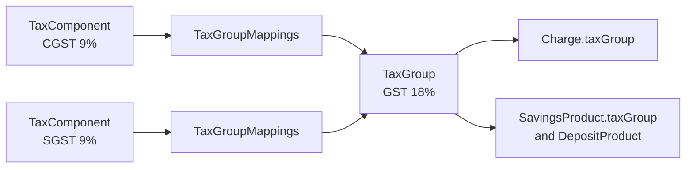
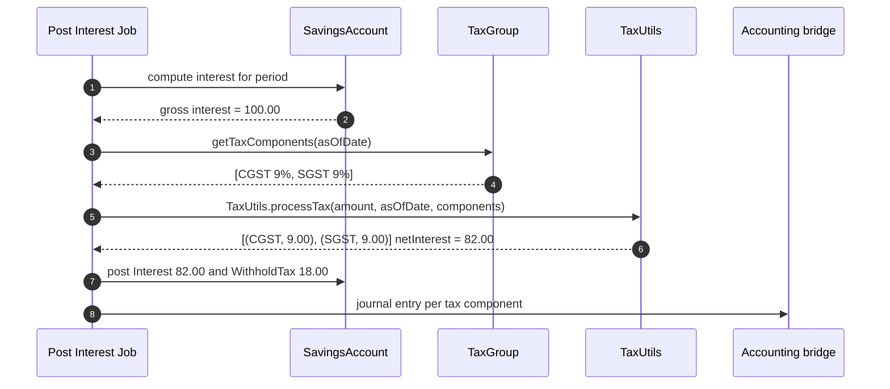
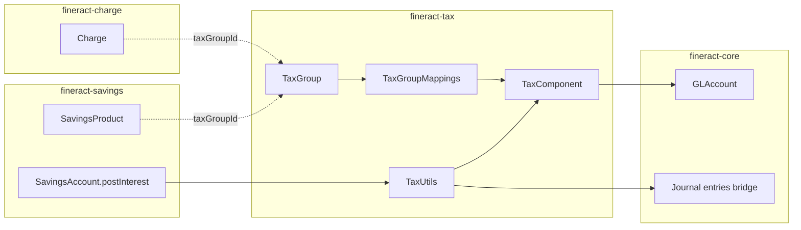

The Apache Fineract tax model is built around three classes that compose cleanly: `TaxComponent` is an atomic, dated tax percentage with its own debit and credit GL routing; `TaxGroup` aggregates several components into a named bundle that can be attached to charges and savings products; and `TaxGroupMappings` is the time-sliced join row that records *when* a component belongs to a group, so historical taxes are reproducible even if rates change. All three live in `org.apache.fineract.portfolio.tax.domain` inside the `fineract-tax` module.

## Module layout

```
fineract-tax
└── org.apache.fineract.portfolio.tax
    ├── api/        TaxApiConstants, TaxComponentApiResource, TaxGroupApiResource
    ├── data/       TaxComponentData, TaxGroupData, TaxComponentHistoryData
    ├── domain/     TaxComponent, TaxComponentHistory, TaxGroup,
    │               TaxGroupMappings, repositories, RepositoryWrapper
    ├── exception/  TaxComponentNotFoundException, TaxGroupNotFoundException,
    │               TaxMappingNotFoundException, …
    ├── handler/    Create / Update command handlers for component & group
    ├── serialization/ Validators from JSON
    └── service/    TaxReadPlatformService, TaxWritePlatformService,
                    TaxAssembler, TaxUtils
```

## TaxComponent — atomic percentage

`TaxComponent` extends `AbstractAuditableCustom` and maps to `m_tax_component`.

| Column | Java field | Notes |
|--------|------------|-------|
| `id` | inherited | PK. |
| `name` | `String name` | Display name, e.g. `"CGST 9%"`. |
| `percentage` | `BigDecimal percentage` | Scale 6, precision 19. The current percentage. |
| `debit_account_type_enum` | `Integer debitAccountType` | Ordinal of `GLAccountType` for the debit side. |
| `debit_account_id` | `GLAccount debitAccount` | Optional GL account where the tax is debited. |
| `credit_account_type_enum` | `Integer creditAccountType` | Ordinal of `GLAccountType` for the credit side. |
| `credit_account_id` | `GLAccount creditAccount` | Optional GL account where the tax is credited. |
| `start_date` | `LocalDate startDate` | Date from which `percentage` is in effect. |

It also carries two eager `@OneToMany` collections:

- `Set<TaxComponentHistory> taxComponentHistories` — keyed by `tax_component_id`, every prior `(percentage, startDate)` is preserved when the component is repriced.
- `Set<TaxGroupMappings> taxGroupMappings` — back-reference into the join rows for every group the component participates in.

### TaxComponentHistory

A small audit row capturing a snapshot whenever the percentage or start-date of a `TaxComponent` is changed. Columns: `tax_component_id`, `percentage`, `start_date`. The write service updates the live `TaxComponent` *and* inserts a history row, so the savings interest posting code can replay a historical computation by reading whatever was in force on a given date.

## TaxGroup — composition

`TaxGroup` is a named bundle of components that gets attached to a charge or a savings product. It maps to `m_tax_group` and has a single payload field plus the mappings collection:

```java
@Entity
@Table(name = "m_tax_group")
public class TaxGroup extends AbstractAuditableCustom {

    @Column(name = "name", length = 100)
    private String name;

    @OneToMany(cascade = CascadeType.ALL, orphanRemoval = true,
               fetch = FetchType.EAGER, mappedBy = "taxGroup")
    private Set<TaxGroupMappings> taxGroupMappings = new HashSet<>();
}
```

A group might be `"GST 18% (CGST 9% + SGST 9%)"` — two `TaxComponent` rows joined via two `TaxGroupMappings` rows.

### TaxGroupMappings

The time-sliced join row. Each instance points to a `TaxGroup` and a `TaxComponent` and carries `start_date` / `end_date`, so a group's composition can change over time:

| Column | Notes |
|--------|-------|
| `tax_group_id` | FK to `m_tax_group`. |
| `tax_component_id` | FK to `m_tax_component`. |
| `start_date` | When this component joins the group. |
| `end_date` | When it leaves; null means still effective. |

`TaxAssembler` uses these dates to filter the active component set for any reference date passed in.



## Where tax groups are referenced

Two production-relevant aggregates carry a `tax_group_id`:

1. **`Charge`** — see `Charge.taxGroup` mapped through `@ManyToOne @JoinColumn(name = "tax_group_id")`. When the charge is materialised on a loan or savings transaction, the tax group's active components are computed and split off as separate tax journal entries.
2. **`SavingsProduct`** and the underlying `DepositProduct` for fixed/recurring deposits — see `DepositProductAssembler.assembleTaxGroup(JsonCommand)`. Every interest posting on accounts of that product is grossed/netted by the tax group.

## Application to savings interest postings

Savings interest is posted by the periodic interest-posting job (see [/flows/savings-interest-posting-flow](/flows/savings-interest-posting-flow) and [/savings/savings-jobs](/savings/savings-jobs)). When the account's product has a `taxGroup`, the posting workflow looks roughly like this:



The savings transaction processor materialises one `SavingsAccountTransaction` for the *net* interest and a separate `WITHHOLD_TAX` transaction (with a child `SavingsAccountTransactionTaxDetails` row per component) so the accounting bridge can route each component to its own debit/credit GL accounts.

`TaxUtils` is the helper that handles rounding to currency multiples and the `(percentage / 100)` arithmetic, falling back to `BigDecimal.ROUND_HALF_UP` consistent with the rest of the platform.

## Application to charges

When a `Charge` with a `taxGroup` is materialised on a loan or savings account, the same splitting happens but per-charge. For loan charges the tax components become extra rows on the schedule's "fees" bucket so that the loan transaction processor allocates payments correctly. For savings, the savings charge transaction is split into tax-bearing rows before the accounting bridge runs.

<Note>
Whether the gross or the net amount is shown to the borrower depends on the loan product's `chargeIncludedInEMI` configuration. Either way, the tax components are visible in the journal entries.
</Note>

## Repositories

| Class | Purpose |
|-------|---------|
| `TaxComponentRepository` / `TaxComponentRepositoryWrapper` | Spring Data + throw-on-miss wrapper. |
| `TaxGroupRepository` / `TaxGroupRepositoryWrapper` | Same pattern for groups. |
| Mappings have no dedicated repository — they cascade with the parent `TaxGroup`. |

## REST endpoints

The tax APIs are split between components and groups.

### `/v1/taxes/component`

| Method | Path | Operation |
|--------|------|-----------|
| `GET` | `/v1/taxes/component` | `retrieveAllTaxComponents` |
| `GET` | `/v1/taxes/component/{taxComponentId}` | `retrieveTaxComponent` |
| `GET` | `/v1/taxes/component/template` | `retrieveTemplate` (GL account / type dropdowns) |
| `POST` | `/v1/taxes/component` | `createTaxComponent` |
| `PUT` | `/v1/taxes/component/{taxComponentId}` | `updateTaxComponent` |

Update accepts only `percentage` and `startDate` for re-pricing; the GL routing is fixed once set, since changing it would invalidate previously-posted journal entries.

### `/v1/taxes/group`

| Method | Path | Operation |
|--------|------|-----------|
| `GET` | `/v1/taxes/group` | `retrieveAllTaxGroups` |
| `GET` | `/v1/taxes/group/{taxGroupId}` | `retrieveTaxGroup` |
| `GET` | `/v1/taxes/group/template` | `retrieveTemplate` (component list) |
| `POST` | `/v1/taxes/group` | `createTaxGroup` |
| `PUT` | `/v1/taxes/group/{taxGroupId}` | `updateTaxGroup` (add / remove component mappings) |

A group update is allowed to *add* new mappings (with `start_date >= today`) and to *end-date* existing ones, but it never deletes a `TaxGroupMappings` row outright — that preserves history for replay during late interest postings.

## Constants and parameter names

`TaxApiConstants` centralises the JSON parameter names used by validators and `update(JsonCommand)` implementations:

| Constant | Value |
|----------|-------|
| `nameParamName` | `"name"` |
| `percentageParamName` | `"percentage"` |
| `startDateParamName` | `"startDate"` |
| `debitAccountTypeParamName` | `"debitAccountType"` |
| `debitAcountIdParamName` | `"debitAccountId"` |
| `creditAccountTypeParamName` | `"creditAccountType"` |
| `creditAcountIdParamName` | `"creditAccountId"` |
| `taxComponentsParamName` | `"taxComponents"` |

## Validation rules

`TaxComponentValidator` and `TaxGroupValidator` (in the `serialization/` sub-package) enforce:

### TaxComponent

| Rule | Failure code |
|------|--------------|
| `name` not blank, ≤ 100 chars | `name.cannot.be.blank` |
| `percentage` in `(0, 100]` | `percentage.invalid` |
| `startDate` not in the future | `startDate.cannot.be.in.future` |
| `debitAccountId` exists if `debitAccountType` set | `debitAccount.not.found` |
| `creditAccountId` exists if `creditAccountType` set | `creditAccount.not.found` |

### TaxGroup

| Rule | Failure code |
|------|--------------|
| `name` not blank, ≤ 100 chars | `name.cannot.be.blank` |
| `taxComponents` array non-empty | `taxComponents.cannot.be.empty` |
| Each component `id` resolves to a `TaxComponent` | `taxComponent.not.found` |
| No two active mappings overlap dates for the same component | `taxComponent.overlapping.mapping` |

## Exceptions

| Exception | When thrown | HTTP |
|-----------|-------------|------|
| `TaxComponentNotFoundException` | `taxComponentId` not in `m_tax_component`. | 404 |
| `TaxGroupNotFoundException` | `taxGroupId` not in `m_tax_group`. | 404 |
| `TaxMappingNotFoundException` | Requested update references a non-existent `TaxGroupMappings`. | 404 |
| `TaxComponentCannotBeDeletedException` | Component still in an active group mapping. | 403 |

## Re-pricing semantics

When `TaxComponent.percentage` is updated through `PUT /v1/taxes/component/{id}`:

1. The current `(percentage, startDate)` is **snapshot** into a new `TaxComponentHistory` row.
2. The live `TaxComponent` updates with the new percentage and the requested `startDate`.
3. Past savings interest postings that already wrote `WITHHOLD_TAX` rows are **not** retroactively altered — the history snapshot lets late corrections look up the rate that was in force.

This is what makes "VAT was 18% until March 31, 17.5% from April 1" work without breaking previously-posted interest. Loan charges and savings charges follow the same convention.

## Cross-module dependency map



## Worked example — Indian GST on a savings interest posting

A savings product is associated with `TaxGroup "GST 18%"` containing two components: `CGST 9%` (debit interest-income, credit CGST-payable) and `SGST 9%` (debit interest-income, credit SGST-payable).

1. The interest-posting job computes gross interest of 100.00 for the quarter.
2. `TaxUtils.processTax(100.00, asOfDate, [CGST 9%, SGST 9%])` returns `[(CGST, 9.00), (SGST, 9.00)]` and net interest 82.00.
3. The savings transaction processor writes:
   - `INTEREST_POSTING` transaction for 82.00.
   - `WITHHOLD_TAX` transaction for 18.00, with two child `SavingsAccountTransactionTaxDetails` rows totalling 18.00.
4. The accounting bridge translates each tax detail into a journal entry against the configured GL accounts on the components.

## Caching

Tax components and groups are read on every savings interest posting and on every charge materialisation. The read services cache the active-as-of-date projection in an in-memory map keyed by tenant — invalidated by the write platform on every update. The cache region is named `tax-components` and shares the same Ehcache/Caffeine infrastructure described in [/core/cache](/core/cache).

## Cross references

- [/reference/charges](/reference/charges) — `Charge.taxGroup` consumes a `TaxGroup`.
- [/savings/savings-product](/savings/savings-product) — `taxGroupId` on the savings product configuration.
- [/savings/fixed-deposits](/savings/fixed-deposits) — withholding-tax handling on fixed-deposit interest.
- [/flows/savings-interest-posting-flow](/flows/savings-interest-posting-flow) — the runtime path that calls `TaxUtils`.
- [/models/charge-tax-rate-model](/models/charges-and-funds-model) — ER view across charge, tax, rate tables.
- [/accounting/journal-entries](/accounting/journal-entries) — where tax debits and credits land.
- [/accounting/gl-accounts](/accounting/gl-accounts) — `GLAccount` configuration referenced by tax components.
