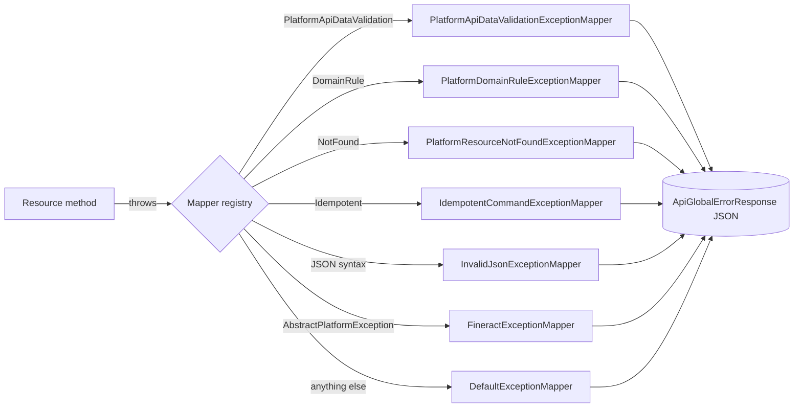

Apache Fineract presents a uniform error contract to every API client: regardless of which layer raised the failure — JSON parsing, bean validation, domain rule, JPA optimistic lock, idempotency conflict — the response carries the same envelope, the same status‑code semantics, and the same i18n‑ready message codes. The machinery behind that contract has three layers: a family of **abstract exception bases** that domain code throws, a set of JAX‑RS **exception mappers** that translate each into an HTTP response, and the **`ApiGlobalErrorResponse` / `ApiParameterError`** value objects that shape the JSON body.

<Info>
Throwing one of the documented exception types is sufficient — you never construct the JSON envelope by hand. Mappers do the translation once, in `fineract-core`, for every API in the platform.
</Info>

## The exception family

The directory `fineract-core/src/main/java/org/apache/fineract/infrastructure/core/exception/` contains the entire public exception hierarchy:

```
AbstractIdempotentCommandException.java
AbstractPlatformDomainRuleException.java
AbstractPlatformException.java
AbstractPlatformResourceNotFoundException.java
AbstractPlatformServiceUnavailableException.java
ErrorHandler.java
GeneralPlatformDomainRuleException.java
HttpMessageNotReadableErrorController.java
IdempotentCommandProcessFailedException.java
IdempotentCommandProcessSucceedException.java
IdempotentCommandProcessUnderProcessingException.java
ImageDataURLNotValidException.java
ImageUploadException.java
InvalidJsonException.java
JobIsNotFoundOrNotEnabledException.java
MultiException.java
PlatformApiDataValidationException.java
PlatformDataIntegrityException.java
PlatformInternalServerException.java
PlatformRequestBodyItemLimitValidationException.java
PlatformServiceUnavailableException.java
ResourceNotFoundException.java
UnrecognizedQueryParamException.java
UnsupportedParameterException.java
```

### Abstract bases

| Base | HTTP | Used for |
| --- | --- | --- |
| `AbstractPlatformException` | varies | Common root carrying `globalisationMessageCode`, `defaultUserMessage`, `defaultUserMessageArgs`. |
| `AbstractPlatformDomainRuleException` | `403` | Business rule violations (e.g. "loan is already approved"). |
| `AbstractPlatformResourceNotFoundException` | `404` | Entity not found by id, externalId, or alternate key. |
| `AbstractPlatformServiceUnavailableException` | `503` | Backend dependency or scheduled work temporarily unavailable. |
| `AbstractIdempotentCommandException` | `409`/`200` | Family covering the three idempotency replay outcomes (see below). |

### Concrete general‑purpose exceptions

| Exception | HTTP | When to throw |
| --- | --- | --- |
| `PlatformApiDataValidationException` | `400` | Aggregates `ApiParameterError` rows produced by a `DataValidatorBuilder`. The richest of the family. |
| `PlatformDataIntegrityException` | `403` | DB constraint violation surfaced as a domain rule. |
| `PlatformInternalServerException` | `500` | Wrap unexpected upstream failures with a stable i18n code. |
| `PlatformServiceUnavailableException` | `503` | A specific downstream is unavailable. |
| `GeneralPlatformDomainRuleException` | `403` | Quick domain rule throw without a custom subclass. |
| `ResourceNotFoundException` | `404` | Generic 404 with parameterised message. |
| `UnrecognizedQueryParamException` | `400` | A `?key=value` was sent that the resource does not accept. |
| `UnsupportedParameterException` | `400` | A JSON body field was sent that the command does not accept. |
| `InvalidJsonException` | `400` | Caller posted malformed JSON. |
| `PlatformRequestBodyItemLimitValidationException` | `400` | Bulk body exceeds the configured maximum item count. |
| `ImageDataURLNotValidException`, `ImageUploadException` | `400` | Avatar / signature upload validation. |
| `JobIsNotFoundOrNotEnabledException` | `404` | Caller tried to trigger a scheduler job that is unknown or disabled. |
| `MultiException` | `500` | Wraps multiple causes from parallel work into a single envelope. |

### The idempotency family

`AbstractIdempotentCommandException` has three concrete subclasses, each signalling a distinct replay state:

| Exception | HTTP | Meaning |
| --- | --- | --- |
| `IdempotentCommandProcessSucceedException` | `200` | Replay of a command that previously succeeded — the original response is returned to the caller. |
| `IdempotentCommandProcessFailedException` | mirrors original | Replay of a command that previously failed — the original error envelope is returned. |
| `IdempotentCommandProcessUnderProcessingException` | `409` | The original command is still executing; the caller should back off and retry. |

<Note>
Idempotency state is keyed by the `Idempotency-Key-Inbound` header against rows persisted by `CommandSourceService` (see [`/runtime/transaction-management`](/runtime/transaction-management)). The replay decision happens *before* the business handler runs.
</Note>

## The JSON envelope

Every error response carries the same top‑level shape, produced by `ApiGlobalErrorResponse`.

### `ApiGlobalErrorResponse`

```json
{
  "developerMessage":             "Validation errors exist.",
  "httpStatusCode":               "400",
  "defaultUserMessage":           "Validation errors exist.",
  "userMessageGlobalisationCode": "validation.msg.validation.errors.exist",
  "errors": [ ... ]
}
```

<ResponseField name="developerMessage" type="string">
English description aimed at developers. Stable across releases.
</ResponseField>
<ResponseField name="httpStatusCode" type="string">
HTTP status as a string. Mirrors the actual response status code.
</ResponseField>
<ResponseField name="defaultUserMessage" type="string">
Human‑readable message safe to display in a UI when no localisation is available.
</ResponseField>
<ResponseField name="userMessageGlobalisationCode" type="string">
The i18n key clients should look up to localise the message.
</ResponseField>
<ResponseField name="errors" type="array">
Zero or more `ApiParameterError` rows describing parameter‑level problems.

<Expandable title="ApiParameterError fields">
<ResponseField name="developerMessage" type="string">English developer message.</ResponseField>
<ResponseField name="defaultUserMessage" type="string">English user message.</ResponseField>
<ResponseField name="userMessageGlobalisationCode" type="string">i18n key.</ResponseField>
<ResponseField name="parameterName" type="string">JSON pointer or query‑string key that failed.</ResponseField>
<ResponseField name="value" type="any">The offending value, when safe to include.</ResponseField>
<ResponseField name="args" type="array">Substitution arguments for the globalisation code (e.g. minimum and maximum allowed).</ResponseField>
</Expandable>
</ResponseField>

### Convenience constructors

`ApiGlobalErrorResponse` exposes named factory methods for each canonical HTTP status:

| Factory | Status | Typical trigger |
| --- | --- | --- |
| `badClientRequest(...)` | `400` | Malformed input. |
| `unAuthenticated()` | `401` | Missing or invalid credentials. |
| `unAuthorized(...)` | `403` | Permission denied. |
| `notFound(...)` | `404` | Resource not present. |
| `invalidInstanceTypeMethod(verb)` | `405` | The instance‑mode filter rejected a write verb (see [`/runtime/profiles-and-instance-modes`](/runtime/profiles-and-instance-modes)). |
| `domainRuleViolation(...)` | `403` | Business rule failure. |
| `serverSideError(...)` | `500` | Unexpected failure. |
| `serviceUnavailable(...)` | `503` | Backend dependency down. |

## JAX‑RS exception mappers

Each exception subclass has a dedicated mapper in `fineract-core/src/main/java/org/apache/fineract/infrastructure/core/exceptionmapper/`. Mappers are registered with the Jersey resource config and run after a resource method throws.

### Catalogue

| Mapper | Maps | Notes |
| --- | --- | --- |
| `PlatformApiDataValidationExceptionMapper` | `PlatformApiDataValidationException` → `400` | Translates the held `List<ApiParameterError>` into the envelope's `errors` array. |
| `PlatformDomainRuleExceptionMapper` | `AbstractPlatformDomainRuleException` → `403` | |
| `PlatformResourceNotFoundExceptionMapper` | `AbstractPlatformResourceNotFoundException` → `404` | |
| `PlatformServiceUnavailableExceptionMapper` | `AbstractPlatformServiceUnavailableException` → `503` | |
| `PlatformInternalServerExceptionMapper` | `PlatformInternalServerException` → `500` | |
| `PlatformDataIntegrityExceptionMapper` | `PlatformDataIntegrityException` → `403` | |
| `PlatformRequestBodyItemLimitValidationExceptionMapper` | `PlatformRequestBodyItemLimitValidationException` → `400` | |
| `IdempotentCommandExceptionMapper` | `AbstractIdempotentCommandException` → `200/409/...` | Inspects subtype to choose status and payload. |
| `InvalidJsonExceptionMapper`, `JsonSyntaxExceptionMapper`, `JsonPathExceptionMapper`, `MalformedJsonExceptionMapper` | `400` | All JSON parsing failures. |
| `InvalidTenantIdentifierExceptionMapper` | Unknown tenant → `400` | Raised by `TenantAwareBasicAuthenticationFilter`. |
| `InvalidInstanceTypeMethodExceptionMapper` | Instance‑mode rejection → `405` | |
| `JobIsNotFoundOrNotEnabledExceptionMapper` | `404` | Scheduler job lookup miss. |
| `UnrecognizedQueryParamExceptionMapper`, `UnsupportedParameterExceptionMapper`, `UnsupportedCommandExceptionMapper` | `400` | Caller sent unknown keys. |
| `JakartaValidationExceptionMapper` | `ConstraintViolationException` → `400` | Bean Validation failures. |
| `JakartaOptimisticLockExceptionMapper`, `JpaOptimisticLockExceptionMapper`, `OptimisticLockExceptionMapper`, `ConcurrencyFailureExceptionMapper` | `409` | Optimistic locking — caller should retry. |
| `RollbackTransactionNotApprovedExceptionMapper` | `403` | Maker‑checker reject. |
| `AccessDeniedExceptionMapper`, `NoAuthorizationExceptionMapper`, `UnAuthenticatedUserExceptionMapper`, `BadCredentialsExceptionMapper` | `401/403` | Spring Security failures. |
| `FineractExceptionMapper` | Any unmapped `AbstractPlatformException` → status from `getHttpStatus()` | Catch‑all for the family. |
| `DefaultExceptionMapper` | `Exception` → `500` | Last‑resort mapper. |

### Flow



## `ErrorHandler`

`ErrorHandler` is a small utility used by services and command handlers to wrap arbitrary `Throwable`s in the canonical hierarchy:

| Method | Result |
| --- | --- |
| `ErrorHandler.getMappable(throwable)` | Unwraps `InvocationTargetException`‑style wrappers and returns the original. |
| `ErrorHandler.handle(throwable, ...)` | Normalises a checked exception into `PlatformInternalServerException` with a stable code. |

<Tip>
Reach for `ErrorHandler` when calling into legacy code that throws checked exceptions. It preserves stack traces and ensures the eventual mapper sees a subclass it knows how to render.
</Tip>

## Throwing exceptions — examples

<CodeGroup>
```java Data validation
throw new PlatformApiDataValidationException(
        "validation.msg.loan.amount.invalid",
        "Loan principal is not valid.",
        List.of(ApiParameterError.parameterError(
                "validation.msg.loan.principal.required",
                "Principal is required.",
                "principal")));
```

```java Domain rule
throw new GeneralPlatformDomainRuleException(
        "error.msg.loan.already.approved",
        "Loan is already approved.",
        loanId);
```

```java Not found
throw new ResourceNotFoundException(
        "error.msg.client.id.invalid",
        "Client with identifier " + clientId + " does not exist.",
        clientId);
```

```java Service unavailable
throw new PlatformServiceUnavailableException(
        "error.msg.payment.gateway.unreachable",
        "Payment gateway did not respond in time.");
```
</CodeGroup>

## Sample envelopes

<Tabs>
<Tab title="400 validation">

```json
{
  "developerMessage": "Validation errors exist.",
  "httpStatusCode":   "400",
  "defaultUserMessage": "Validation errors exist.",
  "userMessageGlobalisationCode": "validation.msg.validation.errors.exist",
  "errors": [
    {
      "developerMessage": "Principal is required.",
      "defaultUserMessage": "Principal is required.",
      "userMessageGlobalisationCode": "validation.msg.loan.principal.required",
      "parameterName": "principal",
      "value": null,
      "args": []
    }
  ]
}
```

</Tab>
<Tab title="403 domain rule">

```json
{
  "developerMessage": "Loan is already approved.",
  "httpStatusCode": "403",
  "defaultUserMessage": "Loan is already approved.",
  "userMessageGlobalisationCode": "error.msg.loan.already.approved",
  "errors": []
}
```

</Tab>
<Tab title="404 not found">

```json
{
  "developerMessage": "Client with identifier 42 does not exist.",
  "httpStatusCode": "404",
  "defaultUserMessage": "Client with identifier 42 does not exist.",
  "userMessageGlobalisationCode": "error.msg.client.id.invalid",
  "errors": []
}
```

</Tab>
<Tab title="409 idempotency replay in flight">

```json
{
  "developerMessage": "Original command is still being processed.",
  "httpStatusCode": "409",
  "defaultUserMessage": "Original command is still being processed.",
  "userMessageGlobalisationCode": "error.msg.idempotent.command.in.progress",
  "errors": []
}
```

</Tab>
</Tabs>

## Operational concerns

<Warning>
Mappers are global. Do not catch `AbstractPlatformException` in a resource method just to log it — you will swallow the structured payload. Let the mapper run; add logging via an HTTP filter or AOP if you need it.
</Warning>

<Warning>
`DefaultExceptionMapper` always emits HTTP 500. Throwing a bare `RuntimeException` from a service therefore produces a generic message. Prefer one of the typed exceptions above so the client receives a meaningful `userMessageGlobalisationCode`.
</Warning>

<Accordion title="How do bean validation errors integrate?">
Jakarta Bean Validation (`@NotNull`, `@Size`, …) violations land on `JakartaValidationExceptionMapper`, which translates the `ConstraintViolation` set into `ApiParameterError` rows so the envelope shape stays identical.
</Accordion>

<Accordion title="What about optimistic lock collisions?">
Four mappers cover EclipseLink, Jakarta, JPA, and Spring's `ConcurrencyFailureException` — all converge on HTTP 409 with a globalisation code that signals "retry your write". Combined with `@Version` columns this gives high‑throughput correctness for hot rows.
</Accordion>

<Accordion title="Can I add a custom exception?">
Yes — extend the appropriate `Abstract*Exception` and either implement `FineractExceptionMapper` (then your exception will fall through to `FineractExceptionMapper`'s status reader) or register a dedicated mapper in the Jersey resource config. Re‑using existing bases is preferred for consistency.
</Accordion>

## Related pages

- The pipeline that wraps every command in its own transaction so idempotency exceptions can be replayed safely: [`/runtime/transaction-management`](/runtime/transaction-management).
- Serialisation of error envelopes and inbound JSON: [`/runtime/serialization-and-jersey`](/runtime/serialization-and-jersey).
- The instance‑mode filter that emits `405` envelopes before reaching any resource: [`/runtime/profiles-and-instance-modes`](/runtime/profiles-and-instance-modes).
