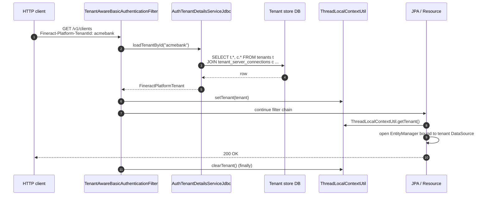

Apache Fineract is multi‑tenant by construction. A single JVM serves an arbitrary number of business tenants, each backed by its own database schema, its own connection pool, and its own timezone — all selected per HTTP request from the value of the `Fineract-Platform-TenantId` header. The mechanism rests on three artefacts: a small **tenant store** database that catalogues every tenant and its connection details, a pair of immutable **domain records** (`FineractPlatformTenant` and `FineractPlatformTenantConnection`) that carry the resolved configuration through the call stack, and a **thread‑local context** (`ThreadLocalContextUtil`) that hands the tenant to JPA, JDBC templates, scheduled jobs, and async listeners.

<Info>
This page focuses on the resolution path and DataSource binding. For how transactions are managed once a tenant is selected, see [`/runtime/transaction-management`](/runtime/transaction-management).
</Info>

## The two layers of state

<CardGroup cols={2}>
<Card title="Tenant store" icon="database">
A single shared database — by convention `fineract_tenants` — holding the catalogue of every tenant the platform serves. Read once per request to look up the active tenant.
</Card>
<Card title="Tenant database" icon="building">
The per‑tenant business database (e.g. `fineract_default`, `fineract_acmebank`). All loan, savings, client, and accounting tables live here. Connections are opened lazily and pooled by tenant identifier.
</Card>
</CardGroup>

### Tenant store schema

The tenant store contains two tables. The exact column names appear in the Liquibase changelog under `fineract-provider/src/main/resources/db/changelog/tenant/`.

#### `tenants`

| Column | Type | Purpose |
| --- | --- | --- |
| `id` | `BIGINT PK` | Surrogate key referenced by `tenant_server_connections.id`. |
| `identifier` | `VARCHAR` (unique) | The string that callers send in `Fineract-Platform-TenantId`. |
| `name` | `VARCHAR` | Human‑readable display name. |
| `timezone_id` | `VARCHAR` | IANA TZ identifier (e.g. `Asia/Kolkata`); used by date arithmetic. |
| `country_id` | `BIGINT` | Optional reference data link. |
| `joined_date` | `DATE` | When the tenant was provisioned. |
| `created_date` | `TIMESTAMP` | Row creation timestamp. |
| `lastmodified_date` | `TIMESTAMP` | Row update timestamp. |
| `oltp_id` | `BIGINT` | FK to `tenant_server_connections` for read‑write traffic. |
| `report_id` | `BIGINT` | FK to `tenant_server_connections` for reporting/read‑only traffic. |

#### `tenant_server_connections`

| Column | Purpose |
| --- | --- |
| `id` | Primary key referenced by `tenants.oltp_id` and `report_id`. |
| `schema_server`, `schema_server_port` | Host and port of the tenant DB. |
| `schema_name` | Database (or schema) name. |
| `schema_username`, `schema_password` | Credentials. The password is encrypted with the master password. |
| `schema_connection_parameters` | Free‑form JDBC query string. |
| `readonly_schema_server`, `readonly_schema_server_port` | Optional read replica host. |
| `readonly_schema_name`, `readonly_schema_username`, `readonly_schema_password` | Read replica credentials. |
| `auto_update` | If `true`, Liquibase migrates the tenant DB at bootstrap. |
| `pool_initial_size`, `pool_max_active`, `pool_min_idle`, `pool_max_idle` | HikariCP pool sizing. |
| `pool_validation_interval`, `pool_test_on_borrow` | Connection liveness checks. |
| `pool_remove_abandoned`, `pool_remove_abandoned_timeout`, `pool_log_abandoned` | Abandoned‑connection handling. |
| `pool_suspect_timeout` | Threshold for logging suspect long‑running connections. |
| `pool_time_between_eviction_runs_millis`, `pool_min_evictable_idle_time_millis` | Eviction policy. |
| `master_password_hash` | Salted hash of the tenant master password used to decrypt `schema_password`. |

## The domain records

### `FineractPlatformTenant`

The resolved tenant is carried through the application as an immutable Lombok‑generated record:

```java
// fineract-core/.../core/domain/FineractPlatformTenant.java
@Jacksonized @Builder @EqualsAndHashCode @RequiredArgsConstructor @Getter
public class FineractPlatformTenant implements Serializable {
    private final Long id;
    private final String tenantIdentifier;
    private final String name;
    private final String timezoneId;
    private final FineractPlatformTenantConnection connection;
}
```

| Field | Source | Used for |
| --- | --- | --- |
| `id` | `tenants.id` | Internal key, audit logging. |
| `tenantIdentifier` | `tenants.identifier` | Matches the inbound header value; used as the cache key for DataSources. |
| `name` | `tenants.name` | Logging and UI. |
| `timezoneId` | `tenants.timezone_id` | Drives business‑date calculations in `DateUtils`. |
| `connection` | Join to `tenant_server_connections` | Holds everything needed to open the JDBC DataSource. |

### `FineractPlatformTenantConnection`

Mirrors `tenant_server_connections`. Beyond the obvious credentials it also exposes static helpers:

```java
public static String toJdbcUrl(String protocol, String host,
                               String port, String db, String parameters);

public static String resolveProtocol(String driver);
// "org.postgresql.Driver"     -> "jdbc:postgresql"
// "com.mysql.cj.jdbc.Driver"  -> "jdbc:mysql"
// "org.mariadb.jdbc.Driver"   -> "jdbc:mariadb"
```

<Note>
`FineractPlatformTenantConnection` is built with Lombok `@Builder` plus an explicit constructor that mirrors the historic positional parameter list. Use the builder in new code; the constructor exists only for backwards compatibility.
</Note>

## The tenant store DataSource

The properties prefixed `fineract.tenant.*` in `application.properties` configure the single connection used to read the tenant store itself. These values bootstrap the *meta* DataSource — they are not the per‑tenant pool.

```properties
fineract.tenant.host=${FINERACT_DEFAULT_TENANTDB_HOSTNAME:localhost}
fineract.tenant.port=${FINERACT_DEFAULT_TENANTDB_PORT:5432}
fineract.tenant.username=${FINERACT_DEFAULT_TENANTDB_UID:root}
fineract.tenant.password=${FINERACT_DEFAULT_TENANTDB_PWD:postgres}
fineract.tenant.parameters=${FINERACT_DEFAULT_TENANTDB_CONN_PARAMS:}
fineract.tenant.timezone=${FINERACT_DEFAULT_TENANTDB_TIMEZONE:Asia/Kolkata}
fineract.tenant.identifier=${FINERACT_DEFAULT_TENANTDB_IDENTIFIER:default}
fineract.tenant.name=${FINERACT_DEFAULT_TENANTDB_NAME:fineract_default}
fineract.tenant.description=${FINERACT_DEFAULT_TENANTDB_DESCRIPTION:Default Demo Tenant}
fineract.tenant.master-password=${FINERACT_DEFAULT_TENANTDB_MASTER_PASSWORD:fineract}
fineract.tenant.encrytion=${FINERACT_DEFAULT_TENANTDB_ENCRYPTION:"AES/CBC/PKCS5Padding"}

fineract.tenant.read-only-host=${FINERACT_DEFAULT_TENANTDB_RO_HOSTNAME:}
fineract.tenant.read-only-port=${FINERACT_DEFAULT_TENANTDB_RO_PORT:}
fineract.tenant.read-only-username=${FINERACT_DEFAULT_TENANTDB_RO_UID:}
fineract.tenant.read-only-password=${FINERACT_DEFAULT_TENANTDB_RO_PWD:}
fineract.tenant.read-only-parameters=${FINERACT_DEFAULT_TENANTDB_RO_CONN_PARAMS:}
fineract.tenant.read-only-name=${FINERACT_DEFAULT_TENANTDB_RO_NAME:}

fineract.tenant.config.min-pool-size=${FINERACT_CONFIG_MIN_POOL_SIZE:-1}
fineract.tenant.config.max-pool-size=${FINERACT_CONFIG_MAX_POOL_SIZE:-1}
fineract.tenant.config.leak-detection-threshold=${FINERACT_CONFIG_LEAK_DETECTION_THRESHOLD:0}
fineract.tenant.config.rounding-mode=${FINERACT_CONFIG_ROUNDING_MODE:6}
```

| Group | What it configures |
| --- | --- |
| `fineract.tenant.host/port/username/password/parameters` | Connection to the **tenant store** DB used to look up tenants. |
| `fineract.tenant.identifier/name/description/timezone` | Defaults used by the bootstrap Liquibase changeset to seed a single demo tenant. |
| `fineract.tenant.master-password` | Master password used to decrypt the per‑tenant `schema_password` blobs. |
| `fineract.tenant.encrytion` | Cipher used (note the historical spelling; do not "fix" it without a migration). |
| `fineract.tenant.read-only-*` | Optional read replica of the tenant store. |
| `fineract.tenant.config.*` | Defaults applied to every per‑tenant HikariCP pool that lacks explicit overrides. |

<Warning>
The property name is `fineract.tenant.encrytion` (sic). It is bound exactly as written; any rename requires a coordinated migration in `application.properties`, env‑var documentation, Helm charts, and downstream deployment manifests.
</Warning>

## Request lifecycle



### Step‑by‑step

<Steps>
<Step title="Header arrives">
Every API call carries `Fineract-Platform-TenantId: <identifier>`. Without the header the request is rejected before any business code runs.
</Step>
<Step title="Filter reads the header">
`TenantAwareBasicAuthenticationFilter` (in `fineract-security`) extracts the identifier and calls `AuthTenantDetailsServiceJdbc.loadTenantById(identifier)`.
</Step>
<Step title="Tenant store lookup">
`AuthTenantDetailsServiceJdbc` runs a single SQL join over `tenants` and `tenant_server_connections` and maps the row into a `FineractPlatformTenant`.
</Step>
<Step title="Context binding">
The resolved tenant is placed on `ThreadLocalContextUtil` so any code reachable from the current thread can call `ThreadLocalContextUtil.getTenant()` without parameter plumbing.
</Step>
<Step title="DataSource resolution">
The JPA infrastructure consults the routing DataSource which uses `tenant.tenantIdentifier` as the lookup key. A HikariCP pool is created on first use and cached.
</Step>
<Step title="Cleanup">
A `finally` block on the filter clears the thread‑local. Forgetting this would leak tenant state into a recycled servlet container thread — a classic multi‑tenant defect.
</Step>
</Steps>

## Using the tenant outside HTTP

Background work — scheduled jobs, batch partitions, JMS listeners — runs on threads that did not pass through the auth filter. They must populate `ThreadLocalContextUtil` themselves before touching JPA.

<CodeGroup>
```java Scheduled job
public void runForTenant(FineractPlatformTenant tenant) {
    try {
        ThreadLocalContextUtil.setTenant(tenant);
        ThreadLocalContextUtil.setBusinessDates(...);
        delegate.execute();
    } finally {
        ThreadLocalContextUtil.reset();
    }
}
```

```java Async listener
@JmsListener(destination = "loan-events")
public void onEvent(LoanEvent event) {
    FineractPlatformTenant tenant = tenantLookup.byIdentifier(event.tenantId());
    try {
        ThreadLocalContextUtil.setTenant(tenant);
        handler.handle(event);
    } finally {
        ThreadLocalContextUtil.reset();
    }
}
```
</CodeGroup>

<Tip>
Use a try/finally rather than try‑with‑resources‑like helpers in your own code: `ThreadLocalContextUtil.reset()` must run even if the body throws, or the next task scheduled on this thread will see the wrong tenant.
</Tip>

## Provisioning a new tenant

<Accordion title="1. Insert into the tenant store">
Insert a `tenant_server_connections` row first (so you have its `id`), then a `tenants` row with `oltp_id` (and optionally `report_id`) pointing at it. The `schema_password` value must be encrypted with the master password using the cipher named by `fineract.tenant.encrytion`.
</Accordion>

<Accordion title="2. Create the tenant database">
Create the physical database referenced by `schema_name`. Grant the configured `schema_username` ownership.
</Accordion>

<Accordion title="3. Bootstrap with Liquibase">
If `auto_update` is `true`, the platform runs the tenant changelogs at next startup. Otherwise, run them out‑of‑band with `SPRING_PROFILES_ACTIVE=liquibase-only` (see [`/runtime/profiles-and-instance-modes`](/runtime/profiles-and-instance-modes)).
</Accordion>

<Accordion title="4. Smoke test">
Send `GET /v1/offices` with `Fineract-Platform-TenantId: <new-id>`. The response should contain only the seed Head Office row, confirming the routing actually hit the new schema.
</Accordion>

## Common pitfalls

<Warning>
**Cross‑tenant leakage.** Any code that caches data indexed by entity ID without including the tenant identifier is unsafe. Always key caches by `(tenantIdentifier, entityId)`.
</Warning>

<Warning>
**Stale ThreadLocal.** A missing `reset()` in a custom executor causes the next task on the same thread to act on the previous tenant. Add a test that runs two tasks for different tenants on a single‑thread executor and asserts isolation.
</Warning>

<Warning>
**Pool exhaustion.** Each tenant gets its own HikariCP pool. With many tenants, sum the per‑tenant `max-pool-size` values to plan database connection budgeting.
</Warning>

## Related pages

- Spring profiles and the instance‑mode filter that runs *after* tenant resolution: [`/runtime/profiles-and-instance-modes`](/runtime/profiles-and-instance-modes)
- Transaction binding to the per‑tenant DataSource: [`/runtime/transaction-management`](/runtime/transaction-management)
- The error envelope used when an unknown tenant is supplied: [`/runtime/error-handling`](/runtime/error-handling)
