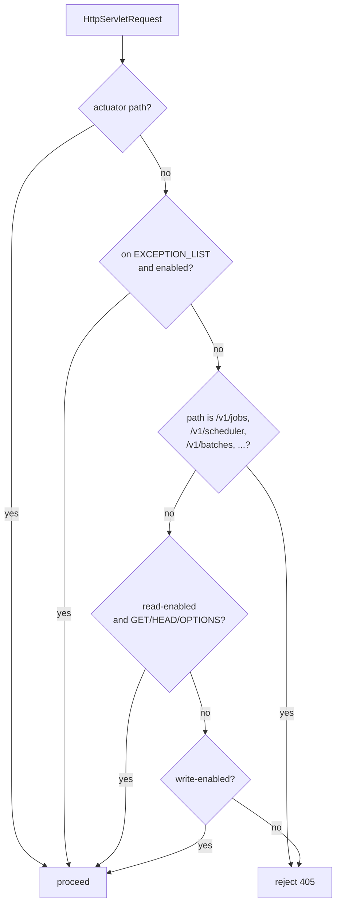

Apache Fineract layers two orthogonal switches on top of Spring Boot to control which beans load and which HTTP traffic is accepted: **Spring profiles** (named environments declared by `spring.profiles.active`) and **instance modes** (`fineract.mode.*` flags read at startup). Profiles toggle whole bundles of beans — schema migrations, diagnostic endpoints, in‑memory test databases — while instance modes shape a single running node into a read replica, a write coordinator, a batch manager, or a batch worker. The two systems are independent and compose: a `liquibase-only` profile boots only the migration runner, whereas a write‑disabled production node still answers `GET` requests but rejects every other verb at the filter layer.

<Info>
This page covers the runtime knobs only. For where the values are read (`FineractProperties`) and how the Spring context is built, see [`/runtime/configuration-binding`](/runtime/spring-boot-configuration) and [`/runtime/jersey-bootstrap`](/provider/jersey-bootstrap).
</Info>

## The `FineractProfiles` constants

`FineractProfiles` is a tiny utility class in `fineract-core` whose only purpose is to name the profile strings consumed by `@Profile` annotations elsewhere in the codebase. Centralising the names keeps typos out of `@Profile("liquibase‑only")` declarations and makes the legal vocabulary auditable in a single file.

```java
// fineract-core/src/main/java/org/apache/fineract/infrastructure/core/boot/FineractProfiles.java
package org.apache.fineract.infrastructure.core.boot;

public final class FineractProfiles {

    public static final String LIQUIBASE_ONLY = "liquibase-only";
    public static final String DIAGNOSTICS    = "diagnostics";
    public static final String TEST           = "test";

    private FineractProfiles() {}
}
```

### Profile catalogue

| Constant | Profile string | Role |
| --- | --- | --- |
| `LIQUIBASE_ONLY` | `liquibase-only` | Boot the process *only* to run Liquibase changelogs against the tenant store and tenant databases, then exit. Used by migration jobs in CI/CD pipelines and Kubernetes init containers. |
| `DIAGNOSTICS` | `diagnostics` | Activate diagnostic beans — extra logging, actuator endpoints, and developer‑facing aids — that must never run in production. |
| `TEST` | `test` | Mark the context as a test harness. Used by `@ActiveProfiles("test")` in integration tests to swap in H2 or test‑container DataSources and to relax security where appropriate. |

<Note>
The three constants are the only profile names Fineract declares for itself. Standard Spring Boot profiles (`default`, `dev`, `prod`, …) and user‑defined profiles continue to work as normal — Fineract simply does not ship pre‑wired beans for them.
</Note>

### Activating profiles

<Tabs>
<Tab title="Environment variable">

```bash
export SPRING_PROFILES_ACTIVE=liquibase-only
java -jar fineract-provider.jar
```

</Tab>
<Tab title="JVM argument">

```bash
java -Dspring.profiles.active=diagnostics \
     -jar fineract-provider.jar
```

</Tab>
<Tab title="application.properties">

```properties
spring.profiles.active=test
```

</Tab>
<Tab title="Kubernetes manifest">

```yaml
env:
  - name: SPRING_PROFILES_ACTIVE
    value: "liquibase-only"
```

</Tab>
</Tabs>

## Instance modes

Instance modes are runtime flags read from `application.properties` (or their `FINERACT_MODE_*` environment overrides) into the `FineractProperties.FineractModeProperties` nested record. Unlike profiles, they do not switch whole bean graphs — they are consulted by request filters, scheduler beans, and the batch infrastructure to decide whether the *running* node should serve a given concern.

### Properties

The four mode switches and their defaults are declared in `fineract-provider/src/main/resources/application.properties`:

```properties
fineract.mode.read-enabled=${FINERACT_MODE_READ_ENABLED:true}
fineract.mode.write-enabled=${FINERACT_MODE_WRITE_ENABLED:true}
fineract.mode.batch-worker-enabled=${FINERACT_MODE_BATCH_WORKER_ENABLED:true}
fineract.mode.batch-manager-enabled=${FINERACT_MODE_BATCH_MANAGER_ENABLED:true}
```

| Property | Env var | Default | Role |
| --- | --- | --- | --- |
| `fineract.mode.read-enabled` | `FINERACT_MODE_READ_ENABLED` | `true` | Allow `GET`/`HEAD`/`OPTIONS` API requests through `FineractInstanceModeApiFilter`. |
| `fineract.mode.write-enabled` | `FINERACT_MODE_WRITE_ENABLED` | `true` | Allow `POST`/`PUT`/`DELETE`/`PATCH` API requests. When `false`, the filter short‑circuits with HTTP 405. |
| `fineract.mode.batch-manager-enabled` | `FINERACT_MODE_BATCH_MANAGER_ENABLED` | `true` | Expose the job, scheduler, batch, and loan catch‑up endpoints. Required on the node that submits batch jobs. |
| `fineract.mode.batch-worker-enabled` | `FINERACT_MODE_BATCH_WORKER_ENABLED` | `true` | Activate Spring Batch worker beans that consume partition step messages. |

### Common deployment shapes

<CardGroup cols={2}>
<Card title="Single all‑in‑one node" icon="server">
All four flags `true`. The default for development and small deployments.
</Card>
<Card title="Read replica" icon="book-open">
`read-enabled=true`, `write-enabled=false`. Front the node behind a read‑only DB; `POST`/`PUT`/`DELETE` are rejected with `405`.
</Card>
<Card title="Write coordinator" icon="pen">
`read-enabled=true`, `write-enabled=true`, `batch-*-enabled=false`. Keeps a dedicated node for transactional traffic without batch contention.
</Card>
<Card title="Batch worker pool" icon="layer-group">
`read-enabled=false`, `write-enabled=false`, `batch-worker-enabled=true`. Pure worker nodes that consume partitioned steps from a manager.
</Card>
</CardGroup>

## The `FineractInstanceModeApiFilter`

`FineractInstanceModeApiFilter` is a `OncePerRequestFilter` that sits in front of the JAX‑RS dispatcher. Every inbound HTTP request passes through `doFilterInternal`, which makes a single decision — proceed or reject with `HTTP 405 Method Not Allowed`.

### Decision flow



### Always‑allowed paths

The filter holds a static `EXCEPTION_LIST` of `(predicate, pathPrefix)` pairs that are evaluated first. They cover bootstrap endpoints that must remain reachable even on degraded nodes:

| Predicate | Path prefix | Reason |
| --- | --- | --- |
| `isBatchManagerEnabled` | `/v1/jobs` | Manager‑only: scheduler job listing and triggering. |
| `isBatchManagerEnabled` | `/v1/scheduler` | Manager‑only: control the global scheduler. |
| `isBatchManagerEnabled` | `/v1/loans/catch-up` | Manager‑only: kick a loan catch‑up run. |
| `isBatchManagerEnabled` | `/v1/loans/is-catch-up-running` | Manager‑only: poll catch‑up status. |
| always `true` | `/v1/instance-mode` | Allow callers to discover the current mode. |
| always `true` | `/v1/batches` | The batch API itself does verb‑level enforcement; the filter lets the request through to the resource. |

Anything under `/actuator/**` is treated as an actuator API and short‑circuited to "proceed" regardless of mode — health and liveness probes must work on every shape.

### Rejection payload

When the filter rejects a request, it writes a JSON envelope produced by `ApiGlobalErrorResponse.invalidInstanceTypeMethod(...)`:

```json
{
  "developerMessage": "Method not allowed in this instance type.",
  "httpStatusCode": "405",
  "defaultUserMessage": "Method not allowed in this instance type.",
  "userMessageGlobalisationCode": "error.msg.method.not.allowed.in.this.instance.type",
  "errors": []
}
```

<Warning>
The filter answers `405`, not `403`. Operators sometimes confuse the two — `405` here means *this node is configured to reject this verb*, not that the principal lacks authorisation.
</Warning>

## Walk‑through: read‑only replica

<Steps>
<Step title="Set the flags">
On the replica node, export environment variables that flip the writable flags off:

```bash
export FINERACT_MODE_READ_ENABLED=true
export FINERACT_MODE_WRITE_ENABLED=false
export FINERACT_MODE_BATCH_MANAGER_ENABLED=false
export FINERACT_MODE_BATCH_WORKER_ENABLED=false
```
</Step>
<Step title="Point at the read replica DB">
Configure the tenant store and tenant connections to use read‑only credentials via the `fineract.tenant.read-only-*` properties (see [`/runtime/multi-tenancy`](/runtime/multi-tenancy)).
</Step>
<Step title="Boot the node">
`SPRING_PROFILES_ACTIVE` can remain unset — the instance‑mode flags are sufficient. Liquibase still runs at startup; if you cannot afford even that, set `spring.liquibase.enabled=false`.
</Step>
<Step title="Verify">
Hit `GET /v1/instance-mode` to confirm the configuration, then try a `POST` to any endpoint and observe the `405` envelope above.
</Step>
</Steps>

## Profiles + modes: how they compose

<Accordion title="Can I run liquibase-only and write-disabled together?">
Yes — but it is redundant. The `liquibase-only` profile exits before the web layer is initialised, so the instance‑mode filter never runs. Use one or the other depending on intent: `liquibase-only` for migration containers, instance modes for steady‑state HTTP shaping.
</Accordion>

<Accordion title="Does the diagnostics profile change mode behaviour?">
No. The diagnostics profile only activates extra beans (loggers, debug endpoints). The instance‑mode filter still enforces verb gating on top.
</Accordion>

<Accordion title="What happens to scheduled jobs on a write‑disabled node?">
The scheduler bean is wired conditionally on `batch-manager-enabled`. Disabling both `batch-manager` and `batch-worker` ensures no jobs fire on a read replica, even if the tenant DB still contains active job definitions.
</Accordion>

<Accordion title="Why does /v1/batches bypass the filter?">
The batch API receives a *bundle* of sub‑requests with mixed verbs. Resource‑level logic walks each sub‑request and applies the instance‑mode rules per item, which is more accurate than a single filter decision at the envelope boundary.
</Accordion>

## Operational tips

<Tip>
Surface the active mode in your readiness probe. A simple endpoint that returns the `FineractModeProperties` record (e.g. `/v1/instance-mode`) lets your service mesh route writes to write‑enabled nodes only.
</Tip>

<Tip>
When promoting a node from replica to primary, flip `FINERACT_MODE_WRITE_ENABLED=true` and restart. The mode is read once at startup; runtime changes to the property do not take effect until the application context is refreshed.
</Tip>

<Warning>
Setting all four flags to `false` produces a node that rejects every API request and runs no scheduled work. It is occasionally useful for "drain" states behind a load balancer, but it is not a supported steady state.
</Warning>

## Verb classification

The filter's `isReadMethod` helper inspects the HTTP method against the set Fineract treats as side‑effect‑free. The classification is straightforward but worth pinning down because some load balancers and client libraries surprise operators:

| HTTP verb | Treated as | Notes |
| --- | --- | --- |
| `GET` | read | Always allowed when `read-enabled=true`. |
| `HEAD` | read | Same as `GET`; allowed when reads are on. |
| `OPTIONS` | read | Pre‑flight CORS requests must succeed even on write‑disabled nodes. |
| `POST` | write | Including idempotent commands — they still write the command source row. |
| `PUT` | write | |
| `PATCH` | write | |
| `DELETE` | write | |
| custom verbs | write | Anything not in the read set is conservatively a write. |

<Note>
Because `OPTIONS` is treated as a read, CORS pre‑flight succeeds against a read‑only replica. Browsers will then send a `POST` that the filter rejects with `405` — this is the intended user‑facing behaviour for write attempts against a read node.
</Note>

## End‑to‑end verification matrix

Use this table when validating a new deployment shape:

| Test | Expectation on all‑in‑one | Expectation on read replica | Expectation on batch worker |
| --- | --- | --- | --- |
| `GET /v1/clients` | `200` | `200` | `405` |
| `POST /v1/clients` | `200` | `405` | `405` |
| `GET /v1/jobs` | `200` | `405` | `405` |
| `POST /v1/scheduler/jobs/.../run` | `200` | `405` | `405` |
| `GET /v1/instance-mode` | `200` | `200` | `200` |
| `GET /actuator/health` | `200` | `200` | `200` |
| `GET /v1/batches` (via list of sub‑requests) | `200` | per sub‑request | per sub‑request |

## Cross‑references

- Bean conditions and property binding: [`/runtime/configuration-binding`](/runtime/spring-boot-configuration)
- The filter chain that wraps `FineractInstanceModeApiFilter`: [`/runtime/jersey-bootstrap`](/provider/jersey-bootstrap)
- Tenant resolution that happens *before* mode checks: [`/runtime/multi-tenancy`](/runtime/multi-tenancy)
- The error envelope returned on rejection: [`/runtime/error-handling`](/runtime/error-handling)
