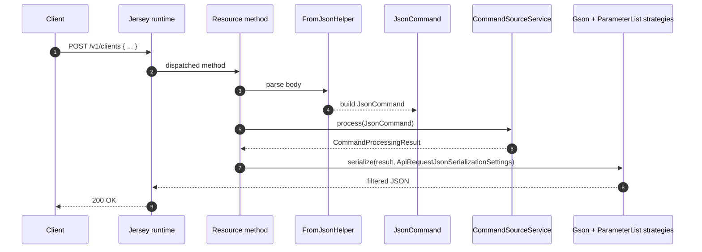

Apache Fineract speaks JSON at every API boundary, and it does so through a hand‑rolled Gson configuration rather than the Spring‑default Jackson stack. This deliberate choice gives the platform fine control over date adapters (`LocalDate`, `OffsetDateTime`, `MonthDay`, `ExternalId`, …), over which fields a response includes for a given `?fields=` query, and over how inbound payloads are wrapped into the `JsonCommand` value object consumed by the command pipeline. The supporting types live in `fineract-core/src/main/java/org/apache/fineract/infrastructure/core/api/`.

<Info>
Jersey resource bootstrap, message body readers/writers, and `MutableUriInfo` are covered separately in [`/runtime/jersey-bootstrap`](/provider/jersey-bootstrap). This page documents the serialization primitives and helpers themselves.
</Info>

## Directory at a glance

```
fineract-core/.../infrastructure/core/api/
├── ApiFacingEnum.java
├── ApiParameterHelper.java
├── ApiRequestParameterHelper.java
├── DateAdapter.java
├── DateParam.java
├── ExternalIdAdapter.java
├── IdTypeResolver.java
├── JodaDateTimeAdapter.java
├── JodaMonthDayAdapter.java
├── JsonCommand.java
├── JsonQuery.java
├── LocalDateAdapter.java
├── LocalDateTimeAdapter.java
├── LocalTimeAdapter.java
├── MutableUriInfo.java
├── OffsetDateTimeAdapter.java
├── ParameterListExclusionStrategy.java
├── ParameterListInclusionStrategy.java
└── jersey/
```

## Inbound payloads

### `JsonCommand`

`JsonCommand` is the immutable wrapper handed to every command handler. It carries the parsed JSON object, the original raw string, the resource identifiers parsed from the URL path, and the maker‑checker / idempotency metadata.

| Field group | Purpose |
| --- | --- |
| `commandId`, `entityName`, `actionName` | Logical identification of the command (`CREATE`, `UPDATE`, `APPROVE`, …) on a resource type. |
| `entityId`, `subentityId`, `groupId`, `clientId`, `loanId`, `savingsId` | Path‑level identifiers extracted by the JAX‑RS resource. |
| `transactionId` | Where applicable (e.g. loan transactions). |
| `jsonCommand` (String), `parsedCommand` (JsonElement) | The original payload and its parsed form. |
| `supportedParameters` | Set of legal JSON keys; used to detect `UnsupportedParameterException`. |

`JsonCommand` exposes typed accessors that hide null‑checks and adapter selection:

| Accessor | Returns | Notes |
| --- | --- | --- |
| `stringValueOfParameterNamed(String)` | `String` | `null` when absent. |
| `integerValueOfParameterNamed(String)` | `Integer` | Locale‑sensitive parse. |
| `longValueOfParameterNamed(String)` | `Long` | Locale‑sensitive parse. |
| `bigDecimalValueOfParameterNamed(String)` | `BigDecimal` | Uses the locale on the command. |
| `booleanPrimitiveValueOfParameterNamed(String)` | `boolean` | False if missing. |
| `booleanObjectValueOfParameterNamed(String)` | `Boolean` | `null` if missing. |
| `localDateValueOfParameterNamed(String)` | `LocalDate` | Drives all date arithmetic. |
| `arrayOfParameterNamed(String)` | `JsonArray` | Raw access for nested structures. |
| `extractLocaleParameter()`, `extractDateFormatParameter()` | metadata | Set per command by the client; needed by date / number parsers. |
| `parameterExists(String)` | `boolean` | Distinguishes "absent" from "explicit null". |
| `isChangeInStringParameterNamed(String, String)` | `boolean` | Used pervasively in updates so handlers only persist actual diffs. |

<Note>
`JsonCommand` is created by `FromJsonHelper` once per request. Mutating it inside a handler is not allowed; instead, handlers return a `CommandProcessingResult` carrying a map of changes that the framework merges back into the audit row.
</Note>

### `JsonQuery`

`JsonQuery` mirrors `JsonCommand` for read paths. It carries the raw and parsed JSON together with the path identifiers, but it is typically used where a read endpoint accepts a JSON body or query parameters that are easier to model as a JSON object (e.g. dynamic report parameters).

| Field | Purpose |
| --- | --- |
| `jsonStr` | Raw JSON. |
| `parsedJson` | Parsed `JsonElement`. |
| `resourceId`, `productId`, etc. | Path identifiers as needed by the consuming read service. |

## Date and identifier adapters

Gson serializes most types reflectively, but date/time and Fineract‑specific identifier types need explicit `TypeAdapter`s so JSON shapes stay stable across releases and drivers.

| Adapter | Java type | Wire format |
| --- | --- | --- |
| `DateAdapter` | `java.util.Date` | `[yyyy, MM, dd]` array (legacy compatibility). |
| `LocalDateAdapter` | `java.time.LocalDate` | `[yyyy, MM, dd]` array. |
| `LocalDateTimeAdapter` | `java.time.LocalDateTime` | `[yyyy, MM, dd, HH, mm, ss]` array. |
| `LocalTimeAdapter` | `java.time.LocalTime` | `[HH, mm]` array. |
| `OffsetDateTimeAdapter` | `java.time.OffsetDateTime` | ISO‑8601 string with offset. |
| `JodaDateTimeAdapter` | `org.joda.time.DateTime` | Legacy support for old persisted data. |
| `JodaMonthDayAdapter` | `org.joda.time.MonthDay` | Legacy support. |
| `ExternalIdAdapter` | `ExternalId` | Plain string; serialises the inner value, deserialises a `String` into a wrapped `ExternalId`. |

<Warning>
Date values are written as integer arrays, not ISO strings. Clients that swap in Jackson defaults will produce `"2024-05-12"`, which the adapter cannot read back. Always serialise outbound JSON with the configured Gson instance.
</Warning>

### `DateParam`

`DateParam` is a JAX‑RS `@QueryParam` adapter that lets resources accept dates in URLs:

```java
@GET
@Path("/by-date")
public List<TransactionData> retrieve(
        @QueryParam("from") DateParam from,
        @QueryParam("locale") String locale,
        @QueryParam("dateFormat") String fmt) {
    LocalDate fromDate = from.getDate("from", fmt, locale);
    ...
}
```

`DateParam` defers parsing until `getDate(...)` is called so the resource can supply locale and format from sibling parameters.

### `IdTypeResolver`

Many resources accept either an internal numeric id or an `externalId` in the path. `IdTypeResolver` inspects the path segment and decides which lookup to use, so the same endpoint can answer `/loans/42` and `/loans/external-id/INV-2024-0042` without duplicating routes.

## Outbound responses

### `ApiRequestParameterHelper`

`ApiRequestParameterHelper` reads the standard query parameters every Fineract response respects:

| Parameter | Effect |
| --- | --- |
| `pretty=true` | Indent the JSON. |
| `fields=id,name,principal` | Whitelist the top‑level fields emitted. Drives `ParameterListInclusionStrategy`. |
| `associations=charges,transactions` | Eagerly include named sub‑structures. |
| `exclude=summary` | Suppress named sub‑structures. Drives `ParameterListExclusionStrategy`. |
| `template=true` | Append the template payload (allowed values, dropdown lists) to the response. |

Calling `process(uriInfo.getQueryParameters())` produces a `ApiRequestJsonSerializationSettings` record consumed by the GoogleGson serialiser to filter fields.

### Inclusion and exclusion strategies

Gson allows custom `ExclusionStrategy` implementations to be plugged into the builder. Fineract supplies two:

| Strategy | When applied | Behaviour |
| --- | --- | --- |
| `ParameterListInclusionStrategy` | Caller sent `?fields=...` | Skips any top‑level field *not* in the list. |
| `ParameterListExclusionStrategy` | Caller sent `?exclude=...` | Skips any top‑level field *in* the list. |

Both work by overriding `shouldSkipField(FieldAttributes)` against the requested set, leaving nested structures untouched unless they too are listed.

### Example query strings

<Tabs>
<Tab title="Field whitelist">

```http
GET /v1/clients/42?fields=id,displayName,officeName
Fineract-Platform-TenantId: default
```

Returns only the three fields. Useful for slim list views.

</Tab>
<Tab title="Associations">

```http
GET /v1/loans/100?associations=charges,transactions
```

Adds the named optional structures to the default loan payload.

</Tab>
<Tab title="Exclusions">

```http
GET /v1/loans/100?associations=all&exclude=guarantors
```

`associations=all` expands every association; `exclude` then trims one back.

</Tab>
<Tab title="Pretty + template">

```http
GET /v1/loanproducts/5?pretty=true&template=true
```

A developer‑friendly indented response that also carries dropdown options.

</Tab>
</Tabs>

## `ApiParameterHelper`

`ApiParameterHelper` is a small set of static helpers for inspecting `MultivaluedMap<String, String>` query maps:

| Method | Purpose |
| --- | --- |
| `prettyPrint(queryParams)` | Returns true if `?pretty=true`. |
| `template(queryParams)` | Returns true if `?template=true`. |
| `fields(queryParams)` | Splits `?fields=` into a `Set<String>`. |
| `associationParameters(queryParams)` | Splits `?associations=` into a `Set<String>`. |
| `excludeAssociationsParameters(queryParams)` | Splits `?exclude=` into a `Set<String>`. |
| `commandParam(queryParams)` | Reads `?command=` used by action endpoints (e.g. `?command=approve`). |

It is consumed by both `ApiRequestParameterHelper` (for serializer settings) and by resources that need to dispatch on the `command` query parameter.

## Lifecycle of a JSON request



### Step‑by‑step

<Steps>
<Step title="Resource receives a request">
The JAX‑RS dispatcher calls the resource method. Path variables become `@PathParam` arguments; the body arrives as an `InputStream` or raw `String`.
</Step>
<Step title="Body is parsed into JsonCommand">
`FromJsonHelper.parse(body)` is invoked. The helper validates against `supportedParameters` and constructs an immutable `JsonCommand` carrying the parsed `JsonElement`.
</Step>
<Step title="Command handler runs">
The handler reads typed values via `stringValueOfParameterNamed` and friends. Dates flow through `LocalDateAdapter` so the array format is parsed back into `LocalDate`.
</Step>
<Step title="Result is serialised">
The resource asks `ApiRequestParameterHelper` for a settings object, builds a Gson instance with the inclusion or exclusion strategy installed, and serialises the result.
</Step>
<Step title="Response is written">
Gson emits a string; Jersey writes it to the HTTP response.
</Step>
</Steps>

## `MutableUriInfo`

`MutableUriInfo` is a wrapper around JAX‑RS `UriInfo` that allows query parameters to be added or removed before a downstream component reads them. This is how the batch API rewrites sub‑request URIs to inject `Idempotency-Key-Inbound` or to normalise `?command=` parameters before dispatching to inner resources.

<Tip>
Need to inject an internal flag without polluting the public API? Wrap the original `UriInfo` in `MutableUriInfo`, call `addQueryParam("internal-flag", "true")`, and pass the wrapper to the resource. Public clients never see the new parameter, but the inner code can read it via `getQueryParameters()`.
</Tip>

## `ApiFacingEnum`

`ApiFacingEnum` is a marker interface for enums that travel across the API. Implementations expose an `id` (the numeric code persisted in the database) and a `code` (the stable string used in JSON). Adapters convert between the two automatically so JSON stays human‑readable while storage stays compact.

<Accordion title="Why not just use the enum name?">
The enum name is a Java identifier and may change during refactors. The `code` is a public API contract that may not. Splitting the two means a rename in code does not break consumers.
</Accordion>

## Practical recipes

<CodeGroup>
```java Reading a date with locale
LocalDate disbursalDate = command.localDateValueOfParameterNamed("disbursalDate");
```

```java Detecting a real change
if (command.isChangeInStringParameterNamed("loanPurposeDescription", existing)) {
    String updated = command.stringValueOfParameterNamed("loanPurposeDescription");
    changes.put("loanPurposeDescription", updated);
    entity.setPurpose(updated);
}
```

```java Building a response with ?fields= support
ApiRequestJsonSerializationSettings settings =
        apiRequestParameterHelper.process(uriInfo.getQueryParameters());
return toApiJsonSerializer.serialize(settings, loanData,
        LOAN_DATA_PARAMETERS);
```

```java Adding an internal flag for a sub-call
MutableUriInfo wrapped = new MutableUriInfo(uriInfo);
wrapped.addQueryParam("template", "true");
return inner.dispatch(wrapped);
```
</CodeGroup>

## Common pitfalls

<Warning>
**Mixing Jackson and Gson.** Some libraries inject Jackson `ObjectMapper` beans automatically. If a Fineract response is serialised by Jackson the date format reverts to ISO strings and clients break. Always inject the Gson `ToApiJsonSerializer`.
</Warning>

<Warning>
**Forgetting `supportedParameters`.** Without it, an unknown JSON key silently becomes a no‑op. Populating the set means `UnsupportedParameterException` fires and the client gets a clear `400`.
</Warning>

<Warning>
**Locale‑less numeric parses.** `bigDecimalValueOfParameterNamed` consults the locale on the command. If the client did not send `locale`, you will get a parse error on values like `1.234,56`. Default the locale in resource code or require it in `supportedParameters`.
</Warning>

## Related pages

- Jersey resource configuration, message body providers, and `MutableUriInfo` plumbing: [`/runtime/jersey-bootstrap`](/provider/jersey-bootstrap)
- The command pipeline that consumes `JsonCommand`: [`/runtime/transaction-management`](/runtime/transaction-management)
- The error envelope produced when deserialisation fails: [`/runtime/error-handling`](/runtime/error-handling)
