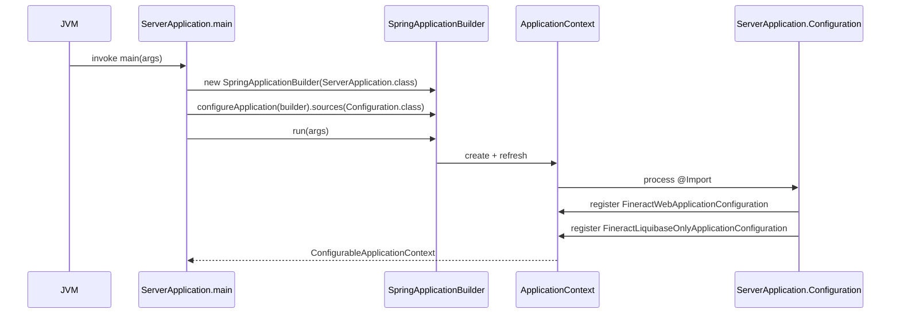

Apache Fineract is delivered as a single Spring Boot application whose entrypoint is the class `org.apache.fineract.ServerApplication`. This page walks through the source of that class (`fineract-provider/src/main/java/org/apache/fineract/ServerApplication.java`), the two configuration classes it `@Import`s (`FineractWebApplicationConfiguration` and `FineractLiquibaseOnlyApplicationConfiguration` from `fineract-provider/src/main/java/org/apache/fineract/infrastructure/core/boot/`), the Spring profiles it understands (`FineractProfiles` from `fineract-core`), and the supported ways to launch the server (Gradle `bootRun`, executable JAR, deployed WAR).

## Class layout

The file `fineract-provider/src/main/java/org/apache/fineract/ServerApplication.java` defines a single public class `ServerApplication` that extends `org.springframework.boot.web.servlet.support.SpringBootServletInitializer`. Extending `SpringBootServletInitializer` is what allows the same artifact to be deployed as a traditional WAR inside an external servlet container; the class overrides `configure(SpringApplicationBuilder)` so the container can locate the application's source class. Aside from `main()`, the class contains exactly one private nested type — an empty `Configuration` class annotated with `@Import({ FineractWebApplicationConfiguration.class, FineractLiquibaseOnlyApplicationConfiguration.class })` — which is the only source registered with the `SpringApplicationBuilder`.

<Note>
The Javadoc on `ServerApplication` (see `fineract-provider/src/main/java/org/apache/fineract/ServerApplication.java`) explains the philosophy: *"You can easily launch this via Debug as Java Application in your IDE - without needing command line Gradle stuff, no need to build and deploy a WAR, remote attachment etc."* The class is deliberately minimal so that the same `main()` and the same servlet bootstrap path share their `Configuration` source.
</Note>

## Source: `ServerApplication`

The whole file fits on one screen. The relevant portion is reproduced below verbatim from `fineract-provider/src/main/java/org/apache/fineract/ServerApplication.java`:

```java
public class ServerApplication extends SpringBootServletInitializer {

    @Import({ FineractWebApplicationConfiguration.class, FineractLiquibaseOnlyApplicationConfiguration.class })
    private static final class Configuration {}

    @Override
    protected SpringApplicationBuilder configure(SpringApplicationBuilder builder) {
        return configureApplication(builder);
    }

    private static SpringApplicationBuilder configureApplication(SpringApplicationBuilder builder) {
        return builder.sources(Configuration.class);
    }

    public static void main(String[] args) throws IOException {
        configureApplication(new SpringApplicationBuilder(ServerApplication.class)).run(args);
    }
}
```

Three methods, one nested class, and a small dance with `SpringApplicationBuilder` — that's the entire bootstrap surface. The shared helper `configureApplication(SpringApplicationBuilder)` is the single point where Spring is told which `@Configuration`-annotated source to register, and it is called both from `main()` and from the overridden `configure()` used during WAR deployment.

### `main(String[] args)`

The `public static void main(String[] args)` method on `ServerApplication` creates a `SpringApplicationBuilder` rooted at `ServerApplication.class` and runs it with the command-line arguments. Because `ServerApplication` itself is **not** annotated with `@SpringBootApplication` — that responsibility lives on the imported `FineractWebApplicationConfiguration` — the builder picks up its real configuration from the nested `Configuration` class set as a `source`. The `throws IOException` clause is propagated from the underlying Spring Boot launcher contract.

### `configure(SpringApplicationBuilder builder)`

The protected override `configure(SpringApplicationBuilder builder)` (declared in `SpringBootServletInitializer`) is called when the application is hosted by an external servlet container. Fineract delegates directly to `configureApplication(builder)` so the WAR and the embedded-Tomcat paths share identical wiring; you can't accidentally end up with a different `Configuration` in production by switching packaging formats.

### `configureApplication(SpringApplicationBuilder builder)`

This `private static` helper calls `builder.sources(Configuration.class)` and returns the builder. The nested `Configuration` class is empty apart from the `@Import` annotation; that single annotation effectively grafts the entire Fineract bean graph onto the Spring Boot application context.

## What gets imported

The `@Import` annotation on `ServerApplication.Configuration` references two classes from `fineract-provider/src/main/java/org/apache/fineract/infrastructure/core/boot/`:

<CardGroup cols={2}>
<Card title="FineractWebApplicationConfiguration" icon="globe">
The "normal" runtime configuration. Active when the `liquibase-only` profile is **not** present.
</Card>
<Card title="FineractLiquibaseOnlyApplicationConfiguration" icon="database">
A schema-migration-only runtime used by CI and ops. Active when the `liquibase-only` profile **is** present.
</Card>
</CardGroup>

Both classes implement `org.springframework.beans.factory.InitializingBean` and log a one-line warning so that operators can immediately see which mode they have started.

### `FineractWebApplicationConfiguration`

Defined in `fineract-provider/src/main/java/org/apache/fineract/infrastructure/core/boot/FineractWebApplicationConfiguration.java`, this abstract class carries the annotations that bring up the full HTTP stack:

```java
@Configuration
@EnableAutoConfiguration(exclude = { DataSourceAutoConfiguration.class, HibernateJpaAutoConfiguration.class,
        DataSourceTransactionManagerAutoConfiguration.class, GsonAutoConfiguration.class, JdbcTemplateAutoConfiguration.class,
        LiquibaseAutoConfiguration.class })
@EnableTransactionManagement
@EnableWebSecurity
@EnableConfigurationProperties({ FineractProperties.class, LiquibaseProperties.class })
@ComponentScan(basePackages = "org.apache.fineract.**")
@IntegrationComponentScan(basePackages = "org.apache.fineract.**")
@Conditional(FineractWebApplicationCondition.class)
@Slf4j
public abstract class FineractWebApplicationConfiguration implements InitializingBean { ... }
```

Several details deserve attention. The Spring Boot auto-configurations for the JDBC stack are explicitly excluded because Fineract supplies its own — `RoutingDataSource`, `JPAConfig`, `JpaTransactionConfig`, `JdbcConfig`, and `JdbcTransactionConfig` are all hand-rolled (see the `runtime/spring-boot-configuration` page). `GsonAutoConfiguration` is excluded for the same reason — the platform's API layer uses its own Gson setup under `fineract-core/src/main/java/org/apache/fineract/infrastructure/core/serialization/`. The `@Conditional(FineractWebApplicationCondition.class)` makes the bean conditional on the absence of the `liquibase-only` profile, and the class is declared `abstract` with a code comment that reads *"The class needs to be abstract for some reason, otherwise the tests start to fail..."* — proof that the codebase prefers honesty to pretending.

### `FineractLiquibaseOnlyApplicationConfiguration`

Defined in `fineract-provider/src/main/java/org/apache/fineract/infrastructure/core/boot/FineractLiquibaseOnlyApplicationConfiguration.java`, this configuration drops nearly everything except database migrations:

```java
@Conditional(FineractLiquibaseOnlyApplicationCondition.class)
@Slf4j
@EnableConfigurationProperties({ FineractProperties.class, LiquibaseProperties.class })
@Import({ HikariCpConfig.class, JdbcConfig.class })
@ComponentScan(basePackages = { "org.apache.fineract.infrastructure.core.service.migration",
        "org.apache.fineract.infrastructure.core.service.database", "org.apache.fineract.infrastructure.core.service.tenant" })
public class FineractLiquibaseOnlyApplicationConfiguration implements InitializingBean {

    @Override
    public void afterPropertiesSet() throws Exception {
        log.warn("Fineract is running in Liquibase only mode");
    }
}
```

It scans only three packages (`migration`, `database`, `tenant`) and imports just the `HikariCpConfig` and `JdbcConfig` from `fineract-provider/src/main/java/org/apache/fineract/infrastructure/core/config/`. No web layer, no security filters, no Jersey resources — useful for running schema upgrades against an upgraded JAR without booting the API.

## Profiles

The `liquibase-only` selector and a few related strings are centralised in `fineract-core/src/main/java/org/apache/fineract/infrastructure/core/boot/FineractProfiles.java`:

```java
public final class FineractProfiles {

    public static final String LIQUIBASE_ONLY = "liquibase-only";
    public static final String DIAGNOSTICS = "diagnostics";

    public static final String TEST = "test";

    private FineractProfiles() {}
}
```

The two condition classes that consume these constants are in `fineract-core/src/main/java/org/apache/fineract/infrastructure/core/condition/`:

| Condition class                                   | Matches when                                                  |
| ------------------------------------------------- | ------------------------------------------------------------- |
| `FineractWebApplicationCondition`                 | `liquibase-only` is **not** in `activeProfiles`               |
| `FineractLiquibaseOnlyApplicationCondition`       | `liquibase-only` **is** in `activeProfiles`                   |
| `ProfileCondition` (abstract base)                | Subclasses inspect `context.getEnvironment().getActiveProfiles()` |

Both subclasses extend `ProfileCondition` and override the single `boolean matches(List<String> activeProfiles)` method — see the [Profiles & Instance Modes](/runtime/profiles-and-instance-modes) page for the full taxonomy.

## Startup sequence



When deployed as a WAR, the same arrows fire but `JVM` is replaced by the external servlet container and `main(...)` is replaced by `configure(SpringApplicationBuilder)`. Both paths converge on `builder.sources(Configuration.class)`.

## Supported entrypoints

<Tabs>
<Tab title="Gradle (development)">
The Gradle subproject for the server is `fineract-provider`. Its build file enables Spring Boot's `bootRun` task, which is the recommended way to launch in development because it picks up `application.properties` and environment variables transparently:

```bash
./gradlew :fineract-provider:bootRun
```

`bootRun` constructs the classpath, invokes `org.apache.fineract.ServerApplication#main`, and passes through arguments. Because `ServerApplication.main(...)` calls `new SpringApplicationBuilder(ServerApplication.class).run(args)`, anything you pass on the command line ends up in Spring Boot's `Environment` exactly as you'd expect.
</Tab>
<Tab title="Executable JAR">
Spring Boot's `bootJar` task produces a fat JAR with `ServerApplication` as its `Start-Class`:

```bash
./gradlew :fineract-provider:bootJar
java -jar fineract-provider/build/libs/fineract-provider-*.jar
```

This path also enters at `ServerApplication.main`. The embedded Tomcat takes over once `SpringApplicationBuilder.run` returns.
</Tab>
<Tab title="WAR deployment">
The `bootWar` task produces a deployable WAR. An external servlet container (Tomcat, WildFly, etc.) discovers `ServerApplication` because it extends `SpringBootServletInitializer`. The container calls `ServerApplication#configure(SpringApplicationBuilder)`, which is the override seen in the source above — it delegates straight to `configureApplication`.

```bash
./gradlew :fineract-provider:bootWar
# Deploy the resulting fineract-provider-*.war to your servlet container
```
</Tab>
<Tab title="Liquibase-only run">
To run only schema migrations without exposing HTTP, activate the `liquibase-only` profile. Any standard Spring Boot mechanism works — environment variable, system property, or `application.properties` override:

```bash
SPRING_PROFILES_ACTIVE=liquibase-only \
  java -jar fineract-provider/build/libs/fineract-provider-*.jar
```

`FineractLiquibaseOnlyApplicationCondition.matches(...)` returns `true`, `FineractLiquibaseOnlyApplicationConfiguration#afterPropertiesSet` logs `"Fineract is running in Liquibase only mode"`, and the web stack is skipped because `FineractWebApplicationCondition` evaluates to `false`.
</Tab>
</Tabs>

## Relevant properties from `application.properties`

The defaults that influence boot behavior live in `fineract-provider/src/main/resources/application.properties`. The most important ones for an operator are summarised below; each value follows the `${ENV_VAR:default}` placeholder syntax that Spring Boot expands at bind time.

| Property                                  | Environment variable                            | Default      | Effect                                                                                                                                |
| ----------------------------------------- | ----------------------------------------------- | ------------ | ------------------------------------------------------------------------------------------------------------------------------------- |
| `fineract.node-id`                        | `FINERACT_NODE_ID`                              | `1`          | Identifies this node in horizontal scale-outs; consumed by the job framework.                                                          |
| `fineract.security.basicauth.enabled`     | `FINERACT_SECURITY_BASICAUTH_ENABLED`           | `true`       | Activates `SecurityConfig.filterChain(...)` (`fineract-provider/.../config/SecurityConfig.java`). Required if OAuth2 is disabled.       |
| `fineract.security.oauth2.enabled`        | `FINERACT_SECURITY_OAUTH_ENABLED`               | `false`      | Switches the security stack to OAuth2. `SecurityValidationConfig` rejects start-up when both basic and OAuth2 are enabled.              |
| `fineract.mode.read-enabled`              | `FINERACT_MODE_READ_ENABLED`                    | `true`       | Controls read API admission (see `FineractInstanceModeApiFilter`).                                                                     |
| `fineract.mode.write-enabled`             | `FINERACT_MODE_WRITE_ENABLED`                   | `true`       | Controls write API admission.                                                                                                          |
| `fineract.mode.batch-worker-enabled`      | `FINERACT_MODE_BATCH_WORKER_ENABLED`            | `true`       | Allows this node to act as a batch worker.                                                                                             |
| `fineract.mode.batch-manager-enabled`     | `FINERACT_MODE_BATCH_MANAGER_ENABLED`           | `true`       | Allows this node to host job scheduling endpoints.                                                                                     |
| `fineract.tenant.identifier`              | `FINERACT_DEFAULT_TENANTDB_IDENTIFIER`          | `default`    | Default tenant identifier used by integration tests and seed scripts.                                                                  |
| `fineract.idempotency-key-header-name`    | `FINERACT_IDEMPOTENCY_KEY_HEADER_NAME`          | `Idempotency-Key` | Header consulted by `IdempotencyStoreFilter`.                                                                                          |
| `fineract.insecure-http-client`           | `FINERACT_INSECURE_HTTP_CLIENT`                 | `true`       | Drives `OkHttp3Config.okHttpClient()` to install a permissive trust manager.                                                            |
| `spring.servlet.multipart.max-file-size`  | `FINERACT_MULTIPART_FILE_SIZE`                  | `5MB`        | File-upload size cap; consumed by Spring's multipart resolver.                                                                         |

<Tip>
`application.properties` defines hundreds of properties, but every entry follows the `${ENV_VAR:default}` pattern, so an operator can override any single value without rebuilding. The full reference for the typed view of these keys is `fineract-core/src/main/java/org/apache/fineract/infrastructure/core/config/FineractProperties.java` — see the [Spring Boot Configuration](/runtime/spring-boot-configuration) page.
</Tip>

## Useful JVM flags

These flags are not Fineract-specific, but they are the ones operators end up reaching for first when tuning a real deployment. They interact with the bean graph wired up under `ServerApplication`:

| Flag                                  | Why it matters for Fineract                                                                                              |
| ------------------------------------- | ------------------------------------------------------------------------------------------------------------------------ |
| `-Dspring.profiles.active=...`        | Activates `FineractProfiles.LIQUIBASE_ONLY` (`liquibase-only`), `FineractProfiles.DIAGNOSTICS` (`diagnostics`), or `FineractProfiles.TEST` (`test`). |
| `-Dserver.port=...`                   | Overrides the embedded Tomcat port; honored by Spring Boot before `SecurityConfig` builds its filter chain.               |
| `-Dspring.config.additional-location=...` | Layers an extra `application.properties`/YAML on top of the packaged defaults from `fineract-provider/src/main/resources/`. |
| `-XX:MaxRAMPercentage=...`            | Controls heap sizing inside containers; the JPA caches in `JPAConfig` (`config/jpa/JPAConfig.java`) can be heap-hungry.   |
| `-Dlogging.level.org.apache.fineract=DEBUG` | Useful for diagnosing the boot sequence printed by `FineractWebApplicationConfiguration#afterPropertiesSet`.            |

## Why two configuration imports?

You might wonder why `ServerApplication.Configuration` imports **both** `FineractWebApplicationConfiguration` and `FineractLiquibaseOnlyApplicationConfiguration` when only one of them can be active at a time. The answer is that the choice is made at runtime by the Spring `Condition` machinery — not at compile or assembly time. Importing both means that the JVM only needs one entrypoint class. The conditions `FineractWebApplicationCondition` and `FineractLiquibaseOnlyApplicationCondition` (in `fineract-core/src/main/java/org/apache/fineract/infrastructure/core/condition/`) consult the active Spring profiles, and exactly one will accept its associated `@Configuration`. The other will be silently dropped. This keeps the WAR/jar binary identical between an "API server" deployment and a "schema migrator" deployment — the only difference is `SPRING_PROFILES_ACTIVE`.

## Where to go next

<CardGroup cols={2}>
<Card title="Spring Boot Configuration" href="/runtime/spring-boot-configuration" icon="gear">
The `@Configuration` classes that `FineractWebApplicationConfiguration` brings into scope: Hikari, JDBC, JPA, security, OkHttp, S3, metrics, and more.
</Card>
<Card title="Profiles & Instance Modes" href="/runtime/profiles-and-instance-modes" icon="layer-group">
The full set of profile constants in `FineractProfiles`, the `Conditional` hierarchy in `fineract-core/.../condition/`, and the runtime mode toggles wired to `FineractInstanceModeApiFilter`.
</Card>
<Card title="Multi-Tenancy" href="/runtime/multi-tenancy" icon="building">
How `TenantAwareBasicAuthenticationFilter` and `ThreadLocalContextUtil` turn a `Fineract-Platform-TenantId` header into a per-tenant data source.
</Card>
<Card title="Transaction Management" href="/runtime/transaction-management" icon="rotate">
`ExtendedDataSourceTransactionManager`, `ExtendedJpaTransactionManager`, the `FlushModeHandler`/`FlushModeAspect` duo, and how `JdbcTransactionConfig` wires lifecycle callbacks.
</Card>
</CardGroup>
