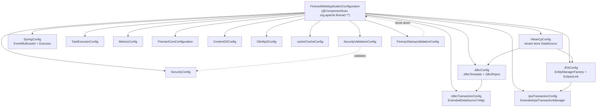

When Apache Fineract starts, the import chain anchored on `org.apache.fineract.ServerApplication` (see [Server Application](/runtime/server-application)) brings in the configuration classes that live under `fineract-provider/src/main/java/org/apache/fineract/infrastructure/core/config/`. This page documents each of those classes in source order, explains its bean graph, its conditional activation rules, and the slice of `FineractProperties` it binds. The companion type system — `FineractProperties` itself — is defined in `fineract-core/src/main/java/org/apache/fineract/infrastructure/core/config/FineractProperties.java` and is summarised at the end of the page.

## Where the configuration lives

The `config` directory contains the following Java files (per `ls fineract-provider/src/main/java/org/apache/fineract/infrastructure/core/config/`):

```
CompatibilityConfig.java
ContentS3Config.java
FineractCorsConfiguration.java
FineractStartupValidationConfig.java
HikariCpConfig.java
JdbcConfig.java
JdbcTransactionConfig.java
MetricsConfig.java
OkHttp3Config.java
SecurityConfig.java
SecurityValidationConfig.java
SpringConfig.java
TaskExecutorConfig.java
TaskExecutorConstant.java
cache/
jpa/
```

The `cache/` and `jpa/` sub-packages add a few more `@Configuration` beans (`CacheConfig`, `JPAConfig`, `JpaTransactionConfig`) that follow the same pattern.

<Info>
Fineract excludes Spring Boot's default JDBC/JPA/Gson auto-configurations in `FineractWebApplicationConfiguration` (see `fineract-provider/src/main/java/org/apache/fineract/infrastructure/core/boot/FineractWebApplicationConfiguration.java`). The classes documented here replace those exclusions with hand-rolled equivalents.
</Info>

## `CompatibilityConfig`

File: `fineract-provider/src/main/java/org/apache/fineract/infrastructure/core/config/CompatibilityConfig.java`. Annotated with `@Configuration`, `@ConditionalOnExpression("#{ systemEnvironment['fineract_tenants_driver'] != null }")`, and `@Deprecated`. The presence of the legacy `fineract_tenants_driver` environment variable activates the class; its only job is a `@PostConstruct` `init()` method that logs a multi-line warning listing the new `FINERACT_HIKARI_*` environment variables operators should switch to.

Defined beans: none in steady state — the class exists purely to print a deprecation notice. The class autowires `ApplicationContext` so it can read environment values via `context.getEnvironment().getProperty(...)`.

## `ContentS3Config`

File: `fineract-provider/src/main/java/org/apache/fineract/infrastructure/core/config/ContentS3Config.java`. Marked `@Slf4j @Configuration`.

| Bean                    | Conditional               | Purpose                                                                                                       |
| ----------------------- | ------------------------- | ------------------------------------------------------------------------------------------------------------- |
| `S3Client contentS3Client(FineractProperties)` | `@ConditionalOnProperty("fineract.content.s3.enabled")` | Builds an AWS SDK v2 `S3Client` for document storage when `fineract.content.s3.enabled=true`.                  |

The credential strategy is implemented by the private helper `getCredentialProvider(FineractContentS3Properties)`: if the access/secret key pair is empty, the bean falls back to `DefaultCredentialsProvider.builder().build()`; otherwise it uses `StaticCredentialsProvider.create(AwsBasicCredentials.create(...))`. The optional `region` and `endpoint` settings on `FineractProperties.FineractContentS3Properties` are applied to the `S3ClientBuilder`. `RequestChecksumCalculation.WHEN_REQUIRED` is set on the builder.

## `FineractCorsConfiguration`

File: `fineract-provider/src/main/java/org/apache/fineract/infrastructure/core/config/FineractCorsConfiguration.java`. A `@Configuration` that exposes a single `@Bean @ConditionalOnMissingBean(CorsConfigurationSource.class) CorsConfigurationSource corsConfigurationSource()`. It pulls `FineractProperties.CorsProperties` from `fineractProperties.getSecurity().getCors()` and applies allowed origin patterns, methods, headers, exposed headers, and the `allowCredentials` flag to a `CorsConfiguration` registered under `/**` on a `UrlBasedCorsConfigurationSource`. Properties bound: `fineract.security.cors.*` (see `application.properties` lines starting `fineract.security.cors.allowed-origin-patterns=...`).

## `FineractStartupValidationConfig`

File: `fineract-provider/src/main/java/org/apache/fineract/infrastructure/core/config/FineractStartupValidationConfig.java`. Marked `@Slf4j @Component @Order(Ordered.HIGHEST_PRECEDENCE) @RequiredArgsConstructor @Conditional(FineractValidationCondition.class)`.

The class implements `InitializingBean`. Its single behavior is in `afterPropertiesSet()` → `terminateApplication()`, which logs `"The application startup fails on validations. Please check the log above for the details"` and casts the injected `ApplicationContext` to `ConfigurableApplicationContext` to call `close()`. The `FineractValidationCondition` (in `fineract-core/.../condition/`) decides whether any other validation conditions (e.g. `FineractModeValidationCondition`) flagged a fatal configuration problem.

<Warning>
This is a deliberate suicide bean — when one of the validation conditions matches, it joins the context, fails fast, and shuts the application down before HTTP listeners are exposed.
</Warning>

## `HikariCpConfig`

File: `fineract-provider/src/main/java/org/apache/fineract/infrastructure/core/config/HikariCpConfig.java`. Annotated `@Configuration @ConditionalOnExpression("#{ systemEnvironment['fineract_tenants_driver'] == null }")` — the opposite of `CompatibilityConfig`'s condition, so exactly one of the two ever activates.

```java
@Bean(destroyMethod = "close")
@ConfigurationProperties(prefix = "spring.datasource.hikari")
public HikariDataSource hikariTenantDataSource() {
    return new HikariDataSource();
}
```

This bean is the **tenant store** data source — the master database that holds the `tenants`/`tenant_server_connections` tables used to look up per-tenant connections. It binds all `spring.datasource.hikari.*` properties from `application.properties` and any environment overrides. The bean is destroyed via `HikariDataSource.close()`.

## `JdbcConfig`

File: `fineract-provider/src/main/java/org/apache/fineract/infrastructure/core/config/JdbcConfig.java`. Annotated `@Profile("!liquibase-only") @Configuration` and `@EnableJdbcRepositories(basePackages = { "org.apache.fineract.command.jdbc.store.domain", "org.apache.fineract.infrastructure.documentmanagement.domain", "org.apache.fineract.mix.domain" }, jdbcOperationsRef = "namedParameterJdbcTemplate", transactionManagerRef = "jdbcTransactionManager")`.

| Bean                                    | Type                          | Source                                  |
| --------------------------------------- | ----------------------------- | --------------------------------------- |
| `jdbcTemplate(RoutingDataSource)`       | `JdbcTemplate`                | `new JdbcTemplate(dataSource)`          |
| `namedParameterJdbcTemplate(RoutingDataSource)` | `NamedParameterJdbcTemplate` | `new NamedParameterJdbcTemplate(dataSource)` |

Both templates take the `RoutingDataSource` bean (from `fineract-core/src/main/java/org/apache/fineract/infrastructure/core/service/database/RoutingDataSource.java`) which dynamically delegates to the per-tenant `HikariDataSource` chosen by `ThreadLocalContextUtil` — see the [Multi-Tenancy](/runtime/multi-tenancy) page for the routing logic.

## `JdbcTransactionConfig`

File: `fineract-provider/src/main/java/org/apache/fineract/infrastructure/core/config/JdbcTransactionConfig.java`. Annotated `@Configuration(proxyBeanMethods = false)`.

| Bean                            | Returns                       | Notes                                                                                                                  |
| ------------------------------- | ----------------------------- | ---------------------------------------------------------------------------------------------------------------------- |
| `jdbcTransactionManager(...)`   | `PlatformTransactionManager`  | Wraps `RoutingDataSource` in an `ExtendedDataSourceTransactionManager(readOnly)`, registers all `TransactionLifecycleCallback` beans. |
| `batchJdbcTransactionManager(...)` | `PlatformTransactionManager` | Identical to the above but bound to a distinct bean name so batch jobs can use a parallel manager.                       |
| `batchJdbcTransactionTemplate(...)` | `TransactionTemplate`        | A `TransactionTemplate` wrapping the batch transaction manager via a `@Qualifier("batchJdbcTransactionManager")`.        |

The `readOnly` flag is read from `fineractProperties.getMode().isReadOnlyMode()` (computed by `FineractProperties.FineractModeProperties#isReadOnlyMode`) and forwarded into the `ExtendedDataSourceTransactionManager` constructor. The `ObjectProvider<TransactionManagerCustomizers>` is invoked via `customizers.customize(transactionManager)` to apply any auto-configured customizers, and `setValidateExistingTransaction(true)` is enabled on both managers. See [Transaction Management](/runtime/transaction-management) for the full lifecycle.

## `MetricsConfig`

File: `fineract-provider/src/main/java/org/apache/fineract/infrastructure/core/config/MetricsConfig.java`. Annotated `@Configuration @EnableAspectJAutoProxy`.

```java
@Bean
public TimedAspect timedAspect(MeterRegistry registry) {
    return new TimedAspect(registry);
}
```

That single bean is what enables Micrometer's `@Timed` annotation on platform services — the rest of the metrics stack is provided by Spring Boot Actuator's auto-configuration (Actuator is not excluded by `FineractWebApplicationConfiguration`).

## `OkHttp3Config`

File: `fineract-provider/src/main/java/org/apache/fineract/infrastructure/core/config/OkHttp3Config.java`. Annotated `@Slf4j @RequiredArgsConstructor @Configuration`. The constructor takes `FineractProperties`. The bean `OkHttpClient okHttpClient()` constructs a builder with `connectTimeout`, `readTimeout` and `writeTimeout` taken from `fineractProperties.getClientConnectTimeout()`, `getClientReadTimeout()`, and `getClientWriteTimeout()` (all in seconds).

When `fineractProperties.getInsecureHttpClient()` is `Boolean.TRUE` (default `true` per `fineract.insecure-http-client=${FINERACT_INSECURE_HTTP_CLIENT:true}` in `application.properties`), the builder is hardened-off: an insecure `X509TrustManager` accepts everything, the `SSLContext("TLS")` is initialised with that trust manager, and the hostname verifier is replaced with one that always returns `true`. The class includes `// NOSONAR` markers to silence security scanners — Fineract intentionally exposes this knob for inter-service traffic in test environments.

## `SecurityConfig`

File: `fineract-provider/src/main/java/org/apache/fineract/infrastructure/core/config/SecurityConfig.java`. Annotated `@Configuration @ConditionalOnProperty("fineract.security.basicauth.enabled") @EnableMethodSecurity`.

This is the largest file in the directory. It autowires (selected entries):

- `TenantAwareJpaPlatformUserDetailsService userDetailsService`
- `FineractProperties fineractProperties`
- `ServerProperties serverProperties`
- `ToApiJsonSerializer<PlatformRequestLog> toApiJsonSerializer`
- `ConfigurationDomainService configurationDomainService`
- `CacheWritePlatformService cacheWritePlatformService`
- `UserNotificationService userNotificationService`
- `AuthTenantDetailsService basicAuthTenantDetailsService`
- `BusinessDateReadPlatformService businessDateReadPlatformService`
- `MDCWrapper mdcWrapper`
- `FineractRequestContextHolder fineractRequestContextHolder`
- `LoanCOBFilterHelper loanCOBFilterHelper` (optional)
- `IdempotencyStoreHelper idempotencyStoreHelper`
- `ProgressiveLoanModelCheckerFilter progressiveLoanModelCheckerFilter`
- `PlatformUserDetailsChecker platformUserDetailsChecker`

The `@Bean SecurityFilterChain filterChain(HttpSecurity http)` method declares the API security pipeline. It uses `PathPatternRequestMatcher.withDefaults()` and `securityMatcher(API_MATCHER.matcher("/api/**"))` to scope the chain to the public API, then adds an `AuthorizationManager` list starting with `fullyAuthenticated()` and, when `fineract.security.2fa.enabled` is true, adds `hasAuthority("TWOFACTOR_AUTHENTICATED")`. The chain permits `OPTIONS /api/**`, `POST /api/*/authentication`, `POST /api/*/password/forgot`, and `PUT /api/*/instance-mode` without authentication, then declares per-endpoint authority checks for hundreds of routes — see the source for the full list of `requestMatchers(...).hasAnyAuthority(...)` rules.

Properties bound: anything under `fineract.security.*` plus the `server.servlet.context-path` consumed via `ServerProperties`.

## `SecurityValidationConfig`

File: `fineract-provider/src/main/java/org/apache/fineract/infrastructure/core/config/SecurityValidationConfig.java`. A plain `@Configuration` whose `@PostConstruct validate()` method asserts the mutual-exclusivity of the two authentication schemes:

```java
@Value("${fineract.security.basicauth.enabled}") private Boolean basicAuthEnabled;
@Value("${fineract.security.oauth2.enabled}")   private Boolean oauthEnabled;

@PostConstruct
public void validate() {
    if (!Boolean.TRUE.equals(basicAuthEnabled) && !Boolean.TRUE.equals(oauthEnabled)) {
        throw new IllegalArgumentException("No authentication scheme selected. ...");
    }
    if (basicAuthEnabled && oauthEnabled) {
        throw new IllegalArgumentException("Too many authentication schemes selected. ...");
    }
}
```

Either both flags are false (no auth) or both are true (ambiguous) → `IllegalArgumentException` aborts the bean lifecycle. Defaults from `application.properties` keep the platform on basic auth out of the box.

## `SpringConfig`

File: `fineract-provider/src/main/java/org/apache/fineract/infrastructure/core/config/SpringConfig.java`. Annotated `@Configuration`. It defines:

| Bean                                | Purpose                                                                                                                                            |
| ----------------------------------- | -------------------------------------------------------------------------------------------------------------------------------------------------- |
| `fineractEventExecutor`             | `ThreadPoolTaskExecutor` whose core/max sizes default to `cpus*2` / `cpus*5` when `spring.task.execution.pool.*` properties are negative.           |
| `applicationEventMulticaster(...)`  | `SimpleApplicationEventMulticaster` wrapping the executor in `DelegatingSecurityContextAsyncTaskExecutor` so async events keep Spring Security context. |
| `overrideSecurityContextHolderStrategy()` | A `MethodInvokingFactoryBean` that calls a `static` setter on `SecurityContextHolder` to install Fineract's chosen `SecurityContextHolderStrategy`. |

The executor is wired with `setRejectedExecutionHandler(new ThreadPoolExecutor.CallerRunsPolicy())`, `setWaitForTasksToCompleteOnShutdown(true)`, and `setAwaitTerminationSeconds(60)`. The `applicationEventMulticaster` bean declares `@DependsOn("overrideSecurityContextHolderStrategy")` to ensure the holder override has already happened before async events start propagating.

## `TaskExecutorConfig`

File: `fineract-provider/src/main/java/org/apache/fineract/infrastructure/core/config/TaskExecutorConfig.java`. Defines two beans — a singleton `fineractDefaultThreadPoolTaskExecutor` and a prototype-scoped `fineractConfigurableThreadPoolTaskExecutor` — both backed by `fineractProperties.getTaskExecutor().getDefaultTaskExecutorCorePoolSize()` / `getDefaultTaskExecutorMaxPoolSize()`. Bean names are pulled from `TaskExecutorConstant`.

## `cache/CacheConfig`

File: `fineract-provider/src/main/java/org/apache/fineract/infrastructure/core/config/cache/CacheConfig.java`. A `@Configuration` that integrates JSR-107 (`javax.cache`) with Ehcache 3 via `org.ehcache.jsr107.Eh107Configuration`, exposes a Spring `JCacheCacheManager`, and falls back to `NoOpCacheManager` when caching is disabled. It uses Reflections to discover `@Cacheable`-annotated methods so cache regions are auto-registered.

Companions in the same package: `SpecifiedCacheSupportingCacheManager` and `TransactionBoundCacheManager` — the latter coordinates cache writes with transaction commits/rollbacks so consumers see consistent reads.

## `jpa/JPAConfig`

File: `fineract-provider/src/main/java/org/apache/fineract/infrastructure/core/config/jpa/JPAConfig.java`. Extends `org.springframework.boot.autoconfigure.orm.jpa.JpaBaseConfiguration` so it re-uses Spring Boot's plumbing but selects its own `JpaVendorAdapter`. Annotated `@Configuration @EnableJpaAuditing @EnableJpaRepositories(basePackages = { "org.apache.fineract.**.domain", "org.apache.fineract.**.repository" }, excludeFilters = ...) @EnableConfigurationProperties(JpaProperties.class) @Import(JpaAuditingHandlerRegistrar.class)`.

The constructor takes `RoutingDataSource`, `JpaProperties`, an `ObjectProvider<JtaTransactionManager>`, `DatabaseTypeResolver`, and a `Collection<EntityManagerFactoryCustomizer>`. The vendor adapter is `EclipseLinkJpaVendorAdapter`, and a `DatabaseSelectingPersistenceUnitPostProcessor` is wired in to pick `TargetDatabase.MySQL` or `TargetDatabase.PostgreSQL` at runtime based on the `DatabaseTypeResolver` (see `fineract-core/src/main/java/org/apache/fineract/infrastructure/core/persistence/DatabaseSelectingPersistenceUnitPostProcessor.java`).

## `jpa/JpaTransactionConfig`

File: `fineract-provider/src/main/java/org/apache/fineract/infrastructure/core/config/jpa/JpaTransactionConfig.java`. Annotated `@Configuration(proxyBeanMethods = false)`. Exposes:

| Bean (names)                                            | Type                          | Notes                                                                                              |
| ------------------------------------------------------- | ----------------------------- | -------------------------------------------------------------------------------------------------- |
| `transactionManager`, `jpaTransactionManager`           | `PlatformTransactionManager`  | `ExtendedJpaTransactionManager(readOnly)`, registers all `TransactionLifecycleCallback`s, `@Primary`. |
| `transactionTemplate`, `txTemplate`, `jpaTransactionTemplate` | `TransactionTemplate`         | Wraps the primary transaction manager, `@Primary`.                                                  |

Both beans honour `fineractProperties.getMode().isReadOnlyMode()` so a read-only deployment cannot accidentally commit writes — the flag flows into `ExtendedJpaTransactionManager`, which sets `FlushModeType.COMMIT` and clears the `EntityManager` on commit when read-only is in effect (see `fineract-core/src/main/java/org/apache/fineract/infrastructure/core/persistence/ExtendedJpaTransactionManager.java`).

## `MapstructMapperConfig` (in `fineract-core`)

File: `fineract-core/src/main/java/org/apache/fineract/infrastructure/core/config/MapstructMapperConfig.java`. An empty class annotated with `@MapperConfig(componentModel = MappingConstants.ComponentModel.SPRING, unmappedTargetPolicy = ReportingPolicy.ERROR, builder = @Builder(disableBuilder = true), uses = { ExternalIdMapper.class }, injectionStrategy = InjectionStrategy.CONSTRUCTOR)`. Every MapStruct mapper in Fineract that wants Spring DI plus strict unmapped-target reporting references this class via `@Mapper(config = MapstructMapperConfig.class)`.

## The `FineractProperties` tree

The class `fineract-core/src/main/java/org/apache/fineract/infrastructure/core/config/FineractProperties.java` is annotated with `@Getter @Setter @ConfigurationProperties(prefix = "fineract")` and aggregates all typed configuration. Its top-level fields are all wired to nested classes:

| Top-level field           | Nested type                                        | Property prefix                       |
| ------------------------- | -------------------------------------------------- | ------------------------------------- |
| `nodeId`                  | `String`                                           | `fineract.node-id`                    |
| `idempotencyKeyHeaderName`| `String`                                           | `fineract.idempotency-key-header-name`|
| `insecureHttpClient`      | `Boolean`                                          | `fineract.insecure-http-client`       |
| `clientConnectTimeout` / `clientReadTimeout` / `clientWriteTimeout` | `long`                       | `fineract.client-*-timeout`           |
| `tenant`                  | `FineractTenantProperties`                         | `fineract.tenant.*`                   |
| `mode`                    | `FineractModeProperties`                           | `fineract.mode.*`                     |
| `correlation`             | `FineractCorrelationProperties`                    | `fineract.correlation.*`              |
| `ipTracking`              | `FineractIpTrackingProperties`                     | `fineract.ip-tracking.*`              |
| `partitionedJob`          | `FineractPartitionedJob`                           | `fineract.partitioned-job.*`          |
| `remoteJobMessageHandler` | `FineractRemoteJobMessageHandlerProperties`        | `fineract.remote-job-message-handler.*`|
| `events`                  | `FineractEventsProperties`                         | `fineract.events.*`                   |
| `taskExecutor`            | `FineractTaskExecutor`                             | `fineract.task-executor.*`            |
| `content`                 | `FineractContentProperties`                        | `fineract.content.*`                  |
| `report`                  | `FineractReportProperties`                         | `fineract.report.*`                   |
| `job`                     | `FineractJobProperties`                            | `fineract.job.*`                      |
| `template`                | `FineractTemplateProperties`                       | `fineract.template.*`                 |
| `jpa`                     | `FineractJpaProperties`                            | `fineract.jpa.*`                      |
| `database`                | `FineractDatabaseProperties`                       | `fineract.database.*`                 |
| `query`                   | `FineractQueryProperties`                          | `fineract.query.*`                    |
| `api`                     | `FineractApiProperties`                            | `fineract.api.*`                      |
| `security`                | `FineractSecurityProperties`                       | `fineract.security.*`                 |
| `notification`            | `FineractNotificationProperties`                   | `fineract.notification.*`             |
| `loan`                    | `FineractLoanProperties`                           | `fineract.loan.*`                     |
| `sampling`                | `FineractSamplingProperties`                       | `fineract.sampling.*`                 |
| `module`                  | `FineractModulesProperties`                        | `fineract.module.*`                   |
| `sqlValidation`           | `FineractSqlValidationProperties`                  | `fineract.sql-validation.*`           |
| `cache`                   | `FineractCache`                                    | `fineract.cache.*`                    |
| `retry`                   | `RetryProperties`                                  | `fineract.retry.*`                    |
| `defaults`                | `FineractDefaultValues`                            | `fineract.defaults.*`                 |

Notable nested types:

<Accordion title="FineractTenantProperties">
Fields include `host`, `port`, `username`, `password`, `parameters`, `timezone`, `identifier`, `name`, `description`, `masterPassword`, `encryption`, and an entire mirror set of `readOnly*` fields (`readOnlyHost`, `readOnlyPort`, ...) plus a nested `FineractConfigProperties config` for pool sizing overrides. These correspond to `fineract.tenant.*` and `fineract.tenant.config.*` in `application.properties`.
</Accordion>

<Accordion title="FineractModeProperties">
Four booleans — `readEnabled`, `writeEnabled`, `batchWorkerEnabled`, `batchManagerEnabled` — and a derived method `isReadOnlyMode()` that returns `readEnabled && !writeEnabled && !batchWorkerEnabled && !batchManagerEnabled`. This is the value `JdbcTransactionConfig` and `JpaTransactionConfig` consult when constructing transaction managers.
</Accordion>

<Accordion title="FineractContentProperties + nested S3/filesystem types">
Houses `regexWhitelist`, `mimeWhitelist`, `defaultBufferSize`, a `FineractContentFilesystemProperties` (with `enabled`, `rootFolder`), and a `FineractContentS3Properties` (with `enabled`, `bucketName`, `accessKey`, `secretKey`, `region`, `endpoint`, `pathStyleAddressingEnabled`). `ContentS3Config` reads `getContent().getS3()` to build the `S3Client`.
</Accordion>

<Accordion title="FineractSqlValidationProperties">
Holds a list of named regex patterns plus an ordered list of profiles that reference them. Used by the SQL injection scanner. Defaults like `inject-blind`, `inject-timing`, `inject-stacked-query` are declared verbatim in `application.properties` under `fineract.sql-validation.patterns[N].*`.
</Accordion>

<Accordion title="FineractPartitionedJob / PartitionedJobProperty">
Each `PartitionedJobProperty` exposes `jobName`, `chunkSize`, `partitionSize`, `threadPoolCorePoolSize`, `threadPoolMaxPoolSize`, `threadPoolQueueCapacity`, `retryLimit`, and `pollInterval`. The first entry in `application.properties` is the LOAN_COB job. See the Jobs documentation for downstream wiring.
</Accordion>

<Accordion title="FineractRemoteJobMessageHandlerProperties">
Holds `FineractRemoteJobMessageHandlerSpringEventsProperties`, `FineractRemoteJobMessageHandlerJmsProperties`, and `FineractRemoteJobMessageHandlerKafkaProperties`. Each contains nested topic/consumer/producer/admin Kafka properties so the remote job handler can be backed by Spring events, JMS, or Kafka.
</Accordion>

## Bean wiring summary



## Quick reference: which file binds which prefix?

<CodeGroup>
```text fineract.security.*
SecurityConfig.java        -> fineract.security.basicauth.enabled (@ConditionalOnProperty)
SecurityValidationConfig   -> fineract.security.basicauth.enabled / fineract.security.oauth2.enabled
FineractCorsConfiguration  -> fineract.security.cors.* (via fineractProperties.getSecurity().getCors())
```

```text fineract.content.*
ContentS3Config            -> fineract.content.s3.* (@ConditionalOnProperty)
                              + filesystem bean wiring elsewhere
```

```text fineract.tenant.* / spring.datasource.hikari.*
HikariCpConfig             -> spring.datasource.hikari.* (tenant store)
JPAConfig / JdbcConfig     -> consume RoutingDataSource (per-tenant DataSources)
```

```text fineract.mode.*
JdbcTransactionConfig      -> reads fineractProperties.getMode().isReadOnlyMode()
JpaTransactionConfig       -> reads fineractProperties.getMode().isReadOnlyMode()
FineractModeValidationCondition -> validates that at least one mode is enabled
```
</CodeGroup>

## Next

<CardGroup cols={2}>
<Card title="Profiles & Instance Modes" href="/runtime/profiles-and-instance-modes" icon="layer-group">
The conditions and mode toggles that decide which of these beans become active.
</Card>
<Card title="Multi-Tenancy" href="/runtime/multi-tenancy" icon="building">
How `RoutingDataSource` resolves the per-tenant `HikariDataSource` configured via `FineractTenantProperties`.
</Card>
<Card title="Transaction Management" href="/runtime/transaction-management" icon="rotate">
The lifecycle of `ExtendedDataSourceTransactionManager` and `ExtendedJpaTransactionManager`.
</Card>
<Card title="Error Handling" href="/runtime/error-handling" icon="shield">
The exception hierarchy and JAX-RS mappers that surface configuration failures to API consumers.
</Card>
</CardGroup>
