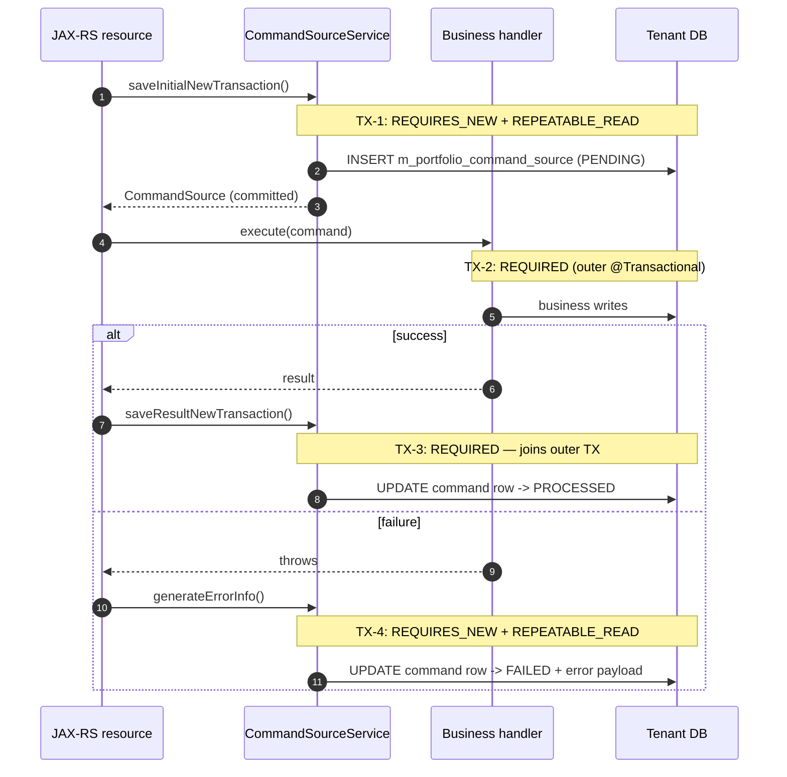

Apache Fineract runs financial workloads where the cost of a botched transaction is measured in money, not log noise. Its transaction story therefore goes beyond Spring's default `JpaTransactionManager`: a thin subclass — `ExtendedJpaTransactionManager` — installs lifecycle callbacks and adjusts JPA flush mode for read‑only paths, while a dedicated AOP aspect — `FlushModeAspect` — lets individual methods opt out of the default `AUTO` flush behaviour. On top of that, the command pipeline encodes a careful propagation contract (`REQUIRES_NEW`, `REPEATABLE_READ`) so idempotency rows and audit entries survive failures of the business logic they record.

<Info>
JPA mappings used by every transaction described below live in `fineract-provider/src/main/resources/META-INF/orm.xml`. EclipseLink is the configured persistence provider.
</Info>

## The pieces

<CardGroup cols={2}>
<Card title="ExtendedJpaTransactionManager" icon="database">
Spring `JpaTransactionManager` subclass that flips the `EntityManager` to `FlushModeType.COMMIT` for read‑only transactions and broadcasts begin/commit/cleanup events to registered `TransactionLifecycleCallback`s.
</Card>
<Card title="FlushModeAspect" icon="rotate">
AspectJ `@Around` advice triggered by the `@WithFlushMode` annotation that changes flush mode for the duration of a single method call inside an active transaction.
</Card>
<Card title="CommandSourceService" icon="scroll">
Owner of the propagation contract for the write pipeline: opens a `REQUIRES_NEW`, `REPEATABLE_READ` transaction to persist the command row before the business logic runs.
</Card>
<Card title="orm.xml + EclipseLink" icon="layer-group">
Centralised JPA configuration: every entity participates in tenant routing via the runtime DataSource selected by [multi‑tenancy](/runtime/multi-tenancy).
</Card>
</CardGroup>

## `ExtendedJpaTransactionManager`

`ExtendedJpaTransactionManager` overrides three hooks of `JpaTransactionManager` and exposes a `readOnly` flag controlled by the bean wiring:

```java
public class ExtendedJpaTransactionManager extends JpaTransactionManager {

    private final List<TransactionLifecycleCallback> lifecycleCallbacks
            = new CopyOnWriteArrayList<>();

    @Getter
    private final boolean readOnly;

    public ExtendedJpaTransactionManager(boolean readOnly) {
        this.readOnly = readOnly;
    }

    @Override
    protected void doBegin(Object transaction, TransactionDefinition definition) {
        super.doBegin(transaction, definition);
        if (definition.isReadOnly() || isReadOnlyTx(transaction) || isReadOnly()) {
            EntityManager em = getCurrentEntityManager();
            if (em != null) em.setFlushMode(FlushModeType.COMMIT);
        }
        invokeLifecycleCallbacks(TransactionLifecycleCallback::afterBegin);
    }

    @Override
    protected void doCommit(DefaultTransactionStatus status) {
        if (isReadOnlyTx(status.getTransaction()) || isReadOnly()) {
            EntityManager em = getCurrentEntityManager();
            if (em != null) em.clear();
        }
        super.doCommit(status);
        invokeLifecycleCallbacks(TransactionLifecycleCallback::afterCommit);
    }

    @Override
    protected void doCleanupAfterCompletion(Object transaction) {
        super.doCleanupAfterCompletion(transaction);
        invokeLifecycleCallbacks(TransactionLifecycleCallback::afterCompletion);
    }
}
```

| Override | Behaviour |
| --- | --- |
| `doBegin` | After Spring opens the JDBC transaction, if it is read‑only the `EntityManager` is moved to `FlushModeType.COMMIT`. This stops EclipseLink from issuing dirty‑check `INSERT`/`UPDATE` statements during simple `SELECT`s and quietly emits an `afterBegin` callback. |
| `doCommit` | For read‑only transactions, `EntityManager.clear()` runs *before* commit to avoid promoting stray loads into the L1 cache that the next request would see. Afterwards an `afterCommit` lifecycle event fires. |
| `doCleanupAfterCompletion` | Always emits `afterCompletion` — the right place to release per‑request resources, regardless of commit or rollback. |

### Flush modes in JPA

| Mode | When changes are flushed | Used by Fineract for |
| --- | --- | --- |
| `AUTO` (default) | Before every query and at commit | Write paths — needed so subsequent queries see in‑flight changes. |
| `COMMIT` | Only at commit | Read‑only paths — avoids spurious SQL emitted before each `SELECT`. |

### Lifecycle callbacks

`TransactionLifecycleCallback` is a SAM (single‑abstract‑method) interface with three default no‑ops:

```java
interface TransactionLifecycleCallback {
    default void afterBegin()       {}
    default void afterCommit()      {}
    default void afterCompletion()  {}
}
```

Callbacks registered with `ExtendedJpaTransactionManager` fire in registration order. Use them for cross‑cutting concerns that need to see *every* transaction (audit hooks, metrics, business‑date snapshotting) without polluting service code.

<Note>
The callback list is `CopyOnWriteArrayList` because registration is rare and iteration is hot — a classic read‑mostly pattern.
</Note>

## `FlushModeAspect`

For finer control, individual methods can demand a specific flush mode via `@WithFlushMode`. The aspect runs at `Ordered.LOWEST_PRECEDENCE − 1`, i.e. *after* `@Transactional`, so it is guaranteed a transaction is already open.

```java
@Aspect @Component @Order @RequiredArgsConstructor
public class FlushModeAspect {

    private final FlushModeHandler flushModeHandler;

    @Around("@within(withFlushMode) || @annotation(withFlushMode)")
    public Object manageFlushMode(ProceedingJoinPoint jp, WithFlushMode withFlushMode) {
        WithFlushMode effective = getEffectiveAnnotation(jp, withFlushMode);
        if (effective == null) return jointPointProceed(jp);

        FlushModeType flushMode = effective.value();
        if (!TransactionSynchronizationManager.isActualTransactionActive()) {
            return jointPointProceed(jp);
        }
        return flushModeHandler.withFlushMode(flushMode, () -> jointPointProceed(jp));
    }
}
```

| Behaviour | Detail |
| --- | --- |
| Method override | Method‑level `@WithFlushMode` wins over class‑level. |
| Transaction guard | If no transaction is active the aspect *logs* and proceeds without changing the flush mode — a misplaced annotation degrades gracefully. |
| Restoration | `FlushModeHandler.withFlushMode` saves the prior mode, swaps in the requested one, runs the body, and restores the original even on exception. |

<Tip>
Use `@WithFlushMode(FlushModeType.COMMIT)` on hot read methods that participate in a writable outer transaction. It avoids the per‑query flush cost without making the whole method `readOnly`.
</Tip>

## The command pipeline: propagation in practice

`CommandSourceService` orchestrates how every write — `createLoan`, `approveSavingsAccount`, etc. — is recorded. It is also the canonical example of Fineract's propagation rules.

### Annotations actually used

```java
// CommandSourceService.java (excerpt)

@Transactional(propagation = Propagation.REQUIRES_NEW,
               isolation   = Isolation.REPEATABLE_READ)
public CommandSource saveInitialNewTransaction(
        CommandWrapper wrapper, JsonCommand jsonCommand,
        AppUser maker, String idempotencyKey) { ... }

@Transactional(propagation = Propagation.REQUIRED)
public CommandSource saveResultNewTransaction(...) { ... }

@Transactional(propagation = Propagation.REQUIRES_NEW,
               isolation   = Isolation.REPEATABLE_READ)
public CommandSource generateErrorInfo(...) { ... }

@Transactional(propagation = Propagation.REQUIRED)
public void saveFailedTransaction(...) { ... }

@Transactional(propagation = Propagation.REQUIRES_NEW)
public CommandSource saveCommandSource(...) { ... }
```

### Why `REQUIRES_NEW` + `REPEATABLE_READ`?

| Goal | Mechanism |
| --- | --- |
| Idempotency row survives a business failure | `REQUIRES_NEW` opens a fresh transaction independent of the outer one. If the outer transaction rolls back, the command row stays — and a retry with the same idempotency key can be answered without re‑executing the side effect. |
| Consistent reads of the idempotency key during the lookup | `REPEATABLE_READ` ensures a SELECT followed by an INSERT against the same key sees a stable snapshot. The class comment notes that MySQL defaults to `REPEATABLE_READ` while PostgreSQL defaults to `READ_COMMITTED`; forcing it makes behaviour portable. |
| Audit logging is allowed to commit independently | The error and success "post‑amble" steps also run in their own transactions so failure tracing never depends on the failing transaction itself. |

### Pipeline diagram



<Note>
The numbering 1‑2‑3‑4 reflects the order of transactions on the wire. TX‑1 always commits before the business logic runs; TX‑4 only runs on failure and uses its own connection so the rollback of the business work cannot also drop the error trail.
</Note>

## Read paths

For pure read APIs the pattern is far simpler:

<CodeGroup>
```java Read service
@Service
@Transactional(readOnly = true)
public class LoanReadPlatformServiceImpl implements LoanReadPlatformService {

    @Override
    public LoanAccountData retrieveOne(Long loanId) { ... }
}
```

```java Hot read with explicit flush
@WithFlushMode(FlushModeType.COMMIT)
@Transactional(propagation = Propagation.SUPPORTS)
public List<LoanTransactionData> retrieveRecent(Long loanId) { ... }
```
</CodeGroup>

| Pattern | When to use |
| --- | --- |
| Class‑level `@Transactional(readOnly = true)` | Plain read services. `ExtendedJpaTransactionManager` switches the flush mode automatically. |
| `@WithFlushMode(COMMIT)` on a method | A read called from inside a writable transaction (e.g. an event listener) where you want to avoid spurious flushes. |
| `SUPPORTS` propagation | A helper that may be called either from a transactional context or standalone. Avoid for writes. |

## Propagation cheat sheet

| Propagation | Behaviour | Used in Fineract |
| --- | --- | --- |
| `REQUIRED` | Join existing or start a new one | Default for business handlers. |
| `REQUIRES_NEW` | Always start a new one, suspending any caller | Idempotency, audit, error logging. |
| `SUPPORTS` | Join if present, otherwise non‑transactional | Read helpers used from mixed callers. |
| `MANDATORY` | Caller must already have a transaction | Internal helpers that should never be entry points. |
| `NEVER` | Throw if a transaction exists | Pure JDBC utilities (rare). |

## Isolation cheat sheet

| Isolation | Effect | Fineract usage |
| --- | --- | --- |
| `READ_COMMITTED` | See only committed data (PostgreSQL default) | Most reads. |
| `REPEATABLE_READ` | Stable view of rows touched in the transaction (MySQL default) | Forced by `saveInitialNewTransaction` and friends for portable idempotency behaviour. |
| `SERIALIZABLE` | Full isolation, highest contention | Avoid unless you can prove the contention cost is acceptable. |

<Warning>
Bumping a method to `SERIALIZABLE` on a busy table will create lock waits that scale with traffic. Prefer optimistic locking via `@Version` (already used on most aggregate roots) plus retry on `OptimisticLockException`.
</Warning>

## JPA mapping

EclipseLink's metadata lives in `fineract-provider/src/main/resources/META-INF/orm.xml`. Keeping mappings external rather than only on entity classes serves two purposes:

1. **Tenant‑neutral entities.** No entity hardcodes a schema or catalogue; routing happens at the DataSource layer (see [multi‑tenancy](/runtime/multi-tenancy)).
2. **Override hook.** Operators can supply a tenant‑specific `orm.xml` overlay when they need a column type tweak without forking entities.

<Accordion title="Why EclipseLink and not Hibernate?">
EclipseLink supports vendor‑specific dialect tweaks Fineract relies on (e.g. concurrent writes against `m_portfolio_command_source`). Switching providers is technically possible but requires re‑validating every `@Convert`, fetch‑graph, and second‑level cache configuration.
</Accordion>

<Accordion title="Why is the @Version column so important?">
Almost every aggregate root carries `@Version`. Combined with retry logic in the command pipeline, optimistic locking gives high throughput without taking long row locks — essential when a single API call may touch dozens of related rows (loan, schedules, transactions, journal entries).
</Accordion>

<Accordion title="Why a separate read replica then?">
`fineract.tenant.read-only-*` connections feed reporting workloads that are too heavy for the OLTP pool. They are read by services that explicitly opt in; ordinary `@Transactional(readOnly = true)` services still hit the OLTP DataSource.
</Accordion>

## Operational tips

<Tip>
Enable `eclipselink.logging.level.sql=FINE` in a non‑production environment when investigating extra flushes. The lines emitted *between* `SELECT` and your code are usually what `@WithFlushMode(COMMIT)` was meant to silence.
</Tip>

<Tip>
Monitor the `m_portfolio_command_source` table. Rows with `processing_result` indefinitely `PENDING` indicate that TX‑1 committed but the business handler crashed before TX‑3 ran. The retry pathway is designed to clean these up — surface them in dashboards.
</Tip>

<Warning>
Never wrap a `@Transactional(REQUIRES_NEW)` call from within the *same* bean — Spring proxies the bean from outside, so a self‑call bypasses the aspect and your "new" transaction is silently the outer one. Inject a separate service or use `AopContext.currentProxy()`.
</Warning>

## Related pages

- DataSource routing per tenant: [`/runtime/multi-tenancy`](/runtime/multi-tenancy)
- Where exceptions thrown inside a transaction end up: [`/runtime/error-handling`](/runtime/error-handling)
- JSON shapes consumed by the command pipeline: [`/runtime/serialization-and-jersey`](/runtime/serialization-and-jersey)
