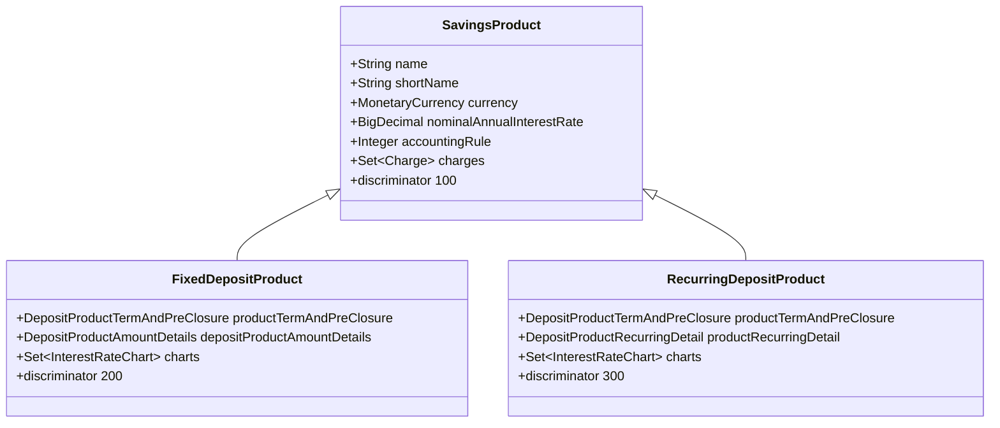
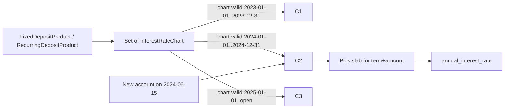

`FixedDepositProduct` and `RecurringDepositProduct` are the two term-deposit product types in Apache Fineract. They share the bulk of their JPA mapping with `SavingsProduct` (single-table inheritance, discriminators `200` and `300` against base `100`), and they share a small set of side rows that define what makes a *deposit* product distinct from an ordinary savings product:

* A chart linkage instead of (or in addition to) a flat nominal rate.
* A term range — the minimum, maximum, and granularity of the deposit period an account may choose.
* A pre-closure penalty configuration.
* For recurring deposits, a recurring detail that says whether installments are mandatory and how late/advance payments are treated.
* For both, optional amount ranges.

This page covers the shared product-side structures so the [fixed-deposit](/savings/fixed-deposits) and [recurring-deposit](/savings/recurring-deposits) pages do not have to repeat them.

## The taxonomy: DepositAccountType

Every deposit account row carries a `deposit_type_enum` column that classifies it via `DepositAccountType` (in `fineract-core`):

| Code | Enum | Description |
|------|------|-------------|
| 0 | `INVALID` | Sentinel |
| 100 | `SAVINGS_DEPOSIT` | Ordinary passbook savings |
| 200 | `FIXED_DEPOSIT` | One lump sum, fixed term |
| 300 | `RECURRING_DEPOSIT` | Installments toward a maturity goal |
| 400 | `CURRENT_DEPOSIT` | Current account (reserved) |

`DepositAccountType.resourceName()` returns the corresponding API resource constant — `FIXED_DEPOSIT_ACCOUNT_RESOURCE_NAME`, `RECURRING_DEPOSIT_ACCOUNT_RESOURCE_NAME`, or `SAVINGS_ACCOUNT_RESOURCE_NAME` — which the command bus uses to dispatch to the right handler.



## Shared product-side row: DepositProductTermAndPreClosure

Table `m_deposit_product_term_and_preclosure`. Both `FixedDepositProduct` and `RecurringDepositProduct` reference this row through `savings_product_id`.

| Field | Source | Meaning |
|-------|--------|---------|
| Embedded `DepositPreClosureDetail` | `m_deposit_*` columns | Default pre-closure penalty applied to new accounts |
| Embedded `DepositTermDetail` | `min/max/in_multiples_of_deposit_term*` | Constraints on the deposit period |
| `min_deposit_term` / `min_deposit_term_type_enum` | embedded | Lower bound + frequency |
| `max_deposit_term` / `max_deposit_term_type_enum` | embedded | Upper bound + frequency |
| `in_multiples_of_deposit_term` / `*_type_enum` | embedded | Granularity multiple |
| `pre_closure_penal_applicable` | embedded | Penalty toggle |
| `pre_closure_penal_interest` | embedded | Penalty rate |
| `pre_closure_penal_interest_on_enum` | embedded | `WHOLE_TERM` or `TILL_PREMATURE_WITHDRAWAL` |

The frequency enum for term and lock-in periods is `SavingsPeriodFrequencyType` — DAYS (0), WEEKS (1), MONTHS (2), YEARS (3). The pre-closure penalty mode is `PreClosurePenalInterestOnType` — WHOLE_TERM (1) or TILL_PREMATURE_WITHDRAWAL (2).

## Amount details: DepositProductAmountDetails

Table `m_deposit_product_amount_details`. Only fixed-deposit products carry these (recurring deposits use the installment amount instead).

| Column | Meaning |
|--------|---------|
| `min_deposit_amount` | Minimum permissible deposit |
| `max_deposit_amount` | Maximum permissible deposit |
| `deposit_amount` | Default/recommended deposit amount |

The account-creation validator refuses an FD application whose `depositAmount` falls outside `[min, max]`.

## Recurring detail: DepositProductRecurringDetail

Only recurring-deposit products. The embedded `DepositRecurringDetail` (table `m_deposit_product_recurring_detail`) defaults the three RD booleans that get copied into per-account state:

| Field | Meaning |
|-------|---------|
| `is_mandatory` | Whether installments are mandatory (drives the missed-installment penalty) |
| `allow_withdrawal` | Allow exceptional pre-maturity withdrawals |
| `adjust_advance_towards_future_payments` | If true, early payments consume future installments |

## Chart linkage

Both deposit products link to a *set* of `InterestRateChart`s through a join table:

```java
@OneToMany(fetch = FetchType.LAZY, cascade = CascadeType.ALL)
@JoinTable(name = "m_deposit_product_interest_rate_chart",
           joinColumns        = @JoinColumn(name = "deposit_product_id"),
           inverseJoinColumns = @JoinColumn(name = "interest_rate_chart_id", unique = true))
protected Set<InterestRateChart> charts;
```

Why a *set*? Because charts have a validity window (`from_date` / `end_date`). A product can carry the current chart, the *next* chart that becomes active in the future, and historical charts that remain attached for audit. When a new account is opened, the platform picks the chart whose validity range covers the application date.



The selected chart and slab are then materialised onto the account as a `DepositAccountInterestRateChart` + `DepositAccountInterestRateChartSlabs` row so the account remembers the exact rate even if the product's chart catalogue changes later.

## Lifecycle commands

| Action | Effect |
|--------|--------|
| `CREATE_FIXEDDEPOSITPRODUCT` / `CREATE_RECURRINGDEPOSITPRODUCT` | Create the product; persist term/pre-closure and (RD) recurring detail |
| `UPDATE_*` | Mutate non-locked fields; reject changes to currency once accounts exist |
| `DELETE_*` | Refuse if any account references the product |

The handlers live under `fineract-provider/.../portfolio/savings/handler/`.

## How deposit products integrate with the rest of the platform

```mermaid
flowchart TD
    Admin[Admin / Tellers] --> ProductsAPI[/v1/fixeddepositproducts/]
    Admin --> RDProductsAPI[/v1/recurringdepositproducts/]
    ProductsAPI --> WPS[FixedDepositProductWritePlatformService]
    RDProductsAPI --> WPSR[RecurringDepositProductWritePlatformService]
    WPS --> DB[(m_savings_product<br/>m_deposit_product_*<br/>m_deposit_product_interest_rate_chart)]
    WPSR --> DB

    NewAccount[New FD/RD application] --> Assembler[FixedDepositAccountAssembler<br/>RecurringDepositAccountAssembler]
    Assembler --> ProductRead[Read product + select active chart]
    ProductRead --> Materialise[Materialise term + chart + (RD) recurring detail on account]
    Materialise --> Account[(FixedDepositAccount / RecurringDepositAccount rows)]
```

## Where to read on

* [Fixed deposits](/savings/fixed-deposits) — the FD account-side detail.
* [Recurring deposits](/savings/recurring-deposits) — the RD account-side detail.
* [Interest rate charts](/savings/interest-rate-charts) — the chart and slab structures.
* [Savings product](/savings/savings-product) — the parent product type these inherit from.

## REST API surface

Fixed-deposit products:

| Method | Path |
|--------|------|
| GET | `/v1/fixeddepositproducts` |
| GET | `/v1/fixeddepositproducts/template` |
| GET | `/v1/fixeddepositproducts/{productId}` |
| POST | `/v1/fixeddepositproducts` |
| PUT | `/v1/fixeddepositproducts/{productId}` |
| DELETE | `/v1/fixeddepositproducts/{productId}` |

Recurring-deposit products mirror the same surface at `/v1/recurringdepositproducts`.

The template endpoint is particularly important because it returns:

* The allowed values for every enum (deposit period frequency, calculation type, posting period type, etc.).
* The currency options.
* The chart catalogue available for attachment.
* The default values for term, multiples, and pre-closure penalty.

UIs use the template payload to populate dropdowns and validation rules.

## Worked example: creating a fixed-deposit product

A minimal `POST /v1/fixeddepositproducts` body for a 6-to-24-month FD with no chart, 6.5% rate, and a 1% pre-closure penalty:

```json
{
  "name": "Standard FD",
  "shortName": "STFD",
  "description": "6-24 month fixed deposit",
  "currencyCode": "INR",
  "digitsAfterDecimal": 2,
  "inMultiplesOf": 1,
  "nominalAnnualInterestRate": 6.5,
  "interestCompoundingPeriodType": 4,
  "interestPostingPeriodType": 5,
  "interestCalculationType": 1,
  "interestCalculationDaysInYearType": 365,
  "accountingRule": 2,
  "minDepositTerm": 6,
  "minDepositTermTypeId": 2,
  "maxDepositTerm": 24,
  "maxDepositTermTypeId": 2,
  "inMultiplesOfDepositTerm": 1,
  "inMultiplesOfDepositTermTypeId": 2,
  "preClosurePenalApplicable": true,
  "preClosurePenalInterest": 1.0,
  "preClosurePenalInterestOnTypeId": 1,
  "minDepositAmount": 1000,
  "maxDepositAmount": 1000000,
  "depositAmount": 10000,
  "locale": "en",
  "dateFormat": "dd MMMM yyyy"
}
```

The platform persists rows in:

* `m_savings_product` (the inherited columns + `deposit_type_enum = 200`).
* `m_deposit_product_term_and_preclosure`.
* `m_deposit_product_amount_details`.
* GL mappings table (because `accountingRule = 2 = CASH_BASED`).

A subsequent `POST` to `/v1/interestratecharts` followed by an attachment via `/v1/fixeddepositproducts/{id}/charts` would replace the flat rate with a tiered chart.

## Validation and lifecycle rules

* `minDepositTerm`, `maxDepositTerm`, and `inMultiplesOfDepositTerm` must all use the same `SavingsPeriodFrequencyType`.
* `maxDepositTerm` (in days when normalised) must be ≥ `minDepositTerm`.
* `inMultiplesOfDepositTerm` must divide `maxDepositTerm - minDepositTerm` (or be null for "any value within range").
* `preClosurePenalInterest` is required when `preClosurePenalApplicable = true`.
* `depositAmount` (default) must be within `[minDepositAmount, maxDepositAmount]` if those are set.
* A product cannot be deleted while *any* `SavingsAccount` row with that `product_id` exists, including closed accounts.

## Chart attachment etiquette

When a new chart becomes effective on the first of the year, the recommended sequence is:

1. Create the new chart with `from_date = 2025-01-01` and `end_date = null`.
2. Update the *previous* chart to set `end_date = 2024-12-31`.
3. Attach the new chart to the product without detaching the previous one.

The product now holds two charts: the previous one frozen at the end of 2024, the new one effective from 2025. Any new account opened in 2025 picks the new one; the old chart remains attached for historical reporting.

The platform does not require detaching superseded charts because the chart bridge on the account snapshots the slab fields anyway — the product's chart catalogue is reference data, not the per-account source of truth.

## Schema reference

| Table | Owner |
|-------|-------|
| `m_savings_product` | Shared with savings + FD + RD products |
| `m_deposit_product_term_and_preclosure` | FD + RD products |
| `m_deposit_product_amount_details` | FD products only |
| `m_deposit_product_recurring_detail` | RD products only |
| `m_deposit_product_interest_rate_chart` | FD + RD ↔ chart join |
| `m_savings_product_charge` | Shared product ↔ charge join |

