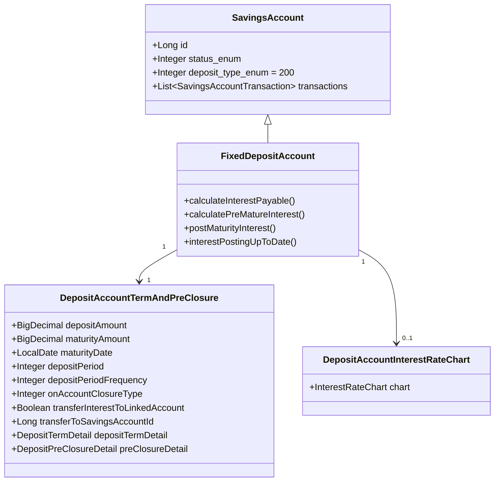
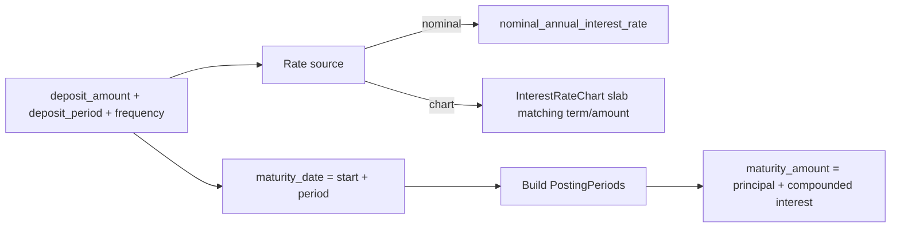
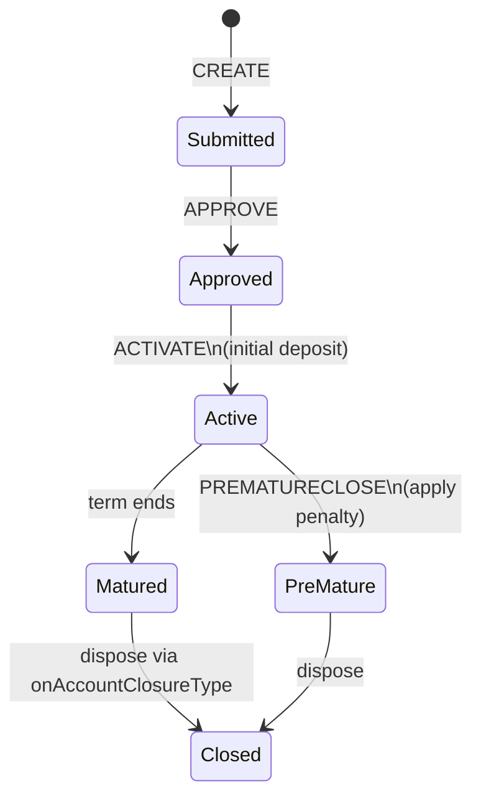

A fixed deposit account locks a single lump sum for a defined term and credits a higher rate of interest in exchange for the loss of liquidity. In Apache Fineract this is modelled as `FixedDepositAccount`, a subclass of [`SavingsAccount`](/savings/savings-account) with discriminator value `200`, plus a side entity `DepositAccountTermAndPreClosure` that holds the term, the maturity amount/date, the pre-closure penalty, and the on-closure disposition.

The relevant files:

* `fineract-savings/.../portfolio/savings/domain/FixedDepositProduct.java`
* `fineract-provider/.../portfolio/savings/domain/FixedDepositAccount.java`
* `fineract-savings/.../portfolio/savings/domain/DepositAccountTermAndPreClosure.java`
* `fineract-savings/.../portfolio/savings/domain/DepositTermDetail.java` (embeddable)
* `fineract-savings/.../portfolio/savings/domain/DepositPreClosureDetail.java` (embeddable)

## How a fixed deposit fits the savings model



The base `SavingsAccount` continues to own transactions, charges, the summary, and the status machine. The FD subclass adds two collaborators: the term/pre-closure side row, and an optional chart selection that overrides the product's nominal rate.

## DepositAccountTermAndPreClosure columns

Table `m_deposit_account_term_and_preclosure`:

| Column | Meaning |
|--------|---------|
| `deposit_amount` | Initial lump sum |
| `maturity_amount` | Projected maturity payout (principal + accrued interest) |
| `maturity_date` | Computed maturity date |
| `expected_firstdepositon_date` | Override for the date the initial deposit will be made |
| `deposit_period` | Term length |
| `deposit_period_frequency_enum` | `SavingsPeriodFrequencyType` — DAYS (0), WEEKS (1), MONTHS (2), YEARS (3) |
| `on_account_closure_enum` | `DepositAccountOnClosureType` |
| `transfer_interest_to_linked_account` | Periodic interest transfer flag |
| `transfer_to_savings_account_id` | Target linked savings account |
| Embedded `DepositPreClosureDetail` | Penalty fields |
| Embedded `DepositTermDetail` | Min/max term ranges and multiples |

### Deposit period frequency

`SavingsPeriodFrequencyType` is shared with min/max term and lock-in periods:

| Code | Enum |
|------|------|
| 0 | `DAYS` |
| 1 | `WEEKS` |
| 2 | `MONTHS` |
| 3 | `YEARS` |
| 4 | `INVALID` |

### On-account-closure dispositions

When a fixed deposit reaches maturity (or is closed pre-maturely), what happens to the principal and interest is governed by `DepositAccountOnClosureType`:

| Code | Enum | Effect at closure |
|------|------|-------------------|
| 100 | `WITHDRAW_DEPOSIT` | Pay the deposit and interest out as cash (or to PaymentDetail) |
| 200 | `TRANSFER_TO_SAVINGS` | Credit `transfer_to_savings_account_id` |
| 300 | `REINVEST_PRINCIPAL_AND_INTEREST` | Open a new FD with principal + interest |
| 400 | `REINVEST_PRINCIPAL_ONLY` | Open a new FD with principal only; interest paid out per `WITHDRAW_DEPOSIT` |

## Embedded DepositTermDetail

Term-range constraints copied from the FD *product* into each account so the account remembers the rules even if the product changes:

| Field | Meaning |
|-------|---------|
| `minDepositTerm` / `minDepositTermType` | Lower bound + frequency code |
| `maxDepositTerm` / `maxDepositTermType` | Upper bound + frequency code |
| `inMultiplesOfDepositTerm` / `inMultiplesOfDepositTermType` | Term granularity (e.g. multiples of 3 months) |

The validator rejects a deposit period outside `[min, max]` or that is not a valid multiple of the granularity.

## Embedded DepositPreClosureDetail

Penalty for closing before maturity:

| Field | Meaning |
|-------|---------|
| `preClosurePenalApplicable` | Whether any penalty applies |
| `preClosurePenalInterest` | Penalty percentage (basis-point reduction) |
| `preClosurePenalInterestOnType` | `PreClosurePenalInterestOnType` — WHOLE_TERM (1) or TILL_PREMATURE_WITHDRAWAL (2) |

`WHOLE_TERM` recomputes interest for the entire term at the reduced rate (most punitive). `TILL_PREMATURE_WITHDRAWAL` only reduces the rate for the portion that has elapsed; the customer keeps something closer to what they earned.

## Maturity calculation

`FixedDepositAccount.calculateInterestPayable(...)` builds a list of `PostingPeriod`s spanning `[depositStartDate, maturityDate]` according to the product's compounding and posting periods, applies the rate (either the nominal rate or, if a chart is attached, the chart-resolved rate for the term/amount), and produces the projected maturity amount.



The same routine is reused at *projection* time (when validating the account application) and at *posting* time (when the maturity job actually pays interest).

## Lifecycle commands

| Action | Effect |
|--------|--------|
| `CREATE` | Submit the FD application; computes projected `maturity_date` and `maturity_amount` |
| `APPROVE` / `UNDOAPPROVAL` | Same as savings |
| `ACTIVATE` | Booking the initial deposit; status → ACTIVE |
| `CALCULATEINTEREST` | Recompute projection |
| `POSTINTEREST` | Post interest at periodic boundary |
| `PREMATURECLOSE` | Status → `PRE_MATURE_CLOSURE`; applies the pre-closure penalty and disposes per `onAccountClosureType` |
| `CLOSE` | At maturity; transitions to `MATURED` then `CLOSED` and disposes per `onAccountClosureType` |



## How the deposit moves through transactions

* On activation, the initial deposit appears as a `DEPOSIT (1)` transaction.
* Interest postings appear as `INTEREST_POSTING (3)` at each posting boundary up to `maturityDate`.
* When `transferInterestToLinkedAccount` is true, each `INTEREST_POSTING` also produces a withdrawal on the FD and a deposit on the linked savings account.
* At closure, depending on disposition:
  * `WITHDRAW_DEPOSIT`: one `WITHDRAWAL (2)` for the maturity amount.
  * `TRANSFER_TO_SAVINGS`: a transfer pair `WITHDRAWAL` (here) + `DEPOSIT` (target).
  * `REINVEST_*`: a `WITHDRAWAL` and a fresh FD activation.

## FixedDepositProduct

`FixedDepositProduct` (discriminator `200`) extends `SavingsProduct` and adds:

* `DepositProductTermAndPreClosure` (term + penalty defaults for new accounts)
* `DepositProductAmountDetails` (min/max permissible deposit amount)
* A chart linkage so the same product can offer term/amount-tiered rates rather than one nominal rate

Charts and the chart slab structure are documented in [Interest rate charts](/savings/interest-rate-charts).

## Interplay with the maturity job

The `UPDATE_DEPOSITS_ACCOUNT_MATURITY_DETAILS` job sweeps active FD and RD accounts that have reached `maturity_date`, recomputes the final accrued interest, transitions them to `MATURED`, and triggers the configured disposition. Operators normally schedule this nightly.

## What to read next

* [Recurring deposits](/savings/recurring-deposits) — the sister product type that uses the same term/pre-closure side row plus a schedule of installments.
* [Deposit products](/savings/deposit-products) — the shared product base.
* [Interest rate charts](/savings/interest-rate-charts) — for tiered FD pricing.
* [Savings jobs](/savings/savings-jobs) — `UPDATE_DEPOSITS_ACCOUNT_MATURITY_DETAILS` and friends.

## REST API surface

| Method | Path | Operation |
|--------|------|-----------|
| GET | `/v1/fixeddepositaccounts/template` | Template for new FD applications |
| GET | `/v1/fixeddepositaccounts/{id}` | Retrieve account with associations |
| POST | `/v1/fixeddepositaccounts` | Submit FD application |
| PUT | `/v1/fixeddepositaccounts/{id}` | Update pending application |
| POST | `/v1/fixeddepositaccounts/{id}?command=approve` | Approve |
| POST | `/v1/fixeddepositaccounts/{id}?command=activate` | Activate (initial deposit) |
| POST | `/v1/fixeddepositaccounts/{id}?command=undoApproval` | Reverse approval |
| POST | `/v1/fixeddepositaccounts/{id}?command=reject` | Reject application |
| POST | `/v1/fixeddepositaccounts/{id}?command=withdrawnByApplicant` | Applicant withdraws |
| POST | `/v1/fixeddepositaccounts/{id}?command=close` | Close at maturity |
| POST | `/v1/fixeddepositaccounts/{id}?command=prematureClose` | Pre-mature close |
| POST | `/v1/fixeddepositaccounts/{id}?command=calculateInterest` | Recompute interest |
| POST | `/v1/fixeddepositaccounts/{id}?command=postInterest` | Manual interest posting |
| GET | `/v1/fixeddepositaccounts/{id}/transactions` | Paged ledger view |

The query parameters `?associations=all` and `?associations=transactions,charges` control what gets eagerly loaded into the response.

## Worked example: a one-year FD with quarterly interest transfer

Suppose a customer opens a 12-month FD for ₹100,000 at 6.5% per annum compounded monthly, with interest transferred quarterly to a linked savings account. The configuration:

| Field | Value |
|-------|-------|
| `depositAmount` | 100000 |
| `depositPeriod` | 12 |
| `depositPeriodFrequencyId` | 2 (MONTHS) |
| `interestPostingPeriodType` | 5 (QUATERLY) |
| `interestCompoundingPeriodType` | 4 (MONTHLY) |
| `interestCalculationType` | 1 (DAILY_BALANCE) |
| `transferInterestToLinkedAccount` | true |
| `linkedAccountId` | (savings account id) |
| `onAccountClosureType` | 100 (WITHDRAW_DEPOSIT) |

On activation:

* T0: `DEPOSIT (1)` of 100,000 on the FD.
* T0+3M: `INTEREST_POSTING (3)` of (≈1,635), `WITHDRAWAL (2)` of (≈1,635) on the FD, `DEPOSIT (1)` of (≈1,635) on the linked savings.
* T0+6M, +9M, +12M: same.
* T0+12M: maturity. The `UPDATE_DEPOSITS_ACCOUNT_MATURITY_DETAILS` job transitions to MATURED and emits a `WITHDRAWAL (2)` of 100,000 as `WITHDRAW_DEPOSIT`.

The total cash returned to the customer is the principal plus four quarterly interest credits.

## Mathematics of maturity

For a compounding-period rate `r = annualRate / (daysInYear / compoundingDays)`, principal `P`, and `n` compounding periods until maturity:

```
maturityAmount = P * (1 + r)^n
```

For monthly compounding at 6.5% annual rate (365-day year), `r = 0.065 / 12 ≈ 0.005417`, and over 12 months `(1.005417)^12 ≈ 1.06697`, so a ₹100,000 deposit returns ≈₹106,697.

When a chart is attached, `r` is whatever rate the matched slab carries (plus any incentives). The maturity calculation algebra is identical.

## Pre-mature closure mechanics

If the customer closes after 7 months:

* The penalty kicks in. If `preClosurePenalInterestOnType = WHOLE_TERM (1)` and `preClosurePenalInterest = 1.0`, the effective rate becomes 5.5% for the entire elapsed period — meaning previously-posted interest at 6.5% is *reversed* and re-posted at 5.5%.
* If `preClosurePenalInterestOnType = TILL_PREMATURE_WITHDRAWAL (2)`, the penalty applies only to the elapsed 7 months, but the rate reduction is the same.

`calculatePreMatureInterest(LocalDate preMatureDate, ...)` returns the corrected interest amount; the writer posts the reversal and the corrected accrual atomically.

## Schema reference

| Table | Columns of interest |
|-------|---------------------|
| `m_savings_account` | Everything in the [SavingsAccount page](/savings/savings-account), with `deposit_type_enum = 200` |
| `m_deposit_account_term_and_preclosure` | Term + maturity + closure disposition (one row per FD) |
| `m_deposit_account_interest_rate_chart` | Chart bridge (when a chart is used) |
| `m_savings_account_transaction` | Transaction ledger, same table used for savings |

