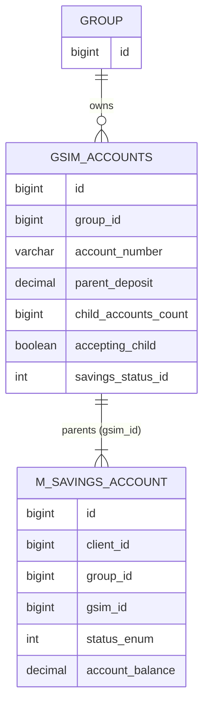
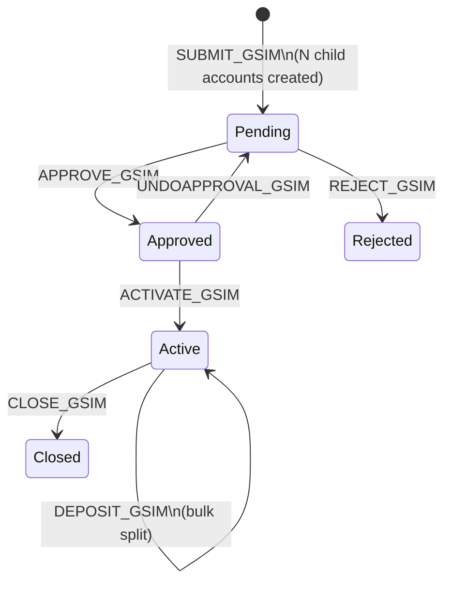
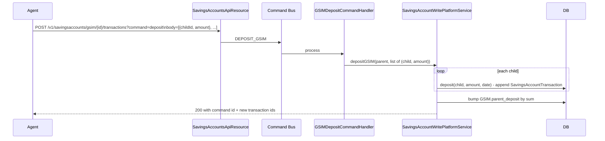

GSIM — Group Savings Individual Monitoring — is Fineract's pattern for the everyday microfinance case where a group of clients deposits money *together* (one pooled transaction) but each member's share of the pool must be tracked *individually* (so members can withdraw, accrue interest, and leave the group cleanly). A GSIM record is the parent that ties N regular `SavingsAccount` rows — one per member — into a single group-level group account.

GSIM is distinct from a plain group savings account (a single `SavingsAccount` with `accountType = GROUP`): GSIM still has the individual member accounts as first-class rows in `m_savings_account`, but it adds a parent row that owns the bulk deposit/withdrawal commands and the shared lifecycle.

## The entity

File: `fineract-savings/.../portfolio/savings/domain/GroupSavingsIndividualMonitoring.java`. Table: `gsim_accounts`.

```java
@Entity
@Table(name = "gsim_accounts",
       uniqueConstraints = { @UniqueConstraint(columnNames = { "account_number" }, name = "gsim_id") })
public final class GroupSavingsIndividualMonitoring extends AbstractPersistableCustom<Long> {

    @ManyToOne
    @JoinColumn(name = "group_id", nullable = false)
    private Group group;

    @Column(name = "account_number", nullable = false)
    private String accountNumber;

    @Column(name = "parent_deposit")
    private BigDecimal parentDeposit;

    @Column(name = "child_accounts_count")
    private Long childAccountsCount;

    @Column(name = "accepting_child")
    private Boolean isAcceptingChild;

    @OneToMany
    private Set<SavingsAccount> childSaving;

    @Column(name = "savings_status_id", nullable = false)
    private Integer savingsStatus;

    @Column(name = "application_id", nullable = true)
    private BigDecimal applicationId;
}
```

| Column | Meaning |
|--------|---------|
| `group_id` | The owning `Group` |
| `account_number` | Unique parent account number |
| `parent_deposit` | Running total of the pooled balance across all members |
| `child_accounts_count` | Number of child member savings accounts |
| `accepting_child` | Flag set on the parent so that approve / activate can add a new child |
| `savings_status_id` | Parent lifecycle status (mirrors `SavingsAccountStatusType`) |
| `application_id` | Optional ID for the originating application bundle |

The child member accounts reference the GSIM through `SavingsAccount.gsim`:

```java
@ManyToOne(fetch = FetchType.LAZY)
@JoinColumn(name = "gsim_id", nullable = true)
private GroupSavingsIndividualMonitoring gsim;
```

So in the database:



Each child row is a normal `SavingsAccount` with its own client, balance, status, and transaction stream. The GSIM row knows the *count* of children and the *aggregate* balance — these are derived/cached values, not the source of truth.

## Lifecycle commands

The GSIM-specific command handlers live in `fineract-provider/.../portfolio/savings/handler/`:

| Handler | Command | Effect |
|---------|---------|--------|
| `GSIMApplicationSubmittalCommandHandler` | `SUBMIT_GSIM` | Create parent + N child accounts in pending state |
| `GSIMApplicationModificationCommandHandler` | `UPDATE_GSIM` | Mutate pending parent / children |
| `GSIMApplicationApprovalCommandHandler` | `APPROVE_GSIM` | Approve parent + all children atomically |
| `GSIMUndoApprovalCommandHandler` | `UNDOAPPROVAL_GSIM` | Revert approval |
| `GSIMApplicationRejectionHandler` | `REJECT_GSIM` | Reject the bundle |
| `GSIMAccountActivationCommandHandler` | `ACTIVATE_GSIM` | Activate parent + children |
| `GSIMDepositCommandHandler` | `DEPOSIT_GSIM` | Bulk deposit split across children by ratio |
| `CloseGSIMCommandHandler` | `CLOSE_GSIM` | Close parent + children |



Each handler is a thin command-bus shim. The real work happens in the corresponding methods of `SavingsAccountWritePlatformService` and the `SavingsAccountAssembler`, which iterate over the children and invoke the same domain methods (`approveApplication`, `activate`, `deposit`, `closeAccount`) as for stand-alone savings accounts — but wrapped in a single transaction so the group transition is atomic.

## Bulk deposit semantics

`DEPOSIT_GSIM` is the marquee feature. A field agent collects a pooled cash payment from a group's meeting and submits it once; the platform splits it across the member accounts based on caller-supplied per-child amounts.



Each child still gets its own `SavingsAccountTransaction` of type `DEPOSIT (1)`, its own running balance update, and its own GL postings. The GSIM parent is updated last with the new aggregate.

## Accepting a new child

A group is not static — members join and leave. When `isAcceptingChild = true` on the parent, a new child savings application can be linked through `SavingsAccount.gsim` and the parent's `childAccountsCount` is incremented. The product configuration on the children is constrained: typically every child must use the same `SavingsProduct` so that interest posting cadences and charges line up.

## Interaction with the rest of the platform

* **Status machine** — the parent's `savings_status_id` is the gate for bulk operations, but each child keeps its own `status_enum`. The lifecycle handlers walk both.
* **Interest posting** — runs per-child as usual. The aggregate is *not* a single interest-bearing account.
* **Reporting** — the `accountdetails` package exposes joins so a member dashboard shows the GSIM linkage.
* **Group lending** — a GSIM commonly coexists with a JLG (Joint Liability Group) loan product on the same `Group`. The GSIM funds an inability-to-pay reserve.

## Reading next

* [SavingsAccount](/savings/savings-account) — the child entity, with its full status machine and transaction stream.
* [SavingsProduct](/savings/savings-product) — the product the children share.
* [Savings transactions](/savings/savings-transactions) — what each child's deposit row looks like.

## REST API surface

The GSIM API endpoints are mounted on the same `SavingsAccountsApiResource` as ordinary savings accounts but under a `gsim` path segment:

| Method | Path | Operation |
|--------|------|-----------|
| POST | `/v1/savingsaccounts/gsim` | Submit a GSIM application (parent + children) |
| GET | `/v1/savingsaccounts/gsim/{groupId}` | Retrieve GSIM details for a group |
| POST | `/v1/savingsaccounts/gsim/{id}?command=approve` | Approve parent + children |
| POST | `/v1/savingsaccounts/gsim/{id}?command=undoapproval` | Reverse approval |
| POST | `/v1/savingsaccounts/gsim/{id}?command=reject` | Reject |
| POST | `/v1/savingsaccounts/gsim/{id}?command=activate` | Activate parent + children |
| POST | `/v1/savingsaccounts/gsim/{id}/transactions?command=deposit` | Bulk deposit, split per child |
| POST | `/v1/savingsaccounts/gsim/{id}?command=close` | Close parent + children |

The bulk-deposit request body is an array of `{ childAccountId, amount }` objects:

```json
{
  "transactionDate": "15 June 2024",
  "dateFormat": "dd MMMM yyyy",
  "locale": "en",
  "paymentTypeId": 1,
  "childAccountsTransactionRequests": [
    { "savingsAccountId": 1001, "transactionAmount": 250 },
    { "savingsAccountId": 1002, "transactionAmount": 300 },
    { "savingsAccountId": 1003, "transactionAmount": 200 }
  ]
}
```

The response is a `CommandProcessingResult` with a list of new transaction ids and the new parent `parent_deposit` value.

## Atomicity guarantees

Every GSIM command runs in a single database transaction. Either *all* children transition successfully or *none* do. This is important because:

* A partial activation would leave some members with an active account and others stuck at APPROVED, violating the group invariant.
* A partial bulk deposit would leave the field agent's books out of sync with the platform.
* A partial close would leave dormant children floating without a parent.

If any per-child validation fails, the transaction rolls back and the whole command fails with an aggregated error response listing each failing child.

## Validation rules

* The group must exist and be ACTIVE.
* Every child savings application within the same GSIM submission must reference the same `SavingsProduct` (so they share interest rules).
* When the parent is `APPROVED`, no child can transition independently; only the GSIM-level command bus path is allowed.
* Bulk deposit amounts must sum to the total declared by the agent.
* Each child must be a client of the *same* group as the GSIM parent.

## Inactivity handling

The `UPDATE_SAVINGS_DORMANT_ACCOUNTS` job processes each child independently — a GSIM child can become dormant or escheat without affecting siblings. The parent `gsim_accounts.savings_status_id` reflects only the lifecycle state (Submitted → Approved → Active → Closed), not the dormancy sub-status of the children.

## Operational analytics

The most common GSIM operational query is "how much is the group holding right now, and what's each member's share?". The query joins:

```sql
SELECT g.id AS gsim_id,
       g.parent_deposit AS group_total,
       sa.id AS member_account,
       c.display_name AS member_name,
       sa.account_balance_derived AS member_balance,
       sa.sub_status_enum AS dormancy
FROM   gsim_accounts g
JOIN   m_savings_account sa ON sa.gsim_id = g.id
JOIN   m_client c            ON c.id      = sa.client_id
WHERE  g.id = :gsim_id;
```

The `parent_deposit` on the GSIM row is a *cached* total; it can drift out of sync with the sum of children if direct SQL bypasses the domain methods. Operators should treat the sum-of-children as authoritative and use the parent as a quick-read approximation.

## Common pitfalls

* **Forgetting to enable `accepting_child`** before adding a new member — the next `CREATE_SAVINGSACCOUNT` with a `gsim_id` will be rejected.
* **Closing the parent before zeroing the children** — `CLOSE_GSIM` walks children and refuses if any has a non-zero balance.
* **Reusing the parent account number** — `gsim_accounts.account_number` is unique; the platform generates fresh numbers automatically when none is supplied.
* **Mismatched product across children** — caught at submission; cannot be patched post-approval.

## Where this lives in the source

* Entity: `fineract-savings/.../portfolio/savings/domain/GroupSavingsIndividualMonitoring.java`.
* Repository: `GSIMRepositoy.java` (note the typo on `Repositoy`).
* Command handlers: `fineract-provider/.../portfolio/savings/handler/` (eight `GSIM*` classes).
* Read service: `GSIMReadPlatformServiceImpl` (under `fineract-provider/.../portfolio/savings/service/`).
* API mounting: `SavingsAccountsApiResource` recognises the GSIM segment and routes to the right command.

