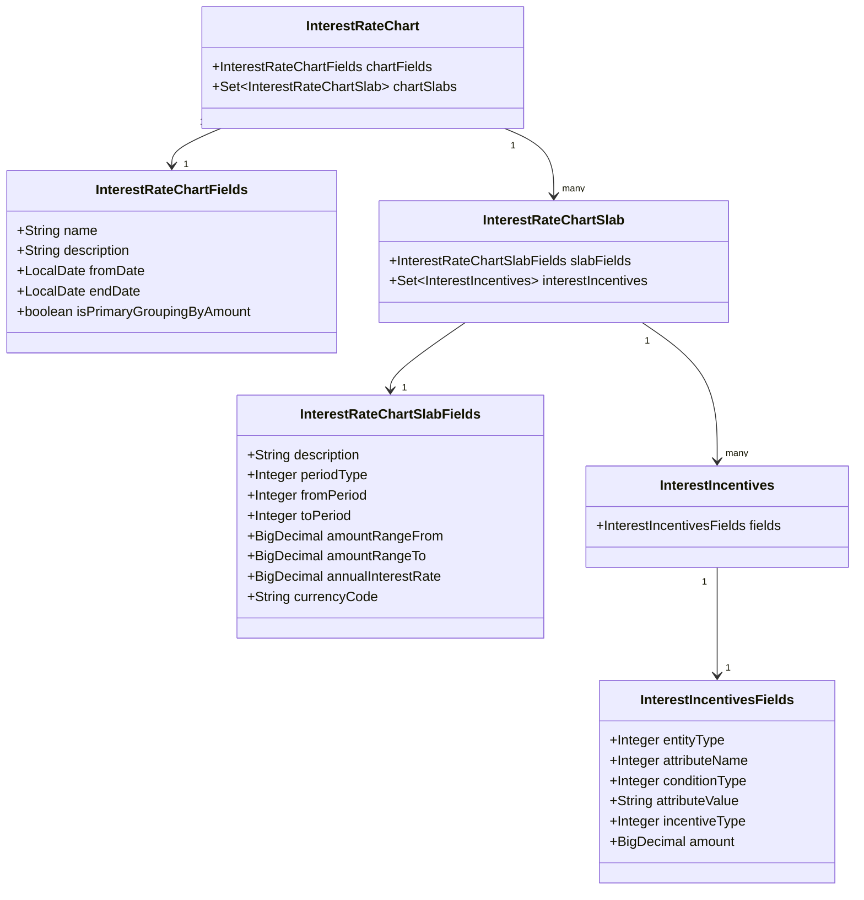
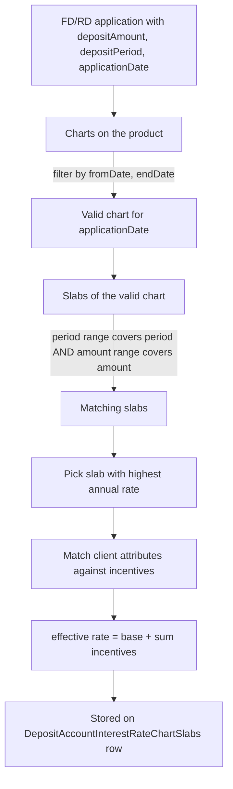

Interest rate charts are how Apache Fineract supports *tiered* deposit pricing: longer terms or larger amounts earn a higher rate, and customer attributes (age, gender, client classification) can earn small *incentive* bonuses on top. A chart applies for a date window and consists of one or more slabs; each slab fixes a period range, an amount range, an annual interest rate, and a set of attribute-based incentives.

Charts attach to `FixedDepositProduct` and `RecurringDepositProduct` (not to ordinary savings) via the `m_deposit_product_interest_rate_chart` join table — see [Deposit products](/savings/deposit-products).

## File layout

The chart code lives under `fineract-savings/.../portfolio/interestratechart/`:

```
interestratechart/
├── InterestRateChartApiConstants.java
├── InterestRateChartSlabApiConstants.java
├── InterestIncentiveApiConstants.java
├── data/        # request/response DTOs + validators
├── domain/      # JPA entities (this page)
├── incentive/   # incentive-side helpers
├── exception/
└── service/
```

The REST API endpoints are mounted in `fineract-provider/.../portfolio/interestratechart/api/InterestRateChartsApiResource.java` at `/v1/interestratecharts`, with sub-resources for slabs (`InterestRateChartSlabsApiResource`) and incentives.

## The entities



### InterestRateChart

Table `m_interest_rate_chart`. The chart itself is mostly a header — name, description, validity window — with an `EAGER` collection of slabs:

```java
@Entity
@Table(name = "m_interest_rate_chart")
public class InterestRateChart extends AbstractPersistableCustom<Long> {

    @Embedded
    private InterestRateChartFields chartFields;

    @OneToMany(mappedBy = "interestRateChart", cascade = CascadeType.ALL,
               orphanRemoval = true, fetch = FetchType.EAGER)
    private Set<InterestRateChartSlab> chartSlabs = new HashSet<>();
}
```

`InterestRateChartFields` (embedded):

| Column | Meaning |
|--------|---------|
| `name` | Chart name |
| `description` | Free-text description |
| `from_date` | First date the chart is active |
| `end_date` | Last date the chart is active (open-ended if null) |
| `is_primary_grouping_by_amount` | Whether the user-facing UI groups slabs by amount-first or period-first |

A chart is "valid on date D" when `fromDate <= D` and (`endDate == null` or `endDate >= D`).

### InterestRateChartSlab

Table `m_interest_rate_slab`. A slab is the actual *pricing line*: one period range, one amount range, one rate.

```java
@Entity
@Table(name = "m_interest_rate_slab")
public class InterestRateChartSlab extends AbstractPersistableCustom<Long> {

    @Embedded
    private InterestRateChartSlabFields slabFields;

    @ManyToOne(optional = false)
    @JoinColumn(name = "interest_rate_chart_id", referencedColumnName = "id", nullable = false)
    private InterestRateChart interestRateChart;

    @OneToMany(mappedBy = "interestRateChartSlab", cascade = CascadeType.ALL,
               orphanRemoval = true, fetch = FetchType.EAGER)
    private Set<InterestIncentives> interestIncentives = new HashSet<>();
}
```

`InterestRateChartSlabFields` (embedded):

| Column | Meaning |
|--------|---------|
| `description` | Slab description |
| `period_type_enum` | `SavingsPeriodFrequencyType` code |
| `from_period` / `to_period` | Period range (e.g. 6 to 12 months) |
| `amount_range_from` / `amount_range_to` | Amount range (nullable to leave open-ended) |
| `annual_interest_rate` | Annual rate paid in this slab |
| `currency_code` | ISO currency code |

A slab is selected for a deposit by finding the chart valid on the application date, then filtering its slabs to those whose period range covers the deposit term *and* whose amount range covers the deposit amount (or for RDs, the expected maturity principal). The slab with the highest rate among matches wins.

### Incentives

`InterestIncentives` and the embedded `InterestIncentivesFields` describe per-slab rate uplifts based on customer attributes. Each row has:

* `entity_type` — what entity is being inspected (Client).
* `attribute_name` — which attribute (gender, age, classification, etc.) via `InterestIncentiveAttributeName`.
* `condition_type` — `ConditionType` (equal, not equal, greater than, etc.).
* `attribute_value` — the comparison value as a string.
* `incentive_type` — flat addition vs percentage of the base rate.
* `amount` — the bonus amount.

When the slab is materialised on an account, every incentive that matches the customer's profile is summed into the effective rate.

## Selection algorithm



The result is persisted on the account as `DepositAccountInterestRateChart` (chart bridge) and `DepositAccountInterestRateChartSlabs` (slab bridge), so reopening the account later does not re-resolve — the rate the customer was promised is the rate they get.

## REST API: `/v1/interestratecharts`

Annotated as `@Tag("Interest Rate Chart")` with the description "This defines an interest rate scheme that can be associated to a term deposit product. This will have a slab (band or range) of deposit periods and the associated interest rates applicable along with incentives for each band."

| Method | Path | Operation |
|--------|------|-----------|
| GET | `/v1/interestratecharts/template` | Template (defaults + allowed values) for UI |
| GET | `/v1/interestratecharts` | List all charts |
| GET | `/v1/interestratecharts/{chartId}` | Retrieve one chart |
| POST | `/v1/interestratecharts` | Create chart |
| PUT | `/v1/interestratecharts/{chartId}` | Update chart |
| DELETE | `/v1/interestratecharts/{chartId}` | Delete chart |

Slab sub-resource at `/v1/interestratecharts/{chartId}/chartslabs`. Each slab can carry its own nested incentives via the `chartSlabs[].incentives` array on chart-level POSTs and via dedicated slab-level endpoints.

## Lifecycle commands

Charts and slabs are managed through the command bus the same way other entities are:

| Command | Effect |
|---------|--------|
| `CREATE_INTERESTRATECHART` | Persist chart + slabs + incentives in one transaction |
| `UPDATE_INTERESTRATECHART` | Mutate fields, optionally add/remove slabs |
| `DELETE_INTERESTRATECHART` | Refuse if the chart is referenced by any active product or account |
| `CREATE_CHART_SLAB` / `UPDATE_CHART_SLAB` / `DELETE_CHART_SLAB` | Slab-level mutation |

Handlers live in `fineract-provider/.../portfolio/interestratechart/handler/`.

## Validation rules

The chart and slab validators (`InterestRateChartDataValidator`, `InterestRateChartSlabDataValidator`) enforce:

* `fromDate` must be present; `endDate` (if any) must be after `fromDate`.
* Slabs of the same chart must not overlap in period+amount space; a deposit application must always resolve to exactly one slab.
* `annual_interest_rate` must be non-negative.
* Incentive amount must be non-negative, percentage-based incentives must be ≤ 100.

## Related pages

* [Deposit products](/savings/deposit-products) — how charts attach to FD/RD products.
* [Fixed deposits](/savings/fixed-deposits) — how the chart-resolved rate feeds maturity calculation.
* [Recurring deposits](/savings/recurring-deposits) — same, with the schedule layered on top.

## Worked example: a chart with three slabs

A cooperative wants its 12-month-or-longer term deposits to pay better rates for larger amounts. The chart definition:

| Slab | Period | Amount range | Rate |
|------|--------|--------------|------|
| 1 | 12–35 months | 0–100,000 | 6.50% |
| 2 | 12–35 months | 100,001–1,000,000 | 7.00% |
| 3 | 12–35 months | 1,000,001 and up | 7.25% |
| 4 | 36+ months | 0–100,000 | 7.50% |
| 5 | 36+ months | 100,001 and up | 8.00% |

The corresponding JSON for `POST /v1/interestratecharts`:

```json
{
  "name": "2025 Term Deposit Rates",
  "description": "Tier-based deposit rates for FY25",
  "fromDate": "01 January 2025",
  "endDate": "31 December 2025",
  "isPrimaryGroupingByAmount": false,
  "locale": "en",
  "dateFormat": "dd MMMM yyyy",
  "chartSlabs": [
    { "periodType": 2, "fromPeriod": 12, "toPeriod": 35,
      "amountRangeFrom": 0, "amountRangeTo": 100000,
      "annualInterestRate": 6.5, "currencyCode": "INR" },
    { "periodType": 2, "fromPeriod": 12, "toPeriod": 35,
      "amountRangeFrom": 100001, "amountRangeTo": 1000000,
      "annualInterestRate": 7.0, "currencyCode": "INR" },
    { "periodType": 2, "fromPeriod": 12, "toPeriod": 35,
      "amountRangeFrom": 1000001,
      "annualInterestRate": 7.25, "currencyCode": "INR" },
    { "periodType": 2, "fromPeriod": 36,
      "amountRangeFrom": 0, "amountRangeTo": 100000,
      "annualInterestRate": 7.5, "currencyCode": "INR" },
    { "periodType": 2, "fromPeriod": 36,
      "amountRangeFrom": 100001,
      "annualInterestRate": 8.0, "currencyCode": "INR" }
  ]
}
```

The omitted `toPeriod` on slabs 3 and 5 means "open-ended"; the omitted `amountRangeTo` on slabs 3 and 5 means the same for amounts.

The `periodType = 2` is `SavingsPeriodFrequencyType.MONTHS`. A 24-month FD for ₹500,000 matches slab 2 and gets 7.0%; the same FD for ₹2,000,000 matches slab 3 at 7.25%; a 60-month FD for ₹500,000 matches slab 5 at 8.0%.

## Adding incentives

To grant senior citizens an extra 0.5%, attach an incentive to each slab:

```json
{
  "entityType": 1,            // Client
  "attributeName": 2,         // age
  "conditionType": 3,         // greater than
  "attributeValue": "60",
  "incentiveType": 1,         // flat addition (vs. percentage)
  "amount": 0.5
}
```

When a 65-year-old client opens a 24-month FD for ₹500,000, the matching slab's 7.0% becomes 7.5% for that account. The result is materialised on `DepositAccountInterestRateChartSlabs`.

## Edge cases and validation

* **Overlapping slabs**: rejected. The validator walks the slab set and refuses to persist two slabs whose (period × amount) rectangles overlap. Without this rule, a single application could match two slabs and the platform would have to choose arbitrarily.
* **Gaps**: not rejected. A chart with a gap (no slab covering 36-48 months for high amounts) will simply fail to resolve a slab for those applications and the platform will fall back to the product's `nominal_annual_interest_rate`. Most operators treat this as a configuration bug to be caught in QA.
* **Empty incentive set**: fine — the slab's base rate is used.
* **Incentive whose attribute doesn't match the client**: ignored silently. Only matching incentives are summed.
* **Chart end date before from date**: rejected.
* **Slab `annual_interest_rate < 0`**: rejected.
* **Slab `currency_code` mismatched with the product**: rejected when the product attaches the chart.

## Performance notes

Charts and their slabs are loaded EAGER from the chart `Set<InterestRateChartSlab>` because the typical chart has only a handful of slabs and they are always read together when pricing an application.

The chart catalogue itself is small (tens of rows per tenant) and is cached by the read service.

## Read side

The read endpoints decorate each enum value with `EnumOptionData`:

```json
{
  "id": 17,
  "name": "2025 Term Deposit Rates",
  "fromDate": [2025, 1, 1],
  "endDate": [2025, 12, 31],
  "chartSlabs": [
    {
      "id": 101,
      "periodType": { "id": 2, "code": "savingsPeriodFrequencyType.months", "value": "Months" },
      "fromPeriod": 12, "toPeriod": 35,
      "amountRangeFrom": 0.0, "amountRangeTo": 100000.0,
      "annualInterestRate": 6.5,
      "currency": { "code": "INR", "name": "Indian Rupee" },
      "incentives": [ ... ]
    }
  ]
}
```

This is the shape consumed by the deposit-product configuration UI.

