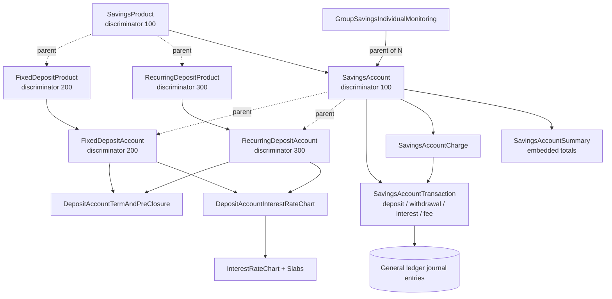
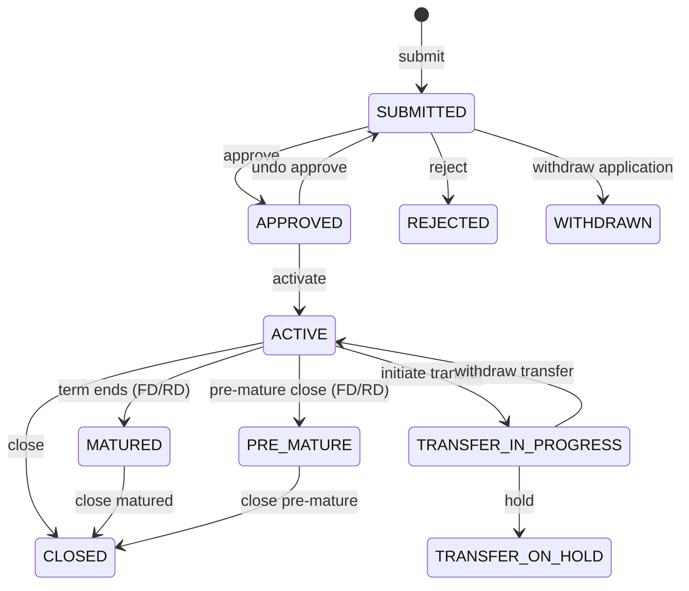
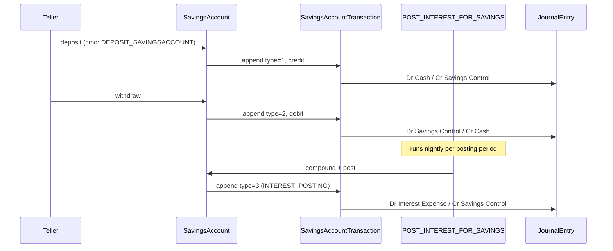
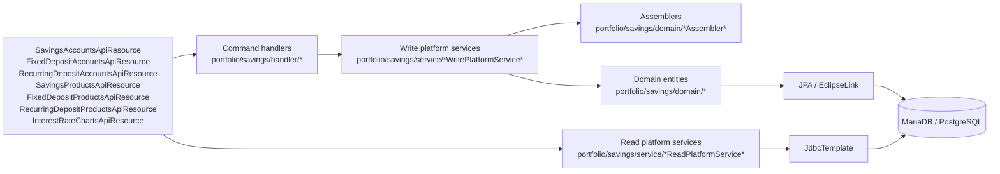

The `fineract-savings` Gradle module groups together every deposit-style portfolio product that Apache Fineract supports: ordinary savings accounts, fixed deposits, recurring deposits, the interest rate charts that drive deposit pricing, group savings, and the schedulers that post interest and apply periodic fees. It sits alongside `fineract-loan` and `fineract-investment` as one of the three large portfolio modules and shares its core abstractions — `MonetaryCurrency`, `Charge`, `Client`, `Group`, journal entries — with the rest of the platform.

Two things make the savings subsystem distinct from loans. First, it models money *coming in* rather than money going out: the GL balances reverse, the interest accrues as a liability instead of an asset, and the schedule (where one exists, for fixed and recurring deposits) drives the *bank* to credit interest rather than the customer to make repayments. Second, the same `SavingsAccount` JPA entity is reused as the base class for fixed deposit accounts and recurring deposit accounts via JPA single-table inheritance — the `deposit_type_enum` discriminator column picks one of `SAVINGS_DEPOSIT (100)`, `FIXED_DEPOSIT (200)`, `RECURRING_DEPOSIT (300)`, or `CURRENT_DEPOSIT (400)`. Sharing the table and the transaction model means one set of interest posting code, one set of charge handlers, and one set of journal-entry mappings serves all four product types.

This page is the entry point. It sketches the module layout, lists the deeper pages, and gives you a one-screen mental model before you dive in.

## Module layout

`fineract-savings/src/main/java/org/apache/fineract/portfolio/` contains four top-level packages:

| Package | What lives here |
|---------|-----------------|
| `accountdetails` | Cross-portfolio account lookup data used by the dashboard and account-details API |
| `charge` | Savings-specific charge metadata that complements the shared `Charge` from `fineract-core` |
| `interestratechart` | `InterestRateChart`, `InterestRateChartSlab`, incentives, and their REST resources |
| `savings` | The bulk of the module — domain entities, services, validators, JPA repositories, REST data DTOs, and the savings APIs |

Inside `savings/`, the `domain` sub-package holds the JPA entities: `SavingsAccount`, `SavingsProduct`, `SavingsAccountTransaction`, `SavingsAccountCharge`, `SavingsAccountSummary`, `SavingsOfficerAssignmentHistory`, the deposit-specific `FixedDepositProduct` / `RecurringDepositProduct`, the embedded `DepositAccountTermAndPreClosure` / `DepositTermDetail` / `DepositPreClosureDetail` / `DepositProductRecurringDetail`, the chart bridges `DepositAccountInterestRateChart` and `DepositAccountInterestRateChartSlabs`, `DepositAccountOnHoldTransaction`, and finally `GroupSavingsIndividualMonitoring` for the GSIM grouping wrapper.

The two concrete account subclasses — `FixedDepositAccount` and `RecurringDepositAccount` — live in `fineract-provider/src/main/java/org/apache/fineract/portfolio/savings/domain/`. They extend `SavingsAccount` and add term, maturity, and pre-closure logic that does not apply to ordinary savings.

## Conceptual map

The same `m_savings_account` table holds every row regardless of subtype; the same `m_savings_account_transaction` table holds every credit and debit. Fixed and recurring deposits add side tables for term/pre-closure detail and chart linkage, but they reuse the savings transaction stream verbatim.

## What each page covers

<CardGroup cols={2}>
  <Card title="SavingsAccount entity" icon="vault" href="/savings/savings-account">
    The base JPA entity, its 11-state status machine, the embedded summary, the transaction/charge/officer collections, and the columns that drive every deposit subtype.
  </Card>
  <Card title="SavingsProduct" icon="tag" href="/savings/savings-product">
    Nominal annual rate, posting period, compounding period, interest calculation type, withdrawal fee for transfer, accounting rule, dormancy tracking, and the per-product charge set.
  </Card>
  <Card title="Savings transactions" icon="arrows-left-right" href="/savings/savings-transactions">
    `SavingsAccountTransactionType` 1–21: deposit, withdrawal, interest posting, fees, holds, dividend payout, withhold tax, escheat, and how each one reaches the GL.
  </Card>
  <Card title="Savings charges" icon="receipt" href="/savings/savings-charges">
    `SavingsAccountCharge` lifecycle, charge time types (monthly, annual, withdrawal, specified due date), waivers, free withdrawal counts, and the `PAY_DUE_SAVINGS_CHARGES` job.
  </Card>
  <Card title="Fixed deposits" icon="lock" href="/savings/fixed-deposits">
    `FixedDepositAccount` and `FixedDepositProduct`, deposit term, maturity instructions, the pre-mature closure penalty, and the chart selection.
  </Card>
  <Card title="Recurring deposits" icon="repeat" href="/savings/recurring-deposits">
    `RecurringDepositAccount`, the mandatory deposit schedule, the recurring detail, the missed-installment penalty, and the maturity flow.
  </Card>
  <Card title="Deposit products" icon="layer-group" href="/savings/deposit-products">
    The shared product base used by fixed and recurring deposits and the `DepositAccountType` taxonomy.
  </Card>
  <Card title="Interest rate charts" icon="chart-line" href="/savings/interest-rate-charts">
    `InterestRateChart`, `InterestRateChartSlab`, period and amount tiering, incentives, and the `/v1/interestratecharts` API.
  </Card>
  <Card title="GSIM" icon="people-group" href="/savings/gsim">
    `GroupSavingsIndividualMonitoring`: one group-level parent savings account with per-member child accounts and a shared deposit pool.
  </Card>
  <Card title="Savings jobs" icon="clock" href="/savings/savings-jobs">
    `POST_INTEREST_FOR_SAVINGS`, `UPDATE_SAVINGS_DORMANT_ACCOUNTS`, `PAY_DUE_SAVINGS_CHARGES`, `TRANSFER_INTEREST_TO_SAVINGS`, `GENERATE_RD_SCEHDULE`, and the maturity-detail job.
  </Card>
</CardGroup>

## The four deposit account types

`DepositAccountType` (in `fineract-core`) is the single enum that classifies every row in `m_savings_account`:

| Code | Enum | Description column value |
|------|------|--------------------------|
| 100 | `SAVINGS_DEPOSIT` | `depositAccountType.savingsDeposit` — ordinary passbook savings |
| 200 | `FIXED_DEPOSIT` | `depositAccountType.fixedDeposit` — single lump sum locked for a term |
| 300 | `RECURRING_DEPOSIT` | `depositAccountType.recurringDeposit` — scheduled installments toward a maturity goal |
| 400 | `CURRENT_DEPOSIT` | `depositAccountType.currentDeposit` — reserved for current accounts |

The enum's `resourceName()` maps each value back to the matching `DepositsApiConstants` resource name used by the command bus, so the same `JsonCommand` plumbing works for all of them.

## Status machine in one screen

Every `SavingsAccount` row carries an integer `status_enum`. The valid codes (from `SavingsAccountStatusType`) are:

Codes: `SUBMITTED_AND_PENDING_APPROVAL = 100`, `APPROVED = 200`, `ACTIVE = 300`, `TRANSFER_IN_PROGRESS = 303`, `TRANSFER_ON_HOLD = 304`, `WITHDRAWN_BY_APPLICANT = 400`, `REJECTED = 500`, `CLOSED = 600`, `PRE_MATURE_CLOSURE = 700`, `MATURED = 800`. The status is reused unchanged for fixed and recurring deposits — `MATURED` and `PRE_MATURE_CLOSURE` simply never appear on ordinary savings.

## Money flow at a glance

A typical month for one ordinary savings account, viewed from the transaction table:

Every transaction type has a `TransactionEntryType` (CREDIT or DEBIT) baked into the enum, which is what the journal-entry writer uses to pick the GL sides.

## Where to start

If you are tracing a customer-visible API call, start with [SavingsAccount](/savings/savings-account) to learn the entity, then [Savings transactions](/savings/savings-transactions) to see how the call writes to the ledger. If you are configuring a new product, start with [SavingsProduct](/savings/savings-product), then [Interest rate charts](/savings/interest-rate-charts) if you need amount- or period-tiered interest, then [Savings charges](/savings/savings-charges). If you are debugging a scheduled job, jump to [Savings jobs](/savings/savings-jobs). And if you operate group accounts, [GSIM](/savings/gsim) is the dedicated page.

The share-account subsystem — `ShareAccount`, `ShareProduct`, dividends — is documented separately under `/shares`, even though it ships in the same `fineract-savings` Gradle module folder structure.

## Database tables at a glance

The `m_savings_*` and `m_deposit_*` tables form a tightly-coupled cluster, all reachable from `m_savings_account.id`.

| Table | Owner | Rows |
|-------|-------|------|
| `m_savings_product` | Product definition | One per product (any deposit type) |
| `m_savings_product_charge` | Product ↔ Charge join | One per product/charge pair |
| `m_deposit_product_term_and_preclosure` | FD/RD product side | One per FD/RD product |
| `m_deposit_product_amount_details` | FD product amount ranges | One per FD product |
| `m_deposit_product_recurring_detail` | RD product recurring side | One per RD product |
| `m_deposit_product_interest_rate_chart` | Product ↔ Chart join | One per attachment |
| `m_savings_account` | Per-customer account | One per account (any deposit type) |
| `m_savings_account_transaction` | Append-only ledger | Many per account |
| `m_savings_account_charge` | Per-account fee row | Many per account |
| `m_savings_account_charge_paid_by` | Tx ↔ charge link | Many per pay event |
| `m_deposit_account_term_and_preclosure` | FD/RD account side | One per FD/RD account |
| `m_deposit_account_recurring_detail` | RD account side | One per RD account |
| `m_mandatory_savings_schedule` | RD installments | Many per RD account |
| `m_deposit_account_interest_rate_chart` | Chart bridge | One per FD/RD account using a chart |
| `m_interest_rate_slab` | Slab bridge | Many per chart bridge |
| `m_deposit_account_on_hold_transaction` | Holds | Many per account |
| `m_savings_officer_assignment_history` | Officer audit | Many per account |
| `gsim_accounts` | Group savings parent | One per GSIM grouping |

The size of this cluster is the reason savings has its own Gradle subproject — the JPA mapping, the assemblers, and the read services would dominate `fineract-provider` otherwise.

## Reading the source

The read side is JDBC-based (no JPA), to keep dashboard queries fast and predictable. The write side is JPA-based to use change tracking on the long-lived account graph.

## Common questions

**Why is `SavingsAccount` so large?** Because single-table inheritance forces it to carry every column needed by FD and RD subclasses. Splitting the table is on every refactoring wishlist but has not been done because of the migration cost and the need to keep the transaction stream uniform.

**Why is `m_interest_rate_slab` reused for both the catalogue and the per-account bridge?** Because the per-account row is a snapshot of the same fields. Sharing the embeddable `InterestRateChartSlabFields` keeps the schema honest.

**Why does GSIM exist separately from a group savings account?** Because the cooperative pattern needs *both* a pooled identity (the GSIM row) *and* per-member balances (the child savings rows). Merging them would lose the ability to track individual liability inside the group.

**Where does the COB date come in?** Every transaction-writing path validates against `BusinessDate` and updates `last_closed_business_date` on the account. The COB engine (covered in the Bootstrap & Runtime tab) drives the daily increment.

## Reading the rest of the wiki in order

If you are new to Fineract and the savings subsystem, the recommended reading order is:

1. **This page** — get the lay of the land.
2. **[SavingsAccount](/savings/savings-account)** — the central entity.
3. **[Savings transactions](/savings/savings-transactions)** — what the account does day-to-day.
4. **[SavingsProduct](/savings/savings-product)** — the configuration that drives accounts.
5. **[Savings charges](/savings/savings-charges)** — fees are the most common operational concern.
6. **[Savings jobs](/savings/savings-jobs)** — the schedulers behind every nightly batch.
7. **[Deposit products](/savings/deposit-products)** — bridges to FD/RD if your deployment uses them.
8. **[Fixed deposits](/savings/fixed-deposits)** and **[Recurring deposits](/savings/recurring-deposits)** — for term-deposit operators.
9. **[Interest rate charts](/savings/interest-rate-charts)** — for tiered pricing.
10. **[GSIM](/savings/gsim)** — for group savings deployments.

If you are debugging a specific symptom, jump directly:

* "Interest didn't post last night" → [Savings jobs](/savings/savings-jobs), then [Savings transactions](/savings/savings-transactions).
* "Withdrawal was rejected" → [SavingsAccount](/savings/savings-account) validation hot spots.
* "Charge wasn't applied" → [Savings charges](/savings/savings-charges).
* "Wrong rate on a new FD" → [Interest rate charts](/savings/interest-rate-charts) selection algorithm.
* "RD maturity miscomputed" → [Recurring deposits](/savings/recurring-deposits) installment allocation.
* "Group bulk deposit doesn't sum" → [GSIM](/savings/gsim).

## Glossary of acronyms used in this section

| Term | Expansion |
|------|-----------|
| FD | Fixed Deposit |
| RD | Recurring Deposit |
| GSIM | Group Savings Individual Monitoring |
| GL | General Ledger |
| COB | Close-of-Business (engine) |
| JLG | Joint Liability Group |
| NPA | Non-Performing Asset |
| CASH_BASED | Accounting rule that posts to the GL immediately on each transaction |
| ACCRUAL_PERIODIC | Accounting rule with periodic accrual job |
| Posting period | The cadence at which accrued interest is materialised as a transaction |
| Compounding period | The cadence at which accrued interest is rolled into principal |
| Slab | One pricing line of an interest rate chart |
| Lock-in | Window during which withdrawals are forbidden |
| Pre-mature closure | Closing a term deposit before maturity date |

