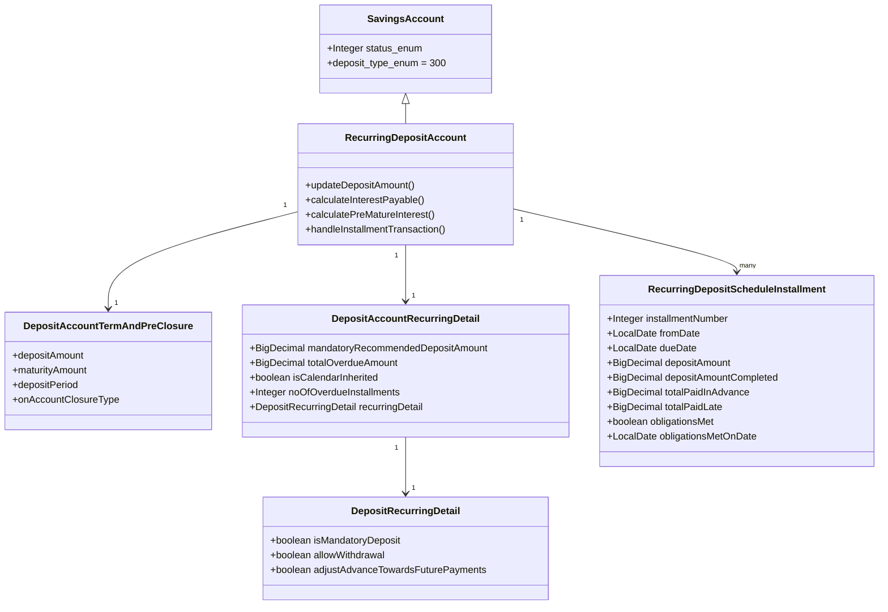
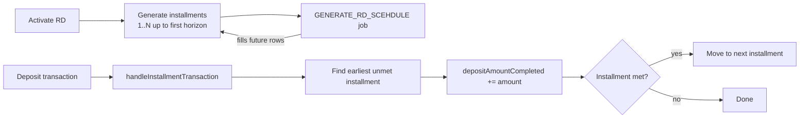

A recurring deposit (RD) is a savings vehicle where the customer commits to a stream of equal installments over a defined term in exchange for a higher rate of interest and a fixed maturity payout. Unlike a fixed deposit (single lump sum), an RD has an internal *schedule* — a list of `RecurringDepositScheduleInstallment` rows — and the platform tracks which installments have been met, which are in advance, and which are late or unpaid.

In Apache Fineract, an RD is modelled as `RecurringDepositAccount`, a subclass of [`SavingsAccount`](/savings/savings-account) with discriminator value `300`. It reuses the term/pre-closure side row from fixed deposits and adds two RD-specific pieces: the recurring detail and the installment schedule.

## Files

* `fineract-savings/.../portfolio/savings/domain/RecurringDepositProduct.java`
* `fineract-provider/.../portfolio/savings/domain/RecurringDepositAccount.java`
* `fineract-savings/.../portfolio/savings/domain/DepositRecurringDetail.java` (embeddable)
* `fineract-provider/.../portfolio/savings/domain/DepositAccountRecurringDetail.java` (entity)
* `fineract-provider/.../portfolio/savings/domain/RecurringDepositScheduleInstallment.java`
* `fineract-savings/.../portfolio/savings/domain/DepositProductRecurringDetail.java` (product side)

## Class shape



The schedule installments are an `@OneToMany` collection mapped on `RecurringDepositAccount`:

```java
@OneToMany(cascade = CascadeType.ALL, mappedBy = "account", orphanRemoval = true, fetch = FetchType.LAZY)
private List<RecurringDepositScheduleInstallment> depositScheduleInstallments = new ArrayList<>();
```

## Recurring detail

`DepositAccountRecurringDetail` (table `m_deposit_account_recurring_detail`) is the per-account row that carries the running state of the schedule:

| Column | Meaning |
|--------|---------|
| `mandatory_recommended_deposit_amount` | The amount due each installment |
| `total_overdue_amount` | Running total of unpaid installments |
| `no_of_overdue_installments` | Count of unpaid installments |
| `is_calendar_inherited` | If true, schedule follows a shared `Calendar` (group meetings) |

The embedded `DepositRecurringDetail` carries three booleans:

* `isMandatoryDeposit` — whether missing an installment incurs a penalty.
* `allowWithdrawal` — exceptional path where the customer can pull funds before maturity.
* `adjustAdvanceTowardsFuturePayments` — if true, paying early consumes future installments.

## Installments

Each `RecurringDepositScheduleInstallment` (table `m_mandatory_savings_schedule`) captures one expected deposit:

| Column | Meaning |
|--------|---------|
| `installment` | 1-based sequence number |
| `fromdate` / `duedate` | Period this installment covers |
| `deposit_amount` | Mandatory amount due (= `mandatoryRecommendedDepositAmount`) |
| `deposit_amount_completed_derived` | Amount paid against this installment so far |
| `total_paid_in_advance_derived` | Portion paid before due date |
| `total_paid_late_derived` | Portion paid after due date |
| `completed_derived` | True when `depositAmountCompleted >= depositAmount` |
| `obligations_met_on_date` | When the installment became completed |

Helper methods on the installment include `checkIfInstallmentObligationsAreMet(date, ccy)` and `trackAdvanceAndLateTotalsForInstallment(date, ccy, amount)`.

## Schedule generation

When an RD is activated, the platform generates `installmentCount = depositPeriod / installmentFrequency` rows. The frequency comes from either:

* The product's own period frequency (when standalone), or
* The group `Calendar` if `isCalendarInherited` is true (group RD aligned to meeting day).

The `GENERATE_RD_SCEHDULE` job (note the historical typo) refills the schedule going forward whenever the existing installments are exhausted, so that long-running RDs stay populated.



## How a deposit lands on the schedule

`RecurringDepositAccount.handleInstallmentTransaction(currentInstallment, amount, transactionDate, ...)` allocates a `DEPOSIT (1)` transaction:

1. The deposit amount is applied to the earliest *unmet* installment first.
2. If the deposit pre-dates the due date, the platform increments `totalPaidInAdvance` on that installment.
3. If it post-dates the due date, `totalPaidLate` is incremented.
4. Any residual amount spills into the next installment (when `adjustAdvanceTowardsFuturePayments` is true) or sits as un-allocated.
5. `obligationsMet` flips to true when the cumulative completed amount meets the mandatory amount.

When an installment falls due unpaid, the recurring detail's `no_of_overdue_installments` and `total_overdue_amount` increase and (if a `MONTHLY_FEE` or `INSTALMENT_FEE` style penalty is attached) a fee transaction is generated.

## Maturity

Maturity for an RD is computed similarly to a fixed deposit, but the principal grows on a schedule rather than starting at the deposit amount. `RecurringDepositAccount.calculateInterestPayable(...)` builds the `PostingPeriod`s with the principal expanding as each installment is presumed met.

The maturity disposition uses the same `DepositAccountOnClosureType` codes as fixed deposits:

| Code | Enum | Effect |
|------|------|--------|
| 100 | `WITHDRAW_DEPOSIT` | Pay out |
| 200 | `TRANSFER_TO_SAVINGS` | Credit linked savings |
| 300 | `REINVEST_PRINCIPAL_AND_INTEREST` | Open a new RD |
| 400 | `REINVEST_PRINCIPAL_ONLY` | Open a new RD principal-only |

## Pre-closure

`calculatePreMatureInterest(...)` strips out the future installments that never happened and reduces the rate by the penalty configured in the embedded `DepositPreClosureDetail`. The rules for `WHOLE_TERM` vs `TILL_PREMATURE_WITHDRAWAL` work identically to the FD case — see [Fixed deposits](/savings/fixed-deposits) for the table.

## Lifecycle commands

The RD inherits every command from the base savings account and adds:

| Action | Effect |
|--------|--------|
| `CREATE` | Submit RD application with deposit amount + period + frequency |
| `ACTIVATE` | Activate; generate the initial schedule rows |
| `DEPOSIT` | Append `DEPOSIT (1)` transaction and allocate to installments |
| `CALCULATEINTEREST` | Recompute projection |
| `POSTINTEREST` | Post interest at posting boundary |
| `PREMATURECLOSE` | Apply penalty, dispose per closure type |
| `CLOSE` | At maturity, dispose per closure type |

## Group RDs and the Calendar

When `isCalendarInherited` is true, the RD's installment dates align to a shared `Calendar` row (the group's meeting calendar). This is how group lending products tie RDs to the same meeting cadence as the loans, so that one collection visit funds both.

## Where to go next

* [Fixed deposits](/savings/fixed-deposits) — sister term-deposit product without a schedule.
* [Deposit products](/savings/deposit-products) — the shared product base.
* [Savings jobs](/savings/savings-jobs) — `GENERATE_RD_SCEHDULE`, `UPDATE_DEPOSITS_ACCOUNT_MATURITY_DETAILS`, `POST_INTEREST_FOR_SAVINGS`.
* [Interest rate charts](/savings/interest-rate-charts) — for amount/period-tiered RD pricing.

## REST API surface

| Method | Path | Operation |
|--------|------|-----------|
| GET | `/v1/recurringdepositaccounts/template` | Template for new RD applications |
| GET | `/v1/recurringdepositaccounts/{id}` | Retrieve account |
| POST | `/v1/recurringdepositaccounts` | Submit RD application |
| PUT | `/v1/recurringdepositaccounts/{id}` | Update pending application |
| POST | `/v1/recurringdepositaccounts/{id}?command=approve` | Approve |
| POST | `/v1/recurringdepositaccounts/{id}?command=activate` | Activate (generate schedule) |
| POST | `/v1/recurringdepositaccounts/{id}?command=undoApproval` | Reverse approval |
| POST | `/v1/recurringdepositaccounts/{id}?command=reject` | Reject |
| POST | `/v1/recurringdepositaccounts/{id}?command=close` | Close at maturity |
| POST | `/v1/recurringdepositaccounts/{id}?command=prematureClose` | Pre-mature close |
| POST | `/v1/recurringdepositaccounts/{id}?command=calculateInterest` | Recompute interest |
| POST | `/v1/recurringdepositaccounts/{id}?command=postInterest` | Manual interest posting |
| POST | `/v1/recurringdepositaccounts/{id}/transactions?command=deposit` | Make an installment deposit |
| GET | `/v1/recurringdepositaccounts/{id}/transactions` | Paged ledger view |

## Worked example: 12-month RD with monthly installments

A customer commits to depositing ₹5,000 every month for 12 months at 7% annual rate compounded monthly:

| Field | Value |
|-------|-------|
| `mandatoryRecommendedDepositAmount` | 5000 |
| `depositPeriod` | 12 |
| `depositPeriodFrequencyId` | 2 (MONTHS) |
| `recurringFrequency` | 1 (months between installments) |
| `interestPostingPeriodType` | 5 (QUATERLY) |
| `interestCompoundingPeriodType` | 4 (MONTHLY) |
| `isMandatoryDeposit` | true |

On activation:

* The schedule is generated: 12 rows in `m_mandatory_savings_schedule` with `due_date` = activation + 1 month, +2 months, ..., +12 months and `deposit_amount = 5000` each.
* The maturity calculation projects principal growth installment by installment, compounding monthly.
* When the customer pays ₹5,000 on time, the corresponding installment row's `obligations_met = true` and `obligations_met_on_date = today`.

If the customer misses the third installment:

* The schedule row stays `obligations_met = false`.
* `total_overdue_amount += 5000`.
* `no_of_overdue_installments += 1`.
* On a subsequent on-time installment, the platform allocates ₹5,000 toward the *oldest* unmet installment first (assuming `adjustAdvanceTowardsFuturePayments = true`).
* If a penalty fee is attached, the `PAY_DUE_SAVINGS_CHARGES` job creates a fee transaction.

## Interplay with group meetings

Group RDs (when the parent `Group` carries a `Calendar`) align installment due dates to the group's meeting cadence. The `isCalendarInherited = true` setting on `DepositAccountRecurringDetail` is the trigger. Schedule generation then:

1. Reads the group's `Calendar` rows for the period.
2. Picks meeting dates that fall on or after `expectedFirstDepositOnDate`.
3. Creates one installment per meeting until the deposit term elapses.

If the group reschedules its meetings, the RD schedule is regenerated to match.

## Maturity disposition examples

| Disposition | What happens |
|-------------|--------------|
| `WITHDRAW_DEPOSIT` (100) | The full maturity amount (sum of installments + interest) is paid out as a `WITHDRAWAL (2)` |
| `TRANSFER_TO_SAVINGS` (200) | Withdrawal here, deposit on `transfer_to_savings_account_id` |
| `REINVEST_PRINCIPAL_AND_INTEREST` (300) | A fresh RD is opened with the full maturity amount as a single seed deposit |
| `REINVEST_PRINCIPAL_ONLY` (400) | The principal (sum of installments) seeds a new RD; the interest is paid out |

For `REINVEST_*`, the new RD inherits its `depositPeriod` and rate either from the original or from a fresh `JsonCommand` payload supplied to the close command — the platform supports both.

## Schema reference

| Table | Columns |
|-------|---------|
| `m_savings_account` | Base account row, `deposit_type_enum = 300` |
| `m_deposit_account_term_and_preclosure` | Term, maturity, closure disposition |
| `m_deposit_account_recurring_detail` | Per-account recurring state |
| `m_mandatory_savings_schedule` | The installment schedule |
| `m_deposit_account_interest_rate_chart` | Chart bridge |
| `m_savings_account_transaction` | Deposit and interest-posting transactions |

