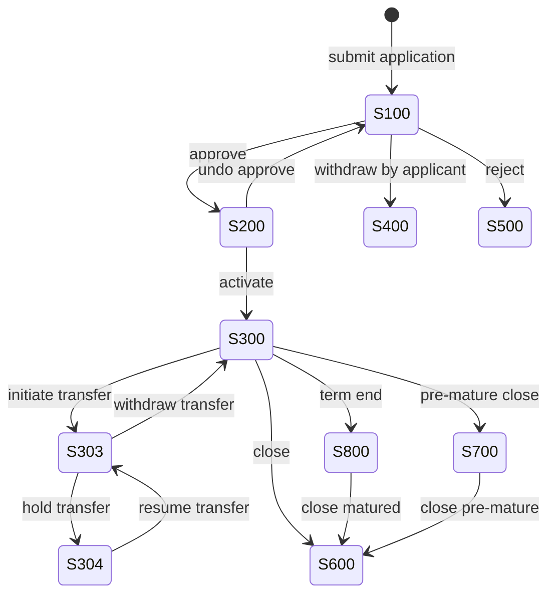

`SavingsAccount` is the root persistent entity for every deposit-style account in Apache Fineract. The same Java class — annotated for JPA single-table inheritance — backs ordinary savings, fixed deposit, and recurring deposit accounts; subclasses add columns through side tables rather than separate inheritance tables. Reading and understanding `SavingsAccount` is the prerequisite for everything else in this section.

The source file is `fineract-savings/src/main/java/org/apache/fineract/portfolio/savings/domain/SavingsAccount.java`. It is one of the longest classes in the codebase because it carries every column needed by the three subtypes, the timeline lifecycle, the interest computation surface, the on-hold ledger, and dormancy tracking. This page walks through the headline columns and then the status machine.

## JPA mapping

```java
@Entity
@Table(name = "m_savings_account",
       uniqueConstraints = { @UniqueConstraint(columnNames = { "account_no" }, name = "sa_account_no_UNIQUE"),
                             @UniqueConstraint(columnNames = { "external_id" }, name = "sa_external_id_UNIQUE") })
@Inheritance(strategy = InheritanceType.SINGLE_TABLE)
@DiscriminatorColumn(name = "deposit_type_enum", discriminatorType = DiscriminatorType.INTEGER)
@DiscriminatorValue("100")
public class SavingsAccount extends AbstractPersistableCustom<Long> { ... }
```

* The table is `m_savings_account`, the same table used by `FixedDepositAccount` (`@DiscriminatorValue("200")`) and `RecurringDepositAccount` (`@DiscriminatorValue("300")`).
* `account_no` is the public-facing 20-character unique identifier; `external_id` is the optional foreign system handle.
* Inheritance is `SINGLE_TABLE`, so the schema carries every column for every subtype. Columns unused by ordinary savings (term, maturity date, pre-closure penalty) are nullable.

## Headline columns

| Column | Java field | Notes |
|--------|------------|-------|
| `account_no` | `accountNumber` | 20-char unique account number, generated by `AccountNumberGenerator` |
| `external_id` | `externalId` | Optional secondary unique id, type `ExternalId` |
| `client_id` | `client` | Owner — exactly one of client or group must be set |
| `group_id` | `group` | Group owner for group savings |
| `gsim_id` | `gsim` | Optional parent in a `GroupSavingsIndividualMonitoring` set |
| `product_id` | `product` | Mandatory FK to `m_savings_product` |
| `field_officer_id` | `savingsOfficer` | Currently assigned officer; history in `savingsOfficerHistory` |
| `status_enum` | `status` | Integer code from `SavingsAccountStatusType` — see below |
| `sub_status_enum` | `sub_status` | Dormancy sub-status (active/inactive/dormant/escheat) |
| `account_type_enum` | `accountType` | `AccountType` — INDIVIDUAL, GROUP, JLG |
| `deposit_type_enum` | discriminator | 100/200/300/400 — controls the JPA subclass |
| `submittedon_date` | `submittedOnDate` | Lifecycle timestamps with paired `*on_userid` columns |
| `approvedon_date`, `activatedon_date`, `closedon_date`, `rejectedon_date`, `withdrawnon_date` | | One per terminal-or-progressing state |
| `nominal_annual_interest_rate` | | Inherited from the product but stored on the account so it can diverge |
| `interest_compounding_period_enum` | | `SavingsCompoundingInterestPeriodType` code |
| `interest_posting_period_enum` | | `SavingsPostingInterestPeriodType` code |
| `interest_calculation_type_enum` | | `SavingsInterestCalculationType` — DAILY_BALANCE or AVERAGE_DAILY_BALANCE |
| `interest_calculation_days_in_year_type_enum` | | 360 or 365 |
| `min_required_opening_balance` | | Enforced on first deposit |
| `lockin_period_frequency`, `lockin_period_frequency_enum` | | Withdrawal restriction window after activation |
| `lockedin_until_date_derived` | | Computed lock-end date |
| `withdrawal_fee_for_transfer` | | Toggle for charging on inter-account transfers |
| `allow_overdraft`, `overdraft_limit` | | Overdraft configuration |
| `nominal_annual_interest_rate_overdraft`, `min_overdraft_for_interest_calculation` | | Overdraft interest |
| `enforce_min_required_balance`, `min_required_balance` | | Minimum balance enforcement |
| `is_lien_allowed`, `max_allowed_lien_limit` | | Lien support |
| `on_hold_funds_derived` | | Sum of active holds |
| `min_balance_for_interest_calculation` | | Threshold below which no interest is computed |
| `withhold_tax`, `tax_group_id` | | Withholding tax via a `TaxGroup` definition |
| `accrued_till_date` | | Last accrual posting date (used by the accrual job) |
| `last_closed_business_date` | | Last COB-closed date affecting this account |
| `total_savings_amount_on_hold` | | Tracks the running held-funds total |
| `reason_for_block` | | Free-text block reason for blocked accounts |

The fields are populated by the static factory `SavingsAccount.createNewApplicationForSubmittal(...)` (which sets `status = SUBMITTED_AND_PENDING_APPROVAL`) and mutated by domain methods like `approveApplication`, `activate`, `close`, `undoApplicationApproval`, `withdraw`, and `rejectApplication`.

## Embedded summary

```java
@Embedded
protected SavingsAccountSummary summary;
```

`SavingsAccountSummary` keeps the running totals (`totalDeposits`, `totalWithdrawals`, `totalInterestPosted`, `totalFeeCharge`, `totalPenaltyCharge`, `totalWithdrawalFees`, `totalAnnualFees`, `totalOverdraftInterestDerived`, `totalWithholdTax`, `accountBalance`) so that read endpoints do not have to re-aggregate `m_savings_account_transaction` on every request. The summary is updated by the same domain methods that append transactions.

## Child collections

```java
@OneToMany(cascade = ALL, mappedBy = "savingsAccount", orphanRemoval = true, fetch = LAZY)
private List<SavingsAccountTransaction> transactions = new ArrayList<>();

@OneToMany(cascade = ALL, mappedBy = "savingsAccount", orphanRemoval = true, fetch = LAZY)
private Set<SavingsAccountCharge> charges = new HashSet<>();

@OneToMany(cascade = ALL, mappedBy = "savingsAccount", orphanRemoval = true, fetch = LAZY)
private Set<SavingsOfficerAssignmentHistory> savingsOfficerHistory = new HashSet<>();
```

* `transactions` is the immutable, chronologically appended ledger of every credit and debit. See [Savings transactions](/savings/savings-transactions).
* `charges` are recurring or one-off fees defined per account, copied from the product on activation. See [Savings charges](/savings/savings-charges).
* `savingsOfficerHistory` tracks every change of the assigned `Staff` officer.

A separate `@OneToMany(mappedBy = "account")` collection holds `DepositAccountOnHoldTransaction` rows — these are the lien/hold and release entries that affect `on_hold_funds_derived` without touching the main transaction ledger.

## Status machine

Status is an integer column read through `SavingsAccountStatusType.fromInt`. The valid codes are:

| Code | Enum | Meaning |
|------|------|---------|
| 100 | `SUBMITTED_AND_PENDING_APPROVAL` | Application captured, awaiting reviewer |
| 200 | `APPROVED` | Approved but not yet activated |
| 300 | `ACTIVE` | Open for transactions |
| 303 | `TRANSFER_IN_PROGRESS` | Inter-branch transfer initiated |
| 304 | `TRANSFER_ON_HOLD` | Transfer paused |
| 400 | `WITHDRAWN_BY_APPLICANT` | Applicant cancelled before approval |
| 500 | `REJECTED` | Reviewer rejected the application |
| 600 | `CLOSED` | Manually closed by user |
| 700 | `PRE_MATURE_CLOSURE` | Fixed/Recurring deposit closed before maturity |
| 800 | `MATURED` | Fixed/Recurring deposit term ended |



Domain helpers like `isSubmittedAndPendingApproval()`, `isApproved()`, `isActive()`, `isClosed()`, and `isMatured()` check the current code; all guard methods (`isNotActive`, `isClosed`) throw `SavingsAccountTransactionsException` when a caller attempts an operation that the current state does not allow.

### Sub-status (dormancy)

`sub_status_enum` is a parallel integer encoding dormancy — `NONE`, `INACTIVE`, `DORMANT`, `ESCHEAT`. It is driven by the [`UPDATE_SAVINGS_DORMANT_ACCOUNTS` job](/savings/savings-jobs) and reads the product's `daysToInactive` / `daysToDormancy` / `daysToEscheat` thresholds (only meaningful when `is_dormancy_tracking_active` is set on the product).

## Lifecycle commands

The command bus mediates every status transition. Typical command actions on the `SAVINGSACCOUNT` entity:

| Action | Effect | Resulting status |
|--------|--------|------------------|
| `CREATE` | Submit application | 100 |
| `APPROVE` | Approve application | 200 |
| `UNDOAPPROVAL` | Undo approval | 100 |
| `WITHDRAW` | Applicant cancels | 400 |
| `REJECT` | Reviewer rejects | 500 |
| `ACTIVATE` | Open the account | 300 |
| `CLOSE` | Close the account (zero balance, settle interest) | 600 |
| `DEPOSIT` / `WITHDRAWAL` | Append a transaction | 300 (unchanged) |
| `POSTINTEREST` | Manually post interest | 300 (unchanged) |
| `BLOCK` / `UNBLOCK` | Toggle blocked sub-state | 300 (sub-status changes) |
| `HOLDAMOUNT` / `RELEASEAMOUNT` | Place or release a hold | 300 (`on_hold_funds_derived` changes) |

Fixed and recurring deposit accounts add `PREMATURECLOSE`, `CALCULATEINTEREST`, and (RD) `DEPOSIT` semantics tied to installments.

## Key behaviour on the entity

* `activate(LocalDate, ...)` sets `activatedon_date`, computes `lockedin_until_date_derived` from the lock-in period, and transitions to ACTIVE.
* `calculateInterestUsing(MathContext, LocalDate, boolean, ...)` reads the account's posting and compounding periods to produce a list of `PostingPeriod`s. The job uses this directly.
* `getRunningBalanceOnDate(...)` and `getAccountBalance()` provide synchronous balance queries used by the API.
* `holdFunds(BigDecimal, ...)` and `releaseFunds(...)` create `DepositAccountOnHoldTransaction` rows without touching the ordinary ledger and bump `on_hold_funds_derived`.
* `closeAccount(...)` validates the zero-balance precondition and, when applicable (fixed/recurring), pushes accrued interest to the linked target savings account.

## Where to look next

For the product configuration that gets copied into the columns above, see [SavingsProduct](/savings/savings-product). For the transaction stream rooted at `transactions`, see [Savings transactions](/savings/savings-transactions). For the fee rows in `charges`, see [Savings charges](/savings/savings-charges). For the subclasses that override key methods, see [Fixed deposits](/savings/fixed-deposits) and [Recurring deposits](/savings/recurring-deposits).

## Static factories

The class exposes two creation paths used by the application layer:

```java
public static SavingsAccount createNewApplicationForSubmittal(
        final Client client,
        final Group group,
        final SavingsProduct product,
        final Staff fieldOfficer,
        final String accountNo,
        final ExternalId externalId,
        final AccountType accountType,
        final LocalDate submittedOnDate,
        final AppUser submittedBy,
        ...) {
    final SavingsAccountStatusType status = SavingsAccountStatusType.SUBMITTED_AND_PENDING_APPROVAL;
    return new SavingsAccount(client, group, product, fieldOfficer, accountNo, externalId,
            status, accountType, submittedOnDate, submittedBy, ...);
}
```

This is the "happy path" — accept an application, set status 100, copy product values, leave every approval/activation timestamp null. Tests construct accounts through the same factory.

The second factory `createNewActivatedAccount(...)` exists for migration paths that need to instantiate an account already in the ACTIVE state — typically when loading data from a legacy system. The validator on it is stricter (every previously-null timestamp must be supplied).

## Behaviour: the interest cycle

`SavingsAccount.calculateInterestUsing(MathContext mc, LocalDate upToDate, boolean isInterestTransfer, ...)` is the central method that drives interest. It:

1. Reads the running list of `SavingsAccountTransaction`s ordered by date.
2. Walks each posting period defined by `interestPostingPeriodType`, building a `PostingPeriod` per boundary.
3. For each `PostingPeriod`, calls into the compounding helper to layer daily balances and apply the rate appropriate to the compounding cadence.
4. Returns the list of computed posting amounts, ready to be materialised as `INTEREST_POSTING (3)` transactions by the caller (either the `POST_INTEREST_FOR_SAVINGS` job or a manual `POSTINTEREST` command).

When `withHoldTax` is true, each posting also generates a `WITHHOLD_TAX (18)` transaction that reduces the credit by the configured tax percentage; the tax breakdown by component is recorded on `SavingsAccountTransactionTaxDetails`.

## Behaviour: holds and releases

`holdFunds(BigDecimal amount, LocalDate date, AppUser user, String reason)` appends a `DepositAccountOnHoldTransaction` row, increments `on_hold_funds_derived`, and (when `lienAllowed`) checks against `max_allowed_lien_limit`. The held funds are *invisible* to the principal balance and the running ledger, but they reduce the *withdrawable* balance reported by the read service.

`releaseFunds(BigDecimal amount, LocalDate date, AppUser user)` is the reverse and decrements `on_hold_funds_derived`. Releases cannot exceed the cumulative holds.

## Validation hot spots

The account enforces several invariants every time it mutates:

* Only one of `client_id` and `group_id` is non-null.
* `account_no` is unique within the tenant.
* Any deposit before `activatedon_date` is rejected.
* Any withdrawal that would push the balance below `min_required_balance` (when `enforce_min_required_balance` is true) is rejected unless an overdraft is configured and within `overdraft_limit`.
* Pre-lock-in withdrawals (`lockedin_until_date_derived > today`) are rejected.

Failures surface as `SavingsAccountTransactionsException` with a translation key the API layer maps to a 400 response.

## Performance notes

`transactions` is a LAZY collection — touching `account.getTransactions()` triggers a SELECT against `m_savings_account_transaction`. For accounts with thousands of transactions (large microfinance branches), the writes services prefer the bulk-paginated read services rather than walking the JPA collection.

The interest calculation walks all transactions for the posting period, but a balance cache is held on the embedded `SavingsAccountSummary` so dashboard reads do not re-aggregate.

## Read services and listings

Account listings, single-account drill-down, and per-period balance queries are served by `SavingsAccountReadPlatformServiceImpl`. The dashboards live at:

* `GET /v1/savingsaccounts` — paged list with status filters.
* `GET /v1/savingsaccounts/{id}` — full account view with embedded summary, charges, and (with `?associations=transactions`) the transaction history.
* `GET /v1/savingsaccounts/{id}/transactions` — transactions paged.
* `GET /v1/savingsaccounts/template` — defaults for new applications.

The read service uses JdbcTemplate and skips JPA entirely, which keeps response times deterministic.

## Common debugging recipes

**The account shows ACTIVE but withdrawals are rejected.**
Check `sub_status_enum` — the account may be INACTIVE or DORMANT, which the dormancy job sets without changing the main status. The validator may also flag `lockedin_until_date_derived > today`.

**The summary balance disagrees with the running balance on the last transaction.**
The `SavingsAccountSummary` row is updated by domain methods. If a transaction was inserted via SQL or a botched migration, the summary may have drifted. The `recalculateInterest` command path will rebuild it; alternatively the read service computes it from scratch on each call.

**Two accounts have the same account number.**
The `account_no` column has a unique constraint, so this should be impossible — unless the row was inserted across tenants. The constraint is per-table, not per-tenant-shard.

**Approval failed silently.**
The platform always logs to `m_command_source` first. Inspect that table for the failed command and read the `result_error_message` column for the exception.

## Cross-cutting concerns

* **Multi-tenancy** — every `m_savings_account` row lives in a tenant-specific schema or database. The `AccountType` enum is shared.
* **Audit columns** — `created_date`, `lastmodified_date`, `created_by`, `lastmodified_by` are populated by JPA listeners; the account does not write them manually.
* **Soft deletion** — `SavingsAccount` is never deleted; the only "destruction" is the `CLOSED` status terminating its lifecycle.
* **Currency** — the `MonetaryCurrency` embeddable on the product propagates to the account at creation; account-level currency cannot diverge from the product.
* **External id** — `external_id` lets foreign systems reference the account without exposing the platform's internal id. Set once at creation and immutable thereafter.


