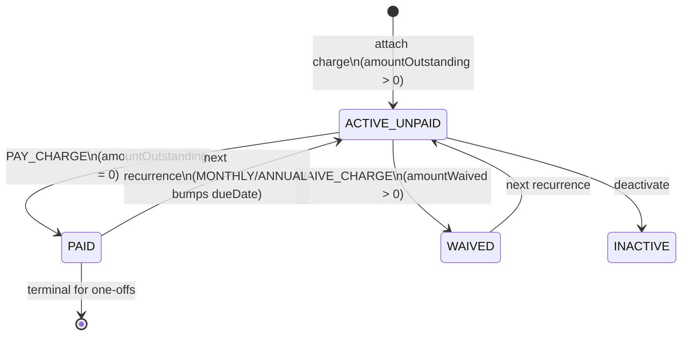
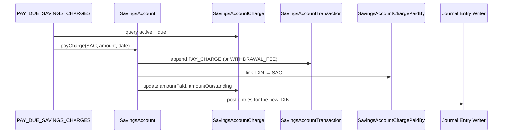
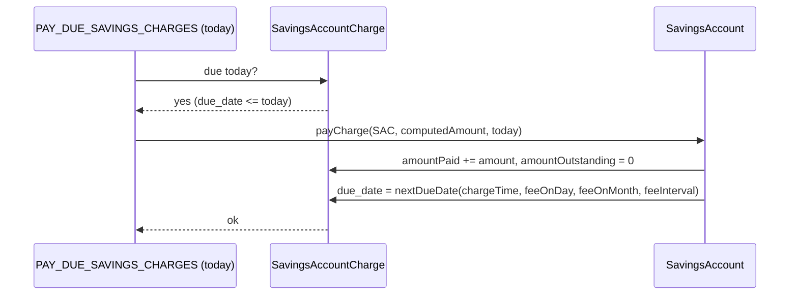

`SavingsAccountCharge` is the per-account row that represents any fee or penalty attached to a savings, fixed deposit, or recurring deposit account. Where the shared `Charge` definition (from `fineract-core`) describes a *template* — a monthly maintenance fee, an annual fee, a specified-due-date penalty — the savings-account charge tracks how much of it remains outstanding, when it's next due, how much has been paid or waived, and whether the user has earned a free-withdrawal allowance.

The class is `fineract-savings/src/main/java/org/apache/fineract/portfolio/savings/domain/SavingsAccountCharge.java`. The same pattern exists on the loan side (`LoanCharge`), so if you have read `/loan/loan-charges` the structure here will be familiar.

## JPA mapping

```java
@Entity
@Table(name = "m_savings_account_charge")
public class SavingsAccountCharge extends AbstractPersistableCustom<Long> {

    @ManyToOne(optional = false)
    @JoinColumn(name = "savings_account_id", referencedColumnName = "id", nullable = false)
    private SavingsAccount savingsAccount;

    @ManyToOne(optional = false)
    @JoinColumn(name = "charge_id", referencedColumnName = "id", nullable = false)
    private Charge charge;

    @Column(name = "charge_time_enum",        nullable = false) private Integer chargeTime;
    @Column(name = "charge_due_date")                            private LocalDate dueDate;
    @Column(name = "fee_on_month")                               private Integer feeOnMonth;
    @Column(name = "fee_on_day")                                 private Integer feeOnDay;
    @Column(name = "fee_interval")                               private Integer feeInterval;
    @Column(name = "charge_calculation_enum")                    private Integer chargeCalculation;
    @Column(name = "free_withdrawal_count")                      private Integer freeWithdrawalCount;
    @Column(name = "charge_reset_date")                          private LocalDate chargeResetDate;
    @Column(name = "calculation_percentage", scale = 6, precision = 19) private BigDecimal percentage;
    @Column(name = "calculation_on_amount",  scale = 6, precision = 19) private BigDecimal amountPercentageAppliedTo;
    @Column(name = "amount",                 scale = 6, precision = 19, nullable = false) private BigDecimal amount;
    @Column(name = "amount_paid_derived",      scale = 6, precision = 19) private BigDecimal amountPaid;
    @Column(name = "amount_waived_derived",    scale = 6, precision = 19) private BigDecimal amountWaived;
    @Column(name = "amount_writtenoff_derived",scale = 6, precision = 19) private BigDecimal amountWrittenOff;
    @Column(name = "amount_outstanding_derived",scale = 6, precision = 19, nullable = false) private BigDecimal amountOutstanding;
    @Column(name = "is_penalty",  nullable = false) private boolean penaltyCharge = false;
    @Column(name = "is_paid_derived", nullable = false) private boolean paid = false;
    @Column(name = "waived",      nullable = false) private boolean waived = false;
    @Column(name = "is_active",   nullable = false) private boolean status = true;
    @Column(name = "inactivated_on_date") private LocalDate inactivationDate;
}
```

## Charge time types

The `chargeTime` integer encodes when the fee applies. The savings-relevant values from `ChargeTimeType` (in `fineract-core`):

| Code | Enum | Meaning |
|------|------|---------|
| 2 | `SPECIFIED_DUE_DATE` | One-off fee on a chosen date |
| 3 | `SAVINGS_ACTIVATION` | Applied automatically on activation |
| 4 | `SAVINGS_CLOSURE` | Applied when the account is closed |
| 5 | `WITHDRAWAL_FEE` | Levied on each withdrawal (subject to `freeWithdrawalCount`) |
| 6 | `ANNUAL_FEE` | Yearly recurring on `feeOnMonth`/`feeOnDay` |
| 7 | `MONTHLY_FEE` | Monthly recurring on `feeOnDay` with `feeInterval` months |
| 10 | `OVERDRAFT_FEE` | Charged on overdraft usage |
| 11 | `WEEKLY_FEE` | Weekly recurring |

`DISBURSEMENT (1)`, `INSTALMENT_FEE (8)`, and `OVERDUE_INSTALLMENT (9)` belong to loans and never apply to savings. The validator `ChargeTimeType.validValuesForSavings()` returns exactly the set above.

## Charge calculation types

`chargeCalculation` is a `ChargeCalculationType` code controlling how the actual amount is computed:

* `FLAT` — use `amount` directly.
* `PERCENT_OF_AMOUNT` — `amount = percentage * amountPercentageAppliedTo / 100`. For withdrawal fees, `amountPercentageAppliedTo` is the withdrawal amount; for monthly fees it can be the running balance.

The combination `(chargeTime, chargeCalculation)` is enough to predict how every fee will move money.

## Lifecycle of an account-level charge



* Recurring fees (`MONTHLY_FEE`, `ANNUAL_FEE`, `WEEKLY_FEE`) flip back to ACTIVE_UNPAID once the job posts the next due date.
* One-off fees (`SPECIFIED_DUE_DATE`, `SAVINGS_ACTIVATION`, `SAVINGS_CLOSURE`) are terminal once paid or waived.

## How a charge becomes a transaction

When the `PAY_DUE_SAVINGS_CHARGES` job runs, or a user explicitly pays a charge through the API, the platform:

1. Reads the due `SavingsAccountCharge` rows.
2. For each, calls `SavingsAccount.payCharge(charge, amount, date, ...)`.
3. That method appends a `SavingsAccountTransaction` of type `PAY_CHARGE (7)` — or, for the special `WITHDRAWAL_FEE`, `WITHDRAWAL_FEE (4)` — and a `SavingsAccountChargePaidBy` linker row joining the transaction to the charge.
4. The charge's `amountPaid` and `amountOutstanding` derived fields are updated.



## Waivers

A waiver does *not* move money on the savings side — it merely zeroes the receivable from the customer's perspective. The flow is:

1. Command `WAIVE_CHARGE_SAVINGSACCOUNT` is issued.
2. `SavingsAccount.waiveCharge(charge, ...)` appends a `WAIVE_CHARGES (6)` transaction with the waived amount, but no `TransactionEntryType` (so no journal entry runs by default).
3. The charge's `amountWaived` increases, `amountOutstanding` decreases, and `waived = true` once fully waived.

If your deployment is configured to post income reversal on waivers, the accounting writer can be wired to post a Cr-fee-income/Dr-fee-loss pair via product configuration, but this is opt-in.

## Withdrawal fees and free withdrawals

When a `WITHDRAWAL_FEE` charge is attached and the account makes a withdrawal:

* If `freeWithdrawalCount > 0` and the count has not been consumed in the current calendar period, the fee is skipped and the running counter decrements.
* Otherwise the fee is computed and a `WITHDRAWAL_FEE (4)` transaction is appended.

`chargeResetDate` records when the free-withdrawal counter was last reset, so the platform can refill it once per month (or whatever cadence the product chose). This is one of the few places where a charge directly observes user behaviour rather than the calendar.

## Cross-references and contrast with loans

The savings charge pattern parallels the loan charge pattern documented under [Loan charges](/loan/loan-charges):

| Aspect | Savings | Loan |
|--------|---------|------|
| Entity | `SavingsAccountCharge` | `LoanCharge` |
| Paying transaction type | `PAY_CHARGE` (7) or `WITHDRAWAL_FEE` (4) | `REPAYMENT_AT_DISBURSEMENT`, `CHARGE_PAYMENT`, fee components |
| Recurring patterns | MONTHLY_FEE, ANNUAL_FEE, WEEKLY_FEE | INSTALMENT_FEE driven by repayment schedule |
| Free-allowance counter | `freeWithdrawalCount` | n/a |
| Penalty flag | `is_penalty` | `is_penalty` |
| Waiver | `WAIVE_CHARGES` (6) tx | Loan transaction type `WAIVE_CHARGES` |
| Linker | `m_savings_account_charge_paid_by` | `m_loan_charge_paid_by` |

Both share the same parent `Charge` definition and the same `ChargeCalculationType` semantics.

## Jobs that touch savings charges

* `PAY_DUE_SAVINGS_CHARGES` — applies due monthly/annual/weekly fees by creating PAY_CHARGE or ANNUAL_FEE transactions.
* `APPLY_ANNUAL_FEE_FOR_SAVINGS` — specialised path for `ANNUAL_FEE (5)` rollover.
* `TRANSFER_FEE_CHARGE_FOR_LOANS` — handles the *loan*-side fee transfer from a savings account.

See [Savings jobs](/savings/savings-jobs) for trigger configuration.

## Where to read on

* [SavingsAccount](/savings/savings-account) — the entity that owns the charges collection.
* [Savings transactions](/savings/savings-transactions) — the destination of every charge-paying transaction.
* [SavingsProduct](/savings/savings-product) — the product-level `Charge` set that seeds account charges.

## How a recurring fee advances its due date

Monthly, weekly, and annual fees keep their `m_savings_account_charge` row alive for the life of the account; only the `charge_due_date` is bumped after each successful payment.



For an `ANNUAL_FEE` due on the 5th of June at `feeInterval = 1`, the next due date is one year later. For a `MONTHLY_FEE` with `feeOnDay = 1` and `feeInterval = 1`, it's the 1st of next month. For a `MONTHLY_FEE` with `feeInterval = 3`, it's 1st of three months later (effectively quarterly without changing the enum).

## Reset of free-withdrawal counters

When `freeWithdrawalCount` is configured on a `WITHDRAWAL_FEE`, the counter is decremented per withdrawal and reset on a periodic boundary. `chargeResetDate` is the last reset; the platform compares it against the current period boundary to decide whether to refill the counter:

```java
if (chargeResetDate.isBefore(currentPeriodBoundary)) {
    counter = freeWithdrawalCount;   // refill
    chargeResetDate = currentPeriodBoundary;
}
```

The "period boundary" is typically the first of the calendar month for monthly products. Refill happens lazily — the first withdrawal in a new period refills before deciding whether the fee applies.

## Penalty vs ordinary fee

`is_penalty` is a boolean column that distinguishes a penalty from an ordinary fee. The distinction matters for:

* **Accounting** — penalties post to a different GL income account than ordinary fees.
* **Reporting** — penalty income is broken out on the income statement.
* **Waivers** — operators may have different permissions for waiving penalties vs ordinary fees.

The `Charge` base definition carries `is_penalty`, and the per-account charge inherits it on attachment.

## Multi-currency considerations

A charge inherits its currency from the savings account's product, not from the `Charge` template. This means a flat ₹100 charge on an INR account and a flat $100 charge on a USD account come from the *same* template — the currency context decides the actual unit.

The validator refuses to attach a `Charge` whose `currency_code` is set and disagrees with the savings account currency, to prevent operational mistakes where charge templates are copied across currency contexts.

## Audit and immutability

Once paid or waived, a `SavingsAccountCharge` row's monetary columns are immutable. To "undo" a paid charge, operators reverse the paying `SavingsAccountTransaction`. The reversal propagates back to the charge: `amountPaid` decreases, `amountOutstanding` increases, `paid` flips to false.

This is the same reversal semantics used for ordinary deposits and withdrawals — there is no special path for charges.

## Inactivating a charge

A charge can be deactivated (`is_active = false`) without being paid. This freezes any further automatic application (the job skips inactive rows) but preserves the historical paid/waived state.

`inactivation_date` records when the deactivation happened. Reactivating is allowed; the next recurrence cycle picks up from the current due date.

## API surface

| Method | Path | Operation |
|--------|------|-----------|
| GET | `/v1/savingsaccounts/{accountId}/charges` | List charges |
| POST | `/v1/savingsaccounts/{accountId}/charges` | Attach a charge to the account |
| PUT | `/v1/savingsaccounts/{accountId}/charges/{chargeId}` | Mutate charge config |
| POST | `/v1/savingsaccounts/{accountId}/charges/{chargeId}?command=waive` | Waive remaining outstanding |
| POST | `/v1/savingsaccounts/{accountId}/charges/{chargeId}?command=pay` | Pay early |
| POST | `/v1/savingsaccounts/{accountId}/charges/{chargeId}?command=inactivate` | Deactivate |
| DELETE | `/v1/savingsaccounts/{accountId}/charges/{chargeId}` | Detach (only when never paid) |

## Common edge cases

* **Charge added after activation**: legal but the platform does not retroactively apply it to past periods. The first due date is computed from `now()`.
* **Charge with a `dueDate` in the past at attachment time**: the validator rejects it; charges must be attached prospectively.
* **Charge amount changed mid-life**: only affects future occurrences. Already-paid amounts are unchanged.
* **Charge fully waived**: the charge stays attached and stays active, but the next recurring cycle starts fresh — waivers are per-occurrence, not permanent.
* **Multiple withdrawal fees**: legal. Each withdrawal causes each attached `WITHDRAWAL_FEE` to fire (subject to its free-withdrawal counter).
* **Charge on a closed account**: blocked. The validator refuses charges on `CLOSED (600)` accounts. To collect a late penalty, reopen the account first or use a separate dispute mechanism.

## Charge and balance interplay

A common operational question is: *what happens when a charge falls due but the account balance is insufficient?* Two scenarios:

1. **Overdraft is allowed and within limit**: the charge is paid, balance goes negative. An `OVERDRAFT_INTEREST (17)` debit may follow on the next interest cycle.
2. **No overdraft (or limit exceeded)**: the charge is not paid; `amountOutstanding` stays positive. The charge remains overdue until the customer deposits enough to cover it. Some products configure a *penalty* charge that applies after N days of unpaid charge — a charge-on-charge.

The `PAY_DUE_SAVINGS_CHARGES` job logs failed payments but continues with the next account. Operators can review the failures and intervene.

## Permissions

The standard share permissions are:

* `READ_SAVINGSCHARGE` — view charges on accounts.
* `CREATE_SAVINGSCHARGE` — attach a new charge.
* `UPDATE_SAVINGSCHARGE` — modify charge config (date, amount).
* `DELETE_SAVINGSCHARGE` — detach a never-paid charge.
* `WAIVE_SAVINGSCHARGE` — waive outstanding.
* `PAY_SAVINGSCHARGE` — manually pay a charge.

A typical roles configuration grants `WAIVE_SAVINGSCHARGE` only to supervisors.


