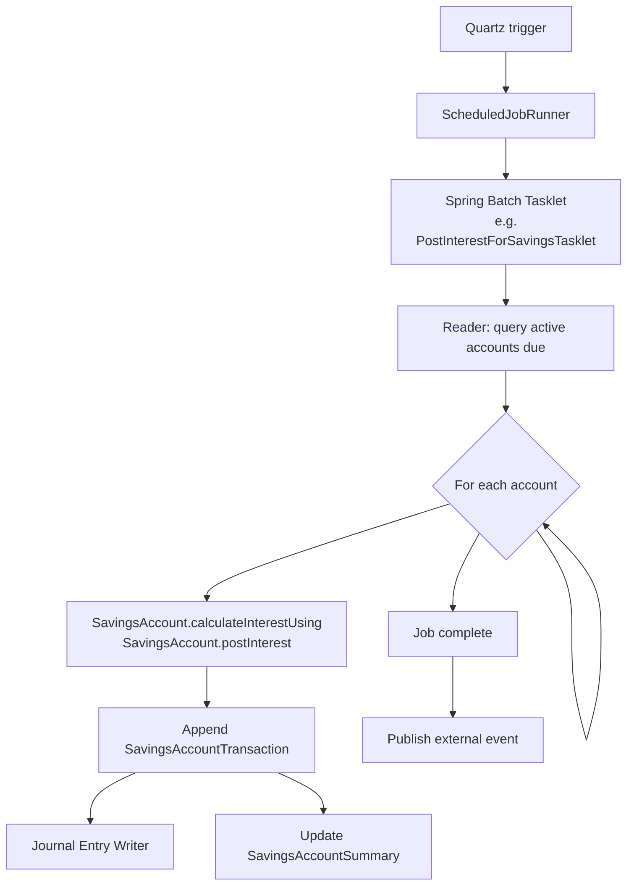
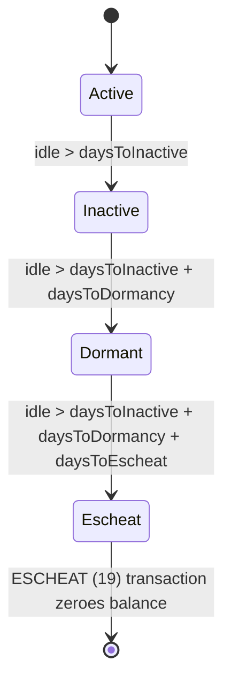

A working savings subsystem leans on a handful of scheduled jobs to do the work that can't be tied to user actions: periodically posting accrued interest, applying recurring fees, rolling matured deposits, generating future RD installments, marking dormancy, and accruing income. This page enumerates the savings-flavoured jobs declared in `JobName`, their cadence, what they touch, and which page covers the entity side.

The job names come from `fineract-core/src/main/java/org/apache/fineract/infrastructure/jobs/service/JobName.java`. Each one is registered through Spring Batch + Quartz, configurable in `m_scheduled_job_detail`, and can be triggered ad-hoc through `POST /v1/jobs/{jobName}` if the job is marked manually executable.

## The savings-side jobs

| Job name (enum) | Display name | What it does |
|-----------------|--------------|--------------|
| `POST_INTEREST_FOR_SAVINGS` | Post Interest For Savings | At each posting-period boundary, materialise accrued interest as `INTEREST_POSTING (3)` transactions on every active savings, FD, and RD account |
| `PAY_DUE_SAVINGS_CHARGES` | Pay Due Savings Charges | Walk active `SavingsAccountCharge` rows whose `dueDate` is today; debit the account with `PAY_CHARGE (7)` and link the paying transaction |
| `APPLY_ANNUAL_FEE_FOR_SAVINGS` | Apply Annual Fee For Savings | Specialised path for `ANNUAL_FEE (5)` charge rollover |
| `TRANSFER_INTEREST_TO_SAVINGS` | Transfer Interest To Savings | On FD/RD accounts with `transferInterestToLinkedAccount = true`, transfer the just-posted interest from the term deposit to the linked savings account |
| `TRANSFER_FEE_CHARGE_FOR_LOANS` | Transfer Fee For Loans From Savings | Move loan-side fees off a designated savings account into the loan ledger |
| `GENERATE_RD_SCEHDULE` | Generate Mandatory Savings Schedule | Refill the installment horizon on recurring deposits so the schedule never runs out |
| `UPDATE_DEPOSITS_ACCOUNT_MATURITY_DETAILS` | Update Deposit Accounts Maturity details | Sweep matured FD/RD accounts, post final interest, transition to `MATURED`, and dispose per `DepositAccountOnClosureType` |
| `UPDATE_SAVINGS_DORMANT_ACCOUNTS` | Update Savings Dormant Accounts | Compute `sub_status_enum` (INACTIVE / DORMANT / ESCHEAT) based on idle days and the product's dormancy thresholds |
| `ADD_PERIODIC_ACCRUAL_ENTRIES_FOR_SAVINGS_WITH_INCOME_POSTED_AS_TRANSACTIONS` | Add Accrual Transactions For Savings | When `accounting_type = ACCRUAL_PERIODIC`, materialise `ACCRUAL (10)` transactions so the income hits the GL ahead of the actual posting |
| `POST_DIVIDENTS_FOR_SHARES` | Post Dividends For Shares | Post declared share dividends to active shareholders' savings accounts as `DIVIDEND_PAYOUT (8)` |

## How a savings job typically works



Each tasklet processes accounts in chunks, committing per batch so a failure on one row doesn't roll back the whole run.

## POST_INTEREST_FOR_SAVINGS

Reads active savings accounts whose next posting-period boundary has elapsed. For each:

1. Recomputes the daily interest using the account's compounding period type, calculation type, days-in-year type.
2. Sums it into `INTEREST_POSTING (3)` transactions per posting boundary.
3. If `withHoldTax = true`, also emits a `WITHHOLD_TAX (18)` transaction proportional to each tax component.

The job is typically scheduled to run at end-of-day. For products with `interest_posting_period = DAILY`, this means a posting transaction every day; for `ANNUAL`, only on the boundary.

## UPDATE_SAVINGS_DORMANT_ACCOUNTS

For products with `is_dormancy_tracking_active = true`:



The job mutates `sub_status_enum` only; the main `status_enum` stays `ACTIVE = 300` until the escheat transaction posts.

## PAY_DUE_SAVINGS_CHARGES

A pass over `m_savings_account_charge` joined to `m_savings_account` filtered to:

* `is_active = true`
* `is_paid_derived = false`
* `charge_due_date <= today`

For each matched row, the job calls `SavingsAccount.payCharge(...)` which appends the appropriate transaction type (`PAY_CHARGE`, `ANNUAL_FEE`, `WITHDRAWAL_FEE`) and updates the charge's derived totals. Recurring fees (monthly/annual/weekly) have their `due_date` advanced to the next occurrence after a successful payment.

See [Savings charges](/savings/savings-charges) for the full lifecycle.

## TRANSFER_INTEREST_TO_SAVINGS

For each FD or RD account where `transfer_interest_to_linked_account = true` and a new `INTEREST_POSTING` has occurred since the previous run:

* Withdraw the interest amount from the term deposit (`WITHDRAWAL (2)`).
* Deposit it on the linked savings account (`transfer_to_savings_account_id`) as `DEPOSIT (1)`.

The pair is recorded with matching `payment_detail_id` so the audit trail makes it clear they are halves of the same transfer.

## GENERATE_RD_SCEHDULE

(Note the historical typo on `SCEHDULE`.) Walks `RecurringDepositAccount` rows and ensures the `RecurringDepositScheduleInstallment` list extends at least `installmentCount` periods into the future. Without this job, an RD whose original schedule was generated only for the first N installments would silently run out and start missing penalties. See [Recurring deposits](/savings/recurring-deposits).

## UPDATE_DEPOSITS_ACCOUNT_MATURITY_DETAILS

For FD and RD accounts whose `maturity_date <= today`:

1. Compute the final accrued interest up to the maturity date.
2. Post the last `INTEREST_POSTING` transaction.
3. Transition status to `MATURED (800)`.
4. Apply the `DepositAccountOnClosureType` disposition:
   * `WITHDRAW_DEPOSIT` — a `WITHDRAWAL (2)` to a payment detail.
   * `TRANSFER_TO_SAVINGS` — `WITHDRAWAL (2)` here + `DEPOSIT (1)` on the linked account.
   * `REINVEST_PRINCIPAL_AND_INTEREST` — open a new FD with the maturity amount.
   * `REINVEST_PRINCIPAL_ONLY` — open a new FD with the principal, pay out the interest.

## ADD_PERIODIC_ACCRUAL_ENTRIES_FOR_SAVINGS_WITH_INCOME_POSTED_AS_TRANSACTIONS

Used when the product's `accounting_type` is `ACCRUAL_PERIODIC`. The job pre-accrues interest expense in the GL before the posting transaction is actually written, by emitting `ACCRUAL (10)` transactions. This is critical for accurate trial-balance reports under accrual accounting.

## POST_DIVIDENTS_FOR_SHARES

Although it lives in the *shares* package (`fineract-provider/.../portfolio/shareaccounts/jobs/postdividentsforshares/`), this job touches savings: when a share-product dividend is approved, the job posts a `DIVIDEND_PAYOUT (8)` transaction on each shareholder's linked savings account. See [Share dividends](/shares/dividends).

## Scheduling and operations

Job records live in the table `m_scheduled_job_detail`:

| Column | Meaning |
|--------|---------|
| `job_name` | Display name from `JobName` |
| `cron_expression` | Quartz cron expression |
| `currently_running` | Concurrency guard |
| `is_misfired` | Whether the last fire missed its window |
| `scheduler_group` | Logical bucket for ops UIs |

Operators can:

* Update the cron via `PUT /v1/jobs/{jobId}`.
* Trigger manually via `POST /v1/jobs/{jobId}?command=executeJob`.
* Inspect history via `GET /v1/jobs/{jobId}/jobrunhistory`.

For the cross-platform mechanics (Quartz wiring, retry policy, the `ScheduledJobRunner` lifecycle) see the broader scheduler page; this page focuses on the savings-specific tasklets and the data they touch. A deeper drill-down is available at [Jobs deep dive — savings](/jobs/savings-jobs-deep-dive).

## Related pages

* [Savings transactions](/savings/savings-transactions) — every job writes one of these.
* [Savings charges](/savings/savings-charges) — what `PAY_DUE_SAVINGS_CHARGES` operates on.
* [Fixed deposits](/savings/fixed-deposits) and [Recurring deposits](/savings/recurring-deposits) — for `UPDATE_DEPOSITS_ACCOUNT_MATURITY_DETAILS` and `GENERATE_RD_SCEHDULE`.
* [Share dividends](/shares/dividends) — for `POST_DIVIDENTS_FOR_SHARES`.

## Typical operational schedule

A production deployment usually runs the savings-side jobs in this order each night:

| Order | Job | Why this order |
|-------|-----|----------------|
| 1 | `INCREASE_BUSINESS_DATE_BY_1_DAY` | Advance the platform's business date |
| 2 | `GENERATE_RD_SCEHDULE` | Ensure RD installments are ready for the day |
| 3 | `PAY_DUE_SAVINGS_CHARGES` | Apply due fees before interest posts so balances are correct |
| 4 | `APPLY_ANNUAL_FEE_FOR_SAVINGS` | Specialised annual rollover |
| 5 | `POST_INTEREST_FOR_SAVINGS` | Materialise accrued interest |
| 6 | `TRANSFER_INTEREST_TO_SAVINGS` | Move FD/RD interest to linked savings |
| 7 | `UPDATE_DEPOSITS_ACCOUNT_MATURITY_DETAILS` | Roll matured FDs/RDs |
| 8 | `UPDATE_SAVINGS_DORMANT_ACCOUNTS` | Mark dormancy after today's posts |
| 9 | `ADD_PERIODIC_ACCRUAL_ENTRIES_FOR_SAVINGS_WITH_INCOME_POSTED_AS_TRANSACTIONS` | GL accrual if needed |
| 10 | `POST_DIVIDENTS_FOR_SHARES` | Post any approved share dividends |

The exact cron expressions are tenant-configured. The dependency between jobs is enforced not by Quartz triggers but by the ordering of `cron_expression` plus a degree of operational discipline — there is no built-in DAG.

## Failure semantics

Each tasklet processes in chunks (usually 100 accounts per chunk) and commits per chunk. A failure on one account:

* Marks the chunk failed.
* Spring Batch rolls back *just that chunk*, not the entire job.
* The exception is logged with the account id.
* The job continues with the next chunk.

At end-of-job, if any chunks failed, the tasklet aggregates the exceptions and throws `JobExecutionException`. The job-run-history table records:

| Column | Meaning |
|--------|---------|
| `job_id` | FK to the job |
| `start_time` / `end_time` | Wall-clock duration |
| `status` | SUCCESS / FAILED / IN_PROGRESS |
| `error_message` | Concatenated exceptions |
| `trigger_type` | CRON / MANUAL |
| `version` | Optimistic concurrency token |

Operators can then re-run the failed accounts manually or fix the underlying data issue.

## Manual triggers

Most savings jobs accept a manual trigger through the jobs API:

```
POST /v1/jobs/{jobId}?command=executeJob
```

with permission `EXECUTE_JOB`. The job runs in a *separate* thread (the request returns immediately) and writes to the same `job_run_history` table.

For per-account ad-hoc runs (e.g. "post interest just on this account"), the API resource exposes `POST /v1/savingsaccounts/{accountId}/transactions?command=postInterestAsOn` — this bypasses the scheduler and invokes the same domain method directly.

## How interest posting handles back-dated transactions

The `POST_INTEREST_FOR_SAVINGS` job is idempotent on a given posting period — calling it twice does not double-post — but back-dated deposits between runs can change the answer for a period that has already been posted.

The platform handles this by *reposting*. When the job sees an active account whose last `INTEREST_POSTING` row is older than the new business date, it walks every posting period from the last posted boundary forward. If the recalculated amount differs from what was already posted, the original posting is reversed and a corrected posting is written.

This is why `running_balance_derived` recomputation is part of the job's per-chunk work, not a separate cleanup.

## Tax withholding and the interest job

When `withHoldTax = true` on the account, the interest job:

1. Computes the gross interest for the posting period.
2. Writes `INTEREST_POSTING (3)` for the gross.
3. Writes `WITHHOLD_TAX (18)` for the tax amount.
4. Writes `SavingsAccountTransactionTaxDetails` rows per tax component.

The net credit visible to the customer is `gross - tax`. Account balance reflects only the net.

## Where to look in the source

* The scheduler core lives in `fineract-core/.../infrastructure/jobs/`.
* Per-job tasklets for savings live alongside their domain code:
  * `fineract-provider/.../portfolio/savings/jobs/postinterestforsavings/`
  * `fineract-provider/.../portfolio/savings/jobs/paydueamountsavings/`
  * `fineract-provider/.../portfolio/savings/jobs/transferinterest/`
  * `fineract-provider/.../portfolio/savings/jobs/updatesavingsdormancy/`
  * `fineract-provider/.../portfolio/savings/jobs/updatedepositmaturity/`
  * `fineract-provider/.../portfolio/savings/jobs/generaterdschedule/`
* The shares dividend job: `fineract-provider/.../portfolio/shareaccounts/jobs/postdividentsforshares/`.

Each tasklet is configured via a Spring `*Config` class that registers it as a Spring Batch step.

## Monitoring

A working scheduler depends on three checks every morning:

* **Did each scheduled job run?** Inspect `job_run_history` for last night's date and verify the row count matches the configured catalogue.
* **Did each job complete successfully?** Filter `job_run_history.status = SUCCESS`.
* **Are there in-progress flags stuck?** A row in `m_scheduled_job_detail` with `currently_running = true` but no corresponding active thread suggests a crashed job; operators reset it manually.

Metrics — number of accounts processed, average per-account latency, exception counts — are exported through the actuator endpoints when the metrics module is enabled.

## Tuning notes

* **Chunk size** is configurable per job via the `cob_partition_size` or per-tasklet equivalent. Larger chunks reduce commit overhead but increase rollback risk.
* **Parallelism**: some jobs (notably `LOAN_COB` and `POST_INTEREST_FOR_SAVINGS`) support partitioning across multiple threads. Configure the partitioner in the tasklet's `*Config` class.
* **Read-only replicas**: read services can be pointed at read replicas to relieve the primary during long-running jobs; the write side must always hit the primary.
* **Business date**: never advance the business date past today's wall-clock date — most jobs assume `BusinessDate <= today`.

## Disabling or replacing a job

Each job can be:

* **Disabled** via `m_scheduled_job_detail.is_misfired = false, currently_running = false, scheduler_group = NULL`, or via the API: `PUT /v1/jobs/{jobId}` with `{ "active": false }`.
* **Reconfigured** to a custom cron expression through the same endpoint.
* **Replaced** by writing a custom tasklet in your fork and registering it with the same `JobName`; you would then exclude the Apache implementation via Spring configuration.

For most deployments, the default schedule works without modification.


