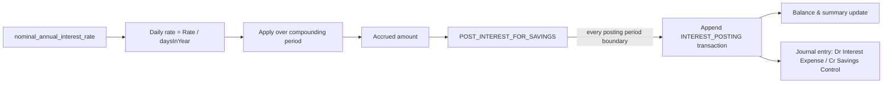
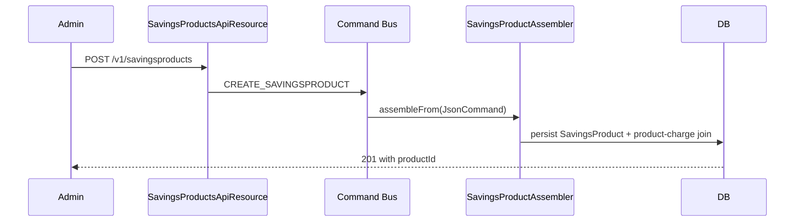

`SavingsProduct` is the template behind every `SavingsAccount`. Where the account row holds *this customer's* balance and rate, the product row defines the *default* rate, the posting cadence, the charges that auto-attach, the accounting mode, and the dormancy thresholds. When an account is submitted, the activation code copies the product's interest fields onto the account and links the product's `Charge` set into per-account `SavingsAccountCharge` rows.

The file is `fineract-savings/src/main/java/org/apache/fineract/portfolio/savings/domain/SavingsProduct.java`. Like `SavingsAccount`, it participates in JPA single-table inheritance via `deposit_type_enum`. `SavingsProduct` itself carries discriminator `100`; `FixedDepositProduct` is `200`; `RecurringDepositProduct` is `300`.

## JPA mapping

```java
@Entity
@Table(name = "m_savings_product",
       uniqueConstraints = { @UniqueConstraint(columnNames = { "name" },       name = "sp_unq_name"),
                             @UniqueConstraint(columnNames = { "short_name" }, name = "sp_unq_short_name") })
@Inheritance
@DiscriminatorColumn(name = "deposit_type_enum", discriminatorType = DiscriminatorType.INTEGER)
@DiscriminatorValue("100")
public class SavingsProduct extends AbstractPersistableCustom<Long> { ... }
```

The product is identified to operators by `name` and by `shortName`, both unique. The short name is what appears in dropdowns and reports.

## Columns at a glance

| Column | Java field | Type / notes |
|--------|------------|--------------|
| `name` | `name` | Unique product name |
| `short_name` | `shortName` | Unique short name (typically 4 characters) |
| `description` | `description` | Free-text description, up to 500 chars |
| `currency_code` / `currency_digits` / `currency_multiplesof` | embedded `MonetaryCurrency` | ISO code plus precision |
| `nominal_annual_interest_rate` | `nominalAnnualInterestRate` | Default annual rate copied to every new account |
| `interest_compounding_period_enum` | `interestCompoundingPeriodType` | Code from `SavingsCompoundingInterestPeriodType` |
| `interest_posting_period_enum` | `interestPostingPeriodType` | Code from `SavingsPostingInterestPeriodType` |
| `interest_calculation_type_enum` | `interestCalculationType` | `DAILY_BALANCE (1)` or `AVERAGE_DAILY_BALANCE (2)` |
| `interest_calculation_days_in_year_type_enum` | `interestCalculationDaysInYearType` | `360 (360)` or `365 (365)` |
| `min_required_opening_balance` | `minRequiredOpeningBalance` | Enforced on first deposit |
| `lockin_period_frequency` / `lockin_period_frequency_enum` | `lockinPeriodFrequency`, `lockinPeriodFrequencyType` | Window during which withdrawals are blocked |
| `accounting_type` | `accountingRule` | `AccountingRuleType` — NONE, CASH_BASED, ACCRUAL_PERIODIC, ACCRUAL_UPFRONT |
| `withdrawal_fee_for_transfer` | `withdrawalFeeApplicableForTransfer` | Apply withdrawal fee even on internal transfers |
| `allow_overdraft` / `overdraft_limit` | `allowOverdraft`, `overdraftLimit` | Enables overdraft and caps it |
| `nominal_annual_interest_rate_overdraft` / `min_overdraft_for_interest_calculation` | | Interest rate on overdraft and threshold |
| `enforce_min_required_balance` / `min_required_balance` | | Hard minimum balance |
| `is_lien_allowed` / `max_allowed_lien_limit` | | Lien feature toggle and cap |
| `min_balance_for_interest_calculation` | | Below this balance no interest is computed |
| `withhold_tax` / `tax_group_id` | `withHoldTax`, `taxGroup` | Withholding tax via `TaxGroup` |
| `is_dormancy_tracking_active` | | Master switch for dormancy job |
| `days_to_inactive` / `days_to_dormancy` / `days_to_escheat` | | Thresholds used by `UPDATE_SAVINGS_DORMANT_ACCOUNTS` |

A separate join table `m_savings_product_charge` links each product to a set of `Charge` rows; those become the charge templates copied to new accounts:

```java
@ManyToMany
@JoinTable(name = "m_savings_product_charge",
           joinColumns        = @JoinColumn(name = "savings_product_id"),
           inverseJoinColumns = @JoinColumn(name = "charge_id"))
protected Set<Charge> charges;
```

## Interest configuration in detail

There are four enums that, together, fully describe how interest is earned and credited.

### Compounding period — `SavingsCompoundingInterestPeriodType`

The span at the end of which earned-but-not-yet-posted interest is compounded into the principal for further interest calculation.

| Code | Enum | Meaning |
|------|------|---------|
| 1 | `DAILY` | Compound daily |
| 4 | `MONTHLY` | Compound monthly |
| 5 | `QUATERLY` | Compound quarterly |
| 6 | `BI_ANNUAL` | Compound twice a year |
| 7 | `ANNUAL` | Compound annually |

### Posting period — `SavingsPostingInterestPeriodType`

The span at the end of which accrued interest is materialised as an `INTEREST_POSTING` transaction credit to the account.

| Code | Enum | Meaning |
|------|------|---------|
| 1 | `DAILY` | Post daily |
| 4 | `MONTHLY` | Post monthly |
| 5 | `QUATERLY` | Post quarterly |
| 6 | `BIANNUAL` | Post biannually |
| 7 | `ANNUAL` | Post annually |
| 8 | `ANNIVERSARY_MONTHLY` | Anchored to account anniversary date, monthly cadence |
| 9 | `ANNIVERSARY_QUARTERLY` | Anchored to anniversary, quarterly |
| 10 | `ANNIVERSARY_BIANNUAL` | Anchored to anniversary, biannual |
| 11 | `ANNIVERSARY_ANNUAL` | Anchored to anniversary, annual |

The non-anniversary variants use calendar boundaries (end of month, end of quarter). Anniversary variants use the activation date offset.

### Calculation type — `SavingsInterestCalculationType`

Two strategies define how the daily balance feeds the formula:

| Code | Enum | Meaning |
|------|------|---------|
| 1 | `DAILY_BALANCE` | Use the end-of-day balance every day |
| 2 | `AVERAGE_DAILY_BALANCE` | Use the average of end-of-day balances across the posting period |

### Days in year — `SavingsInterestCalculationDaysInYearType`

`360` or `365`. Determines the denominator in the rate-to-daily-rate conversion.



The actual computation lives in `SavingsAccount.calculateInterestUsing(...)` and the `PostingPeriod` helper.

## Accounting rules

`accounting_type` selects how every savings transaction posts to the general ledger.

| Code | Enum | Behaviour |
|------|------|-----------|
| 1 | `NONE` | No GL postings |
| 2 | `CASH_BASED` | Each cash-impacting transaction (deposit, withdrawal, fee, interest posting) creates an immediate journal entry |
| 3 | `ACCRUAL_PERIODIC` | Periodic accrual via `ADD_PERIODIC_ACCRUAL_ENTRIES_FOR_SAVINGS_WITH_INCOME_POSTED_AS_TRANSACTIONS` |
| 4 | `ACCRUAL_UPFRONT` | Upfront accrual on inception |

The GL account mappings — *which* income, expense, and control accounts to use — live in `productToGLAccountMapping`, a side table associated with each product.

## Dormancy fields

When `is_dormancy_tracking_active` is true on the product, the [`UPDATE_SAVINGS_DORMANT_ACCOUNTS` job](/savings/savings-jobs) sweeps every account and bumps `sub_status_enum` based on the elapsed-since-last-transaction days:

* After `daysToInactive` days idle → INACTIVE.
* After `daysToDormancy` more days → DORMANT.
* After `daysToEscheat` more days → ESCHEAT (an `ESCHEAT` transaction zeroes the balance into a regulator account).

## Lifecycle

`SavingsProduct` is created by the `CREATE_SAVINGSPRODUCT` command, updated by `UPDATE_SAVINGSPRODUCT`, and deleted by `DELETE_SAVINGSPRODUCT`. The deletion guard refuses to delete products that have any account associated. The product assembler is `SavingsProductAssembler`; the charge-attaching counterpart is `SavingsProductChargeAssembler`.



## How a new account inherits product values

When a `SavingsAccount` is submitted, the assembler copies these fields from the product:

* `nominalAnnualInterestRate` and the three interest period/calculation enums
* `lockinPeriodFrequency` and its type
* `minRequiredOpeningBalance` and `enforceMinRequiredBalance` / `minRequiredBalance`
* `allowOverdraft`, `overdraftLimit`, `nominalAnnualInterestRateOverdraft`, `minOverdraftForInterestCalculation`
* `withdrawalFeeApplicableForTransfer`
* `lienAllowed`, `maxAllowedLienLimit`
* `withHoldTax`, `taxGroup`
* the `Charge` set → per-account `SavingsAccountCharge` rows

After activation the account can override any of these locally. The product is no longer authoritative for the account's running rate.

## Cross-references

* [SavingsAccount](/savings/savings-account) — the entity that consumes these settings.
* [Interest rate charts](/savings/interest-rate-charts) — used by fixed and recurring deposit products as an *alternative* to a single nominal rate.
* [Savings charges](/savings/savings-charges) — how the per-account charges that come out of the product join table behave.
* [Deposit products](/savings/deposit-products) — the fixed and recurring subtypes that extend `SavingsProduct`.

## REST API surface

The product endpoints sit under `/v1/savingsproducts`:

| Method | Path | Operation |
|--------|------|-----------|
| GET | `/v1/savingsproducts` | List products |
| GET | `/v1/savingsproducts/template` | Template (defaults + allowed values) |
| GET | `/v1/savingsproducts/{productId}` | Retrieve one |
| POST | `/v1/savingsproducts` | Create |
| PUT | `/v1/savingsproducts/{productId}` | Update |
| DELETE | `/v1/savingsproducts/{productId}` | Delete (rejected if accounts exist) |

The FD and RD products are mounted in parallel under `/v1/fixeddepositproducts` and `/v1/recurringdepositproducts`. Each sub-resource has its own assembler and write service in `fineract-provider`.

## Mapping enum codes to API JSON

When the platform returns a product over the REST API, every enum code is decorated with its human-readable counterpart. For example:

```json
{
  "id": 17,
  "name": "Premier Savings",
  "shortName": "PRSV",
  "interestPostingPeriodType": {
    "id": 4,
    "code": "savingsPostingInterestPeriodType.monthly",
    "value": "Monthly"
  },
  "interestCompoundingPeriodType": {
    "id": 4,
    "code": "savingsCompoundingInterestPeriodType.monthly",
    "value": "Monthly"
  },
  "interestCalculationType": {
    "id": 1,
    "code": "savingsInterestCalculationType.dailybalance",
    "value": "Daily Balance"
  }
}
```

The decoration happens through `SavingsEnumerations`, which produces a `EnumOptionData` (id + code + value) for every relevant enum. UIs render `value` and store `id`; the platform validates against the code on save.

## Worked example: configuring an FD-compatible savings parent

The most common configuration question is "how do I configure a savings product so it can act as the cash hub for fixed-deposit interest transfers?". The recipe:

1. Create a `SavingsProduct` with `accounting_type = CASH_BASED` and a moderate `nominal_annual_interest_rate` (often 0 — interest accrues elsewhere).
2. Disable `enforce_min_required_balance` (or set a very low threshold) so transfers cannot bounce.
3. Set `lockin_period_frequency` to zero — the customer must be able to withdraw transferred interest immediately.
4. Mark `is_dormancy_tracking_active = false` so transfer accounts are not flagged as dormant.

The corresponding FD account will then be opened with `transfer_interest_to_linked_account = true` and `transfer_to_savings_account_id` set to the savings account opened above. Each `INTEREST_POSTING` on the FD triggers a `WITHDRAWAL` on the FD and a `DEPOSIT` on this savings account, driven by the `TRANSFER_INTEREST_TO_SAVINGS` job.

## Common edge cases

* **Changing the rate**: updating `nominal_annual_interest_rate` on a product does *not* retroactively change rates on accounts already opened — accounts have their own copy of the rate. New accounts pick up the new rate at submission time.
* **Changing the posting period**: same story — new accounts adopt the new cadence; existing accounts keep their original.
* **Deleting a product with closed accounts**: rejected. The platform refuses to delete a product that has any `m_savings_account` row, even closed, to preserve historical reporting integrity.
* **Currency change**: rejected once any account exists. Currency is part of the contract with the customer.
* **Removing a charge from the product**: only affects future account opens. Accounts already attached to the charge keep it (the join is via `m_savings_account_charge`, independent of the product join).

## Schema reference

| Table | Purpose |
|-------|---------|
| `m_savings_product` | Product definition (shared across savings, FD, RD via `deposit_type_enum`) |
| `m_savings_product_charge` | Product ↔ Charge join |
| `m_product_to_gl_mapping` | Per-product GL accounts for accrual/cash accounting |

The `deposit_type_enum` discriminator on `m_savings_product` defaults to 100 for savings, 200 for FD, 300 for RD. The same row therefore carries the columns needed by all three types — most columns relevant only to FD/RD live on the side tables documented in [Deposit products](/savings/deposit-products).


