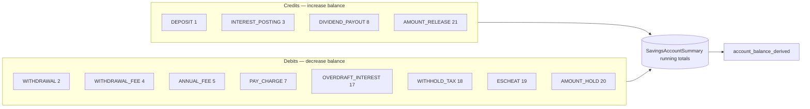
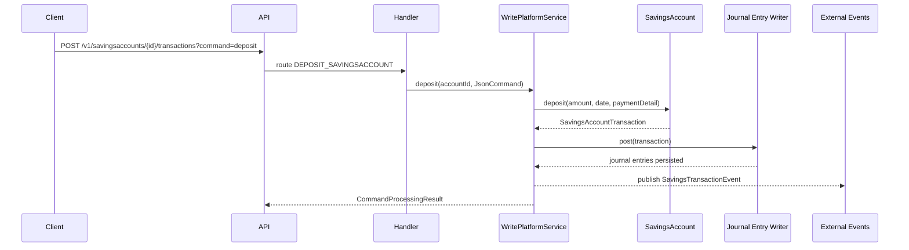

`SavingsAccountTransaction` is the single append-only ledger entity behind every credit and debit on a savings account, fixed deposit, or recurring deposit. Every customer action — depositing cash, withdrawing, paying a fee, having interest posted, receiving a dividend, having tax withheld — produces exactly one row. Holds and releases use a parallel `DepositAccountOnHoldTransaction` table because they do not change the principal balance but do change the available balance.

This page explains the `SavingsAccountTransactionType` enum, lays out which types are credits vs debits, and shows how rows reach the general ledger.

## The transaction-type enum

`SavingsAccountTransactionType` lives in `fineract-core/src/main/java/org/apache/fineract/portfolio/savings/SavingsAccountTransactionType.java`. Every constant carries an integer code stored in `transaction_type_enum`, a translation key, and (when applicable) a `TransactionEntryType` of CREDIT or DEBIT used by the journal-entry writer.

| Code | Enum | Entry type | Description |
|------|------|-----------|-------------|
| 1 | `DEPOSIT` | CREDIT | Cash, transfer, or system credit |
| 2 | `WITHDRAWAL` | DEBIT | Cash, transfer, or system debit |
| 3 | `INTEREST_POSTING` | CREDIT | Interest credited from posting period |
| 4 | `WITHDRAWAL_FEE` | DEBIT | Fee accompanying a withdrawal |
| 5 | `ANNUAL_FEE` | DEBIT | Yearly recurring fee |
| 6 | `WAIVE_CHARGES` | — | Charge waiver (no monetary side; reduces outstanding) |
| 7 | `PAY_CHARGE` | DEBIT | Pay a non-fee charge or penalty |
| 8 | `DIVIDEND_PAYOUT` | CREDIT | Share dividend credited to the linked savings account |
| 10 | `ACCRUAL` | — | Accrual posting (driven by periodic accrual job) |
| 12 | `INITIATE_TRANSFER` | — | Initiate an inter-account transfer |
| 13 | `APPROVE_TRANSFER` | — | Approve the transfer |
| 14 | `WITHDRAW_TRANSFER` | — | Caller withdraws the transfer request |
| 15 | `REJECT_TRANSFER` | — | Reviewer rejects the transfer |
| 16 | `WRITTEN_OFF` | — | Account written off |
| 17 | `OVERDRAFT_INTEREST` | DEBIT | Interest charged on negative balance |
| 18 | `WITHHOLD_TAX` | DEBIT | Tax withheld on interest |
| 19 | `ESCHEAT` | DEBIT | Dormant funds escheated to the regulator |
| 20 | `AMOUNT_HOLD` | DEBIT | Lien/hold debited from available balance |
| 21 | `AMOUNT_RELEASE` | CREDIT | Hold released |

`isCreditEntryType()` and `isDebitEntryType()` on the enum check `entryType != null && entryType.isX()`, which is exactly what the journal-entry writer calls to decide which GL side to debit and which to credit.

## What a transaction row looks like

The persistent fields most often referenced (table `m_savings_account_transaction`):

| Column | Meaning |
|--------|---------|
| `savings_account_id` | FK back to `m_savings_account` |
| `transaction_type_enum` | One of the codes above |
| `transaction_date` | Effective business date |
| `created_date`, `submitted_on_date` | Audit timestamps |
| `amount` (+ derived components) | Principal amount; `running_balance_derived` |
| `is_reversed` | Whether this row was reversed by a later entry |
| `payment_detail_id` | Optional `PaymentDetail` capturing payment channel/cheque/etc. |
| `office_id` | Booking office |
| `appuser_id` | User who created the entry |
| `over_draft_amount_derived` | Portion of the amount that pushed the account into overdraft |
| `cumulative_balance_derived`, `balance_end_date_derived`, `balance_number_of_days_derived` | Used for daily-balance/average-daily-balance interest calculations |

A side table, `m_savings_account_charge_paid_by`, records the mapping when a single transaction pays one or more `SavingsAccountCharge` rows.

When tax is withheld on an interest posting, the same parent transaction also writes a `SavingsAccountTransactionTaxDetails` row that breaks the tax amount down by `TaxComponent`.

## Credit vs debit flow



`WAIVE_CHARGES`, the four `*_TRANSFER` types, `ACCRUAL`, and `WRITTEN_OFF` carry no `TransactionEntryType` because they either do not move money on the savings side (`*_TRANSFER` is administrative) or they post to a separate accrual ledger (`ACCRUAL`).

## Lifecycle: how a row gets created

1. The API resource builds a `JsonCommand` and routes through the command bus.
2. A handler (for example `DepositSavingsAccountCommandHandler`) calls into `SavingsAccountWritePlatformServiceJpaRepositoryImpl`.
3. The write service loads the `SavingsAccount`, validates the operation against the status machine, and calls `account.deposit(...)` or `account.withdraw(...)`.
4. The domain method appends a `SavingsAccountTransaction` to its `transactions` collection, updates `SavingsAccountSummary`, and recomputes running balance.
5. The write service flushes, then asks the journal-entry writer to produce GL postings derived from the new transaction.
6. An external event is published with the new `transactionId`.



## Bridging to the general ledger

When the product's `accounting_type` is `CASH_BASED`, every transaction with a non-null `TransactionEntryType` produces a journal-entry pair using the product's GL mapping:

| Transaction | Dr | Cr |
|-------------|----|----|
| `DEPOSIT` | Cash / Bank | Savings Reference (Liability) |
| `WITHDRAWAL` | Savings Reference (Liability) | Cash / Bank |
| `INTEREST_POSTING` | Interest on Savings (Expense) | Savings Reference (Liability) |
| `WITHDRAWAL_FEE` | Savings Reference | Income from Fees |
| `ANNUAL_FEE` | Savings Reference | Income from Fees |
| `PAY_CHARGE` | Savings Reference | Income from Fees or Penalty |
| `OVERDRAFT_INTEREST` | Savings Reference | Income from Overdraft Interest |
| `WITHHOLD_TAX` | Savings Reference | Tax Payable |
| `DIVIDEND_PAYOUT` | Equity (from share product) | Savings Reference |
| `ESCHEAT` | Savings Reference | Escheat Liability |

Under `ACCRUAL_PERIODIC`, the [`ADD_PERIODIC_ACCRUAL_ENTRIES_FOR_SAVINGS_WITH_INCOME_POSTED_AS_TRANSACTIONS` job](/savings/savings-jobs) periodically materialises accrual entries (`ACCRUAL` transactions) ahead of the actual posting.

## Holds and releases

Holds and releases live in `DepositAccountOnHoldTransaction`, not in `m_savings_account_transaction`, because they do not move principal — they only reduce or restore *available* balance.

* `AMOUNT_HOLD` (20) creates an on-hold transaction and bumps `on_hold_funds_derived` on the account.
* `AMOUNT_RELEASE` (21) reverses it.

The withdrawable balance shown to the user is `account_balance_derived − on_hold_funds_derived`.

## Reversals

Transactions are never deleted — they are reversed. The `is_reversed` flag, together with a reversing twin row, undoes the financial effect and rolls the running balance back. Most reversal paths require a special command (`UNDOTRANSACTION_SAVINGSACCOUNT`) and the user must have the corresponding permission.

## Related pages

* [SavingsAccount](/savings/savings-account) — the parent entity that owns the transactions collection.
* [Savings charges](/savings/savings-charges) — how `WITHDRAWAL_FEE`, `ANNUAL_FEE`, and `PAY_CHARGE` originate.
* [Savings jobs](/savings/savings-jobs) — the schedulers that create `INTEREST_POSTING`, `ACCRUAL`, `WITHHOLD_TAX`, `ANNUAL_FEE`, and `ESCHEAT` rows.
* [Share dividends](/shares/dividends) — produces the `DIVIDEND_PAYOUT` (8) row on the linked savings account.

## Running balance and the daily-balance calculation

Every transaction row carries the derived columns:

| Column | Meaning |
|--------|---------|
| `running_balance_derived` | Account balance immediately after this transaction posted |
| `cumulative_balance_derived` | Sum of balances day by day through this transaction (for AVERAGE_DAILY_BALANCE) |
| `balance_end_date_derived` | The last date for which this transaction's balance applied |
| `balance_number_of_days_derived` | How many days `running_balance_derived` was the effective balance |

These columns are populated by the platform every time it appends or reverses a transaction. They power two things:

1. The interest calculation — the daily balance method walks the rows multiplying `running_balance_derived` by `balance_number_of_days_derived` to get balance-days, while the average daily balance method divides the cumulative balance by the period length.
2. The audit trail — operators can reproduce the balance at any past date by stopping the walk at the cutoff.

## Money helpers

The platform represents money through `org.apache.fineract.organisation.monetary.domain.Money`, an immutable wrapper around `BigDecimal` and `MonetaryCurrency`. Every domain method that takes or returns an amount uses `Money`, not raw `BigDecimal`, so currency mismatches surface as compile-time or unit-test failures rather than rounding glitches in production.

When transactions are persisted, the rounded amount goes into the `amount` column; the currency comes from the parent account's product, not the transaction itself, because all transactions on a single account must share its currency.

## API surface

The transaction endpoints sit at:

* `GET /v1/savingsaccounts/{accountId}/transactions` — paged list, supports `transactionType`, `fromDate`, `toDate`.
* `GET /v1/savingsaccounts/{accountId}/transactions/{transactionId}` — drill-down.
* `POST /v1/savingsaccounts/{accountId}/transactions?command=deposit` — append a deposit.
* `POST /v1/savingsaccounts/{accountId}/transactions?command=withdrawal` — append a withdrawal.
* `POST /v1/savingsaccounts/{accountId}/transactions?command=postInterestAsOn` — manually trigger interest posting.
* `POST /v1/savingsaccounts/{accountId}/transactions?command=holdAmount` — place a hold.
* `POST /v1/savingsaccounts/{accountId}/transactions?command=releaseAmount` — release a hold.
* `POST /v1/savingsaccounts/{accountId}/transactions/{transactionId}?command=undo` — reverse a transaction.

Each call returns a `CommandProcessingResult` containing the new (or reversed) `transactionId`, plus a change map that summarises which derived fields moved.

## Common debugging recipes

**An account's `account_balance_derived` doesn't match the transaction sum.**
Re-run `SavingsAccount.recalculateDailyBalances(...)` or use the `recalculateInterest` command — usually a manual transaction was inserted via SQL bypassing the domain method.

**Interest posting produced a smaller credit than expected.**
Check whether `withHoldTax` was true at the moment of posting and look for a sibling `WITHHOLD_TAX (18)` row.

**A withdrawal succeeded that should have failed for min-balance.**
Verify `enforce_min_required_balance` was true at the time. If the product was changed mid-flight, the account *may* have an older value because the account holds its own copy.

**Holds are showing on the account but `on_hold_funds_derived` is zero.**
The hold rows live in `m_deposit_account_on_hold_transaction`. The derived column is updated only by `holdFunds` / `releaseFunds` — direct SQL inserts won't trigger it.

## Cross-module integration

Savings transactions interact with several other subsystems:

* **External events** — every new transaction publishes a `SavingsTransactionEvent` through the external events pipeline; downstream consumers (Kafka, ActiveMQ) can react.
* **Hooks** — the `Hooks` framework can trigger HTTP webhooks on transaction events.
* **Notifications** — SMS and email campaigns can be configured to fire on `DEPOSIT`, `WITHDRAWAL`, `INTEREST_POSTING`, etc.
* **Standing instructions** — the `EXECUTE_STANDING_INSTRUCTIONS` job can issue recurring `DEPOSIT`s or `WITHDRAWAL`s programmatically.

## Reading the transaction stream

For most operational queries, the ordering you want is "chronological by business date, ties broken by submitted timestamp". The platform exposes this through `SavingsAccountTransactionComparator` and uses it consistently in the read service and in `SavingsAccount.recalculateDailyBalances(...)`.

When you join `m_savings_account_transaction` directly in SQL:

```sql
SELECT t.id, t.transaction_date, t.transaction_type_enum, t.amount,
       t.running_balance_derived, t.is_reversed
FROM   m_savings_account_transaction t
WHERE  t.savings_account_id = :accountId
ORDER  BY t.transaction_date, t.id;
```

Filter `is_reversed = false` to get the live ledger; leave it in for the full history.

## Soft deletion semantics

The transaction table does not allow physical deletion through the API. Even reversals leave both the original and the reversal row in place. This is a deliberate compliance choice: the ledger must be append-only so auditors can trust the chain.

The `is_reversed` flag and the linker to the reversing twin row provide the cancellation semantics without losing data.

## Payment detail

Many transactions carry a `payment_detail_id` pointing to `m_payment_detail`, which holds payment-channel-specific information:

| Column | Meaning |
|--------|---------|
| `payment_type_id` | Reference to `m_payment_type` (Cash, Cheque, Mobile, etc.) |
| `account_number` | Free-text account number of the payer/payee |
| `cheque_number` | For cheque payments |
| `receipt_number` | For receipt-bound payments |
| `bank_number` | Routing number |
| `routing_code` | Channel-specific code |

The payment detail is optional — system-generated transactions (interest postings, withhold tax, fees) typically have it null because there is no payment channel involved.


