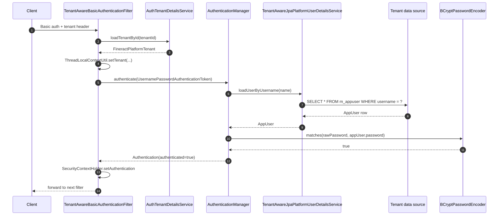

HTTP Basic is the default authentication mode shipped with Apache Fineract — turn it on with `fineract.security.basicauth.enabled=true` in `application.properties` and every `/api/**` request is expected to carry an `Authorization: Basic …` header plus the multi-tenant `Fineract-Platform-TenantId` header. This page walks through `TenantAwareBasicAuthenticationFilter`, the BCrypt-backed `AuthenticationProvider` it delegates to, the `m_appuser` lookup performed by `TenantAwareJpaPlatformUserDetailsService`, and the `SpringSecurityPlatformSecurityContext` bean that exposes the authenticated `AppUser` to the rest of the platform.

## When to use Basic

Basic auth is the simplest mode to deploy — no IdP, no token store, no refresh flow — which makes it the right choice for:

- **Server-to-server integration** where the client can hold credentials securely (microservice in the same VPC, ETL pipeline).
- **Local development** where setting up Keycloak is overkill.
- **Single-page apps in trusted contexts** where the browser already has TLS-pinned access to the API.

It is the *wrong* choice when credentials must be shared with end users in a browser without a confidential storage option, when token revocation latency matters (Basic credentials live as long as the password row), or when the SSO portfolio includes an OIDC provider — in those cases switch to [OAuth2 & OIDC](/security/oauth2-and-oidc).

## The filter

`fineract-security/src/main/java/org/apache/fineract/infrastructure/security/filter/TenantAwareBasicAuthenticationFilter.java` extends Spring's `BasicAuthenticationFilter`. Its constructor takes the standard `AuthenticationManager` plus four Fineract-specific collaborators:

| Collaborator | Why |
| --- | --- |
| `AuthTenantDetailsService basicAuthTenantDetailsService` | Resolves the `Fineract-Platform-TenantId` header to a `FineractPlatformTenant` row in the `tenants` table of `fineract_tenants`. |
| `ConfigurationDomainService` | Reads platform configuration — e.g. whether request logging is enabled. |
| `CacheWritePlatformService` | Invalidates per-request caches on the very first request after boot. |
| `BusinessDateReadPlatformService` | Loads the current business date to seed `ThreadLocalContextUtil`. |
| `UserNotificationService` | Updates the per-user notification cursor once authentication succeeds. |
| `ToApiJsonSerializer<PlatformRequestLog>` | Serialises the request log entry if request logging is enabled. |

The filter overrides `doFilterInternal` and runs in three phases.

### Phase 1 — header parsing

The header constant is:

```java
private static final String TENANT_ID_REQUEST_HEADER = "Fineract-Platform-TenantId";
private static final boolean EXCEPTION_IF_HEADER_MISSING = true;
```

If the header is absent, the filter throws `InvalidTenantIdentifierException` and the configured `AuthenticationEntryPoint` translates it to `HTTP 401`. There is no fallback tenant — multi-tenancy is mandatory even in single-tenant deployments (the default tenant is named `default`).

### Phase 2 — tenant lookup

`basicAuthTenantDetailsService.loadTenantById(tenantIdentifier, false)` performs a JDBC lookup against the `tenants` table in the `tenant_store` schema (typically `fineract_tenants`). The returned `FineractPlatformTenant` carries the connection details of the tenant's *data* schema and is immediately pushed onto `ThreadLocalContextUtil.setTenant(tenant)`. From this point on, all data-source-aware beans pick up the correct `DataSource`. See [Tenant authentication resolution](/security/tenant-auth-resolution) for the schema and code path.

### Phase 3 — credential check

With the tenant pinned, the filter delegates back to `BasicAuthenticationFilter.doFilterInternal`, which extracts the user/password from the header and calls `AuthenticationManager.authenticate()` with a `UsernamePasswordAuthenticationToken`. The configured `DaoAuthenticationProvider` consults two beans:

1. `TenantAwareJpaPlatformUserDetailsService` — a `UserDetailsService` that JPA-loads `AppUser` from the now-active tenant data source.
2. `BCryptPasswordEncoder` (Spring's default) — compares the supplied password to the BCrypt hash stored in `m_appuser.password`.

A successful match returns an `AppUser` (which implements `UserDetails`) inside the `Authentication` object; the filter then writes it to `SecurityContextHolder.getContext().setAuthentication(...)`.



## BCrypt and `m_appuser`

`m_appuser` is the Liquibase-managed user table in every tenant data source. The relevant columns:

| Column | Purpose |
| --- | --- |
| `username` | Login identifier — unique per tenant. |
| `password` | BCrypt hash (`$2a$10$…`) of the user's password. |
| `firstname`, `lastname`, `email` | Profile data surfaced through `/v1/users`. |
| `nonexpired`, `nonlocked`, `nonexpired_credentials`, `enabled` | Standard Spring `UserDetails` flags. |
| `office_id`, `staff_id` | Tenancy-internal scope (an office tree row is required). |

`org.apache.fineract.infrastructure.security.service.PlatformPasswordEncoder` wraps Spring's `BCryptPasswordEncoder` with the work factor read from `application.properties`. New users created via `/v1/users` are encoded on the way in by `AppUserWritePlatformServiceJpaRepositoryImpl`; password changes via `/v1/users/{id}` follow the same path. The hash is *never* read by application code — only `BCryptPasswordEncoder.matches(rawPassword, storedHash)` consults it.

## `TenantAwareJpaPlatformUserDetailsService`

This bean is a thin adapter that:

1. Reads the currently-bound tenant from `ThreadLocalContextUtil.getTenant()`.
2. Loads `AppUser` via the JPA `AppUserRepositoryWrapper#findAppUserByName(username)`.
3. Triggers `AppUser.updateLastTimeLoggedIn()` if requested.
4. Returns the `AppUser` — which is itself a `UserDetails` implementation — back to the `DaoAuthenticationProvider`.

Because step 1 reads from the already-set ThreadLocal, the lookup automatically targets the correct tenant database. There is no per-tenant cache; the bean is request-scoped through the natural lifetime of `doFilterInternal`.

## `SpringSecurityPlatformSecurityContext`

`org.apache.fineract.infrastructure.security.service.SpringSecurityPlatformSecurityContext` is the read interface every service in `fineract-provider` uses to obtain the authenticated user:

```java
public AppUser authenticatedUser();
public AppUser getAuthenticatedUserIfPresent();
public void validateAccessRights(String resourceType);
```

It pulls the `Authentication` object from `SecurityContextHolder`, narrows it to `AppUser`, and surfaces helpers for permission checks (e.g. `appUser.validateHasPermissionTo(...)`). All write-platform services begin with `final AppUser currentUser = this.context.authenticatedUser();` — that one line is the single point of contact between business code and Spring Security.

## Where the header drives DB selection

The `Fineract-Platform-TenantId` header is the *only* signal Fineract uses to pick a tenant. The end-to-end flow:

1. `TenantAwareBasicAuthenticationFilter` extracts the header.
2. `AuthTenantDetailsService.loadTenantById(...)` runs `SELECT * FROM tenants WHERE identifier = ?` against the `tenant_store` database.
3. The returned tenant carries pool credentials for the data-tenant `DataSource`.
4. `ThreadLocalContextUtil.setTenant(...)` makes those credentials globally visible.
5. `RoutingDataSource#determineCurrentLookupKey()` returns the tenant identifier so JPA / JDBC operations target the right pool.

Bypassing the header is not possible at the protocol layer — even health checks have to either be excluded from the security chain or supply the default tenant.

## Failure modes

| Symptom | Cause | Resolution |
| --- | --- | --- |
| `401 Unauthorized` with `InvalidTenantIdentifierException` | Missing or unknown `Fineract-Platform-TenantId` | Confirm the tenant exists in `tenants`. |
| `401` with no error body | BCrypt mismatch | Reset the user's password via `/v1/users/{id}` with `passwordNeverExpires=false`. |
| `403` after successful auth | `AppUser` lacks the required permission for the resource | Grant the permission row in `m_role_permission`. |
| `500` on the *first* request after restart | `cacheWritePlatformService.invalidateAll()` racing with a hot deployment | Warm the cache before traffic resumes. |

## Disabling Basic auth

Setting `fineract.security.basicauth.enabled=false` removes `TenantAwareBasicAuthenticationFilter` from the chain entirely. The deployment must then run with either `fineract.security.oauth.enabled=true` or `fineract.security.oidc-federation.enabled=true`; see [OAuth2 & OIDC](/security/oauth2-and-oidc) for the migration. Mixing modes is not supported — `WebSecurityConfig` checks for exactly one enabled mode at startup.

## Request logging

When `fineract.security.basicauth.request-log.enabled=true`, the filter materialises a `PlatformRequestLog` after a successful authentication and serialises it to the configured sink (by default the application log). The record carries the elapsed-time stamp from the `StopWatch` started at the top of `doFilterInternal` plus the authenticated username and tenant. Disabling the log is recommended for production deployments serving high request volumes — the serialisation itself is cheap, but the resulting log volume is non-trivial.

## First-request side effects

The static `FIRST_REQUEST_PROCESSED` flag in `TenantAwareBasicAuthenticationFilter` is set to `true` after the *first* successful request goes through and triggers two one-off actions:

1. `cacheWritePlatformService.invalidateAll()` is called to clear the configuration cache that was warmed during boot.
2. `userNotificationService.updateNotificationReadStatus()` recomputes the per-user notification cursor.

Both are idempotent — a transient failure on the first request would simply replay on the next one. The flag is JVM-scoped (not per-tenant) which keeps the cost bounded; in a clustered deployment each node runs the side effects exactly once at startup.

## Password policy

The `PlatformPasswordEncoder` enforces complexity via the `m_password_validation_policy` table when the configuration `password-validation-policy-id` is set. The default ships three policies:

| ID | Rule |
| --- | --- |
| 1 | Minimum 8 characters. |
| 2 | Minimum 8 characters with at least one digit, one upper-case, one lower-case. |
| 3 | Minimum 12 characters with the above plus at least one symbol. |

Policy enforcement happens at write-time inside `AppUserWritePlatformServiceJpaRepositoryImpl#changePassword`; the read-time `BCryptPasswordEncoder.matches` does *not* re-validate complexity since the hash hides the original.

The `force_change_password` column on `m_appuser` lets operators force a password change on next login — the filter still authenticates the user, but the JAX-RS resource layer rejects every request except `PUT /v1/users/{id}` with `?passwordEncoded=true`.

## CSRF and stateless sessions

The filter operates in Spring Security's stateless mode (`SessionCreationPolicy.STATELESS`). No HTTP session is created, no `JSESSIONID` cookie is set, and CSRF protection is disabled (since there is no stateful state to forge against). This is consistent with Basic auth's request-per-request authentication model — each request carries its own credentials and is independently verified.

## Headers reference

| Direction | Header | Mandatory | Set by |
| --- | --- | --- | --- |
| Request | `Authorization: Basic <base64>` | Yes | Client |
| Request | `Fineract-Platform-TenantId` | Yes | Client |
| Request | `X-Correlation-Id` | No | Client (else generated) |
| Response | `WWW-Authenticate: Basic realm="…"` on 401 | — | `BasicAuthenticationEntryPoint` |
| Response | `X-Correlation-Id` | — | `CorrelationHeaderFilter` |

## Cache warm-up details

`CacheWritePlatformService.invalidateAll()` clears three caches the first time a request authenticates after restart:

| Cache | Reason for invalidation |
| --- | --- |
| `usersByUsername` | Picks up role changes applied while the JVM was offline. |
| `permissionsByRoleId` | Ensures permission edits are visible. |
| `configurationsByName` | Re-reads `c_configuration` rows. |

The clear is unconditional and cheap (single-digit milliseconds even for large tenants). It is performed *after* the first successful authentication so a failing first request does not flush the caches.

## CLI smoke-test

The simplest verification that Basic auth is wired correctly is a `curl` round-trip to the user-details endpoint:

```bash
curl -sS \
  -u mifos:password \
  -H "Fineract-Platform-TenantId: default" \
  http://localhost:8080/fineract-provider/api/v1/userdetails
```

A 200 with the user's profile confirms the chain — tenant lookup, BCrypt comparison, and `AppUser` materialisation — is healthy end-to-end. A 401 with `WWW-Authenticate: Basic` indicates the credentials failed; a 401 with `InvalidTenantIdentifierException` in the server log indicates the tenant header is wrong.

## Operator checklist

| Task | Where |
| --- | --- |
| Rotate a user's password | `PUT /v1/users/{id}` with a new password — BCrypt encoding is applied server-side. |
| Lock a user | `PUT /v1/users/{id}/nonlocked=false`. |
| Enforce password complexity | Set `fineract.security.basicauth.password.policy.*` in `application.properties` — `PlatformPasswordEncoder` reads them during change. |
| Tune the BCrypt cost | `fineract.security.basicauth.password.bcrypt.cost` (default `10`). |
| Disable Basic globally | `fineract.security.basicauth.enabled=false`. |

## Authorization header reference

The `Authorization: Basic …` header is constructed by:

1. Concatenating `username + ":" + rawPassword`.
2. UTF-8 encoding the string.
3. Base64-encoding the bytes (without line wrapping).
4. Prepending `Basic ` (note the trailing space).

Example: a user named `mifos` with password `password` produces `Basic bWlmb3M6cGFzc3dvcmQ=`. The header is **not** URL-encoded — clients that delegate header construction to a URL encoder will see authentication failures because the trailing `=` padding will be percent-encoded.

## Programmatic authentication

A handful of internal code paths need to authenticate without the HTTP filter — most notably the scheduler when it impersonates the system user to run scheduled jobs. The pattern is:

```java
AppUser systemUser = appUserRepository.findSystemUser();
FineractPlatformTenant tenant = tenantDetailsService.loadTenantById("default", false);
ThreadLocalContextUtil.setTenant(tenant);
SecurityContextHolder.getContext().setAuthentication(
    new UsernamePasswordAuthenticationToken(systemUser, null, systemUser.getAuthorities()));
try {
    job.run();
} finally {
    SecurityContextHolder.clearContext();
    ThreadLocalContextUtil.reset();
}
```

The `null` credentials are intentional — the scheduler bypasses BCrypt because it is *not* receiving raw credentials from a client. Note the symmetric cleanup in `finally`; the executor thread will be reused for the next job and must not leak the system-user context.

## Related reading

- [Filters](/security/filters) — where Basic auth sits in the wider chain.
- [Two-factor](/security/two-factor) — additional protection layered on top.
- [Tenant resolution](/security/tenant-auth-resolution) — what happens to the `Fineract-Platform-TenantId` header.
- [SQL injection prevention](/security/sql-injection-prevention) — defence in depth for queries built from request input.
