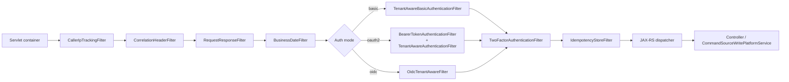
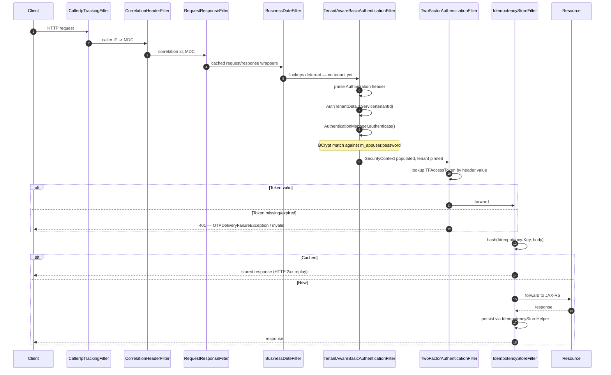
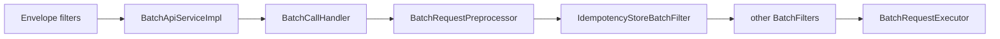

Apache Fineract assembles its HTTP request pipeline from two stacks of `OncePerRequestFilter` / `BasicAuthenticationFilter` subclasses: an *authentication* stack that lives in `fineract-security` and binds the `Fineract-Platform-TenantId` header to a `FineractPlatformTenant` plus an authenticated `AppUser`, and a *cross-cutting* stack that lives in `fineract-core` and handles correlation IDs, idempotency, batch sub-request fan-out, and IP capture. This page inventories both stacks, gives the package-qualified signature of every filter, and walks a representative request — basic auth + two-factor + idempotency — through the chain as a sequence diagram.

## Filter inventory

### `fineract-security` — authentication and per-tenant bindings

Located at `fineract-security/src/main/java/org/apache/fineract/infrastructure/security/filter/`:

| File | Type | Role |
| --- | --- | --- |
| `TenantAwareBasicAuthenticationFilter.java` | `extends BasicAuthenticationFilter` | Reads `Authorization: Basic …` plus `Fineract-Platform-TenantId`; resolves the tenant via `AuthTenantDetailsService`, runs the BCrypt-backed `AuthenticationManager`, and pins the result into `ThreadLocalContextUtil`. |
| `TenantAwareAuthenticationFilter.java` | `extends OncePerRequestFilter` | The OAuth2 / OIDC equivalent — runs *after* Spring's `BearerTokenAuthenticationFilter`, takes the already-authenticated principal and binds the tenant for the rest of the request. |
| `OidcTenantAwareFilter.java` | `extends OncePerRequestFilter` | Used when OIDC federation is enabled. Looks at the validated `JwtAuthenticationToken`, resolves a tenant from the configured `tenant-claim-name`, and delegates user resolution to `OidcAppUserResolutionService`. |
| `TwoFactorAuthenticationFilter.java` | `extends OncePerRequestFilter` | Conditional filter — active only when the `twofactor` Spring profile is on. Rejects requests that target the protected API surface without a valid `Fineract-Platform-TFA-Token` header. |
| `BusinessDateFilter.java` | `extends OncePerRequestFilter` | Loads the current `BusinessDate` / `COB business date` for the tenant and stores both in `ThreadLocalContextUtil` so downstream services can read them without another DB hit. |

### `fineract-core` — cross-cutting plumbing

Located at `fineract-core/src/main/java/org/apache/fineract/infrastructure/core/filters/`:

| File | Type | Role |
| --- | --- | --- |
| `CallerIpTrackingFilter.java` | `OncePerRequestFilter` | Resolves the caller IP (honouring `X-Forwarded-For` when configured) and pushes it into the audit context. |
| `CorrelationHeaderFilter.java` | `OncePerRequestFilter` | Reads or generates the correlation id header, mirrors it onto the response, and seeds the MDC so every downstream log line is traceable. |
| `RequestResponseFilter.java` | `OncePerRequestFilter` | Wraps the request / response in caching variants so later filters (idempotency, batch) can re-read the body without consuming the input stream. |
| `IdempotencyStoreFilter.java` | `OncePerRequestFilter` | For POST endpoints carrying `Idempotency-Key`: either returns a stored response or marks the request for later persistence by `IdempotencyStoreHelper`. |
| `IdempotencyStoreBatchFilter.java` | `BatchFilter` | The batch-equivalent — applies idempotency lookup *per sub-request* inside `/v1/batches`. |
| `IdempotencyStoreHelper.java` | helper bean | Shared between the two idempotency filters — serialises responses and persists them via `FineractRequestContextHolder` and the idempotency repository. |
| `BatchFilter.java` | interface | Contract every batch-aware filter implements — `Optional<BatchResponse> doFilter(BatchRequest, BatchFilterChain)`. |
| `BatchFilterChain.java` | interface | The chain handed to a `BatchFilter` so it can call the next link. |
| `BatchCallHandler.java` | class | Wires a list of `BatchFilter`s into an executable chain whose tail invokes the actual command processor. |
| `BatchRequestPreprocessor.java` | interface | Normalises a `BatchRequest` (header propagation, path resolution) before the batch chain runs. |

## Ordering

Spring Security's `SecurityFilterChain` runs first; the `fineract-core` filters are registered as plain Servlet `Filter`s with explicit `@Order` so they straddle the security chain at well-defined points.



`BusinessDateFilter` runs *before* the auth filters so that the tenant context is the only thing missing when business-date lookups happen — but several install profiles flip it to after, depending on whether the business-date subsystem needs an authenticated principal. Both orderings are valid; the production default in `application.properties` puts it before.

## Request-bound state

Every filter contributes a slice of `ThreadLocalContextUtil`:

| Filter | Writes |
| --- | --- |
| `CorrelationHeaderFilter` | MDC `correlationId` |
| `CallerIpTrackingFilter` | `AuditorAware` IP |
| `TenantAwareBasicAuthenticationFilter` | `FineractPlatformTenant`, `SecurityContext` |
| `TenantAwareAuthenticationFilter` | `FineractPlatformTenant`, `AppUser` from JWT subject |
| `OidcTenantAwareFilter` | `FineractPlatformTenant`, `OidcAppUserResolutionService` lookup |
| `BusinessDateFilter` | `BusinessDate`, `cobBusinessDate` |
| `TwoFactorAuthenticationFilter` | validates `Fineract-Platform-TFA-Token` against `TFAccessTokenRepository` |
| `IdempotencyStoreFilter` | reads / writes the idempotency cache via `IdempotencyStoreHelper` |

`ThreadLocalContextUtil` is cleared in the `finally` of the last filter so that an `ExecutorService`-borrowed thread cannot leak tenant state to the next request. The cross-cutting filters in `fineract-core` are responsible for the cleanup symmetry — `RequestResponseFilter` resets the caching wrappers, `CorrelationHeaderFilter` clears the MDC.

## Walking a sample request

A `POST /fineract-provider/api/v1/clients` with `Authorization: Basic …`, `Fineract-Platform-TenantId: default`, `Idempotency-Key: 7f…`, and a `Fineract-Platform-TFA-Token: …`:



Steps 1–4 are mode-agnostic infrastructure. Steps 5–8 are the basic-auth path; if the deployment runs OAuth2 instead, `BearerTokenAuthenticationFilter` (Spring) plus `TenantAwareAuthenticationFilter` replace step 7 with JWT validation and DB lookup. Step 9–10 only fire when `fineract.security.2fa.enabled=true`; otherwise the filter is a no-op pass-through. Step 11 is skipped when the endpoint is not registered as idempotent (`IdempotencyStoreHelper` consults a whitelist of POST routes).

## Batch sub-requests

When `POST /v1/batches` is invoked, the outer chain runs once for the *envelope* — basic auth, tenant binding, idempotency on the envelope itself. Inside the envelope, `BatchApiServiceImpl` builds a `BatchCallHandler` whose chain is composed of all `BatchFilter`s discovered in the Spring context:



`BatchFilterChain` is the cursor object handed between filters; each `BatchFilter` may return `Optional.of(BatchResponse)` to short-circuit (the idempotency variant does this when it finds a cached sub-response) or call `chain.serviceCall()` to delegate to the next link. This means an idempotent retry of a `POST /v1/batches` whose third sub-request previously succeeded can re-execute the first two and replay the third from the store — all from a single envelope.

## Configuring the chain

The filters listed above are wired in `fineract-provider`'s `WebSecurityConfig` (one variant per authentication mode). The mode is selected by `fineract.security.basicauth.enabled`, `fineract.security.oauth.enabled` and `fineract.security.oidc-federation.enabled`. Only one mode is permitted at runtime, but the cross-cutting `fineract-core` filters apply uniformly to all three. See [Security overview](/security/overview) for the property matrix and [Basic auth](/security/basic-auth), [OAuth2 & OIDC](/security/oauth2-and-oidc), and [Two-factor](/security/two-factor) for per-mode details.

## Adding a filter

Two extension points exist:

1. **HTTP filter.** Implement `OncePerRequestFilter`, annotate with `@Component` and `@Order(...)`, and place it in a package scanned by `fineract-provider`. Order numbers should leave gaps — the built-in filters use multiples of 100 — to make insertion easier.
2. **Batch filter.** Implement `BatchFilter` and expose it as a Spring bean; `BatchCallHandler` discovers all such beans by type and inserts them in the order returned by `@Order` (or `Ordered`).

For a batch filter that needs the outer authentication context, rely on `ThreadLocalContextUtil` — `BatchApiServiceImpl` is careful to forward the same thread (no async hop) so the security context survives into the inner chain. If you fan out work onto a `TaskExecutor`, copy the context with `ThreadLocalContextUtil.getContext()` and restore it on the worker.

## Filter source map

The two stacks are easy to grep for when adding a new filter. The expected layout:

```text
fineract-security/src/main/java/org/apache/fineract/infrastructure/security/filter/
├── BusinessDateFilter.java
├── OidcTenantAwareFilter.java
├── TenantAwareAuthenticationFilter.java
├── TenantAwareBasicAuthenticationFilter.java
└── TwoFactorAuthenticationFilter.java

fineract-core/src/main/java/org/apache/fineract/infrastructure/core/filters/
├── BatchCallHandler.java
├── BatchFilter.java
├── BatchFilterChain.java
├── BatchRequestPreprocessor.java
├── CallerIpTrackingFilter.java
├── CorrelationHeaderFilter.java
├── IdempotencyStoreBatchFilter.java
├── IdempotencyStoreFilter.java
├── IdempotencyStoreHelper.java
└── RequestResponseFilter.java
```

The split is deliberate: anything that participates in *authentication* lives in `fineract-security`; anything that is *purely* HTTP infrastructure lives in `fineract-core`. This matters at the build-graph level — modules can depend on `fineract-core` without inheriting Spring Security on the classpath.

## Detailed filter responsibilities

### `BusinessDateFilter`

`BusinessDateFilter` runs early so the rest of the chain has access to the tenant's *business* and *COB business* date. The filter consults `BusinessDateReadPlatformService` once per request and pushes a `Map<BusinessDateType, LocalDate>` onto `ThreadLocalContextUtil`. Downstream services then read `ThreadLocalContextUtil.getBusinessDate()` instead of `LocalDate.now()` — the indirection is what makes time-travel tests and backdated postings tractable.

Because the filter needs a `DataSource`, it runs *after* the tenant binding (the basic-auth or OAuth2 filter has already set the tenant). In some deployment profiles `BusinessDateFilter` is moved later in the chain — there is no hard dependency from the auth filters on the business date.

### `CallerIpTrackingFilter`

Reads the caller IP. The resolution rule is:

1. If `fineract.security.x-forwarded-for-trusted=true` and `X-Forwarded-For` is present, use the first non-trusted IP in the list.
2. Otherwise, use `HttpServletRequest#getRemoteAddr()`.

The chosen value is written to `ThreadLocalContextUtil.setAuthToken(...)` for inclusion in audit columns (`createdby_id`'s sibling `created_from_ip` column on a handful of tables).

### `CorrelationHeaderFilter`

Reads `X-Correlation-Id` (or `Correlation-Id`, configurable) from the request, generates a UUID if absent, mirrors the value onto the response, and pushes it into the SLF4J MDC under `correlationId`. The MDC is cleared in `finally` so a pooled thread does not leak the ID to the next request.

### `RequestResponseFilter`

Wraps the request and response in `ContentCachingRequestWrapper` / `ContentCachingResponseWrapper`. This is what lets later filters (`IdempotencyStoreFilter`, the request logger) re-read the body without exhausting the input stream. The wrappers buffer bounded amounts of content and flush on completion.

### `IdempotencyStoreFilter` and `IdempotencyStoreHelper`

Together they implement HTTP idempotency keys for write endpoints. The filter is configured with a whitelist of routes that should be made idempotent — typically POST endpoints whose business semantics are "create a thing". On a matching request the filter:

1. Reads `Idempotency-Key` from headers.
2. Asks `IdempotencyStoreHelper` whether a response is already stored for the (tenant, user, key, route) tuple.
3. If yes — returns the stored response immediately.
4. If no — forwards the request, captures the response via the caching wrapper, and persists it.

The store is JPA-backed (table `m_idempotent_command_storage`) so it survives restarts and replicates across nodes via the database. A TTL field controls expiry; expired rows are reaped by a scheduled job.

### `BatchFilter`, `BatchFilterChain`, `BatchCallHandler`, `BatchRequestPreprocessor`

The four batch types form a parallel filter stack for `/v1/batches` sub-requests. `BatchCallHandler` owns the ordered list of `BatchFilter` beans and the terminal request executor. `BatchFilterChain` is the cursor passed between filters; each filter calls `chain.serviceCall(request)` to advance, or returns `Optional.of(BatchResponse)` to short-circuit. `BatchRequestPreprocessor` runs before the chain and normalises headers (propagating tenant + correlation from the envelope).

The most common use is `IdempotencyStoreBatchFilter`, which lets each sub-request carry its own `Idempotency-Key` so a partially completed batch can be safely retried.

## Sample filter implementation

A custom filter that rejects requests whose body is over a configured size:

```java
@Component
@Order(150) // between RequestResponseFilter (100) and BusinessDateFilter (200)
public class BodySizeLimitFilter extends OncePerRequestFilter {
    private final long maxBytes;

    public BodySizeLimitFilter(@Value("${app.max-body-bytes:1048576}") long maxBytes) {
        this.maxBytes = maxBytes;
    }

    @Override
    protected void doFilterInternal(HttpServletRequest req,
                                    HttpServletResponse resp,
                                    FilterChain chain) throws IOException, ServletException {
        if (req.getContentLengthLong() > maxBytes) {
            resp.sendError(413, "Payload too large");
            return;
        }
        chain.doFilter(req, resp);
    }
}
```

The filter is discovered by Spring's auto-wiring and inserted between the body-buffering wrapper and the business-date filter. No `WebSecurityConfig` change is required for plain Servlet filters.

## Operator checklist

| Task | Where |
| --- | --- |
| Confirm idempotency is active | Check `m_idempotent_command_storage` is being populated. |
| Verify correlation IDs reach logs | Grep server logs for `[corr=…]` markers from `MDC`. |
| See which auth mode is active | `GET /actuator/configprops` and check `fineract.security.*.enabled`. |
| Add a temporary trace filter | Implement `OncePerRequestFilter` with `@Order` after `IdempotencyStoreFilter` so it sees the final outbound response. |
