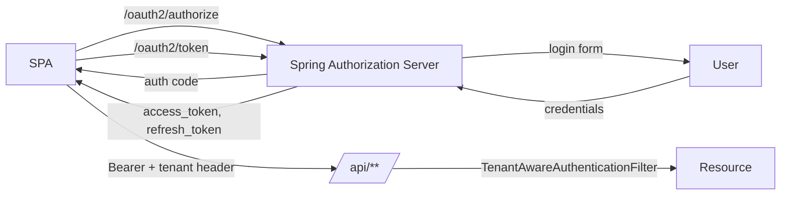
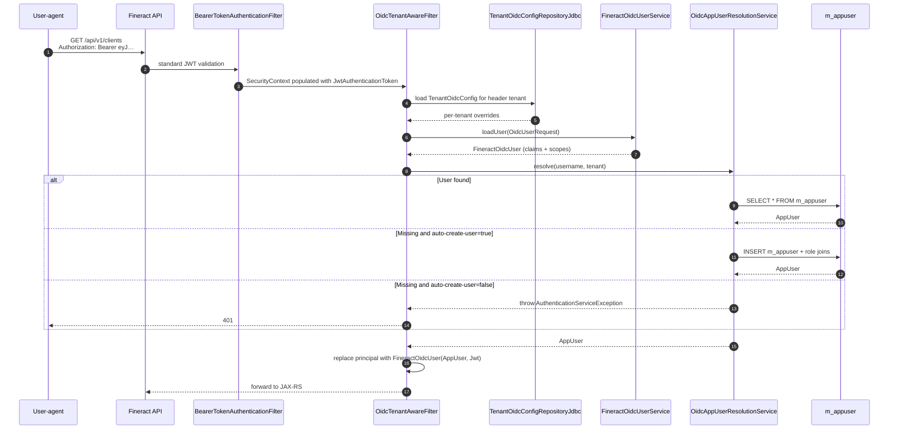

Apache Fineract supports two token-based authentication modes that replace HTTP Basic: a built-in **Spring Authorization Server** (so the Fineract instance itself issues the access tokens for its UI) and **OIDC federation** (where a foreign identity provider — Keycloak, Auth0, Azure AD — issues tokens that Fineract validates and maps onto local `m_appuser` rows). Both modes are off by default and are toggled by the `fineract.security.oauth2.*` and `fineract.security.oidc-federation.*` keys in `application.properties`. This page enumerates those keys, walks the `frontend-client` registration, and traces a federated request through `OidcTenantAwareFilter`, `FineractOidcUserService`, and `OidcAppUserResolutionService`.

## Configuration matrix

The full set of properties, taken from `fineract-provider/src/main/resources/application.properties`:

```properties
# Spring Authorization Server (frontend-client)
fineract.security.oauth2.enabled=${FINERACT_SECURITY_OAUTH_ENABLED:false}
fineract.security.oauth2.client.registrations.frontend-client.client-id=${FINERACT_SECURITY_OAUTH2_CLIENTS_FRONTEND_ID:frontend-client}
fineract.security.oauth2.client.registrations.frontend-client.scopes=${FINERACT_SECURITY_OAUTH2_CLIENTS_FRONTEND_SCOPES:read,write}
fineract.security.oauth2.client.registrations.frontend-client.authorization-grant-types=${FINERACT_SECURITY_OAUTH2_CLIENTS_FRONTEND_GRANTS:authorization_code,refresh_token}
fineract.security.oauth2.client.registrations.frontend-client.redirect-uris=${FINERACT_SECURITY_OAUTH2_CLIENTS_FRONTEND_REDIRECT:http://localhost:3000/callback}
fineract.security.oauth2.client.registrations.frontend-client.require-authorization-consent=${FINERACT_SECURITY_OAUTH2_CLIENTS_FRONTEND_CONSENT:false}

# OIDC federation (foreign IdP)
fineract.security.oidc-federation.enabled=${FINERACT_SECURITY_OIDC_FEDERATION_ENABLED:false}
fineract.security.oidc-federation.tenant-claim-name=${FINERACT_SECURITY_OIDC_TENANT_CLAIM:fineract_tenant}
fineract.security.oidc-federation.username-claim=${FINERACT_SECURITY_OIDC_USERNAME_CLAIM:preferred_username}
fineract.security.oidc-federation.auto-create-user=${FINERACT_SECURITY_OIDC_AUTO_CREATE_USER:false}
fineract.security.oidc-federation.default-roles=${FINERACT_SECURITY_OIDC_DEFAULT_ROLES:}
fineract.security.oidc-federation.provider=${FINERACT_SECURITY_OIDC_PROVIDER:generic}
fineract.security.oidc-federation.post-logout-redirect-uri=${FINERACT_SECURITY_OIDC_POST_LOGOUT_URI:}
```

The two stacks are independent — you can run the embedded authorization server *with* OIDC federation enabled (so the UI logs into Fineract, which itself federates to Keycloak for the actual identity check) or stand the federation up alone with an external SPA.

<Note>Only one of `basicauth.enabled`, `oauth2.enabled`, and `oidc-federation.enabled` may be `true` at any time. `WebSecurityConfig` asserts this at startup and fails fast if more than one is set.</Note>

## Spring Authorization Server: the `frontend-client` registration

When `fineract.security.oauth2.enabled=true`, Fineract bootstraps an embedded `OAuth2AuthorizationServerConfiguration` and registers a single client named `frontend-client`. The properties above translate one-to-one to a `RegisteredClient` object:

| Property | `RegisteredClient` field |
| --- | --- |
| `client-id` | `clientId` |
| `scopes` | `scopes` (parsed from CSV) |
| `authorization-grant-types` | `authorizationGrantTypes` |
| `redirect-uris` | `redirectUris` |
| `require-authorization-consent` | `clientSettings.requireAuthorizationConsent` |

The default grant set, `authorization_code,refresh_token`, supports the standard SPA flow with PKCE. The frontend (the Mifos web app or any custom client) opens `/oauth2/authorize?client_id=frontend-client&…`, the user authenticates against the basic-auth login form, an authorization code is returned to `redirect-uris`, and the SPA exchanges it for an access + refresh token at `/oauth2/token`. The resulting JWT carries `Fineract-Platform-TenantId` as a claim and is consumed downstream by `TenantAwareAuthenticationFilter` (see [Filters](/security/filters)).



## OIDC federation

OIDC federation is enabled with `fineract.security.oidc-federation.enabled=true`. The runtime then wires four cooperating beans plus the `OidcTenantAwareFilter` into the security chain.

### `OidcTenantAwareFilter`

Located at `fineract-security/src/main/java/org/apache/fineract/infrastructure/security/filter/OidcTenantAwareFilter.java`, this filter runs **after** Spring's `BearerTokenAuthenticationFilter` has validated the JWT and populated `SecurityContextHolder` with a `JwtAuthenticationToken`. Its work is purely Fineract-specific:

1. Read the configured `tenant-claim-name` from the JWT.
2. Resolve the tenant via `AuthTenantDetailsService` and push it onto `ThreadLocalContextUtil`.
3. Delegate to `OidcAppUserResolutionService` to find — or, with `auto-create-user=true`, create — the matching `AppUser`.
4. Replace the principal with a `FineractOidcUser` that carries both the original JWT and the resolved `AppUser`.

### `FineractOidcUserService`

A subclass of Spring's `OidcUserService` that overrides `loadUser(OidcUserRequest)` to translate the IdP's userinfo claims into the Fineract domain. The username comes from the claim named in `fineract.security.oidc-federation.username-claim` — defaulting to `preferred_username` (Keycloak-style) but commonly `email` or `sub` depending on the provider.

The bean is fronted by a `JwtDecoderFactory` so each registered OIDC provider gets its own signature-verification key set; `fineract.security.oidc-federation.provider=generic` toggles a permissive validator suited to most issuers, while named profiles (`keycloak`, `azure`, …) add provider-specific claim normalisation.

### `OidcAppUserResolutionService`

The bridge between an OIDC principal and an `m_appuser` row:

| Method | Behaviour |
| --- | --- |
| `resolve(String username, FineractPlatformTenant tenant)` | Looks up `m_appuser` by `username`. Returns the entity if found. |
| `autoCreate(FineractOidcUser principal, Collection<String> defaultRoles)` | When `auto-create-user=true` and the lookup misses, creates a new `AppUser` with the default office and the comma-separated `default-roles`. The password column is set to a random unusable hash — the user can only authenticate through the IdP. |

If `auto-create-user=false` and the lookup misses, the filter throws `AuthenticationServiceException`, which the entry point converts to HTTP 401. Operators typically pre-provision users and enable auto-create later when self-service onboarding is desired.

### `TenantOidcConfig` and `TenantOidcConfigRepository(Jdbc)`

Per-tenant OIDC overrides are stored in the `tenant_oidc_config` table inside the `tenant_store` schema. The shape:

| Column | Meaning |
| --- | --- |
| `tenant_id` | FK to `tenants.id`. |
| `issuer_uri` | OIDC discovery URL (`/.well-known/openid-configuration`). |
| `client_id`, `client_secret` | Credentials Fineract uses to call userinfo / introspection. |
| `scopes` | Space-separated list. |
| `username_claim`, `tenant_claim_name` | Per-tenant overrides of the global defaults. |
| `auto_create_user`, `default_roles` | Per-tenant overrides. |
| `post_logout_redirect_uri` | Where to send the user after `/logout`. |

`TenantOidcConfigRepository` is the JPA interface; `TenantOidcConfigRepositoryJdbc` is the lightweight JDBC alternative used during filter execution to avoid an `EntityManager` per request. Configuration is managed through the `/v1/tenants/{id}/oidc` REST resource (`TenantOidcConfigApiResource`).

## End-to-end OIDC flow



## Claim mapping

| OIDC claim | Lookup target | Notes |
| --- | --- | --- |
| `fineract.security.oidc-federation.username-claim` | `m_appuser.username` | Defaults to `preferred_username`. Set to `email` for IdPs that don't expose a stable username. |
| `fineract.security.oidc-federation.tenant-claim-name` | `tenants.identifier` | Defaults to `fineract_tenant`. If the claim is absent the request falls back to `Fineract-Platform-TenantId`. |
| `groups` / `roles` (provider-specific) | `m_role.name` | Provider-specific — `provider=keycloak` reads `realm_access.roles`; `provider=generic` reads top-level `roles`. |
| `email`, `given_name`, `family_name` | `m_appuser.email`, `firstname`, `lastname` | Used during auto-create. |

For unmapped claims, the raw JWT is still attached to the `FineractOidcUser` principal so custom downstream services can read them via `SpringSecurityPlatformSecurityContext`.

## Logout

Calling `POST /logout` with a bearer token clears the local session and, if `fineract.security.oidc-federation.post-logout-redirect-uri` (or the per-tenant override) is set, returns an `OIDC RP-initiated logout` redirect to the IdP's end-session endpoint. The post-logout URL is delivered as a `Location` header so SPAs can follow it transparently. Without the property, only the local session is dropped — the IdP session lives on.

## Troubleshooting

| Symptom | Cause |
| --- | --- |
| `401` after IdP login, no `AppUser` matched | `username-claim` does not match the `m_appuser.username` value. Inspect the JWT and adjust. |
| `400 Bad Request` from `/oauth2/token` | `redirect-uris` mismatch or PKCE verifier missing. |
| Tenant claim ignored | Header `Fineract-Platform-TenantId` is also present and overrides the JWT claim — remove one. |
| Auto-create succeeds but the user has no roles | `default-roles` is empty; populate the property or grant roles manually. |

## Token validation details

Spring's `BearerTokenAuthenticationFilter` runs first and performs the cryptographic checks:

| Check | Implementation |
| --- | --- |
| Signature | `JwtDecoder` configured with the issuer's JWK set URI; rotating keys are picked up automatically via the `JwkSetUriJwtDecoderBuilder`'s 5-minute cache. |
| `exp` | `JwtTimestampValidator` — token must be in the future. |
| `iss` | `JwtIssuerValidator` — must match the configured discovery URL's `issuer`. |
| `aud` | Optional `JwtClaimValidator` — only enabled when the runtime is configured with an audience claim to enforce. |
| `nbf` | `JwtTimestampValidator` — must be in the past (with the default 60s clock skew). |

If any check fails, the request is rejected with `401 Unauthorized` and an `error="invalid_token"` parameter; `OidcTenantAwareFilter` never sees the request.

## Default roles and group sync

When `auto-create-user=true`, the newly inserted `AppUser` is granted the comma-separated `default-roles` (matched against `m_role.name`). On subsequent logins for an existing user, the bean does *not* sync roles by default — once provisioned, the local Fineract role assignment is authoritative.

To re-sync roles on every login (full IdP-driven authorisation), implement a custom `OidcAppUserResolutionService` bean that compares the JWT's `groups` claim with `m_user_role` and reconciles the delta. The shipped implementation deliberately avoids this to keep IdP outages from cascading into role loss.

## Tenant claim vs. header precedence

When both a JWT `fineract_tenant` claim and an explicit `Fineract-Platform-TenantId` header are present, the header wins. This lets a federated client target a different tenant than the one its JWT was issued for — useful for support tooling — but operators may consider this surprising. The exact rule is enforced by the lookup order inside `OidcTenantAwareFilter`:

1. Header value present? Use it.
2. Otherwise, read the configured tenant claim.
3. If neither yields a tenant, throw `InvalidTenantIdentifierException` — 401.

To lock the request to the JWT claim, disable the header path by routing through a gateway that strips `Fineract-Platform-TenantId`.

## Logout reference

| Action | Endpoint | Effect |
| --- | --- | --- |
| Local logout | `POST /logout` | Drops the local `SecurityContext`. Returns 200. |
| RP-initiated logout | `POST /logout` with `post-logout-redirect-uri` configured | Returns 302 to the IdP's `end_session_endpoint` with the redirect URI as a parameter. |
| Token revocation | `POST {issuer}/revoke` (Spring Authorization Server) | Invalidates the access + refresh tokens server-side. |

## Operator checklist

| Task | Where |
| --- | --- |
| Enable embedded auth server | `fineract.security.oauth2.enabled=true` |
| Enable OIDC federation | `fineract.security.oidc-federation.enabled=true` |
| Add a tenant-specific IdP | `INSERT INTO tenant_oidc_config (...)` or `PUT /v1/tenants/{id}/oidc` |
| Rotate the auth-server signing key | `POST /actuator/oauth2/keys/rotate` (if the actuator is enabled) |

## Refresh-token flow

The embedded auth server issues refresh tokens when the grant set includes `refresh_token`. The refresh-token lifetime is configurable via Spring Authorization Server's standard `tokenSettings.refreshTokenTimeToLive`; the default is 60 minutes for access tokens and 30 days for refresh tokens. Refreshing follows the standard:

```http
POST /oauth2/token
Content-Type: application/x-www-form-urlencoded

grant_type=refresh_token&refresh_token=…&client_id=frontend-client
```

The response carries a new access token and (by default) the same refresh token rotated. Disable rotation by setting the registration's `tokenSettings.reuseRefreshTokens=true` — generally not recommended because it weakens replay defence.

## `FineractOidcUser` principal shape

After `OidcTenantAwareFilter` finishes, the principal stored on `SecurityContextHolder` is a `FineractOidcUser` exposing both the raw JWT and the resolved `AppUser`:

```java
public class FineractOidcUser implements OidcUser {
    private final AppUser appUser;
    private final OidcIdToken idToken;
    private final OidcUserInfo userInfo;
    private final Map<String, Object> attributes;
    // standard OidcUser delegate methods …

    public AppUser getAppUser() { return appUser; }
}
```

`SpringSecurityPlatformSecurityContext.authenticatedUser()` returns `appUser` regardless of which authentication mode populated it, so business services never see the distinction. The raw JWT is available for custom code that needs to forward the token to a downstream resource server (e.g. webhooks signed with the caller's identity).

## Related reading

- [Filters](/security/filters) — chain ordering with `OidcTenantAwareFilter`.
- [Basic auth](/security/basic-auth) — the mode being replaced.
- [Tenant resolution](/security/tenant-auth-resolution) — how the tenant claim resolves to a connection.
- [Two-factor](/security/two-factor) — can be layered on top of OIDC for sensitive operations.
