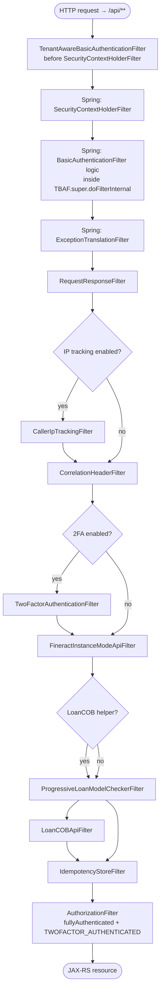

Apache Fineract ships its security primitives in a dedicated Gradle module, `fineract-security`, that is consumed by `fineract-provider` to build the runtime Spring Security filter chain. This page is the entry point for the `Security & Auth` section of the wiki: it inventories the packages under `org.apache.fineract.infrastructure.security`, lists the `application.properties` keys that toggle each subsystem on or off, and diagrams the order in which filters fire for an `/api/**` request.

## Module layout

The `fineract-security` module rooted at `fineract-security/src/main/java/org/apache/fineract/infrastructure/security/` is partitioned into nine peer packages — every other security page in this section drills into one of them.

| Package | Role | Deep dive |
| --- | --- | --- |
| `api` | JAX-RS resources — `AuthenticationApiResource`, `LoginController`, `TwoFactorApiResource`, `TwoFactorConfigurationApiResource`, `TenantOidcConfigApiResource`, `UserDetailsApiResource` | See per-feature pages |
| `command` | `CommandWrapperBuilder` extensions for the 2FA invalidate / configure commands | [Two-factor](/security/two-factor) |
| `constants` | `TenantConstants`, `TwoFactorConstants`, `TwoFactorConfigurationConstants` | [Two-factor](/security/two-factor) |
| `converter` | OAuth2 / OIDC `Converter<Jwt, AbstractAuthenticationToken>` implementations | [OAuth2 & OIDC](/security/oauth2-and-oidc) |
| `data` | DTOs — `PlatformRequestLog`, `OTPRequest`, `AccessTokenData`, `FineractJwtAuthenticationToken`, `FineractOidcUser` | — |
| `domain` | JPA entities — `TFAccessToken`, `TwoFactorConfiguration`, plus the in-memory `OTPRequestRepository` | [Two-factor](/security/two-factor) |
| `exception` | `InvalidTenantIdentifierException`, `OTPTokenInvalidException`, `OidcUserNotFoundException`, `ResetPasswordException`, etc. | — |
| `filter` | The five servlet filters wired into the Spring Security chain | [Filters](/security/filters) |
| `handler` | `CustomAuthenticationFailureHandler` for the OAuth2 login form | [OAuth2 & OIDC](/security/oauth2-and-oidc) |
| `service` | Tenant lookup, user details, password checking, OIDC user resolution, OTP generation, SQL escaping | All sub-pages |

The `service/` package is the biggest — it hosts the tenant lookup (`AuthTenantDetailsServiceJdbc`), the user details bridge to JPA (`TenantAwareJpaPlatformUserDetailsService`), the OIDC plumbing (`FineractOidcUserService`, `TenantOidcConfigService`), the two-factor backend (`TwoFactorService`, `RandomOTPGenerator`, `UUIDAccessTokenGenerationService`) and the SQL escaping utility (`SqlInjectionPreventerServiceImpl`).

## Three authentication modes

Fineract supports three mutually exclusive authentication modes for `/api/**`. Each mode owns one `SecurityFilterChain` bean inside `fineract-provider`, gated by an `@ConditionalOnProperty`:

| Mode | Provider config class | Toggle |
| --- | --- | --- |
| HTTP Basic (multi-tenant) | `org.apache.fineract.infrastructure.core.config.SecurityConfig` | `fineract.security.basicauth.enabled=true` |
| OAuth2 Authorization Server | `org.apache.fineract.infrastructure.security.config.AuthorizationServerConfig` | `fineract.security.oauth2.enabled=true` |
| OIDC federation (external IdP) | `org.apache.fineract.infrastructure.security.config.OidcFederationSecurityConfig` | `fineract.security.oidc-federation.enabled=true` |

Two-factor auth is a cross-cutting overlay enabled by `fineract.security.2fa.enabled=true` — it adds the `TwoFactorAuthenticationFilter` and an extra `TWOFACTOR_AUTHENTICATED` authority requirement to whichever chain is active.

<Note>
The `basicauth` chain is the default and historical Fineract path. The OAuth2 and OIDC chains were added to support browser-based logins against Spring Authorization Server and external IdPs (Keycloak, Auth0, Azure AD).
</Note>

## application.properties: `fineract.security.*`

The provider exposes every security toggle as a property in `fineract-provider/src/main/resources/application.properties`, each bound to a `FINERACT_*` environment variable so containers can override without rebuilding.

### Authentication toggles

| Property | Default | Purpose |
| --- | --- | --- |
| `fineract.security.basicauth.enabled` | `true` | Activates the `SecurityConfig` filter chain that requires `Authorization: Basic …` plus `Fineract-Platform-TenantId` on every `/api/**` call. |
| `fineract.security.oauth2.enabled` | `false` | Enables Spring Authorization Server with the `frontend-client` registration; protects `/api/**` with `oauth2ResourceServer.jwt()`. |
| `fineract.security.2fa.enabled` | `false` | Conditionally registers `TwoFactorAuthenticationFilter`, the `TFAccessTokenRepository` and the `/v1/twofactor` API. |
| `fineract.security.hsts.enabled` | `false` | Adds `Strict-Transport-Security: max-age=31536000; includeSubDomains` and redirects HTTP→HTTPS for `/api/**`. |

### CORS

| Property | Default | Purpose |
| --- | --- | --- |
| `fineract.security.cors.enabled` | `true` | Registers Spring's CORS configurer on the filter chain. |
| `fineract.security.cors.allowed-origin-patterns` | `*` | Wildcard origin matcher. |
| `fineract.security.cors.allowed-methods` | `*` | Methods accepted on preflight. |
| `fineract.security.cors.allowed-headers` | `*` | Request headers allowed in preflight. |
| `fineract.security.cors.exposed-headers` | `*` | Response headers exposed to JS clients. |
| `fineract.security.cors.allow-credentials` | `true` | Allows cookies / `Authorization` on cross-origin requests. |

### OAuth2 frontend client

The Spring Authorization Server ships one example registration named `frontend-client`:

| Property | Default | Purpose |
| --- | --- | --- |
| `fineract.security.oauth2.client.registrations.frontend-client.client-id` | `frontend-client` | OAuth2 `client_id` advertised on the discovery document. |
| `fineract.security.oauth2.client.registrations.frontend-client.scopes` | `read,write` | Comma-separated scopes the SPA may request. |
| `fineract.security.oauth2.client.registrations.frontend-client.authorization-grant-types` | `authorization_code,refresh_token` | Allowed RFC 6749 grant types. |
| `fineract.security.oauth2.client.registrations.frontend-client.redirect-uris` | `http://localhost:3000/callback` | Callback URI registered for PKCE flows. |
| `fineract.security.oauth2.client.registrations.frontend-client.require-authorization-consent` | `false` | Skip the consent page on first use. |

### OIDC federation

When `fineract.security.oidc-federation.enabled=true`, Fineract validates JWTs minted by an external IdP and maps each token to an `AppUser`:

| Property | Default | Purpose |
| --- | --- | --- |
| `fineract.security.oidc-federation.tenant-claim-name` | `fineract_tenant` | Custom claim read by `OidcTenantAwareFilter` (priority 3, after DB and YAML issuers). |
| `fineract.security.oidc-federation.username-claim` | `preferred_username` | Claim used by `FineractOidcUserService.extractUsername()`. |
| `fineract.security.oidc-federation.auto-create-user` | `false` | When `true`, `OidcAppUserResolutionService` creates an `AppUser` on first sight. |
| `fineract.security.oidc-federation.default-roles` | _empty_ | Comma-separated role names assigned to auto-created users. |
| `fineract.security.oidc-federation.provider` | `generic` | Profile hint (`keycloak`, `auth0`, etc.) used to tweak claim handling. |
| `fineract.security.oidc-federation.post-logout-redirect-uri` | _empty_ | Where the IdP returns the browser after `end_session_endpoint`. |

<Tip>
All keys are also reachable via `FINERACT_SECURITY_*` environment variables — see the `${FINERACT_…}` placeholders in `application.properties` for the exact names.
</Tip>

## The basicauth filter chain

`SecurityConfig.filterChain(HttpSecurity)` (provider) is the canonical wiring under the default `basicauth` mode. It is registered with `@ConditionalOnProperty("fineract.security.basicauth.enabled")` and applies only to URLs that match the matcher `/api/**`.

```java
http.securityMatcher(API_MATCHER.matcher("/api/**")).authorizeHttpRequests(auth -> {
    List<AuthorizationManager<RequestAuthorizationContext>> authorizationManagers = new ArrayList<>();
    authorizationManagers.add(fullyAuthenticated());

    if (fineractProperties.getSecurity().getTwoFactor().isEnabled()) {
        authorizationManagers.add(hasAuthority("TWOFACTOR_AUTHENTICATED"));
    }
    // … permitAll() for authentication, password/forgot, instance-mode, OPTIONS …
    // … explicit hasAuthority(…) per resource (notes, documents, images, charts, …) …
    .requestMatchers(API_MATCHER.matcher("/api/**")).access(allOfRequestManagers(authorizationManagers));
}).httpBasic(hb -> hb.authenticationEntryPoint(basicAuthenticationEntryPoint()))
  .csrf(AbstractHttpConfigurer::disable)
  .sessionManagement(smc -> smc.sessionCreationPolicy(SessionCreationPolicy.STATELESS))
  .addFilterBefore(tenantAwareBasicAuthenticationFilter(), SecurityContextHolderFilter.class)
  .addFilterAfter(requestResponseFilter(), ExceptionTranslationFilter.class)
  .addFilterAfter(correlationHeaderFilter(), RequestResponseFilter.class)
  .addFilterAfter(fineractInstanceModeApiFilter(), CorrelationHeaderFilter.class);
```

Key points to note:

- **Session policy is `STATELESS`** — no `JSESSIONID` is ever set. Every request must carry its own credentials.
- **CSRF is disabled** — because there is no session and clients are non-browser by default.
- **The custom `TenantAwareBasicAuthenticationFilter` runs _before_ `SecurityContextHolderFilter`** so the tenant context is bound before any authorization manager touches the database.
- **An `allOf` authorization manager** combines `fullyAuthenticated()` with `hasAuthority("TWOFACTOR_AUTHENTICATED")` when 2FA is on, so both checks must pass.

### Conditional filters

`SecurityConfig` then conditionally adds filters depending on other properties:

```java
if (loanCOBFilterHelper != null) {
    http.addFilterAfter(loanCOBApiFilter(), FineractInstanceModeApiFilter.class)
        .addFilterAfter(idempotencyStoreFilter(), LoanCOBApiFilter.class);
    http.addFilterBefore(progressiveLoanModelCheckerFilter, LoanCOBApiFilter.class);
} else {
    http.addFilterAfter(idempotencyStoreFilter(), FineractInstanceModeApiFilter.class);
    http.addFilterAfter(progressiveLoanModelCheckerFilter, FineractInstanceModeApiFilter.class);
}
if (fineractProperties.getIpTracking().isEnabled()) {
    http.addFilterAfter(callerIpTrackingFilter(), RequestResponseFilter.class);
}
if (fineractProperties.getSecurity().getTwoFactor().isEnabled()) {
    http.addFilterAfter(twoFactorAuthenticationFilter(), CorrelationHeaderFilter.class);
}

if (serverProperties.getSsl().isEnabled()) {
    http.redirectToHttps(redirect -> redirect.requestMatchers(API_MATCHER.matcher("/api/**")));
}
if (fineractProperties.getSecurity().getHsts().isEnabled()) {
    http.redirectToHttps(Customizer.withDefaults()).headers(
        headers -> headers.httpStrictTransportSecurity(hsts -> hsts.includeSubDomains(true).maxAgeInSeconds(31536000)));
}
if (fineractProperties.getSecurity().getCors().isEnabled()) {
    http.cors(Customizer.withDefaults());
}
```

## Filter chain diagram

The diagram below shows every filter the basicauth chain assembles, in the relative order produced by `addFilterBefore` / `addFilterAfter`:



## Authentication provider and password encoder

`SecurityConfig` exposes the `DaoAuthenticationProvider` and the delegating `PasswordEncoder` that the basicauth filter relies on:

```java
@Bean(name = "customAuthenticationProvider")
public DaoAuthenticationProvider authProvider() {
    DaoAuthenticationProvider authProvider = new TemporaryPasswordAwareAuthenticationProvider(userDetailsService);
    authProvider.setPasswordEncoder(passwordEncoder());
    authProvider.setPostAuthenticationChecks(platformUserDetailsChecker);
    return authProvider;
}

@Bean
public PasswordEncoder passwordEncoder() {
    return PasswordEncoderFactories.createDelegatingPasswordEncoder();
}
```

`PasswordEncoderFactories.createDelegatingPasswordEncoder()` returns a `DelegatingPasswordEncoder` whose default is BCrypt (`{bcrypt}` prefix on stored hashes); legacy hashes with other prefixes are still recognised on login, so a password rotation transparently upgrades the encoding. Details on the BCrypt path live in [Basic auth](/security/basic-auth).

## Entry point

Every basicauth chain shares one entry point bean, exposed at the standard HTTP `WWW-Authenticate` realm `Fineract Platform API`:

```java
@Bean
public BasicAuthenticationEntryPoint basicAuthenticationEntryPoint() {
    BasicAuthenticationEntryPoint basicAuthenticationEntryPoint = new BasicAuthenticationEntryPoint();
    basicAuthenticationEntryPoint.setRealmName("Fineract Platform API");
    return basicAuthenticationEntryPoint;
}
```

An unauthenticated request to `/api/**` therefore returns `401 Unauthorized` with `WWW-Authenticate: Basic realm="Fineract Platform API"`.

## Method-level security

`SecurityConfig` is annotated `@EnableMethodSecurity`, which activates Spring's `@PreAuthorize`/`@PostAuthorize` and the legacy `@Secured`. Most service-layer authorization in Fineract is _not_ method-level — it goes through the JAX-RS resource calling `PlatformSecurityContext.authenticatedUser().validateHasReadPermission(resource)` — but the annotation gives downstream modules the option.

The per-URL pattern matchers inside `authorizeHttpRequests {…}` carry the bulk of the rules. They form a long catalogue keyed by HTTP method and path pattern, each requiring one of:

- `ALL_FUNCTIONS` — superuser
- `ALL_FUNCTIONS_READ` — global read role
- `ALL_FUNCTIONS_WRITE` — global write role
- A resource-specific permission such as `READ_CLIENTNOTE`, `CREATE_DOCUMENT`, `UPDATE_INTERESTRATECHART`, `DELETE_HOOK`, `READ_STAFF`, etc.

The unmatched tail of `/api/**` falls through to the combined `fullyAuthenticated() + hasAuthority("TWOFACTOR_AUTHENTICATED")` rule when 2FA is enabled, otherwise to `fullyAuthenticated()` alone.

## What's next

<CardGroup cols={2}>
  <Card title="Filters" href="/security/filters">
    Per-filter signatures, order, and what each one writes to the request / `ThreadLocalContextUtil`.
  </Card>
  <Card title="Basic auth" href="/security/basic-auth">
    `TenantAwareBasicAuthenticationFilter`, `TenantAwareJpaPlatformUserDetailsService`, `SpringSecurityPlatformSecurityContext`, BCrypt.
  </Card>
  <Card title="OAuth2 & OIDC" href="/security/oauth2-and-oidc">
    Spring Authorization Server, the `frontend-client` registration, and the OIDC federation flow.
  </Card>
  <Card title="Two-factor" href="/security/two-factor">
    `TwoFactorService`, OTP delivery, access tokens, `/v1/twofactor` endpoints.
  </Card>
  <Card title="Tenant resolution" href="/security/tenant-auth-resolution">
    How `Fineract-Platform-TenantId` becomes a `FineractPlatformTenant` in `ThreadLocalContextUtil`.
  </Card>
  <Card title="SQL injection prevention" href="/security/sql-injection-prevention">
    `SqlInjectionPreventerServiceImpl.encodeSql()` and `quoteIdentifier()` regex inventory.
  </Card>
</CardGroup>
