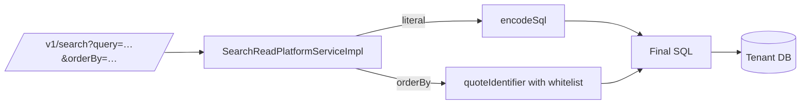

Several Apache Fineract subsystems build SQL dynamically — the ad-hoc search resource pieces together `WHERE` clauses from query parameters, the data-tables feature `CREATE TABLE`s columns named by clients, and the reports engine accepts raw SQL stored in `m_stretchy_report`. Each of those is a potential SQL-injection vector, and each routes its user-controlled input through `SqlInjectionPreventerServiceImpl` — the single point of escape, identifier quoting, and whitelist enforcement. This page documents the bean's regex inventory, the database-specific escapers it delegates to, and the three call-site classes (search, data-tables, reports) that depend on it.

## The bean

`fineract-security/src/main/java/org/apache/fineract/infrastructure/security/service/SqlInjectionPreventerServiceImpl.java` implements `SqlInjectionPreventerService` and is wired with one collaborator:

```java
@Service
public class SqlInjectionPreventerServiceImpl implements SqlInjectionPreventerService {
    private final DatabaseTypeResolver databaseTypeResolver;
    // …
}
```

`DatabaseTypeResolver` distinguishes MySQL/MariaDB from PostgreSQL so each gets the correct escaping. Any other database returns the input unchanged with a warning — a deliberate decision to maintain backwards compatibility with the (small) set of community-supported databases that have not been audited.

The interface exposes three operations:

| Method | Purpose |
| --- | --- |
| `String encodeSql(String literal)` | Escape a *literal value* so it is safe to interpolate into a single-quoted SQL string. |
| `String quoteIdentifier(String identifier)` | Validate an *identifier* (table / column name) against a regex and wrap it in the dialect-appropriate quote. |
| `String quoteIdentifier(String identifier, Set<String> allowedValues)` | The same plus an extra whitelist check (case-insensitive). |

## `encodeSql` — literal escaping

For PostgreSQL, the bean delegates to the JDBC driver:

```java
return Utils.escapeLiteral(null, literal, true).toString();
```

`org.postgresql.core.Utils#escapeLiteral` is the official, battle-tested routine for Postgres `standard_conforming_strings`; it handles backslashes, single quotes, and Unicode escapes correctly. Failure (e.g. a literal containing a null byte that Postgres refuses) bubbles up as `EscapeSqlLiteralException`.

For MySQL/MariaDB, the bean uses a custom routine — replacing the previously used ESAPI implementation as part of the fix for **CVE-2025-5878**:

| Character | Escaped to |
| --- | --- |
| `\0` (null byte) | `\\0` |
| `'` | `\\'` |
| `"` | `\\"` |
| `\` | `\\\\` |
| `\n` | `\\n` |
| `\r` | `\\r` |
| `\t` | `\\t` |
| `\032` (Ctrl+Z, ASCII 26) | `\\Z` |

A `null` input returns the literal string `"NULL"` so callers can assemble `WHERE col = …` blindly:

```java
@Override
public String encodeSql(String literal) {
    if (literal == null) {
        return "NULL";
    }
    if (databaseTypeResolver.isMySQL()) {
        return escapeMySQLLiteral(literal);
    } else if (databaseTypeResolver.isPostgreSQL()) {
        try {
            return Utils.escapeLiteral(null, literal, true).toString();
        } catch (SQLException e) {
            throw new EscapeSqlLiteralException("Failed to escape SQL literal", e);
        }
    } else {
        return literal;
    }
}
```

## `quoteIdentifier` — identifier validation

The first overload runs an unconditional regex check before any quoting:

```java
if (!identifier.matches("^[a-zA-Z_][a-zA-Z0-9_]*$")) {
    throw new IllegalArgumentException("Invalid identifier format: " + identifier);
}
```

The regex enforces:

- starts with an ASCII letter or underscore;
- continues with ASCII letters, digits, or underscores;
- no spaces, hyphens, dots, or quote characters.

Anything outside that grammar is rejected outright — even before the dialect step. This is a strict superset of the SQL identifier grammar Fineract's own schema uses (snake_case all-lowercase) and refuses the kinds of payload that escape attempts typically rely on (`"`, ``\``, `;`, backticks).

Once the regex passes, the dialect step adds quotes:

| Database | Output |
| --- | --- |
| MySQL / MariaDB | `` `identifier` `` with embedded backticks doubled. |
| PostgreSQL | `"identifier"` with embedded double quotes doubled. |
| Other | identifier returned unquoted (with the regex check still enforced). |

The second overload adds a whitelist check before delegation:

```java
if (allowedValues != null && !allowedValues.contains(identifier.toLowerCase())) {
    throw new IllegalArgumentException("Identifier not in whitelist: " + identifier);
}
```

The whitelist is always lower-cased on both sides — Fineract's schemata are case-insensitive, and the caller typically supplies the whitelist from a `INFORMATION_SCHEMA` lookup.

## Regex inventory

| Regex / pattern | Where defined | What it allows |
| --- | --- | --- |
| `^[a-zA-Z_][a-zA-Z0-9_]*$` | `quoteIdentifier` | The default identifier grammar. |
| Single-quote literal escapes | `escapeMySQLLiteral` | MySQL/MariaDB literal characters listed above. |
| `org.postgresql.core.Utils#escapeLiteral` | PostgreSQL driver | Standard Postgres literal escapes. |

There is no regex for ordering / pagination keywords — those are validated at the caller side against a hard-coded `Set<String> ALLOWED = Set.of("asc", "desc")` and similar before they ever reach the SQL preventer.

## Callers

Three subsystems are the predominant consumers.

### Search — `SearchReadPlatformServiceImpl`

The free-text search endpoint (`GET /v1/search`) builds a `UNION ALL` across the loan, savings, client, and group tables. The `query` parameter is escaped with `encodeSql`, while the sort column — supplied as `orderBy=…` by the caller — is run through `quoteIdentifier(orderBy, ALLOWED_SEARCH_COLUMNS)`. The whitelist holds the half-dozen columns the search index actually understands; anything else is rejected with a 400.



### Data tables — `ReadWriteNonCoreDataServiceImpl`

Data tables are user-defined extensions to core entities — operators may add `tax_id` to `m_client`, `branch_code` to `m_loan`, and so on. The endpoint accepts the new column name and type in the request body and issues a `CREATE TABLE` / `ALTER TABLE`. Every identifier (table name, column name) goes through `quoteIdentifier`:

| Identifier | Whitelist? |
| --- | --- |
| Table name | No (must pass the regex; the bean rejects anything reserved). |
| Column name | No (regex only — there is no fixed whitelist for user-created columns). |
| Column type | Yes — `quoteIdentifier(type, Set.of("varchar","integer","date",…))`. |

Where data tables are *read* (`GET /v1/datatables/{name}/{appTableId}`), the column list is checked against the live `INFORMATION_SCHEMA` for the data table and *that* set becomes the whitelist for `quoteIdentifier`. This prevents callers from injecting a column from a *different* table.

### Reports — `GenericDataServiceImpl` and `ReadReportingServiceImpl`

The reporting engine executes parametrised SQL stored in `m_stretchy_report`. The query body is trusted (only privileged users can edit it) but the parameter values supplied at run-time are user input. Each parameter is escaped with `encodeSql` before substitution; the substitution itself is a literal `String#replace` against a placeholder of the form `${paramName}`.

For pivot reports, the engine also accepts a column to pivot on — that column name is run through `quoteIdentifier(name, columnsFromReport)` where `columnsFromReport` is the SELECT list of the underlying report. The same pattern (use the previous step's output to constrain the next step) keeps user input from naming a column the report does not expose.

```mermaid
flowchart TB
    R[/v1/runreports/{name}?R_param=val/] --> Svc[ReadReportingServiceImpl]
    Svc --> Sql[m_stretchy_report.report_sql]
    Svc --> Esc[encodeSql per param]
    Esc --> Sub[String#replace placeholder]
    Sub --> Run[JDBC execute]
```

## Threat model

The bean's invariants:

| Invariant | Enforced by |
| --- | --- |
| A literal that round-trips through `encodeSql` cannot terminate a `'…'` SQL string. | `Utils.escapeLiteral` (Postgres) / `escapeMySQLLiteral` (MySQL). |
| An identifier that round-trips through `quoteIdentifier` cannot escape the quote wrapper. | Backtick / double-quote doubling + the regex. |
| The whitelist overload cannot return an identifier outside the whitelist. | `allowedValues.contains(identifier.toLowerCase())` check. |

Threats that lie **outside** the bean's scope:

- Raw concatenation of user input directly into SQL without calling the bean — `SqlInjectionPreventerService` cannot defend a caller that never invokes it. Code review and SpotBugs rules guard against new offenders.
- Stored SQL (in `m_stretchy_report.report_sql`) is trusted; an operator with the `CREATE_REPORT` permission can write arbitrary SQL. Limit that permission accordingly.
- LIKE patterns — `encodeSql` escapes string-delimiter characters but not the LIKE metacharacters `%` and `_`. Callers that want a literal `%` must escape it themselves.

## Testing

`SqlInjectionPreventerServiceImpl` has a dedicated test suite covering the MySQL escape table character-by-character, both the regex-pass and regex-fail branches of `quoteIdentifier`, and the whitelist overload. The dialect dispatch is exercised with both `DatabaseTypeResolver.isMySQL()=true` and `…isPostgreSQL()=true`; a fallback branch verifies that an unknown dialect returns the input unchanged but still enforces the regex.

When adding a new caller, add an integration test that submits a known-bad payload (e.g. `name'; DROP TABLE m_appuser;--`) and asserts a 400 — that proves the new path actually invokes the bean. The existing test fixtures in `fineract-provider/src/test/java/org/apache/fineract/infrastructure/security/` are a useful starting point.

## Behaviour summary

A quick mental model for the bean's three methods:

| Call | Input | Output |
| --- | --- | --- |
| `encodeSql("O'Brien")` | `O'Brien` | `O\\'Brien` on MySQL, `O''Brien` on Postgres. |
| `encodeSql(null)` | `null` | The string `"NULL"`. |
| `quoteIdentifier("client_name")` | `client_name` | `` `client_name` `` (MySQL) or `"client_name"` (Postgres). |
| `quoteIdentifier("client name")` | spaces in identifier | Throws `IllegalArgumentException`. |
| `quoteIdentifier("nm", Set.of("nm","id"))` | `nm` (in whitelist) | Quoted output. |
| `quoteIdentifier("evil", Set.of("nm","id"))` | not in whitelist | Throws `IllegalArgumentException`. |

The three calls compose: callers typically run a literal through `encodeSql`, identifiers through `quoteIdentifier`, and concatenate the results.

## Defence-in-depth context

Even with the preventer in place, Fineract layers several other defences in front of dynamic SQL:

| Layer | Defence |
| --- | --- |
| HTTP filter | Authentication ([Basic](/security/basic-auth) or [OIDC](/security/oauth2-and-oidc)) — only authenticated users can hit the endpoints that build dynamic SQL. |
| Tenant binding | [Tenant resolution](/security/tenant-auth-resolution) ensures the dynamic query runs against the caller's own database — there is no cross-tenant exposure even on a successful injection. |
| Spring Data | All "core" entities use JPA parameter binding (`?1` placeholders) — only the search / data-tables / reports paths build SQL dynamically. |
| Permission checks | The privileged endpoints (e.g. `CREATE_REPORT`) require a permission row; ordinary users cannot edit `m_stretchy_report.report_sql`. |
| `quoteIdentifier` regex | Even within the dynamic paths, identifiers are constrained to a strict grammar before being concatenated. |

## Usage patterns

The bean is autowired wherever it is needed:

```java
public class SearchReadPlatformServiceImpl implements SearchReadPlatformService {

    private final SqlInjectionPreventerService sqlInjectionPreventer;

    @Override
    public Collection<SearchData> retrieveAll(SearchRequest req) {
        String safeOrderBy = sqlInjectionPreventer.quoteIdentifier(
                req.getOrderBy(), ALLOWED_SEARCH_COLUMNS);
        String safeQuery = sqlInjectionPreventer.encodeSql(req.getQuery());

        String sql = "SELECT … FROM v_search_index"
                   + " WHERE search_blob LIKE '%" + safeQuery + "%'"
                   + " ORDER BY " + safeOrderBy;
        return jdbcTemplate.query(sql, rowMapper);
    }
}
```

Two things worth pointing out:

1. The order-by output already includes the dialect-appropriate quotes, so the caller does *not* add backticks or double quotes around it.
2. The literal is interpolated raw — the surrounding single quotes are *not* added by `encodeSql`. Callers wrap the result themselves so the bean stays composable with `IS NULL`, `IN (…)`, and other non-quoted contexts (the `NULL` return value for `null` inputs is what makes this work).

## When to *not* use the bean

If the dynamic input can be expressed as a JDBC parameter (`?`), use that instead — parameter binding is always safer than string escaping. The preventer is for the cases where the dynamic input is structurally a SQL element (an identifier, an `ORDER BY` clause, a table name in a `CREATE TABLE`) that the driver cannot bind as a parameter.

## CVE history

| CVE | Mitigation |
| --- | --- |
| **CVE-2025-5878** | Replaced ESAPI's `Encoder#encodeForSQL` with `escapeMySQLLiteral` to fix a bypass for MySQL/MariaDB. See the inline comment on `escapeMySQLLiteral` for details. |
| Earlier hardenings (pre-CVE) | Introduced the `^[a-zA-Z_][a-zA-Z0-9_]*$` regex on `quoteIdentifier` after a report of unquoted table-name injection in the data-tables endpoint. |

The bean is a high-blast-radius primitive — a change here affects every dynamic-SQL caller. Pull requests modifying it require a full security review.

## Related reading

- [Filters](/security/filters) — request-level defences that complement the bean.
- [Basic auth](/security/basic-auth) — user-level authorisation gating who can hit the vulnerable endpoints.
- [Tenant resolution](/security/tenant-auth-resolution) — even after escaping, queries are scoped to the bound tenant database.
- [Two-factor](/security/two-factor) — additional gate for the privileged report-editing endpoints.
