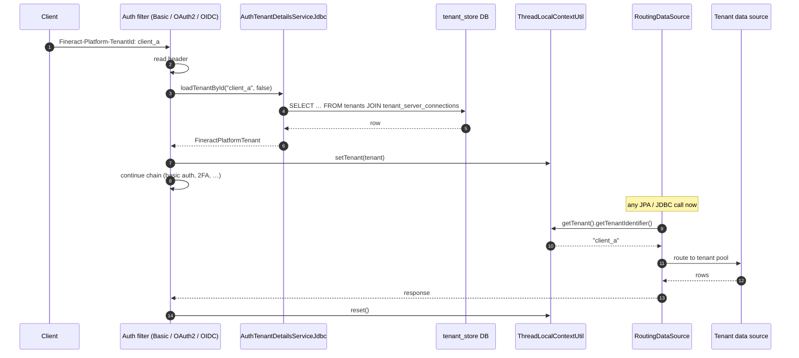

Every request to Apache Fineract carries a `Fineract-Platform-TenantId` HTTP header (or, under OIDC federation, an equivalent JWT claim). The value is the *only* signal the runtime uses to pick a connection pool, run authentication, and resolve business data — there is no implicit "default" tenant in production. This page traces the header's journey: the parsing step in the authentication filter, the JDBC lookup performed by `AuthTenantDetailsService` (and its `AuthTenantDetailsServiceJdbc` implementation), the `tenants` table that lives in the `tenant_store` database, and the `ThreadLocalContextUtil` binding that exposes the resolved `FineractPlatformTenant` to the rest of the request thread.

## The `tenants` table

The `tenant_store` database (usually a Postgres or MariaDB instance named `fineract_tenants`) holds two tables — `tenants` and `tenant_server_connections` — that together describe every tenant the runtime can serve.

`tenants` columns:

| Column | Purpose |
| --- | --- |
| `id` | Surrogate primary key. |
| `identifier` | The string compared against the `Fineract-Platform-TenantId` header — typically `default`, `client_a`, etc. |
| `name` | Human-readable label. |
| `timezone_id` | IANA zone used to drive business-date / COB calculations. |
| `country_id` | Optional FK into the localisation tables. |
| `joined_date`, `created_date`, `lastmodified_date` | Audit. |
| `oltp_id` | FK to `tenant_server_connections` for the OLTP pool. |
| `report_id` | FK to `tenant_server_connections` for the read-only / reporting pool. |

`tenant_server_connections` columns:

| Column | Purpose |
| --- | --- |
| `schema_server`, `schema_server_port` | Host and port of the per-tenant database. |
| `schema_name`, `schema_username`, `schema_password` | Connection coordinates. |
| `auto_update`, `pool_*` | HikariCP tuning. |
| `readonly_*` | Optional read-only replica details. |

Together they describe a tenant fully — both the data schema and the pool size — so a single `Fineract-Platform-TenantId` lookup yields everything required to obtain a `DataSource`.

## `AuthTenantDetailsService`

`fineract-security/src/main/java/org/apache/fineract/infrastructure/security/service/AuthTenantDetailsService.java` is the contract the authentication filters depend on:

```java
public interface AuthTenantDetailsService {
    FineractPlatformTenant loadTenantById(String tenantIdentifier, boolean isReport);
}
```

The `isReport` flag toggles between the OLTP connection (`oltp_id`) and the reporting connection (`report_id`); the authentication path always passes `false`, while the reporting subsystem uses `true` when running heavy SELECTs against the read-only pool.

### `AuthTenantDetailsServiceJdbc`

The single shipped implementation. It exists in two variants depending on the active profile:

| Variant | When | What it does |
| --- | --- | --- |
| `AuthTenantDetailsServiceJdbc` (default) | Production | Issues a `SELECT` against `tenant_store.tenants` joined to `tenant_server_connections` and materialises a `FineractPlatformTenant`. Caches the result for the lifetime of the JVM keyed on `(identifier, isReport)`. |
| Spring-profile variants | Test / embedded | Use an in-memory tenant list compiled from `application.properties`. |

The SQL is straightforward:

```sql
SELECT t.id, t.identifier, t.name, t.timezone_id,
       c.schema_server, c.schema_server_port,
       c.schema_name,  c.schema_username, c.schema_password,
       c.pool_initial_size, c.pool_maximum_active_connections,
       c.readonly_schema_server, c.readonly_schema_name, ...
  FROM tenants t
  JOIN tenant_server_connections c
    ON c.id = CASE WHEN ? THEN t.report_id ELSE t.oltp_id END
 WHERE t.identifier = ?
```

If the row is absent, the bean throws `InvalidTenantIdentifierException`, which the filter's `AuthenticationEntryPoint` translates to HTTP 401.

## `ThreadLocalContextUtil`

`fineract-core/src/main/java/org/apache/fineract/infrastructure/core/service/ThreadLocalContextUtil.java` is the per-request bag of contextual state. Its responsibilities:

| Slot | Set by | Read by |
| --- | --- | --- |
| `tenant` | The auth filter (after `AuthTenantDetailsService`) | `RoutingDataSource`, every JPA / JDBC service |
| `authToken` | The auth filter | Audit columns (`createdby_id`, `lastmodifiedby_id`) |
| `dateTimeZone` | `BusinessDateFilter` | `BusinessDateProvider` |
| `businessDates` | `BusinessDateFilter` | Schedule / COB services |
| `actionContext`, `correlationId` | Cross-cutting filters | Logging / audit |

`setTenant(FineractPlatformTenant)` writes through to a `ThreadLocal<FineractPlatformTenant>`; `getTenant()` reads it. `reset()` (called in the `finally` of the outer filter) clears all slots so a pooled thread cannot leak state across requests.

`RoutingDataSource#determineCurrentLookupKey()` calls `ThreadLocalContextUtil.getTenant().getTenantIdentifier()` — which is *the* hand-off between the security context and the data layer. Any code path that bypasses the filter (e.g. a background job) must call `ThreadLocalContextUtil.setTenant(...)` manually before issuing queries; otherwise the lookup key resolves to `null` and the routing DataSource throws.

## End-to-end resolution



## Caching strategy

Tenant rows are read at startup and on demand, then cached in a `ConcurrentHashMap<String, FineractPlatformTenant>` keyed by `(identifier, isReport)`. The cache is invalidated only on JVM restart; tenant onboarding via `/v1/tenants` flushes the cache for the affected identifier through `CacheWritePlatformService.invalidateAll()`.

The `tenant_server_connections` row is *not* re-read per request — once a tenant's `HikariDataSource` is materialised, the runtime keeps it alive for the JVM. Connection-string changes therefore require a restart. (A bounce-free reconfiguration path is on the project roadmap but not yet shipped.)

## Validation rules

`InvalidTenantIdentifierException` is thrown in these scenarios:

| Scenario | Cause |
| --- | --- |
| Header missing | `EXCEPTION_IF_HEADER_MISSING=true` in the filter (it always is). |
| Identifier not in `tenants` | Typo, deleted tenant, or wrong instance. |
| Identifier present but `tenant_server_connections` row missing | Half-baked onboarding — the FK is non-null but the row was deleted. |
| Underlying schema unreachable | Surfaced as `DataSourceLookupFailureException` wrapped by the filter. |

All four are reported as HTTP 401 to clients. Operators should distinguish them by inspecting the server log; the underlying-schema variant is usually a transient network or pool-exhaustion problem.

## Code paths that re-set the tenant

A handful of background or async code paths need to re-establish tenancy because they execute outside the servlet filter chain. They use one of two helpers:

| Helper | Where |
| --- | --- |
| `ThreadLocalContextUtil.setTenant(tenant)` direct call | Scheduled jobs (`SchedulerJobRunnerReadService`), batch handlers. |
| `TenantDetailsService` lookup + `setTenant` | Message-driven beans (Kafka, JMS) — the consumer reads the tenant identifier from the message header and replays the lookup. |

In both cases `ThreadLocalContextUtil.reset()` must be called in a `finally` block; the otherwise-pooled executor would otherwise drag the tenant binding into the next task.

## Multi-tenancy cross-link

Tenant resolution is one half of Fineract's multi-tenant story; the other half — physical database partitioning, schema upgrades through Liquibase, the read-only reporting pool — is documented in [Runtime → Multi-tenancy](/runtime/multi-tenancy). Read it next for the connection-pool, Liquibase, and `tenant-store` migration mechanics.

## Operational notes

| Concern | Where to look |
| --- | --- |
| Tenant onboarding | `POST /v1/tenants` and the Liquibase pre-runner that materialises the new tenant schema. |
| Tenant decommissioning | Manual — remove the `tenants` row and let the pool age out; the `HikariDataSource` is closed on JVM restart. |
| Audit trail of tenant lookups | `CallerIpTrackingFilter` writes the IP plus the resolved tenant identifier into the audit columns of every command. |
| Concurrency | The `FineractPlatformTenant` value object is immutable; sharing it across threads is safe. |

## `FineractPlatformTenant`

The value object that travels through `ThreadLocalContextUtil`:

| Field | Source |
| --- | --- |
| `id` | `tenants.id` |
| `tenantIdentifier` | `tenants.identifier` — the routing key |
| `name` | `tenants.name` |
| `timezoneId` | `tenants.timezone_id` |
| `connection` | A `FineractPlatformTenantConnection` carrying `schema_name`, `schema_username`, `schema_password`, host, port, and pool sizes |

`FineractPlatformTenantConnection` is what `RoutingDataSource` consults to materialise a `HikariDataSource` on first use. The materialised pool is cached for the JVM lifetime keyed on `tenantIdentifier`.

## Header propagation

When Fineract calls *out* to another service — for example, when a job posts a webhook — the same `Fineract-Platform-TenantId` header is propagated on the outgoing request so the receiving service can reconstruct its own tenant binding. The propagation is implemented by `org.apache.fineract.infrastructure.core.service.HeaderForwardingClientHttpRequestInterceptor` and is registered with the default `RestTemplate`.

For asynchronous propagation (Kafka, JMS), the producer copies the identifier into a message header (`fineract-tenant`) and the consumer reads it back. This is the only safe way to carry tenancy across thread or process boundaries — `ThreadLocalContextUtil` does *not* survive an async hop.

## Worked example — adding a tenant

```sql
-- 1. Insert the connection details
INSERT INTO tenant_server_connections (
    schema_server, schema_server_port, schema_name,
    schema_username, schema_password,
    pool_initial_size, pool_maximum_active_connections
) VALUES (
    'db.internal', 5432, 'fineract_tenant_b',
    'fineract_user', 'secret',
    5, 40
);

-- 2. Insert the tenant row referring to the connection
INSERT INTO tenants (
    identifier, name, timezone_id,
    oltp_id, report_id
) VALUES (
    'tenant_b', 'Tenant B', 'Africa/Nairobi',
    LAST_INSERT_ID(), LAST_INSERT_ID()
);

-- 3. Run Liquibase against the new schema to materialise the data tables
```

After Liquibase finishes, the first request carrying `Fineract-Platform-TenantId: tenant_b` will:

1. Find the row in `tenants`.
2. Materialise a `HikariDataSource` on demand from `tenant_server_connections`.
3. Cache both for the rest of the JVM lifetime.

The same flow can be triggered via the REST API `POST /v1/tenants` which performs the SQL and the Liquibase run atomically.

## Read replicas

`tenant_server_connections` also carries a `readonly_*` column set used by the reporting subsystem. When `AuthTenantDetailsService.loadTenantById(id, true)` is called, the resulting `FineractPlatformTenant` is built with the replica connection details. Any subsequent query routed through `RoutingDataSource` uses the read-only pool — useful for long-running report SQL that would otherwise compete with OLTP traffic. The reporting variant is opt-in: caller code must set `ThreadLocalContextUtil.setTenant(reportTenant)` explicitly before the report runs and restore the OLTP variant afterwards.

## Metrics

When the actuator is enabled, the tenant subsystem registers a handful of Micrometer counters:

| Metric | Tag | Meaning |
| --- | --- | --- |
| `fineract.tenant.lookup.count` | `tenant`, `result=hit\|miss` | Each `AuthTenantDetailsService` invocation. |
| `fineract.tenant.lookup.latency` | `tenant` | Time spent in the JDBC fetch. |
| `fineract.tenant.datasource.active` | `tenant` | Hikari active connections per tenant pool. |
| `fineract.tenant.datasource.idle` | `tenant` | Hikari idle connections per tenant pool. |

The lookup latency should typically be sub-millisecond once the cache warms up; a sustained spike usually indicates `tenant_store` connectivity problems and is a useful early-warning signal.

## Diagnostics

When a request fails authentication or tenant resolution, the most useful first step is to enable DEBUG on the `org.apache.fineract.infrastructure.security` and `org.apache.fineract.infrastructure.core.service.ThreadLocalContextUtil` loggers. The filter emits one of:

| Log line | Meaning |
| --- | --- |
| `Tenant {} not found` | The header value did not match any `tenants.identifier`. |
| `Tenant {} connection details missing` | The `oltp_id` FK was null or dangled. |
| `Setting tenant {} for thread {}` | Successful binding — useful for tracing async paths. |
| `Resetting context for thread {}` | Cleanup ran — confirms the `finally` block fired. |

Production deployments should keep these loggers at INFO; DEBUG can be enabled briefly during incident response without restart through `/actuator/loggers/org.apache.fineract.infrastructure.security`.

## Related reading

- [Filters](/security/filters) — where `AuthTenantDetailsService` is invoked.
- [Basic auth](/security/basic-auth) and [OAuth2 & OIDC](/security/oauth2-and-oidc) — both call the same `AuthTenantDetailsService`.
- [Runtime → Multi-tenancy](/runtime/multi-tenancy) — partitioning, pooling, and migrations.
- [SQL injection prevention](/security/sql-injection-prevention) — the next layer of defence once a tenant is bound.
