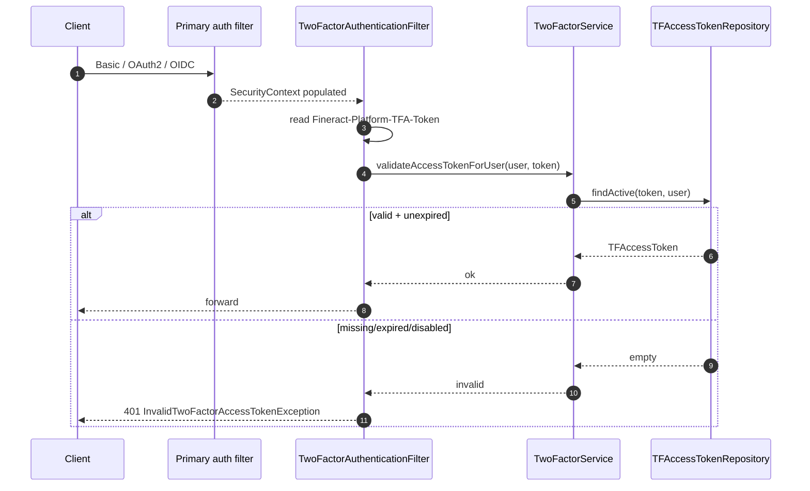
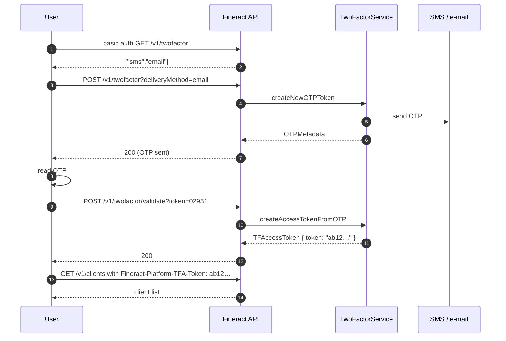

Apache Fineract's two-factor authentication adds a second challenge layer in front of any protected endpoint: after the primary authentication filter has resolved an `AppUser`, the user must request a one-time password (OTP) via SMS or e-mail, exchange that OTP for a short-lived `TFAccessToken`, and then attach the token to subsequent requests in the `Fineract-Platform-TFA-Token` header. The subsystem is split between `fineract-security/src/main/java/org/apache/fineract/infrastructure/security/domain/` (JPA entities and the in-memory OTP cache), the `service/` package (token + OTP generation), and a small JAX-RS surface under `/v1/twofactor`.

## Activating the subsystem

Two-factor is gated by the `twofactor` Spring profile. With it active, `WebSecurityConfig` inserts `TwoFactorAuthenticationFilter` immediately after the primary authentication filter (Basic, OAuth2, or OIDC — all three paths are supported). Without the profile, all 2FA beans are absent from the context and the protected endpoints are reachable with just the primary credentials.

Per-tenant fine-tuning lives in the `m_twofactor_configuration` table and is exposed through `TwoFactorConfigurationApiResource` (`/v1/twofactor/configure`). A representative row:

| Key | Default | Meaning |
| --- | --- | --- |
| `otp-delivery-sms-enable` | `false` | Allow SMS delivery channel. |
| `otp-delivery-email-enable` | `true` | Allow e-mail delivery channel. |
| `otp-delivery-sms-provider` | unset | Name of the SMS gateway bean. |
| `otp-token-length` | `5` | Number of digits in the OTP. |
| `otp-token-live-time` | `300` | OTP lifetime in seconds. |
| `access-token-live-time` | `86400` | `TFAccessToken` lifetime in seconds. |
| `access-token-live-time-extended` | `604800` | Token lifetime when extended via `/extend`. |

## Domain inventory

Inside `…/security/domain/`:

| File | Kind | Purpose |
| --- | --- | --- |
| `TFAccessToken.java` | JPA entity | The token row. Columns: `id`, `token`, `app_user_id`, `valid_from`, `valid_to`, `enabled`. |
| `TFAccessTokenRepository.java` | Spring Data JPA | Lookups by `(token, AppUser)` and `(AppUser, enabled)` plus a custom `findActive`. |
| `TwoFactorConfiguration.java` | JPA entity | A single config row — `name`, `value` — backing the per-tenant table. |
| `TwoFactorConfigurationRepository.java` | Spring Data JPA | CRUD over `TwoFactorConfiguration`. |
| `OTPRequestRepository.java` | in-memory bean | A non-persistent `ConcurrentHashMap<AppUser, OTPRequest>` — deliberately *not* JPA-backed so a rolled-back transaction does not also roll back an OTP send. |

### `TFAccessToken` lifecycle

The entity is a long-lived secret — by default 24h — that gets stamped onto every privileged request:

```text
+---------------+    POST /v1/twofactor (OTP)   +---------------+
| AUTHENTICATED | ----------------------------> | OTP_PENDING   |
+---------------+                               +---------------+
        ^                                              |
        |                                              | POST /v1/twofactor/validate
        |       /v1/twofactor/invalidate               v
        |<-------------------------------------+ ACTIVE_TFA    |
                                               +---------------+
                                                      |
                                                      | /v1/twofactor/extend
                                                      v
                                               +---------------+
                                               | EXTENDED      |
                                               +---------------+
```

`TFAccessToken.token` is a 32-character UUID-derived string produced by `UUIDAccessTokenGenerationService`; it is opaque (the server is the only authority) and is invalidated by setting `enabled=false` rather than deleted, so audit history is preserved.

### `OTPRequestRepository`

An `OTPRequest` carries the generated digits, the issued-at instant, the configured live-time, and the delivery channel. The repository is purely in-process:

| Operation | Behaviour |
| --- | --- |
| `getOTPRequestForUser(AppUser)` | Returns the current `OTPRequest` or empty. |
| `addOTPRequest(AppUser, OTPRequest)` | Replaces any previous request — only the most recent OTP is valid. |
| `deleteOTPRequestForUser(AppUser)` | Removes the entry after a successful validate. |

A `@Scheduled` reaper sweeps expired entries every minute so the map cannot grow unboundedly.

## Service layer

### `TwoFactorService`

The orchestrator bean (`…/security/service/TwoFactorService.java`). It exposes the operations the JAX-RS resource and the filter rely on:

| Method | Use |
| --- | --- |
| `getDeliveryMethodsForUser(AppUser)` | Lists enabled `OTPDeliveryMethod` beans for the user — typically SMS, e-mail. |
| `createNewOTPToken(AppUser, OTPMetadata)` | Generates an OTP via `RandomOTPGenerator`, dispatches it through the chosen delivery method, and stores it in `OTPRequestRepository`. |
| `createAccessTokenFromOTP(AppUser, String otp)` | Validates the OTP against the in-memory repository; if it matches and is unexpired, mints a `TFAccessToken` via `UUIDAccessTokenGenerationService` and persists it. |
| `validateAccessTokenForUser(AppUser, String token)` | Used by the filter — returns `true` only if the token belongs to the user, is `enabled=true`, and is within `valid_to`. |
| `extendAccessToken(AppUser, String token)` | Resets `valid_to` to `now + access-token-live-time-extended`. |
| `invalidateAccessToken(AppUser, String token)` | Flips `enabled` to `false`. |

### `RandomOTPGenerator`

A wafer-thin bean around `SecureRandom`. `generate(int length)` returns a numeric string of exactly the configured length (e.g. `01928` for a length-5 OTP). The leading-zero handling is explicit — `String.format("%0" + length + "d", random.nextInt(10**length))` — so OTPs are never silently shortened.

### `UUIDAccessTokenGenerationService`

Generates a token by stripping the dashes from `UUID.randomUUID()` and concatenating two of them to reach 32 characters. The result is high-entropy and unguessable but **not** a session cookie — it is sent in a header and must be stored client-side just like a bearer token.

## `TwoFactorAuthenticationFilter`

`fineract-security/src/main/java/org/apache/fineract/infrastructure/security/filter/TwoFactorAuthenticationFilter.java` extends `OncePerRequestFilter`. Its `doFilterInternal`:

1. Skips the check for endpoints whose path matches the protected-routes whitelist managed in `TwoFactorConstants` — the 2FA endpoints themselves, `/v1/userdetails`, health checks, and the OpenAPI surface are excluded.
2. Reads the `Fineract-Platform-TFA-Token` header.
3. Pulls the authenticated `AppUser` from the `SecurityContext`.
4. Calls `TwoFactorService.validateAccessTokenForUser(appUser, headerValue)`.
5. On success, forwards to the next filter. On failure, returns `401` with a `PlatformApiDataValidationException`.



## REST surface — `/v1/twofactor`

`TwoFactorApiResource` exposes five endpoints. All require a primary authentication and *no* `Fineract-Platform-TFA-Token` for the first two (you cannot 2FA before you have a token):

| Method & path | Body / params | Returns |
| --- | --- | --- |
| `GET /v1/twofactor` | — | The list of `OTPDeliveryMethod`s for the current user. |
| `` POST /v1/twofactor?deliveryMethod=sms\|email&extendedAccessToken=false `` | — | Sends an OTP; returns metadata (expiry, masked target). |
| `POST /v1/twofactor/validate?token={otp}` | — | Validates the OTP; returns an `AccessTokenData` containing the `TFAccessToken`. |
| `POST /v1/twofactor/invalidate` | `{ "token": "…" }` | Disables the token (logout-equivalent). |
| `GET /v1/twofactor/configure` and `PUT /v1/twofactor/configure` | configuration map | Read / update `TwoFactorConfiguration`. |

The configure endpoint is permission-gated; the rest are accessible to any authenticated user — but only for their own tokens.

## Response payloads

The successful `POST /v1/twofactor/validate` payload is an `AccessTokenData`:

```json
{
  "token": "ab12cd34ef567890abcdef1234567890",
  "validFrom": "2025-04-12T08:31:00Z",
  "validTo":   "2025-04-13T08:31:00Z"
}
```

The `token` field is the value to put in the `Fineract-Platform-TFA-Token` header. The `validTo` field lets clients schedule a pre-emptive re-issue before the token expires. Both timestamps are in UTC.

## Standard 2FA login



## Failure modes and remediation

| Failure | Likely cause | Remediation |
| --- | --- | --- |
| OTP arrives but `/validate` returns 401 | OTP expired (`otp-token-live-time` elapsed) — only the most recent OTP per user is valid | Re-request via `POST /v1/twofactor` |
| Token rejected immediately after issue | Wrong header name; must be `Fineract-Platform-TFA-Token` | Fix client header |
| SMS never arrives | `otp-delivery-sms-provider` unset or gateway down | Fall back to e-mail; check provider logs |
| All requests 401 even with valid token | `twofactor` profile not active in this deployment but client thinks it is | Check `SPRING_PROFILES_ACTIVE` |

## Auditing and rotation

Every state transition — issue, validate, extend, invalidate — is recorded as a `CommandSource` row with the standard `actionName` taxonomy (`CREATE_TWOFACTOR_ACCESSTOKEN`, `INVALIDATE_TWOFACTOR_ACCESSTOKEN`, …). The audit row carries the originating IP (sourced by `CallerIpTrackingFilter` — see [Filters](/security/filters)) so token misuse can be retrospectively investigated.

For rotation, set `access-token-live-time` to the longest tolerable session and require clients to refresh by issuing a new `POST /v1/twofactor` + `/validate` pair when `valid_to` is within a guard window.

## Delivery method extensions

`OTPDeliveryMethod` is the SPI through which an OTP gets to the user. The shipped implementations are:

| Class | Channel | Required configuration |
| --- | --- | --- |
| `SMSOTPDeliveryMethod` | SMS via the existing SMS gateway abstraction | `otp-delivery-sms-enable=true`, `otp-delivery-sms-provider=<bean name>` |
| `EmailOTPDeliveryMethod` | E-mail via Spring's `JavaMailSender` | `otp-delivery-email-enable=true`, SMTP host configured in `application.properties` |

Additional methods (push notifications, TOTP authenticator apps) can be added by implementing the SPI, marking the bean with `@Component`, and updating `TwoFactorConfigurationConstants` to expose the new toggle. The discovery is purely Spring-context-based — `TwoFactorService` injects `List<OTPDeliveryMethod>` and filters by the per-tenant toggle.

## Permissions

The 2FA endpoints are permission-gated through the standard Fineract permission table:

| Permission code | Endpoint |
| --- | --- |
| `READ_TWOFACTOR_CONFIGURATION` | `GET /v1/twofactor/configure` |
| `UPDATE_TWOFACTOR_CONFIGURATION` | `PUT /v1/twofactor/configure` |
| `BYPASS_TWOFACTOR` | Internal — when granted to a role, `TwoFactorAuthenticationFilter` lets requests through without a token. Use sparingly; intended for emergency-access roles. |

The OTP-request and validate endpoints are accessible to any authenticated user — only their own user record is touched.

## Audit columns

Every state-changing 2FA endpoint records a `m_command_source` row with:

| Column | Value |
| --- | --- |
| `action_name` | One of `CREATE_TWOFACTOR_ACCESSTOKEN`, `INVALIDATE_TWOFACTOR_ACCESSTOKEN`, `UPDATE_TWOFACTOR_CONFIGURATION`. |
| `maker_id` | The `m_appuser.id` performing the action. |
| `checker_id` | NULL (no maker-checker flow for 2FA). |
| `made_on_date` | Timestamp. |
| `command_as_json` | The body that was processed. |

Pair the audit table with the `CallerIpTrackingFilter` output to reconstruct the originating IP for any 2FA action — useful for incident response when a token is suspected of being misused.

## Bypass and emergency access

Two carefully scoped bypass mechanisms exist for legitimate use:

1. **The `BYPASS_TWOFACTOR` permission.** Roles holding this permission cause `TwoFactorAuthenticationFilter` to let requests through without a `Fineract-Platform-TFA-Token` header. Intended for service accounts and emergency-access roles — *not* for normal user accounts. Audit trails still record the user's identity because primary authentication has already happened.

2. **Configuration disable.** Setting all delivery toggles to `false` and removing the `twofactor` Spring profile takes the filter out of the chain entirely. This is appropriate for non-production environments but should never be the production state.

A *user-level* bypass — "this user is exempt from 2FA" — is not supported. The granularity is permission-based, by design: an audit reviewer can grep `m_role_permission` for `BYPASS_TWOFACTOR` and see exactly who can skip the second factor.

## Operational concerns

| Concern | Mitigation |
| --- | --- |
| OTP brute-force | The OTP is single-use *and* per-user-most-recent. After a configurable number of failures (default 3), the OTP is invalidated and the user must re-request. Configure via `otp-max-attempts`. |
| Token theft | `TFAccessToken` carries no PII and is opaque, but if leaked it is fully equivalent to the user's session. Treat it like a session cookie — TLS only, short-lived. |
| Channel availability | If SMS is down, fall back to e-mail by setting both toggles to `true`. The UI presents both options via `GET /v1/twofactor`. |
| Token explosion | A single user can hold many `TFAccessToken` rows over time (each session creates one). A periodic cleanup job deletes rows whose `valid_to` is more than 90 days in the past. |

## Related reading

- [Basic auth](/security/basic-auth) — the primary credential check that runs before this filter.
- [OAuth2 & OIDC](/security/oauth2-and-oidc) — 2FA layered on top of bearer tokens.
- [Filters](/security/filters) — where `TwoFactorAuthenticationFilter` sits in the chain.
- [Tenant resolution](/security/tenant-auth-resolution) — `m_twofactor_configuration` is per-tenant.
