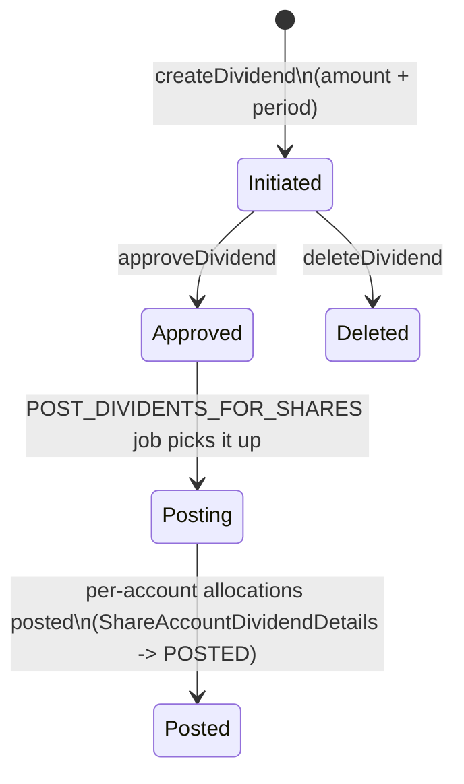
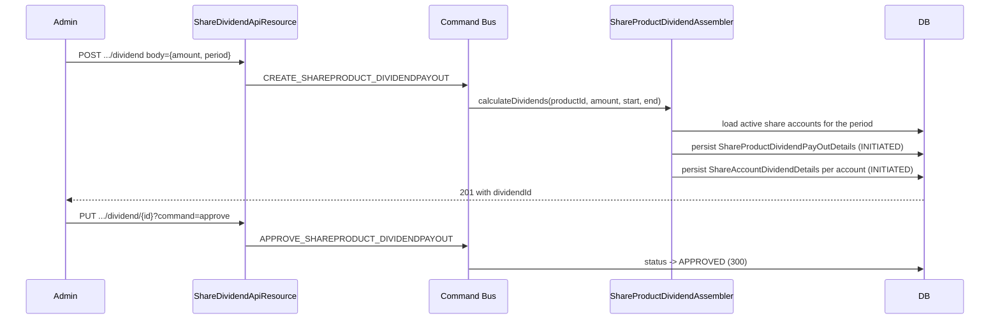
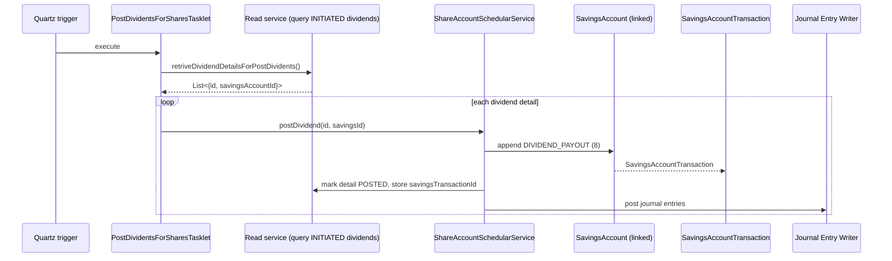

A *share dividend* is a periodic distribution of profits from a cooperative or mutual to its share-holding members, paid in proportion to the number of shares each member holds. In Apache Fineract, dividends are declared at the `ShareProduct` level, approved as a separate command, and then materialised one-by-one onto each shareholder's linked savings account via a Spring Batch tasklet.

The data lives in two entities:

* `ShareProductDividendPayOutDetails` — the *declaration*: the gross amount, the period it covers, and a status.
* `ShareAccountDividendDetails` — one row per shareholder per declaration: the share of the dividend allocated to that account and whether it has been posted yet.

## Entities

### ShareProductDividendPayOutDetails

File: `fineract-provider/.../portfolio/shareproducts/domain/ShareProductDividendPayOutDetails.java`. Table: `m_share_product_dividend_pay_out`.

```java
@Entity
@Table(name = "m_share_product_dividend_pay_out")
public class ShareProductDividendPayOutDetails extends AbstractPersistableCustom<Long> {

    @Column(name = "product_id", nullable = true)
    private Long shareProductId;

    @Column(name = "amount", scale = 6, precision = 19)
    private BigDecimal amount;

    @Column(name = "dividend_period_start_date")
    private LocalDate dividendPeriodStartDate;

    @Column(name = "dividend_period_end_date")
    private LocalDate dividendPeriodEndDate;

    @Column(name = "status", nullable = false)
    private Integer status;

    @OneToMany(cascade = CascadeType.ALL, orphanRemoval = true, fetch = FetchType.EAGER,
               mappedBy = "productDividentPayOutDetails")
    private List<ShareAccountDividendDetails> accountDividendDetails = new ArrayList<>();
}
```

| Column | Meaning |
|--------|---------|
| `product_id` | Owning `ShareProduct` |
| `amount` | Total gross dividend to distribute |
| `dividend_period_start_date` | Beginning of the period the dividend rewards |
| `dividend_period_end_date` | End of that period |
| `status` | `ShareProductDividendStatusType` — INVALID (0), INITIATED (100), APPROVED (300) |

### ShareAccountDividendDetails

File: `fineract-provider/.../portfolio/shareaccounts/domain/ShareAccountDividendDetails.java`. Table: `m_share_account_dividend_details`.

| Column | Meaning |
|--------|---------|
| `account_id` | The `ShareAccount` receiving the allocation |
| `amount` | This account's share of the dividend |
| `status` | `ShareAccountDividendStatusType` — INVALID (0), INITIATED (100), POSTED (300) |
| `savings_transaction_id` | After posting, the `SavingsAccountTransaction` id of the `DIVIDEND_PAYOUT (8)` credit |
| `dividend_pay_out_id` | FK back to `ShareProductDividendPayOutDetails` |

The presence of `savings_transaction_id` makes the operational claim "this dividend, on this date, was posted as that savings transaction" auditable end-to-end.

## Lifecycle in one screen



Status codes:

| Entity | INVALID | INITIATED | APPROVED / POSTED |
|--------|---------|-----------|-------------------|
| `ShareProductDividendPayOutDetails` (`ShareProductDividendStatusType`) | 0 | 100 | 300 (APPROVED) |
| `ShareAccountDividendDetails` (`ShareAccountDividendStatusType`) | 0 | 100 | 300 (POSTED) |

## Declaration via the API

The REST surface lives at `/v1/shareproduct/{productId}/dividend`, defined in `ShareDividendApiResource`.

| Method | Path | Operation |
|--------|------|-----------|
| GET | `/v1/shareproduct/{productId}/dividend` | List all dividends for the product |
| GET | `/v1/shareproduct/{productId}/dividend/{dividendId}` | Retrieve per-account allocations for one dividend |
| POST | `/v1/shareproduct/{productId}/dividend` | Create dividend declaration |
| PUT | `/v1/shareproduct/{productId}/dividend/{dividendId}?command=approve` | Approve a dividend (INITIATED → APPROVED) |
| DELETE | `/v1/shareproduct/{productId}/dividend/{dividendId}` | Delete an unapproved declaration |

The `POST` create body carries `amount`, `dividendPeriodStartDate`, and `dividendPeriodEndDate`. The handler enqueues `CREATE_SHAREPRODUCT_DIVIDENDPAYOUT`; the approve enqueues `APPROVE_SHAREPRODUCT_DIVIDENDPAYOUT`; the delete enqueues `DELETE_SHAREPRODUCT_DIVIDENDPAYOUT`. All three are routed through the standard command bus.



## Per-account allocation

`ShareProductDividendAssembler.calculateDividends(...)` reads every share account eligible for the dividend (filtered through `retrieveAllShareAccountDataForDividends(productId, allowInactive, periodStart)`), applies the product's `minimumActivePeriod` gate, and allocates each account's share proportionally to its average number of held shares during the dividend period.

Conceptually:

```
account_share = (account_shares_during_period * days_held_in_period)
              / sum over all accounts
              * total_dividend_amount
```

The result is one `ShareAccountDividendDetails` row per eligible account, each in INITIATED status, all linked back to the parent `ShareProductDividendPayOutDetails`.

Validation:

* If no eligible accounts exist, `ShareAccountsNotFoundException` is thrown.
* If `allow_dividends_inactive_clients` is false on the product, inactive clients are excluded.
* If the account's age (since activation) is less than the product's `minimumActivePeriod`, it is excluded.

## Approval

The `APPROVE_SHAREPRODUCT_DIVIDENDPAYOUT` handler flips the parent's status to `APPROVED (300)` and *only* the parent. Per-account `ShareAccountDividendDetails` rows remain `INITIATED (100)` until the job posts them.

## Posting: POST_DIVIDENTS_FOR_SHARES

The actual cash movement happens through the `POST_DIVIDENTS_FOR_SHARES` job. The tasklet lives at `fineract-provider/.../portfolio/shareaccounts/jobs/postdividentsforshares/PostDividentsForSharesTasklet.java`:

```java
public class PostDividentsForSharesTasklet implements Tasklet {
    private final ShareAccountDividendReadPlatformService shareAccountDividendReadPlatformService;
    private final ShareAccountSchedularService shareAccountSchedularService;

    public RepeatStatus execute(StepContribution contribution, ChunkContext chunkContext) {
        List<Map<String, Object>> dividendDetails =
            shareAccountDividendReadPlatformService.retriveDividendDetailsForPostDividents();
        for (Map<String, Object> dividendMap : dividendDetails) {
            Long id          = ...;
            Long savingsId   = (Long) dividendMap.get("savingsAccountId");
            shareAccountSchedularService.postDividend(id, savingsId);
        }
        return RepeatStatus.FINISHED;
    }
}
```

`retriveDividendDetailsForPostDividents()` selects every `ShareAccountDividendDetails` row in INITIATED whose parent declaration is APPROVED, joined to the share account's linked savings account.

`shareAccountSchedularService.postDividend(dividendDetailId, savingsAccountId)` then:

1. Loads the dividend detail and the linked `SavingsAccount`.
2. Appends a `SavingsAccountTransaction` of type `DIVIDEND_PAYOUT (8)`.
3. Updates `ShareAccountDividendDetails.savingsTransactionId` with the new transaction id and flips status to `POSTED (300)`.
4. Lets the journal-entry writer post the GL pair.



Per-account failures are caught and logged but do not abort the rest of the batch — the tasklet collects exceptions and rethrows them as a `JobExecutionException` after the loop, so an operator can see exactly which accounts failed without losing the successful ones.

## GL impact

When the product's `accounting_type` is `CASH_BASED`:

| Step | Dr | Cr |
|------|----|----|
| Dividend posted to savings | Equity / Retained Earnings | Savings Reference (Liability) |

The Equity-side GL account comes from the product's GL mapping. The savings side comes from the product mapping on the linked `SavingsProduct` — this is why the `DIVIDEND_PAYOUT` transaction type carries `TransactionEntryType.CREDIT` (it credits the savings liability).

## What an admin sees

After posting, calling `GET /v1/shareproduct/{productId}/dividend/{dividendId}` returns per-account allocations with status and the savings transaction id, so the dividend run can be reconciled.

The corresponding read on the savings side — `GET /v1/savingsaccounts/{id}/transactions` — shows the same money entering as a `DIVIDEND_PAYOUT (8)` row.

## Where to go next

* [ShareProduct](/shares/share-product) — the product whose accounts receive the dividend.
* [ShareAccount](/shares/share-account) — the per-member holding whose share-of-the-pie is calculated by the assembler.
* [Savings transactions](/savings/savings-transactions) — the `DIVIDEND_PAYOUT (8)` row landing on the linked savings account.
* [Savings jobs](/savings/savings-jobs) — for the cross-cutting job runner that drives `POST_DIVIDENTS_FOR_SHARES`.

## Worked example: declaring a quarterly dividend

A cooperative declares a ₹100,000 dividend for the period 01 January 2024 – 31 March 2024 on share product 17:

```http
POST /v1/shareproduct/17/dividend
Content-Type: application/json

{
  "amount": 100000,
  "dividendPeriodStartDate": "01 January 2024",
  "dividendPeriodEndDate": "31 March 2024",
  "locale": "en",
  "dateFormat": "dd MMMM yyyy"
}
```

The assembler:

1. Loads the share product (10,000 total shares, 8,500 issued across N member accounts).
2. Queries active share accounts whose `activated_date + minimumActivePeriod <= 2024-01-01`.
3. For each, computes share-days during the period: `holding_during_period × days_held`.
4. Allocates the dividend: `account_share = (share_days_for_account / sum_share_days) × 100000`.
5. Persists one `ShareProductDividendPayOutDetails` row in `INITIATED (100)` and one `ShareAccountDividendDetails` row per account, each in `INITIATED (100)`.

The response is the new `dividendId`, ready for approval.

## Worked example: approval and posting

A board member approves the dividend:

```http
PUT /v1/shareproduct/17/dividend/901?command=approve
```

The parent row's `status` flips from `INITIATED (100)` to `APPROVED (300)`. Per-account rows remain `INITIATED (100)`.

That night, the `POST_DIVIDENTS_FOR_SHARES` job runs:

* It reads every `ShareAccountDividendDetails` in INITIATED whose parent is APPROVED.
* For each, it calls `shareAccountSchedularService.postDividend(dividendDetailId, savingsAccountId)`.
* The linked savings receives a `DIVIDEND_PAYOUT (8)` transaction crediting the allocated amount.
* The detail row's `savings_transaction_id` is set; its `status` flips to `POSTED (300)`.

At end-of-job, all per-account rows are `POSTED`. Reconciliation shows the total of credited savings transactions equals the parent declaration's `amount`.

## Reconciliation queries

```sql
-- Total declared vs total posted for one dividend
SELECT  dp.id,
        dp.amount AS declared,
        SUM(dd.amount) AS allocated,
        SUM(CASE WHEN dd.status = 300 THEN dd.amount ELSE 0 END) AS posted
FROM    m_share_product_dividend_pay_out dp
JOIN    m_share_account_dividend_details dd
        ON dd.dividend_pay_out_id = dp.id
WHERE   dp.id = :dividendId
GROUP BY dp.id, dp.amount;
```

The `declared = allocated` invariant should always hold post-approval. The `posted ≤ allocated` invariant should always hold; equal once the job has finished a complete run.

## Per-account share allocation algorithm

The allocation is *proportional to share-days held* during the dividend period, not simply to current shares. This rewards members who held shares throughout the period and shorter-tenure members proportionally less.

For each eligible share account `A`:

```
total_share_days[A] = Σ over all transactions T affecting A's holdings:
                       (shares_after_T) × (days from T.date to next change or period_end,
                                          clamped to period)
```

Then:

```
allocation[A] = (total_share_days[A] / Σ total_share_days[*]) × declaration.amount
```

Member-friendly behaviour: a member who joined two months into a three-month dividend period receives 1/3 of what a member holding from day 1 would receive (for the same shares).

## Currency and rounding

Allocations are rounded to the product's currency precision. The platform applies a deterministic rounding rule so that the sum of allocations equals the declared amount within a one-unit-of-precision tolerance; any rounding residue is added to or subtracted from the largest allocation.

This avoids the "we declared ₹100,000.00 but only ₹99,999.85 actually paid out" footnote on the audit report.

## Edge cases

* **Account closed mid-period**: still eligible if it was active *and* past the minimum-active gate for any portion of the period. The allocation is proportional to the days it was active.
* **Account opened mid-period**: same — eligible from the day it cleared the minimum-active gate.
* **Account inactive but product allows it**: included with full eligibility (subject to share-days held).
* **No eligible accounts**: `ShareAccountsNotFoundException`. The declaration cannot be persisted.
* **Linked savings is closed**: dividend posting fails for that account; the tasklet logs the failure but continues with the rest.
* **Two consecutive dividends declared for overlapping periods**: not blocked by the platform; operators are expected to enforce non-overlap policy administratively.

## Status transition diagram

```mermaid
stateDiagram-v2
    direction LR
    state Declaration {
        [*] --> Initiated_D: createDividend
        Initiated_D --> Approved_D: approve
        Initiated_D --> [*]: delete
    }
    state PerAccount {
        [*] --> Initiated_A: assembler creates per-account row
        Initiated_A --> Posted_A: POST_DIVIDENTS_FOR_SHARES posts and links savings tx
    }
    Approved_D -.gates.-> Initiated_A
    Approved_D -.allows.-> Posted_A
```

## Where to look in the source

* Declaration entity: `ShareProductDividendPayOutDetails.java`
* Per-account allocation: `ShareAccountDividendDetails.java`
* Assembler: `ShareProductDividendAssembler.java`
* Read services: `ShareProductDividendReadPlatformServiceImpl`, `ShareAccountDividendReadPlatformServiceImpl`
* Scheduler service: `ShareAccountSchedularService`
* Job tasklet: `PostDividentsForSharesTasklet`
* Job config: `PostDividentsForSharesConfig`
* API resource: `ShareDividendApiResource`
* Command handlers: `CreateShareProductDividendCommandHandler`, `ApproveShareProductDividendCommandHandler`, `DeleteShareProductDividendCommandHandler`

