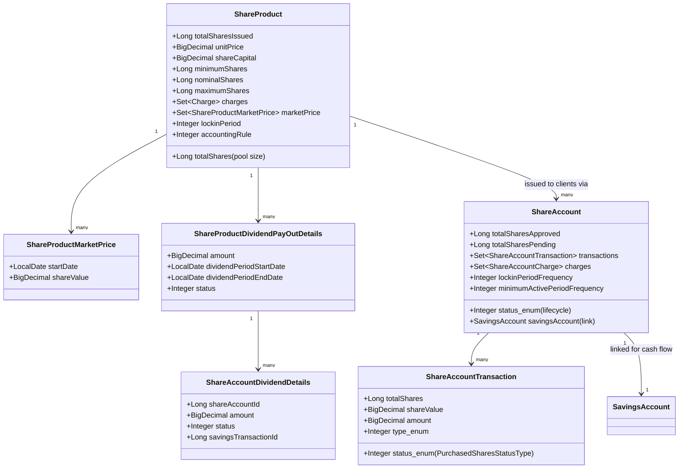
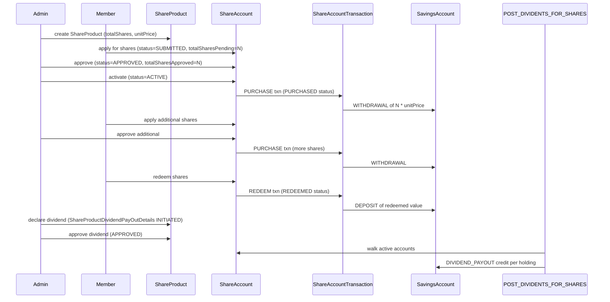

The share-account subsystem models *cooperative shares* — equity instruments that a financial cooperative or mutual issues to its member-owners. A member purchases shares (subject to approval), holds them for a lock-in period, may purchase additional shares, may redeem shares back, and receives periodic dividends declared at the product level. Unlike savings, share accounts are not interest-bearing; they are equity. Unlike loans, they do not create a debt — the member pays in advance for a stake.

In Apache Fineract, the implementation lives in two Java packages under the `fineract-provider` module:

```
fineract-provider/.../portfolio/
├── shareaccounts/   # ShareAccount (per-member holding), purchases, charges, transactions, dividend details
└── shareproducts/   # ShareProduct (the issue), market prices, dividend declarations
```

The `fineract-core` module owns the constants (`ShareProductApiConstants`).

## Why a separate subsystem?

A share is fundamentally different from a savings deposit:

| Aspect | Savings | Shares |
|--------|---------|--------|
| Liability vs equity | Customer's liability to the institution (institution owes them money) | Customer's equity stake (institution does not owe; the customer is part-owner) |
| Rate | Interest accrues continuously | Dividends declared periodically by board action |
| Liquidity | On-demand withdrawal (modulo locks) | Redemption usually subject to product rules and approval |
| Pricing | One nominal rate or a chart of rates | A unit price and a finite pool of shares |
| Settlement | Debit/credit cash directly | A purchase moves cash from the linked savings account; a dividend moves cash to it |

That is why share accounts have their own `ShareAccount` entity, their own transaction model (`ShareAccountTransaction` for share-quantity movements), and their own product type (`ShareProduct`). The *cash* side of every share purchase, redeem, or dividend lands on a linked `SavingsAccount` — share accounts piggyback on savings for the money flow.

## Entity map



## Where each piece lives

The non-test files in the `shareaccounts` package include:

```
shareaccounts/
├── data/         # DTOs: ShareAccountData, ShareAccountChargeData, ShareAccountDividendData, ShareAccountTransactionData
├── domain/       # JPA: ShareAccount, ShareAccountTransaction, ShareAccountCharge, ShareAccountDividendDetails, ShareAccountStatusType, PurchasedSharesStatusType
├── handler/      # Command handlers (ApplyAdditionalShares, ApproveShareAccount, RedeemShares, Activate, Close, Reject, ...)
├── jobs/         # Spring Batch tasklets (POST_DIVIDENTS_FOR_SHARES)
├── serialization/# ShareAccountDataSerializer
└── service/      # Read/write platform services
```

And the `shareproducts` package:

```
shareproducts/
├── api/          # ShareDividendApiResource at /v1/shareproduct/{productId}/dividend
├── constants/    # (in core)
├── data/         # ShareProductData, ShareProductDividendPayOutData, ShareProductMarketPriceData
├── domain/       # ShareProduct, ShareProductMarketPrice, ShareProductDividendPayOutDetails, status enums
├── exception/    # DividendNotFoundException, DividentProcessingException
├── handler/      # CreateShareProduct, UpdateShareProduct, CreateShareProductDividend, ApproveShareProductDividend, DeleteShareProductDividend
└── service/      # ShareProductWritePlatformService(JpaRepositoryImpl), ShareProductDividendReadPlatformService, ShareProductDividendAssembler
```

## What each page covers

<CardGroup cols={2}>
  <Card title="ShareAccount" icon="user" href="/shares/share-account">
    The per-member holding: status states, pending/approved share counts, purchase requests, redemption flow, lock-in and minimum-active periods, dividend eligibility.
  </Card>
  <Card title="ShareProduct" icon="building-columns" href="/shares/share-product">
    Total issued pool, unit price, market price history, minimum/nominal/maximum client shares, lock periods, accounting rule, and the product-level charges.
  </Card>
  <Card title="Dividends" icon="hand-holding-dollar" href="/shares/dividends">
    ShareProductDividendPayOutDetails, the declare / approve / post lifecycle, per-share allocation to active accounts, the POST_DIVIDENTS_FOR_SHARES job, and how cash lands on linked savings.
  </Card>
</CardGroup>

## The lifecycle in one screen



## Status machine summary

`ShareAccountStatusType` codes:

| Code | Enum |
|------|------|
| 0 | `INVALID` |
| 100 | `SUBMITTED_AND_PENDING_APPROVAL` |
| 200 | `APPROVED` |
| 300 | `ACTIVE` |
| 500 | `REJECTED` |
| 600 | `CLOSED` |

`PurchasedSharesStatusType` codes (applied per-transaction):

| Code | Enum |
|------|------|
| 0 | `INVALID` |
| 100 | `APPLIED` |
| 300 | `APPROVED` |
| 400 | `REJECTED` |
| 500 | `PURCHASED` |
| 600 | `REDEEMED` |
| 700 | `CHARGE_PAYMENT` |

`ShareProductDividendStatusType` (on declarations): INVALID (0), INITIATED (100), APPROVED (300).
`ShareAccountDividendStatusType` (on per-account allocations): INVALID (0), INITIATED (100), POSTED (300).

## Where to read on

Continue with [ShareAccount](/shares/share-account) for the per-member entity, [ShareProduct](/shares/share-product) for the product configuration, or [Dividends](/shares/dividends) for the declaration and posting workflow.

For the linked savings-side transaction that receives a `DIVIDEND_PAYOUT (8)`, see [Savings transactions](/savings/savings-transactions).

## Cash flow always passes through savings

The cash side of every share operation lands on the linked savings account. This is enforced architecturally — `ShareAccount.savingsAccount` is a non-null `@ManyToOne`. The matrix:

| Share event | Linked savings side |
|-------------|---------------------|
| Purchase (initial) | `WITHDRAWAL (2)` of `N * unitPrice` |
| Additional purchase | `WITHDRAWAL (2)` of `M * currentUnitPrice` |
| Redemption | `DEPOSIT (1)` of `R * currentUnitPrice` |
| Dividend posted | `DIVIDEND_PAYOUT (8)` of allocated amount |
| Charge paid | `WITHDRAWAL (2)` referenced via `ShareAccountChargePaidBy` |

This means a cooperative cannot accept share purchases in cash directly — the customer must first deposit cash on their savings account, then purchase shares from that savings balance. From an accounting and compliance perspective this is a feature, not a bug: every cash event has a savings transaction id for the audit trail.

## Database tables at a glance

| Table | Purpose |
|-------|---------|
| `m_share_product` | The issuance definition (totalShares, unitPrice, lock periods, accounting) |
| `m_share_product_market_price` | Historic / future market price changes |
| `m_share_product_charge` | Product ↔ Charge join |
| `m_share_product_dividend_pay_out` | Dividend declarations |
| `m_share_account` | Per-member holding |
| `m_share_account_charge` | Per-account fees |
| `m_share_account_charge_paid_by` | Tx ↔ charge link |
| `m_share_account_transactions` | Per-account share transaction stream |
| `m_share_account_dividend_details` | Per-account dividend allocations |

The transaction stream on `m_share_account_transactions` is separate from the savings transaction stream because it tracks share *counts* (with `total_shares` and `unit_price` columns), not just monetary amounts.

## Read side

The share-account read services are JdbcTemplate-based, like the savings read side:

* `ShareProductReadPlatformServiceImpl` — products and market prices.
* `ShareAccountReadPlatformService` — accounts, transactions, charges, dividend allocations.
* `ShareProductDividendReadPlatformServiceImpl` — dividend declarations.
* `ShareAccountDividendReadPlatformServiceImpl` — per-account allocations.

The dividend-eligibility query (`retrieveAllShareAccountDataForDividends`) is non-trivial: it joins share accounts to clients, filters by `status = ACTIVE`, evaluates `minimumActivePeriod`, and respects the `allow_dividends_inactive_clients` toggle.

## Common questions

**Why is the linked savings account mandatory?**
Because the platform refuses to net-settle cash on the share account directly. Every cash event must land on a savings row both for accounting traceability and for unified treasury management.

**Can one share product issue different share classes?**
Not in the current model — one product is one class. Different classes (preference vs ordinary, voting vs non-voting) require separate `ShareProduct` rows.

**Where do dividends come *from* on the books?**
The product GL mapping nominates an Equity / Retained Earnings account. Dividends transfer from that account to the savings reference (liability) account on the linked savings.

**Are share account charges levied in shares or in cash?**
Always in cash — paid out of the linked savings account. There is no concept of paying a fee in shares.

**Can a member hold accounts on multiple share products?**
Yes — one `ShareAccount` row per `(client, product)` combination. The member ends up with N share accounts, each potentially linked to the same savings account.

