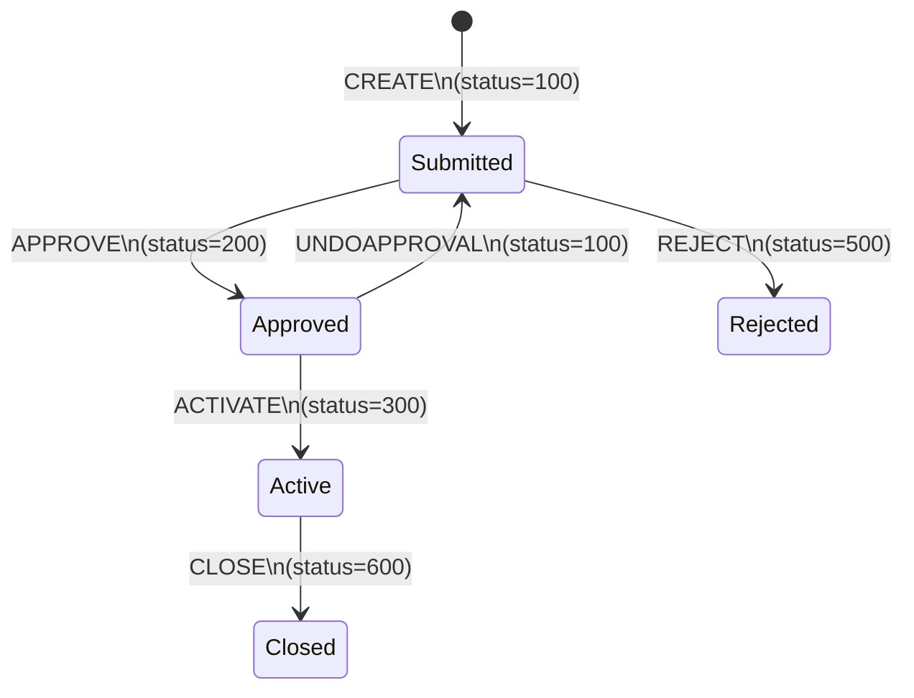
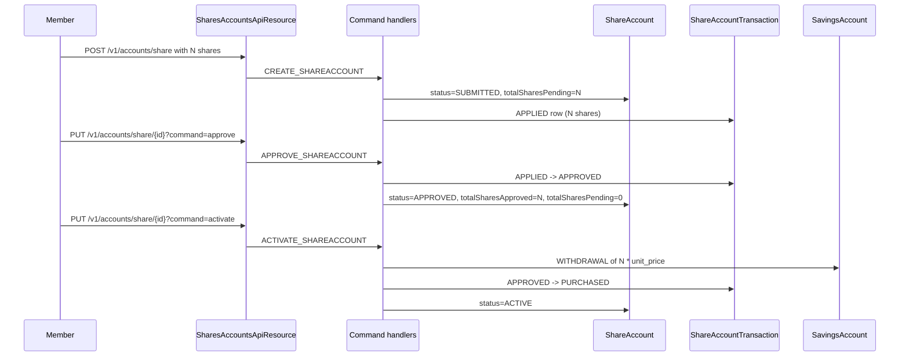
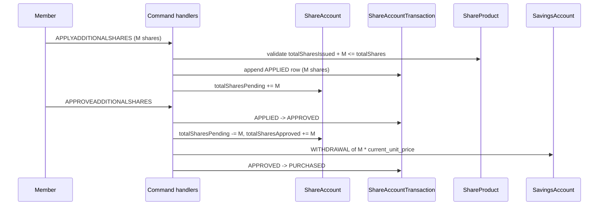

`ShareAccount` is the per-member equity holding in a `ShareProduct`. It tracks how many shares the member has *approved* (and therefore owns), how many are *pending* approval, the audit timeline of who applied/approved/activated/closed it, the linked savings account that funds purchases and receives dividends, and the lock-in and minimum-active periods that gate redemption and dividend eligibility.

File: `fineract-provider/src/main/java/org/apache/fineract/portfolio/shareaccounts/domain/ShareAccount.java`. Table: `m_share_account`.

## JPA shape

```java
@Entity
@Table(name = "m_share_account",
       uniqueConstraints = { @UniqueConstraint(columnNames = { "account_no" }, name = "sa_account_no_UNIQUE"),
                             @UniqueConstraint(columnNames = { "external_id" }, name = "sa_external_id_UNIQUE") })
public class ShareAccount extends AbstractPersistableCustom<Long> { ... }
```

### Headline columns

| Column | Java field | Notes |
|--------|------------|-------|
| `client_id` | `client` | Owner — shares are held by clients, not groups |
| `product_id` | `shareProduct` | The `ShareProduct` issued from |
| `status_enum` | `status` | `ShareAccountStatusType` integer code |
| `account_no` | `accountNumber` | 20-char unique account number |
| `external_id` | `externalId` | Optional secondary id |
| `total_approved_shares` | `totalSharesApproved` | Currently owned share count |
| `total_pending_shares` | `totalSharesPending` | Applied but not yet approved |
| `savings_account_id` | `savingsAccount` | Linked savings — funds purchases and receives dividends |
| `submitted_date` / `submitted_userid` | | Application audit |
| `approved_date` / `approved_userid` | | Approval audit |
| `rejected_date` / `rejected_userid` | | Rejection audit |
| `activated_date` / `activated_userid` | | Activation audit |
| `closed_date` / `closed_userid` | | Closure audit |
| `lastmodified_date` / `lastmodifiedby_id` | | Last modification audit |
| `allow_dividends_inactive_clients` | `allowDividendCalculationForInactiveClients` | Inherited from product |
| `lockin_period_frequency` / `lockin_period_frequency_enum` | | Period during which no redemption is allowed |
| `minimum_active_period_frequency` / `minimum_active_period_frequency_enum` | | Minimum holding time before earning dividends |

### Child collections

```java
@OneToMany(cascade = CascadeType.ALL, mappedBy = "shareAccount", orphanRemoval = true, fetch = FetchType.EAGER)
private Set<ShareAccountTransaction> shareAccountTransactions;

@OneToMany(cascade = CascadeType.ALL, mappedBy = "shareAccount", orphanRemoval = true, fetch = FetchType.EAGER)
private Set<ShareAccountCharge> charges;
```

Both collections are `EAGER` because share accounts have low fan-out (a typical member has tens of transactions, not thousands).

## Account status

`ShareAccountStatusType` has six states (see [overview](/shares/overview) for the table):



The same `ShareAccount` row stays around through the whole life; `status_enum` and the audit-date columns evolve.

## Purchase workflow

A *purchase* is the act of acquiring shares — initial purchase at application or subsequent additional purchase. Each request goes through APPLIED → APPROVED → PURCHASED, recorded on a `ShareAccountTransaction` row whose `status_enum` tracks the state from `PurchasedSharesStatusType` and whose `type_enum` distinguishes purchase from redemption.

| Stage | tx status | Account effect |
|-------|-----------|----------------|
| APPLIED (100) | row inserted | `totalSharesPending += N` |
| APPROVED (300) | row updated | `totalSharesPending -= N`, `totalSharesApproved += N` |
| REJECTED (400) | row updated | `totalSharesPending -= N` |
| PURCHASED (500) | row finalised on activation | (no change; shares already in `totalSharesApproved`) |
| REDEEMED (600) | new redemption row | `totalSharesApproved -= N` |
| CHARGE_PAYMENT (700) | row records a charge | no share-count change |

The full sequence for a brand-new account:



## Apply additional shares

Once the account is ACTIVE, a member can request more shares without creating a new account.



Note that the *current* unit price is taken from the product or, when present, from the latest applicable `ShareProductMarketPrice`. This is documented in [ShareProduct](/shares/share-product).

## Redemption

Redeeming shares is the reverse — the member gives back N shares and receives cash on the linked savings account.

| Step | Effect |
|------|--------|
| Validate lock-in elapsed | Use `lockinPeriodFrequency` + `activated_date` |
| Validate available shares | `totalSharesApproved >= N` |
| Compute payout | `N * unit_price` (less any charge) |
| Append `ShareAccountTransaction` | `type_enum = redeem`, `status_enum = REDEEMED (600)` |
| Credit linked savings | `DEPOSIT (1)` on linked `SavingsAccount` |
| Decrement | `totalSharesApproved -= N` |

If the redemption brings the account to zero shares, the `CloseShareAccountCommandHandler` is normally invoked to finalise the closure.

## Lock-in and minimum-active periods

Two distinct time windows constrain the account:

| Period | Purpose | Frequency type |
|--------|---------|---------------|
| `lockinPeriodFrequency` | Time after activation during which *redemption* is blocked | `PeriodFrequencyType` (days/weeks/months/years) |
| `minimumActivePeriodFrequency` | Minimum holding time before the account is eligible for *dividends* | `PeriodFrequencyType` |

The `allow_dividends_inactive_clients` flag overrides the minimum-active gate for products where the cooperative chooses to pay dividends regardless of client active/inactive status.

## Charges

`ShareAccountCharge` mirrors `SavingsAccountCharge` but applies to share-life events: an activation fee, a purchase fee (e.g. 1% of the purchase amount), a redemption fee. Each charge can be flat or percentage-based, can be a penalty or a normal fee, and is paid via the linked savings account.

A `ShareAccountChargePaidBy` linker joins each `ShareAccountTransaction` to the `ShareAccountCharge` rows it settled.

## Lifecycle commands

The handlers in `shareaccounts/handler/`:

| Handler | Command | Effect |
|---------|---------|--------|
| `CreateShareAccountCommandHandler` | `CREATE_SHAREACCOUNT` | Submit application |
| `UpdateShareAccountCommandHandler` | `UPDATE_SHAREACCOUNT` | Modify pending application |
| `ApproveShareAccountCommandHandler` | `APPROVE_SHAREACCOUNT` | Approve initial purchase |
| `UndoApproveShareAccountCommandHandler` | `UNDOAPPROVAL_SHAREACCOUNT` | Revert approval |
| `RejectShareAccountCommandHandler` | `REJECT_SHAREACCOUNT` | Reject application |
| `ActivateShareAccountCommandHandler` | `ACTIVATE_SHAREACCOUNT` | Activate and settle cash |
| `ApplyAddtionalSharesCommandHandler` | `APPLYADDITIONALSHARES_SHAREACCOUNT` | Request more shares |
| `ApproveAddtionalSharesCommandHandler` | `APPROVEADDITIONALSHARES_SHAREACCOUNT` | Approve the request |
| `RejectAddtionalSharesCommandHandler` | `REJECTADDITIONALSHARES_SHAREACCOUNT` | Reject the request |
| `RedeemSharesCommandHandler` | `REDEEMSHARES_SHAREACCOUNT` | Redeem N shares |
| `CloseShareAccountCommandHandler` | `CLOSE_SHAREACCOUNT` | Close the account |

(The handler class names preserve the historical `Addtional` typo.)

## Read next

* [ShareProduct](/shares/share-product) — the issuance the account draws from.
* [Dividends](/shares/dividends) — how a declared dividend lands on this account's linked savings.
* [Savings transactions](/savings/savings-transactions) — the linked savings receives `WITHDRAWAL (2)` on purchase and `DEPOSIT (1)` / `DIVIDEND_PAYOUT (8)` on redemption / dividend.

## REST API surface

The share-account endpoints sit under `/v1/accounts/share`:

| Method | Path | Operation |
|--------|------|-----------|
| GET | `/v1/accounts/share/template` | Defaults for new applications |
| GET | `/v1/accounts/share/{accountId}` | Retrieve account |
| POST | `/v1/accounts/share` | Submit application |
| PUT | `/v1/accounts/share/{accountId}` | Update pending application |
| POST | `/v1/accounts/share/{accountId}?command=approve` | Approve initial purchase |
| POST | `/v1/accounts/share/{accountId}?command=undoapproval` | Reverse approval |
| POST | `/v1/accounts/share/{accountId}?command=reject` | Reject application |
| POST | `/v1/accounts/share/{accountId}?command=activate` | Activate (settle cash) |
| POST | `/v1/accounts/share/{accountId}?command=applyadditionalshares` | Request more shares |
| POST | `/v1/accounts/share/{accountId}?command=approveadditionalshares` | Approve additional |
| POST | `/v1/accounts/share/{accountId}?command=rejectadditionalshares` | Reject additional |
| POST | `/v1/accounts/share/{accountId}?command=redeemshares` | Redeem N shares |
| POST | `/v1/accounts/share/{accountId}?command=close` | Close the account |
| GET | `/v1/accounts/share/{accountId}/charges` | List charges |
| POST | `/v1/accounts/share/{accountId}/charges` | Attach a charge |

The query string `?associations=transactions,charges` controls eager loading.

## Worked example: opening a member account

A new cooperative member applies for 50 shares at the current unit price of ₹100:

```json
{
  "clientId": 4321,
  "productId": 17,
  "submittedDate": "01 March 2024",
  "savingsAccountId": 8765,
  "requestedShares": 50,
  "applicationDate": "01 March 2024",
  "lockinPeriodFrequency": 6,
  "lockinPeriodFrequencyType": 2,
  "minimumActivePeriodFrequency": 3,
  "minimumActivePeriodFrequencyType": 2,
  "allowDividendCalculationForInactiveClients": false,
  "locale": "en",
  "dateFormat": "dd MMMM yyyy"
}
```

Lifecycle:

1. `POST /v1/accounts/share` — account created in `SUBMITTED (100)`; transaction in `APPLIED (100)` with `total_shares=50, unit_price=100, amount=5000`. `m_share_product.totalsubscribed_shares += 50`.
2. `POST /v1/accounts/share/{id}?command=approve` — account → `APPROVED (200)`; transaction → `APPROVED (300)`. `totalsubscribed_shares -= 50, issued_shares += 50`.
3. `POST /v1/accounts/share/{id}?command=activate` — account → `ACTIVE (300)`; transaction → `PURCHASED (500)`. `WITHDRAWAL (2)` of 5000 on savings 8765.

If the member later wants 25 more shares at the new market price of ₹120:

4. `POST .../share/{id}?command=applyadditionalshares` with `requestedShares=25, requestedDate=2024-09-01`. New transaction in `APPLIED (100)`.
5. `POST .../share/{id}?command=approveadditionalshares`. Transaction → `APPROVED → PURCHASED`. `WITHDRAWAL` of 3000 on the linked savings.

Account now holds 75 shares; `total_approved_shares = 75`.

## Redemption mechanics

Redemption requires:

* Account is `ACTIVE`.
* Lock-in elapsed: `today >= activated_date + lockinPeriod`.
* `total_approved_shares >= numberOfSharesToRedeem`.
* The current unit price (looked up via the market-price history) is used to compute the payout.
* Any redemption charge is computed and the cash payout is reduced accordingly.

The redemption transaction is appended with `status = REDEEMED (600)`. `total_approved_shares` decreases. The linked savings receives a `DEPOSIT (1)` for the net redemption amount.

## Closure

Closing a share account requires `total_approved_shares = 0`. The handler ensures all approved shares have been redeemed first; the redemption proceeds land on the linked savings as usual; then the account transitions to `CLOSED (600)`.

## Dividend eligibility check

A separate gate from lock-in. Dividend posting (via the `POST_DIVIDENTS_FOR_SHARES` job) considers an account eligible when:

* `status = ACTIVE`.
* `today >= activated_date + minimumActivePeriod`.
* OR the *product*'s `allowDividendCalculationForInactiveClients` is true and the client is inactive.

The per-account `allowDividendCalculationForInactiveClients` column is the override, populated at account creation from the product default.

## Validation hot spots

* **Requested shares must be within `[minimumShares, maximumShares]`** of the product.
* **The linked savings account must belong to the same client and use the same currency** as the share product.
* **Lock-in period frequency types must use `PeriodFrequencyType`** — DAYS, WEEKS, MONTHS, YEARS.
* **Approving more shares than the product has issuance capacity for** raises `IssueableSharesExceededException`.

## Edge cases

* **Reducing requested shares before approval**: allowed via `UPDATE_SHAREACCOUNT`; the `APPLIED` transaction is updated in place and `totalsubscribed_shares` on the product is recomputed.
* **Redeem more shares than held**: rejected.
* **Redeem during lock-in**: rejected.
* **Receive a dividend while inactive**: only if the product's `allowDividendCalculationForInactiveClients` is true.
* **Close with a non-zero balance**: rejected — the `CloseShareAccount` validator requires every share to be redeemed first.

