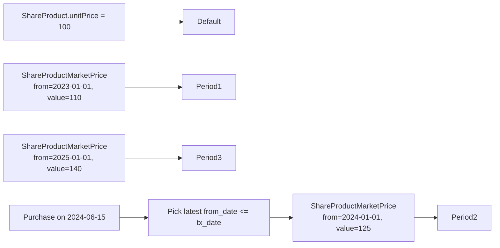
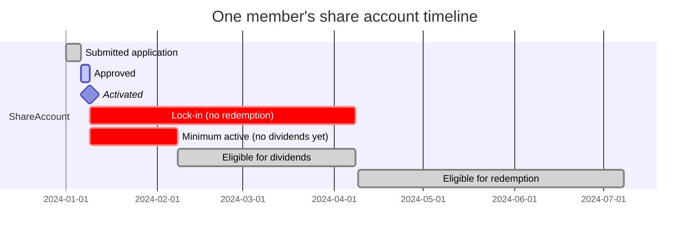
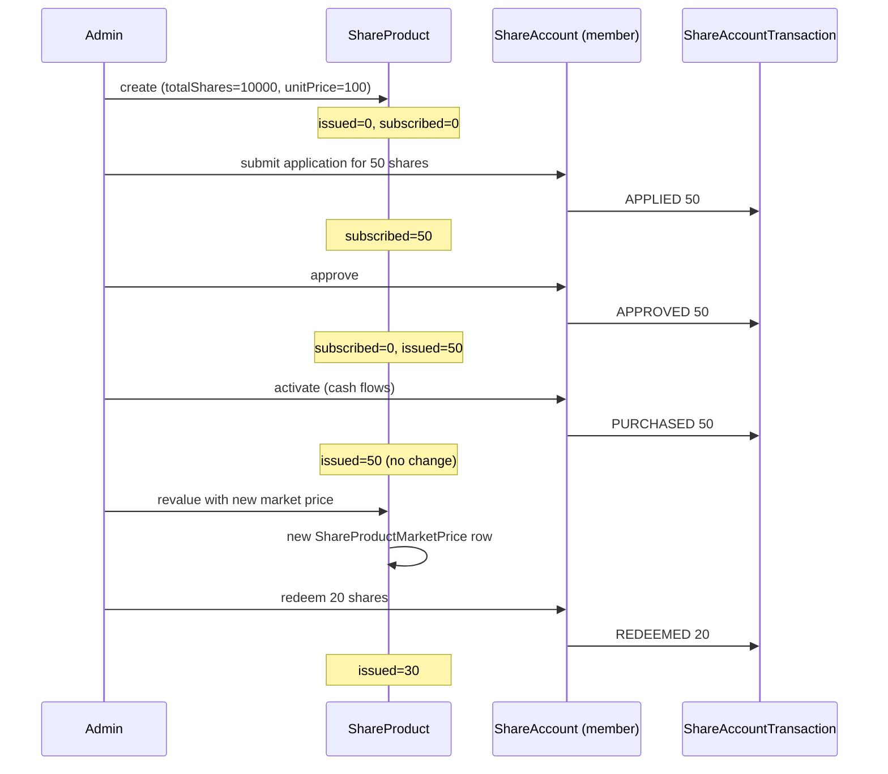

`ShareProduct` defines the *issue*: a cooperative or mutual decides to put N shares on the market at a unit price P, with rules for how many shares any one member can hold, how long they must hold, when the cooperative will recognise them as eligible for dividends, and how the proceeds and dividends flow through the GL. Every `ShareAccount` is created from one `ShareProduct`.

File: `fineract-provider/src/main/java/org/apache/fineract/portfolio/shareproducts/domain/ShareProduct.java`. Table: `m_share_product`.

## Columns

```java
@Entity
@Table(name = "m_share_product",
       uniqueConstraints = {
           @UniqueConstraint(columnNames = { "name" },        name = "sp_unq_name"),
           @UniqueConstraint(columnNames = { "short_name" },  name = "sp_unq_short_name"),
           @UniqueConstraint(columnNames = { "external_id" }, name = "sp_unq_external_id") })
public class ShareProduct extends AbstractPersistableCustom<Long> { ... }
```

| Column | Field | Notes |
|--------|-------|-------|
| `name` | `name` | Unique product name |
| `short_name` | `shortName` | Unique short code |
| `description` | `description` | Free text |
| `start_date` | `startDate` | Product effective start |
| `end_date` | `endDate` | Product end (optional) |
| `external_id` | `externalId` | Optional secondary identifier |
| `currency_*` (embedded `MonetaryCurrency`) | `currency` | Code + decimal precision |
| `total_shares` | `totalShares` | Total pool size — the issuance cap |
| `issued_shares` | `totalSharesIssued` | Currently issued count |
| `totalsubscribed_shares` | `totalSubscribedShares` | Subscribed-but-not-issued count |
| `unit_price` | `unitPrice` | Default unit price (see market price below) |
| `capital_amount` | `shareCapital` | Total share capital |
| `minimum_client_shares` | `minimumShares` | Lower bound per member account |
| `nominal_client_shares` | `nominalShares` | Default / recommended count per member |
| `maximum_client_shares` | `maximumShares` | Upper bound per member account |
| `allow_dividends_inactive_clients` | `allowDividendCalculationForInactiveClients` | Pay dividends even on inactive clients? |
| `lockin_period_frequency` / `lockin_period_frequency_enum` | `lockinPeriod`, `lockPeriodType` | Default lock window copied to new accounts |
| `minimum_active_period_frequency` / `minimum_active_period_frequency_enum` | `minimumActivePeriod`, `minimumActivePeriodType` | Minimum holding time before dividend eligibility |
| `accounting_type` | `accountingRule` | `AccountingRuleType` — NONE, CASH_BASED, ACCRUAL_PERIODIC, ACCRUAL_UPFRONT |

## Child collections

Two `@OneToMany` and one `@ManyToMany` collection hang off the product:

```java
@OneToMany(cascade = CascadeType.ALL, mappedBy = "product", orphanRemoval = true, fetch = FetchType.EAGER)
protected Set<ShareProductMarketPrice> marketPrice;

@ManyToMany
@JoinTable(name = "m_share_product_charge",
           joinColumns        = @JoinColumn(name = "product_id"),
           inverseJoinColumns = @JoinColumn(name = "charge_id"))
private Set<Charge> charges;
```

(A third relationship — to `ShareProductDividendPayOutDetails` — is documented in [Dividends](/shares/dividends).)

## Market price history

The unit price of a share is not static — a cooperative may revalue annually. `ShareProductMarketPrice` (table `m_share_product_market_price`) stores price changes effective from a given date:

| Column | Meaning |
|--------|---------|
| `product_id` | FK to `m_share_product` |
| `from_date` | Date this price becomes effective |
| `share_value` | The new unit price |

When a new purchase is processed, the platform picks the market-price row whose `from_date` is the latest value that is ≤ the transaction date. If no row matches, the product's `unit_price` is used as a fallback.



## Total / issued / subscribed shares

Three counters track the *supply side* of the product:

| Counter | Increment trigger | Decrement trigger |
|---------|-------------------|-------------------|
| `total_shares` | Set at product creation (the cap) | Updated only by admin modify |
| `issued_shares` | Approving a purchase | Approving a redemption |
| `totalsubscribed_shares` | A `ShareAccountTransaction` enters APPLIED | Approve or reject the application |

The invariant enforced by the validator: `issued_shares + totalsubscribed_shares <= total_shares`. If a request would push it over, `IssueableSharesExceededException` is thrown.

## Per-member share constraints

| Field | Role |
|-------|------|
| `minimumShares` | A new `ShareAccount` must request at least this many shares |
| `nominalShares` | The default count shown on the application form |
| `maximumShares` | A `ShareAccount` cannot hold more than this; subsequent `applyAdditionalShares` requests are rejected if they would exceed the cap |

## Lock periods and dividend eligibility

Two windows govern member behaviour:



The product seeds each new account with the same periods unless the application overrides them. The `allow_dividends_inactive_clients` flag is a separate gate that runs in parallel with the minimum-active gate — the platform asks both "is the account old enough?" and "is the client still active?" before posting a dividend.

## Accounting rule

`accounting_type` mirrors the savings product:

| Code | Enum | Behaviour for shares |
|------|------|----------------------|
| 1 | `NONE` | No GL postings |
| 2 | `CASH_BASED` | Each purchase debits a suspense account and credits equity; each redemption reverses; each dividend posts the cash side |
| 3 | `ACCRUAL_PERIODIC` | Periodic accrual entries |
| 4 | `ACCRUAL_UPFRONT` | Upfront accrual on inception |

The GL accounts (Equity, Share Reference, Income from Fees, etc.) are defined in product GL mappings.

## Charges

`m_share_product_charge` links a product to the charges that should auto-attach to every account: activation fee, purchase fee, redemption fee. Each `Charge` is the shared cross-product definition from `fineract-core`. See [Savings charges](/savings/savings-charges) for how the same `Charge` base works on savings.

When a new `ShareAccount` is opened, the product's charge set is copied to per-account `ShareAccountCharge` rows.

## Lifecycle commands

| Handler | Command | Effect |
|---------|---------|--------|
| `CreateShareProductCommandHandler` | `CREATE_SHAREPRODUCT` | Persist product + market prices + charges |
| `UpdateShareProductCommandHandler` | `UPDATE_SHAREPRODUCT` | Mutate fields; reject changes to currency once accounts exist |

There is no explicit `DELETE_SHAREPRODUCT` handler in the standard build; products that have accounts associated cannot be removed.

## Listing and retrieval

The read side is served by `ShareProductReadPlatformServiceImpl` (queries against `m_share_product` joined to charges and market prices) and the dropdown helper `ShareProductDropdownReadPlatformServiceImpl` for UI selects.

## Lifecycle of the supply



## Read next

* [ShareAccount](/shares/share-account) — the per-member holding driven by this product.
* [Dividends](/shares/dividends) — how the cooperative declares and posts dividends against the issued share base.

## REST API surface

Share products sit at `/v1/products/share` (not `/v1/shareproducts` — note the URL):

| Method | Path | Operation |
|--------|------|-----------|
| GET | `/v1/products/share/template` | Defaults + allowed values |
| GET | `/v1/products/share` | List products |
| GET | `/v1/products/share/{productId}` | Retrieve one |
| POST | `/v1/products/share` | Create product |
| PUT | `/v1/products/share/{productId}` | Update product |

The dividend sub-resource is at `/v1/shareproduct/{productId}/dividend` (note: singular `shareproduct`, different from the products path). See [Dividends](/shares/dividends).

## Worked example: defining a cooperative share product

A small credit union issues 10,000 shares at ₹100 each. Each member must hold between 1 and 100 shares; the nominal recommendation is 10 shares. New members are locked in for 6 months before they can redeem, and they must hold for at least 3 months before they earn dividends.

```json
{
  "name": "Member Equity Share",
  "shortName": "MES",
  "description": "Cooperative member ordinary equity",
  "externalId": "PROD-MES-2024",
  "currencyCode": "INR",
  "digitsAfterDecimal": 2,
  "totalShares": 10000,
  "totalSharesIssued": 0,
  "unitPrice": 100,
  "sharesIssued": 0,
  "minimumShares": 1,
  "nominalShares": 10,
  "maximumShares": 100,
  "allowDividendCalculationForInactiveClients": false,
  "lockinPeriodFrequency": 6,
  "lockinPeriodFrequencyType": 2,
  "minimumActivePeriodFrequency": 3,
  "minimumActivePeriodFrequencyType": 2,
  "accountingRule": 2,
  "marketPricePeriods": [],
  "charges": [],
  "locale": "en",
  "dateFormat": "dd MMMM yyyy"
}
```

The response carries the new `productId`. From that moment, members can apply for share accounts referencing this product.

## Worked example: revaluing shares

In January 2026, the cooperative revalues shares to ₹110. The admin posts a market-price update:

```json
{
  "marketPricePeriods": [
    { "fromDate": "01 January 2026", "shareValue": 110.0 }
  ]
}
```

via `PUT /v1/products/share/{productId}`. The new row appears in `m_share_product_market_price`. Existing share holdings are unaffected — they are still 50 shares, 75 shares, whatever — but any new purchase or redemption from January 2026 onward uses ₹110.

Dividends declared for the period straddling the revaluation also use the new value when computing per-share allocations to accounts whose holding accumulated after January 2026.

## Validation rules

* `minimumShares ≤ nominalShares ≤ maximumShares`, all positive.
* `totalShares ≥ totalSharesIssued + totalSharesSubscribed` always.
* `unit_price > 0`.
* `lockin_period_frequency ≥ 0`.
* `accounting_type` is one of the four `AccountingRuleType` codes.
* Updating `currency` after any account exists is rejected.
* Updating `totalShares` below `totalSharesIssued` is rejected.

## Charges on share products

The product can carry a set of `Charge` rows that auto-attach to new share accounts. Charge times relevant to shares (from `ChargeTimeType`):

| Code | Enum | When applied |
|------|------|--------------|
| 13 | `SHAREACCOUNT_ACTIVATION` | On activation of a new share account |
| 14 | `SHARE_PURCHASE` | Each purchase transaction |
| 15 | `SHARE_REDEEM` | Each redemption transaction |

(Code values come from `ChargeTimeType` in fineract-core.) A purchase fee, for example, can be `PERCENT_OF_AMOUNT` so a 1% buy-side fee on a 50-share purchase of ₹100 each automatically charges ₹50.

## Lock-in vs minimum-active in practice

Operators commonly set `lockinPeriod = 6 months` and `minimumActivePeriod = 3 months`. This means:

* During months 0–3: no dividends, no redemptions.
* During months 3–6: dividends eligible, redemption blocked.
* From month 6 onward: dividends eligible, redemption allowed.

Setting these the same way for every account in a product is the default. Per-account overrides at submission allow exceptions when needed (e.g. board members with longer lock-ins).

## Schema cheat sheet

| Table | Key rows |
|-------|----------|
| `m_share_product` | id, name, total_shares, unit_price, lock periods, accounting_rule |
| `m_share_product_market_price` | id, product_id, from_date, share_value |
| `m_share_product_charge` | product_id, charge_id |
| `m_share_product_dividend_pay_out` | id, product_id, amount, period dates, status |
| `m_share_account` | id, product_id, client_id, savings_account_id, status |

## Permissions

Standard permission codes:

* `READ_SHAREPRODUCT`, `CREATE_SHAREPRODUCT`, `UPDATE_SHAREPRODUCT`, `DELETE_SHAREPRODUCT`.
* `READ_SHAREACCOUNT`, `CREATE_SHAREACCOUNT`, `APPROVE_SHAREACCOUNT`, `ACTIVATE_SHAREACCOUNT`, `CLOSE_SHAREACCOUNT`, `REDEEMSHARES_SHAREACCOUNT`.
* `READ_DIVIDEND_SHAREPRODUCT`, `CREATE_DIVIDEND_SHAREPRODUCT`, `APPROVE_DIVIDEND_SHAREPRODUCT`, `DELETE_DIVIDEND_SHAREPRODUCT`.

These appear in the standard permissions seed and are typically grouped onto roles like "Cooperative Admin" and "Member Services Officer".

