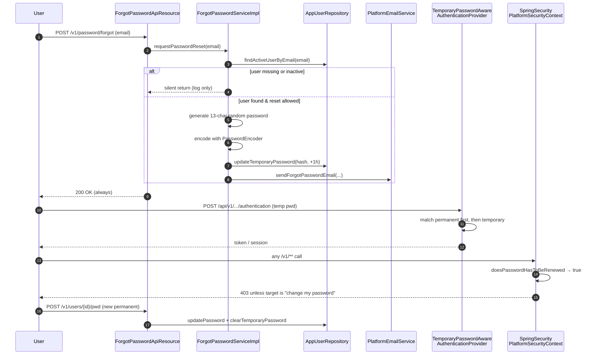
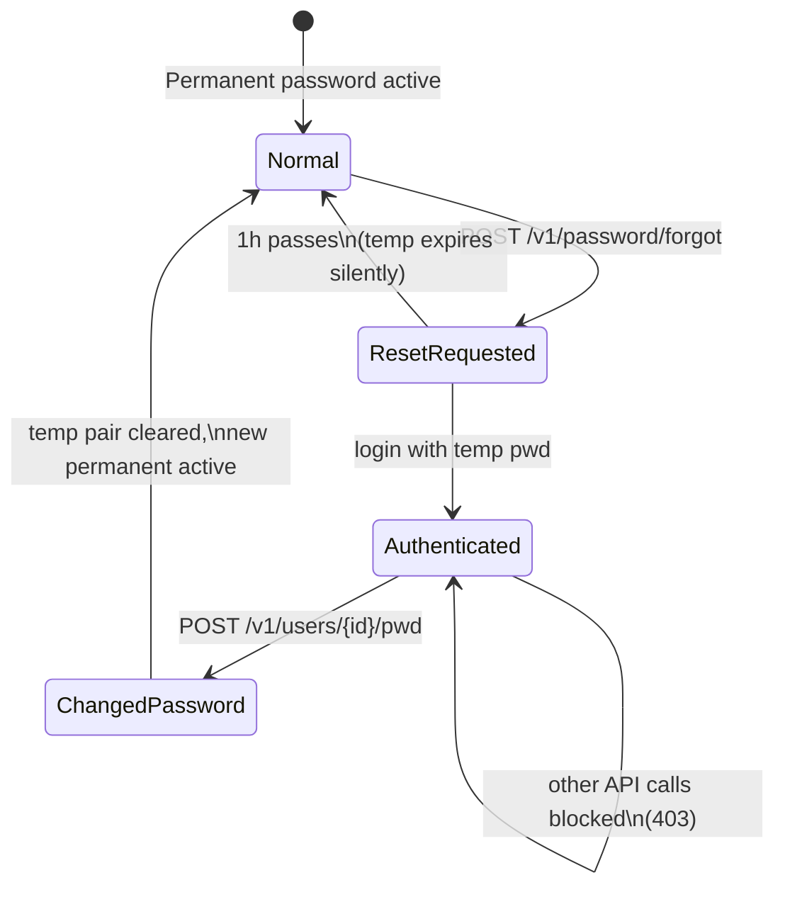

Apache Fineract lets a user reset a forgotten password without administrator intervention. The flow is opt-in per user (`is_password_reset_enabled`), runs against the public `/v1/password/forgot` endpoint, and produces a **temporary password** that is emailed to the user's address on file and expires after one hour. The user logs in with their existing username and the temporary password, the authentication provider accepts it as an alternative credential, and the platform then forces a change to a fresh permanent password.

The flow touches three layers in turn — REST, service, authentication. This page walks the entire path with the real classes and methods.

## High-level sequence



## REST endpoint — `/v1/password/forgot`

`ForgotPasswordApiResource` lives at `fineract-provider/src/main/java/org/apache/fineract/useradministration/api/ForgotPasswordApiResource.java`. The full resource is small enough to read end-to-end:

```java
@Path("/v1/password")
@Component
@Tag(name = "Password Management",
     description = "APIs for password management operations including forgot password functionality.")
@RequiredArgsConstructor
public class ForgotPasswordApiResource {

    private final ForgotPasswordService forgotPasswordService;

    @POST
    @Path("/forgot")
    @Consumes({ MediaType.APPLICATION_JSON })
    @Produces({ MediaType.APPLICATION_JSON })
    @Operation(summary = "Request password reset",
               description = """
            Requests a password reset for the user with the given email.
            If the email exists and the user is active, a temporary password will be sent to the email address.
            The temporary password expires in 1 hour.""")
    @RequestBody(required = true,
                 content = @Content(schema = @Schema(implementation = ForgotPasswordRequest.class)))
    @ApiResponse(responseCode = "200", description = "OK")
    public Response forgotPassword(final ForgotPasswordRequest request) {
        this.forgotPasswordService.requestPasswordReset(request.email());
        return Response.ok().build();
    }

    public record ForgotPasswordRequest(String email) {
    }
}
```

Key properties:

- **Unauthenticated.** The endpoint sits under `/v1/password` and is opened up by the security filter chain so a logged-out user can call it.
- **Single-field payload.** A Java record `ForgotPasswordRequest(String email)` — nothing else is accepted.
- **Always returns 200.** Whether the email matched a user or not, the response is identical. This is a deliberate enumeration-resistance measure.
- **Tag.** `Password Management` is a distinct Swagger tag from `Password preferences` and `Users`.

### Sample request

```http
POST /api/v1/password/forgot
Content-Type: application/json

{ "email": "alice@example.com" }
```

```http
HTTP/1.1 200 OK
```

No body is returned even on success — the user is expected to check their email.

## The service — `ForgotPasswordServiceImpl`

The interface is the minimal one method:

```java
public interface ForgotPasswordService {
    void requestPasswordReset(String email);
}
```

The implementation is at `fineract-provider/src/main/java/org/apache/fineract/useradministration/service/ForgotPasswordServiceImpl.java`. Reproduced in full because every line matters:

```java
@Slf4j
@Service
@RequiredArgsConstructor
public class ForgotPasswordServiceImpl implements ForgotPasswordService {

    private static final int TEMPORARY_PASSWORD_LENGTH       = 13;
    private static final int TEMPORARY_PASSWORD_EXPIRY_HOURS = 1;

    private final AppUserRepository appUserRepository;
    private final PasswordEncoder   passwordEncoder;
    private final PlatformEmailService emailService;

    @Override
    @Transactional
    public void requestPasswordReset(final String email) {
        final AppUser user = this.appUserRepository.findActiveUserByEmail(email);
        if (user == null) {
            log.debug("Password reset requested for non-existent or inactive email: {}", email);
            return;
        }

        if (!user.isPasswordResetAllowed()) {
            log.debug("Password reset is disabled for user: {}", user.getUsername());
            return;
        }

        final String temporaryPassword = new RandomPasswordGenerator(TEMPORARY_PASSWORD_LENGTH).generate();
        final String encodedPassword   = this.passwordEncoder.encode(temporaryPassword);
        final OffsetDateTime expiryTime = OffsetDateTime.now(ZoneOffset.UTC)
                                          .plusHours(TEMPORARY_PASSWORD_EXPIRY_HOURS);

        user.updateTemporaryPassword(encodedPassword, expiryTime);
        this.appUserRepository.saveAndFlush(user);

        final String organisationName = user.getOffice().getName();
        final String contactName = user.getFirstname() + " " + user.getLastname();

        this.emailService.sendForgotPasswordEmail(organisationName, contactName, email,
                                                  user.getUsername(), temporaryPassword);

        log.info("Password reset email sent to user: {}", user.getUsername());
    }
}
```

What it enforces:

| Check | Outcome on failure |
| --- | --- |
| `findActiveUserByEmail` — only `enabled=true and deleted=false` | Silent return, debug log. |
| `user.isPasswordResetAllowed()` — checks `is_password_reset_enabled` | Silent return, debug log. |
| `user.updateTemporaryPassword(hash, expiry)` — stores hash and UTC expiry | Persisted in the same transaction. |
| `emailService.sendForgotPasswordEmail(...)` | Throws `PlatformEmailSendException` on SMTP failure — the transaction rolls back, so the temp password is **not** persisted unless the email succeeds. |

The clear-text temp password is generated, hashed, persisted, then handed to the email service. It is never logged.

### Per-user opt-out

`AppUser.isPasswordResetAllowed()` is the gate. The setter prevents the system user from being enrolled even by mistake:

```java
public void updatePasswordResetAllowed(final boolean passwordResetAllowed) {
    this.passwordResetAllowed = passwordResetAllowed
        && !isSystemUser()
        && !Boolean.TRUE.equals(this.cannotChangePassword);
}
```

The same flag is set during user-create from `AppUserConstants.IS_PASSWORD_RESET_ALLOWED`, so deployments can lock down which accounts may be reset by self-service.

## Storing the temporary password

The temp password lives in two extra columns on `m_appuser` rather than a separate table — see [Users](/users/users):

| Column | Type | Set by | Cleared by |
| --- | --- | --- | --- |
| `temporary_password` | `String` (hash) | `ForgotPasswordServiceImpl` | `AppUser.clearTemporaryPassword()` |
| `temporary_password_expiry_time` | `OffsetDateTime` UTC | `ForgotPasswordServiceImpl` (`now + 1h`) | same |

The entity methods are:

```java
public void updateTemporaryPassword(final String encodedPassword, final OffsetDateTime expiryTime) {
    this.temporaryPassword = encodedPassword;
    this.temporaryPasswordExpiryTime = expiryTime;
}

public boolean isTemporaryPasswordExpired() {
    if (this.temporaryPasswordExpiryTime == null) {
        return false;
    }
    return OffsetDateTime.now(ZoneOffset.UTC).isAfter(this.temporaryPasswordExpiryTime);
}

public boolean hasValidTemporaryPassword() {
    return StringUtils.isNotBlank(this.temporaryPassword) && !isTemporaryPasswordExpired();
}

public void clearTemporaryPassword() {
    this.temporaryPassword = null;
    this.temporaryPasswordExpiryTime = null;
}
```

`updatePassword(String encoded)` — the permanent-password setter — calls `clearTemporaryPassword()` automatically so a successful change-password wipes the temp pair.

## Email delivery

`PlatformEmailService.sendForgotPasswordEmail(organisationName, contactName, address, username, temporaryPassword)` is the contract; the default Gmail-backed implementation is in `GmailBackedPlatformEmailService`:

```java
@Override
public void sendForgotPasswordEmail(String organisationName, String contactName, String address,
                                    String username, String temporaryPassword) {
    final String subject = "Password Reset Request - " + organisationName;
    final String body = "Dear " + contactName + ",\n\n"
        + "You have requested to reset your password for your account on " + organisationName + ".\n\n"
        + "Your temporary password is: " + temporaryPassword + "\n\n"
        + "This temporary password will expire in 1 hour.\n\n"
        + "Please login with your username: " + username
        + " and this temporary password.\n"
        + "You will be required to change your password immediately after logging in.\n\n"
        + "If you did not request this password reset, please contact your system administrator.\n\n"
        + "Thank you.";
    sendDefinedEmail(new EmailDetail(subject, body, address, contactName));
}
```

The body is plain text and includes the temp password directly. SMTP credentials are loaded from `c_external_service` (the standard Fineract external-service mechanism). Failures bubble up as `PlatformEmailSendException`, rolling back the transaction so the user is not left with an unannounced temp password.

<Note>
Replace `GmailBackedPlatformEmailService` with a custom `PlatformEmailService` bean if you need a different transport (SES, Mailgun, a queue, ...). The forgot-password service depends only on the interface.
</Note>

## Logging in with the temporary password

The login form does not change — the user submits their existing `username` and the new `temporary_password`. The work happens inside `TemporaryPasswordAwareAuthenticationProvider` (`fineract-provider/src/main/java/org/apache/fineract/infrastructure/security/service/TemporaryPasswordAwareAuthenticationProvider.java`):

```java
/**
 * Supports authentication with either the permanent password or a non-expired temporary password.
 */
public class TemporaryPasswordAwareAuthenticationProvider extends DaoAuthenticationProvider {

    public TemporaryPasswordAwareAuthenticationProvider(UserDetailsService userDetailsService) {
        super(userDetailsService);
    }

    @Override
    protected void additionalAuthenticationChecks(final UserDetails userDetails,
                                                  final UsernamePasswordAuthenticationToken authentication)
            throws AuthenticationException {
        if (authentication.getCredentials() == null) {
            throw new BadCredentialsException(
                messages.getMessage("AbstractUserDetailsAuthenticationProvider.badCredentials",
                                    "Bad credentials"));
        }

        final String presentedPassword = authentication.getCredentials().toString();
        if (getPasswordEncoder().matches(presentedPassword, userDetails.getPassword())) {
            return;
        }

        if (userDetails instanceof AppUser appUser
                && appUser.hasValidTemporaryPassword()
                && getPasswordEncoder().matches(presentedPassword, appUser.getTemporaryPassword())) {
            return;
        }

        throw new BadCredentialsException(
            messages.getMessage("AbstractUserDetailsAuthenticationProvider.badCredentials",
                                "Bad credentials"));
    }
}
```

Algorithm:

1. Try the permanent BCrypt hash via the standard `DaoAuthenticationProvider` path. If it matches → success.
2. Otherwise, if the `UserDetails` is actually an `AppUser`, check `hasValidTemporaryPassword()` (non-null and not expired) and compare with `temporary_password`. If it matches → success.
3. Otherwise → `BadCredentialsException` with the standard Spring Security message (no enumeration leak).

This provider is wired into both authentication chains that need it:

| Wired in | Bean |
| --- | --- |
| `SecurityConfig.daoAuthenticationProvider` (HTTP Basic chain) | `new TemporaryPasswordAwareAuthenticationProvider(userDetailsService)` |
| `AuthorizationServerConfig.daoAuthenticationProvider` (OAuth2 Authorization Server) | same |

The OIDC chain does not need it — external IdPs handle their own credential exchange.

## Forced password change after login

Once the user is in, the security context refuses every command except "change my password" until a permanent password is set. The relevant method on `SpringSecurityPlatformSecurityContext`:

```java
@Override
public boolean doesPasswordHasToBeRenewed(AppUser currentUser) {
    if (currentUser.isPasswordResetRequired()) {
        return true;
    }
    if (this.configurationDomainService.isPasswordForcedResetEnable()
            && !currentUser.getPasswordNeverExpires()) {
        Long passwordDurationDays = this.configurationDomainService.retrievePasswordLiveTime();
        final LocalDate passWordLastUpdateDate = currentUser.getLastTimePasswordUpdated();
        final LocalDate passwordExpirationDate = passWordLastUpdateDate.plusDays(passwordDurationDays);
        if (DateUtils.isBeforeTenantDate(passwordExpirationDate)) {
            return true;
        }
    }
    return false;
}
```

The same context maintains an `EXEMPT_FROM_PASSWORD_RESET_CHECK` list of `(action, entity)` pairs — `UPDATE`/`USER` targeting the calling user is exempt, everything else is blocked while `password_reset_required = true`. The block is enforced by `shouldCheckForPasswordForceReset`:

```java
private boolean shouldCheckForPasswordForceReset(CommandWrapper commandWrapper, AppUser currentUser) {
    for (CommandWrapper commandItem : EXEMPT_FROM_PASSWORD_RESET_CHECK) {
        if (commandItem.actionName().equals(commandWrapper.actionName())
                && commandItem.getEntityName().equals(commandWrapper.getEntityName())) {
            return commandWrapper.getEntityId() == null
                || !commandWrapper.getEntityId().equals(currentUser.getId());
        }
    }
    return true;
}
```

So a user authenticated with a temp password can call `POST /v1/users/{theirOwnId}/pwd` but nothing else, and a successful change-password call also calls `clearTemporaryPassword()` so the temp pair is wiped.

## State machine



## What is **not** in the flow

- **No token / link.** Fineract does not send a clickable reset link — the email contains a temp password the user types.
- **No rate limiting.** The endpoint accepts repeated calls; each one issues a fresh temp password and resets the expiry. Operators should put a rate limiter (e.g. an API gateway) in front of `/v1/password/forgot` in production.
- **No SMS path.** Email is the only delivery channel inside the platform. Custom installs can swap the implementation of `PlatformEmailService`.
- **No effect on previous-password history.** The temp password is not written to `m_appuser_previous_password`; only permanent password changes are recorded there. See [Password Preferences](/users/password-preferences).

## Validation summary

| Field | Constraint |
| --- | --- |
| `email` | Required string in the JSON body. No format check at the resource — the repository query is the discriminator. |
| User must be `enabled = true and deleted = false` | Filter in `findActiveUserByEmail`. |
| User must have `is_password_reset_enabled = true` | Re-checked in the service. |
| `system` user | Hard-blocked because `updatePasswordResetAllowed` refuses to set the flag for the system account. |

## Related pages

<CardGroup cols={2}>
  <Card title="Users" icon="user" href="/users/users">
    The `temporary_password*` columns and the `password_reset_required` flag.
  </Card>
  <Card title="Password Preferences" icon="shield-halved" href="/users/password-preferences">
    The regex applied to the new permanent password the user picks after login.
  </Card>
  <Card title="Overview" icon="compass" href="/users/overview">
    Section landing page.
  </Card>
  <Card title="Security overview" icon="shield" href="/security/overview">
    The filter chains that whitelist `/v1/password/forgot` for unauthenticated access.
  </Card>
</CardGroup>

<Tip>
Because the response is always `200`, monitoring should rely on the `info`-level "Password reset email sent to user" log line plus the SMTP send rate — never on the HTTP status code.
</Tip>
