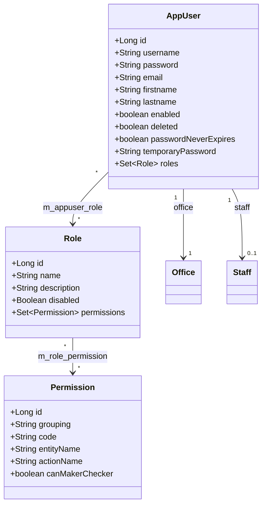
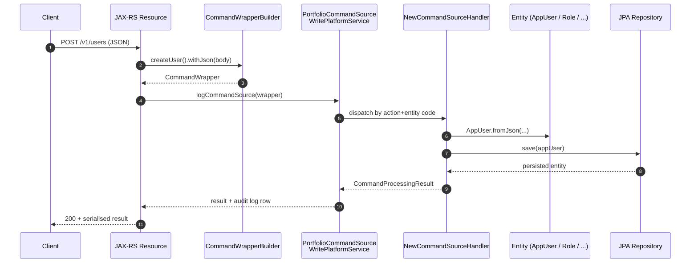
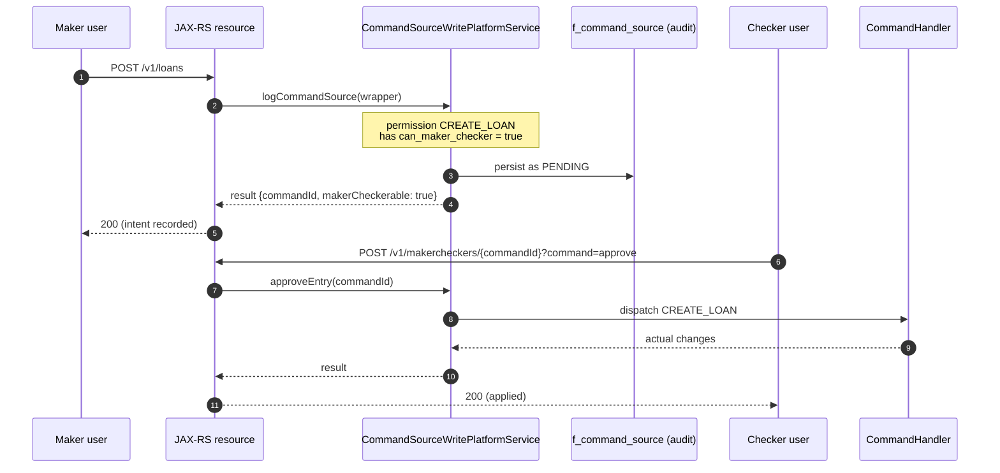

Apache Fineract ships a small, self-contained user-administration subsystem that backs every authenticated `/api/v1/**` call. The domain entities (`AppUser`, `Role`, `Permission`) live in `fineract-core` so any module can reference them; the write-side services, REST resources, and password-policy machinery sit in `fineract-provider`. Together they implement username + BCrypt password authentication, role-based authorisation with per-action permission codes, configurable password complexity, and a forgot-password flow that mints a temporary password and emails it to the user.

This section of the wiki is the entry point for every page under `users/*`. It inventories the packages, lists the tables that store the data, sketches the REST surface, and links out to the per-feature deep dives.

## Where the code lives

The subsystem is split across two Gradle modules:

| Module | Package | Contents |
| --- | --- | --- |
| `fineract-core` | `org.apache.fineract.useradministration.domain` | `AppUser`, `Role`, `Permission`, `AppUserRepository`, `AppUserRepositoryWrapper` |
| `fineract-core` | `org.apache.fineract.useradministration.api` | `PasswordPreferencesApiConstants` (shared constants only) |
| `fineract-core` | `org.apache.fineract.useradministration.service` | `AppUserConstants` (well-known IDs and parameter names) |
| `fineract-provider` | `org.apache.fineract.useradministration.api` | JAX-RS resources: `UsersApiResource`, `RolesApiResource`, `PermissionsApiResource`, `PasswordPreferencesApiResource`, `ForgotPasswordApiResource` |
| `fineract-provider` | `org.apache.fineract.useradministration.domain` | `PasswordValidationPolicy`, `AppUserPreviousPassword`, `UserDomainService` / `JpaUserDomainService` |
| `fineract-provider` | `org.apache.fineract.useradministration.service` | Read / write platform services, command handlers, data validators |
| `fineract-provider` | `org.apache.fineract.useradministration.command` | `CommandWrapperBuilder` extensions for user / role / permission commands |
| `fineract-provider` | `org.apache.fineract.useradministration.handler` | `NewCommandSourceHandler` implementations dispatched by the commands framework |
| `fineract-provider` | `org.apache.fineract.useradministration.serialization` | JSON deserialisation helpers for command payloads |

A complementary deep dive into the core-only entities and the Spring Security bridge lives at [User admin core](/core/user-administration-core); this section is the user-facing administration surface.

## Tables

The administration data sits in five tables, all prefixed `m_`:

| Table | Holds |
| --- | --- |
| `m_appuser` | One row per platform user — username, BCrypt password hash, office FK, optional staff FK, flags |
| `m_appuser_role` | Join table — `(appuser_id, role_id)` rows mapping users to roles |
| `m_role` | One row per role — `name`, `description`, `is_disabled` |
| `m_role_permission` | Join table — `(role_id, permission_id)` rows mapping roles to permissions |
| `m_permission` | One row per permission code — `grouping`, `code`, `entity_name`, `action_name`, `can_maker_checker` |

Password preferences live in `m_password_validation_policy`; previous passwords (for the password-history rule) live in `m_appuser_previous_password`. The forgot-password flow uses two extra columns on `m_appuser` — `temporary_password` and `temporary_password_expiry_time` — rather than a new table.

## REST surface

Every administrative operation is exposed as a JAX-RS resource under `/v1/`. The resources are thin: each one builds a `CommandWrapper`, hands it to `PortfolioCommandSourceWritePlatformService`, and serialises the result. The same handlers feed the maker-checker pipeline so any mutating call can be intercepted, recorded, and approved.

| Resource class | Base path | Tag | Operations |
| --- | --- | --- | --- |
| `UsersApiResource` | `/v1/users` | `Users` | `GET` list / one / template, `POST` create, `PUT {id}` update, `POST {id}/pwd` change password, `DELETE {id}` |
| `RolesApiResource` | `/v1/roles` | `Roles` | `GET` list / one / template, `POST` create, `POST {id}?command=enable|disable`, `PUT {id}` update, `GET/PUT {id}/permissions` |
| `PermissionsApiResource` | `/v1/permissions` | `Permissions` | `GET` list (with `?makerCheckerable=true`), `PUT` toggle maker-checker flags |
| `PasswordPreferencesApiResource` | `/v1/passwordpreferences` | `Password preferences` | `GET` active policy, `PUT` activate a policy, `GET /template` list policies |
| `ForgotPasswordApiResource` | `/v1/password/forgot` | `Password Management` | `POST` request a reset token by email |

Bulk import endpoints (`/v1/users/downloadtemplate`, `/v1/users/uploadtemplate`) plumb through the standard `BulkImportWorkbookService` plumbing — they are not covered in detail here.

## Domain model at a glance

`AppUser` implements the `PlatformUser` contract from `fineract-security`, which lets `TenantAwareJpaPlatformUserDetailsService` adapt it directly to a Spring Security `UserDetails`.

## Request lifecycle

Every mutating call flows through the commands framework:

For read calls the flow is simpler — the resource calls a `*ReadPlatformService` that runs a plain JDBC query and returns a `*Data` DTO.

## Where to go next

<CardGroup cols={2}>
  <Card title="Users" icon="user" href="/users/users">
    `AppUser` entity, the `/v1/users` API, password change, soft-delete and disable semantics.
  </Card>
  <Card title="Roles" icon="users" href="/users/roles">
    `Role` entity, the `m_role_permission` mapping, enable / disable commands, and the super-user concept.
  </Card>
  <Card title="Permissions" icon="key" href="/users/permissions">
    `Permission` entity, the `ACTION_ENTITY` naming convention, groupings, and per-permission maker-checker flags.
  </Card>
  <Card title="Password Preferences" icon="shield-halved" href="/users/password-preferences">
    `PasswordValidationPolicy`, the regex-based complexity rules, and how new passwords are validated.
  </Card>
  <Card title="Forgot Password" icon="envelope" href="/users/forgot-password">
    `ForgotPasswordApiResource`, the temporary-password column, the email delivery hook, and the temp-password aware authentication provider.
  </Card>
  <Card title="User admin core" icon="cube" href="/core/user-administration-core">
    Companion page: the `fineract-core` entities, the `AppUserRepository`, and the Spring Security `UserDetailsService` bridge.
  </Card>
</CardGroup>

## Security and authorisation

Every read endpoint calls `context.authenticatedUser().validateHasReadPermission(entity)` and every write endpoint goes through the commands framework, which in turn calls `validateHasPermissionTo(action, entity)` on the current `AppUser`. The check resolves by walking the user's roles, then each role's permissions, looking for a code that matches `ACTION_ENTITY` (or one of the "all functions" super codes — see [Roles](/users/roles)).

<Note>
The two well-known users `admin` (id `1`) and `system` (id `2`) are defined by `AppUserConstants.ADMIN_USER_ID` / `SYSTEM_USER_NAME` and receive special treatment — the `system` account cannot self-enable password reset, and the admin account is the seeded super-user out of the box.
</Note>

## Maker-checker integration

Permissions carry a `can_maker_checker` boolean. When set, any command whose action+entity matches that permission is forced through the maker-checker pipeline: the first call only records the intent, and a second user with the corresponding `CHECKER_` permission must approve it before the change takes effect. The toggle is set per-permission via `PUT /v1/permissions`. See [Permissions](/users/permissions) for the data shape.

## Data model summary

The five tables and their relationships:

| Table | Owns FK to | Cardinality |
| --- | --- | --- |
| `m_appuser` | `office_id → m_office`, `staff_id → m_staff` | many-to-one |
| `m_appuser_role` | `appuser_id → m_appuser`, `role_id → m_role` | many-to-many join |
| `m_role` | — | — |
| `m_role_permission` | `role_id → m_role`, `permission_id → m_permission` | many-to-many join |
| `m_permission` | — | — |

Effective permissions for a user are computed by walking `m_appuser → m_appuser_role → m_role → m_role_permission → m_permission` and discarding rows whose role is disabled. The join is implemented in JPA, not in a SQL view, so authorisation runs against the entity graph eagerly fetched at authentication time.

## REST conventions

Every resource in this section follows the same conventions, inherited from the rest of the Fineract API:

- **Base path** is `/api/v1/<resource>` once the servlet prefix is applied. Internally the resources declare `/v1/<resource>`.
- **Authentication** uses the configured chain — HTTP Basic by default, OAuth2 or OIDC when enabled. See [Security overview](/security/overview).
- **Tenant routing** uses the `Fineract-Platform-TenantId` header. The user lookup runs against the resolved tenant's schema.
- **Responses** are JSON. Field selection via `?fields=a,b,c` and template-mode toggles via `?template=true` are supported on `GET` endpoints.
- **Mutations** return a `CommandProcessingResult` with `commandId`, `resourceId`, and an `actualChanges` map enumerating exactly what was written. Maker-checker queues additionally carry `makerCheckerable: true`.
- **Errors** are translated by the global mapper into `400` (validation), `403` (authz), `404` (not found), `409` (conflict). The body always contains `developerMessage`, `defaultUserMessage`, and a stable `userMessageGlobalisationCode`.

## Operational footprint

| Concern | Where |
| --- | --- |
| Bootstrap seed (admin / system, default roles, all permissions) | Liquibase changelogs under `fineract-provider/src/main/resources/db/changelog`. |
| Multi-tenant isolation | Each tenant schema owns its own copy of `m_appuser`, `m_role`, `m_role_permission`, and `m_password_validation_policy`. `m_permission` is also per-tenant so customisations stay local. |
| Audit | Every mutation goes through `PortfolioCommandSourceWritePlatformService`, which writes to `f_command_source` regardless of maker-checker state. |
| Background jobs | The password-expiry scheduled job flips `password_reset_required = true` for users whose `last_time_password_updated` aged beyond the configured `password_live_time`. |
| Bulk import | `UsersApiResource.downloadtemplate` / `uploadtemplate` flow through `BulkImportWorkbookService` with `GlobalEntityType.USERS`. |

## Password lifecycle

Passwords flow through three independent mechanisms:

- **Complexity** is enforced by the active `PasswordValidationPolicy` regex whenever a new or changed password is supplied. See [Password Preferences](/users/password-preferences).
- **History** is enforced by `AppUserPreviousPassword` — the last `numberOfPreviousPasswords = 3` hashes are stored and a re-use is rejected.
- **Expiry** is checked by the password-expiry scheduled job against `last_time_password_updated`; users with `password_never_expires = true` are skipped.

The forgot-password flow is orthogonal — it does not change `password`, only sets a short-lived `temporary_password` that the [authentication provider](/users/forgot-password) accepts as an alternative. The user is expected to change their permanent password after logging in with the temp one.

## Conventions used in this section

- Field names are taken verbatim from the JPA entity sources under `org.apache.fineract.useradministration.domain`.
- REST paths and parameter names come from the JAX-RS resources and their Swagger annotations.
- Command codes use the standard Fineract `ACTION_ENTITY` shape — e.g. `CREATE_USER`, `UPDATE_ROLE`, `DELETE_PERMISSION`.

## Reading order

If you are new to the subsystem, the pages in this section are designed to be read in order:

1. **Overview** (this page) — the map and the table layout.
2. [Users](/users/users) — the central `AppUser` entity and its REST surface.
3. [Roles](/users/roles) — how permissions are bundled and granted to users.
4. [Permissions](/users/permissions) — the catalogue and the `ACTION_ENTITY` convention.
5. [Password Preferences](/users/password-preferences) — complexity rules applied to every new password.
6. [Forgot Password](/users/forgot-password) — the self-service reset flow.

For the security plumbing that runs *before* a request reaches any of these resources — the authentication filter chain, OAuth2 / OIDC integration, and the optional two-factor overlay — see the [Security overview](/security/overview).

<Tip>
If you are looking for the Spring Security filter chain, the OAuth2 / OIDC integration, or the two-factor overlay that runs in front of these resources, jump to the [Security overview](/security/overview) — those concerns sit below user administration.
</Tip>
